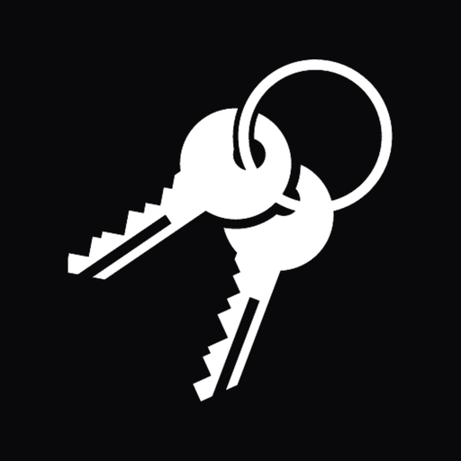

# web10

[](https://www.npmjs.com/package/web10-npm)



web10 starts from one premise: **what you make is yours.**

Every user gets their own database collection. Every record is
`{service, body}`. Apps are stateless frontends that borrow
access through a scoped, expiring token, do their work, and step aside.
The data outlives any app, because the data was never the app's to keep.

On that protocol stands the product: **a platform for creators who refuse
to rent their own audience.** Today a creator with a million subscribers
reaches three hundred thousand — not by accident, but by design. The
platform withholds your reach so it can sell it back to you. web10 removes
the landlord. On your own node, a post reaches 100% of your followers,
delivered to each one's inbox the moment you publish. There is no algorithm
to please, no throttle to buy your way past, no shadow ban to fear. This
is not a promise written in a policy that can be revised. It is the
architecture, and architecture cannot be quietly revoked.

The model is WordPress, applied to social media: open, self-hostable
nodes. Creators run them, under their own name and their own domain, and
keep what they earn. Accounts are free for their audience. web10 takes a
small percentage of the revenue that moves through its payment rails —
paid for value delivered, not for permission granted.

## The premise, made concrete

| | |
| --- | --- |
| **You own your data** | One collection per user — the record of your own life, held by you. Export it, move it, erase it. Delete means delete. |
| **No shadow ban** | Every post reaches every follower, by construction (fan-out on write). The feed is chronological, because a feed should report — not editorialize. |
| **Apps are just frontends** | An app earns access through a scoped, expiring, revocable token. It never owns what it touches. |
| **Federated identity** | Identity is `(username, provider)`, like email. No central registry to petition, no account that can be taken from you. |
| **Private, not permanent** | Unlike a blockchain, your data can be private, temporary, and deletable. You set who sees it via terms — and delete means delete. |
| **Self-hostable** | One `docker compose up` runs a node on hardware you own. The escape hatch is real, and that is what makes the ownership real. |

## Run a node locally

Requirements: Docker.

```bash
git clone <your fork of this repo>
cd web10
docker compose up --build
```

Then open **http://auth.localhost** and sign up on your own node.

No config archaeology — settings are environment variables, with working
defaults (see `api/app/settings.py` for the full list). The compose stack
includes:

- **api** — the node itself: data, auth, billing, media (`api.localhost`)
- **ui** — signup/login, consent, contracts, admin (`auth.localhost`)
- **ferretdb + postgres** — the default open database backend
  (FerretDB speaks the MongoDB wire protocol on top of DocumentDB/postgres)
- **minio** — S3-compatible blob storage for media
- **rtc** — WebRTC signaling (`rtc.localhost`)
- **sdk** — serves `wapi.js` and demos (`sdk.localhost`)

Prefer real MongoDB? It's a supported backend:

```bash
DB_URL=mongodb://mongo:27017 docker compose --profile mongo up
```

Atlas or any external Mongo works the same way — just set `DB_URL`. If
something else owns port 80 on your machine, set `WEB10_HTTP_PORT`.

## Deploy to a server

`ubuntu-deployment/` has a one-shot deploy script for a fresh Ubuntu VM:
Docker, Caddy with automatic TLS, and the full node stack. Point your DNS
at the box and the certificates provision themselves. See
[`ubuntu-deployment/README.md`](ubuntu-deployment/README.md).

## What's in this repo

| directory | what it is |
| --- | --- |
| `api/` | FastAPI — the node. All data + auth + billing + media. |
| `api/rtc/` | WebRTC signaling server. |
| `ui/` | React admin/consent UI (signup, login, contracts, settings). |
| `sdk/` | `wapi.js`, the frontend library web10 apps are built with. |
| `marketing/web10-social/` | The killer app: all-in-one social app (feed, profiles, DMs, media). CRM and Mail live here as sub-apps. |
| `marketing/marketing-ui/` | web10 Inc.'s site: landing page, docs, App Store, Exporter UI. |
| `marketing/marketing-api/` | Backend for the marketing site: ZIP import pipeline (bring your Instagram/Facebook/YouTube data), analytics. |
| `marketing/web10-cli/` | CLI tool for web10. |
| `ubuntu-deployment/` | One-shot server deploy (Docker + Caddy + TLS). |

## Learn more

- **[`plan.txt`](plan.txt)** — the roadmap and the why.
- **[`decisions.md`](decisions.md)** — why the big calls were made.
- **[`manifesto.md`](manifesto.md)** — the fan-facing pitch that ships on every node.
- **Developer docs** — protocol spec, conventions, schemas: `marketing/marketing-ui/public/docs/`.
- **SDK** — `npm install web10-npm` · [npm](https://www.npmjs.com/package/web10-npm) · [docs](https://www.web10.app/docs/sdk)
- **[`SECURITY.md`](SECURITY.md)** — how to report vulnerabilities, and the security invariants (I1–I5) that define what a break means.

## Community

- Discord: https://discord.gg/Dbd4VEDznU
- Live node: https://web10.app

web10 is built for people whose work carries their name. If the idea
earns your respect, star the repo. Better — run a node, and build
something you'd sign.
