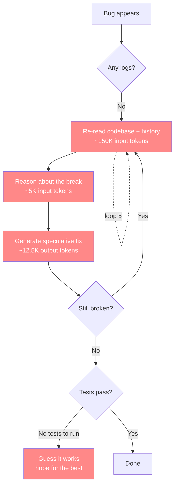
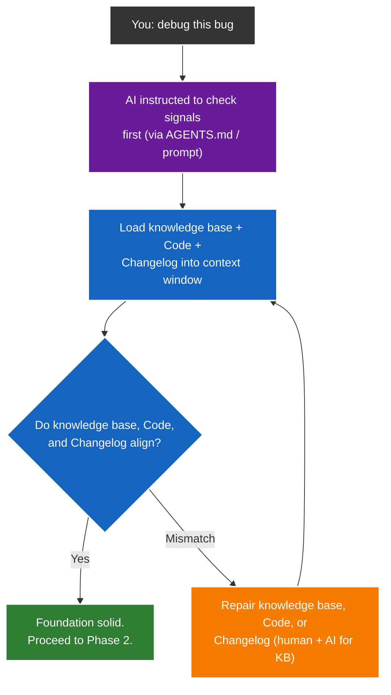
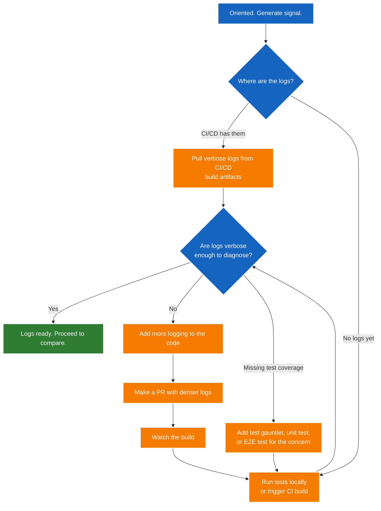
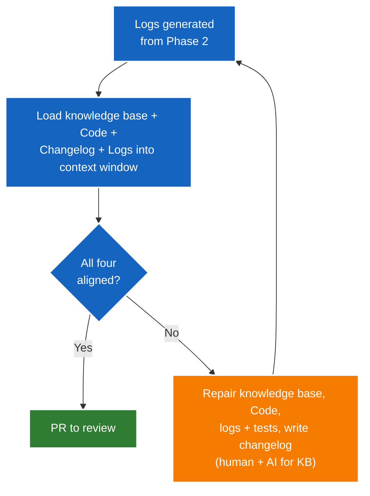
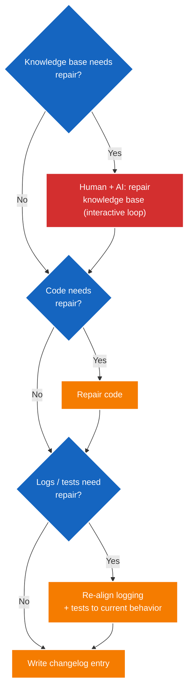

# AI Use Theory

[← back to README](./README.md)

A methodology for AI file-modifying tasks. On debugging, it saves doom loops. On features, it saves reimplementation from misalignment. The process that makes any change converge on the first pass instead of burning tokens in speculative loops.

## What an LLM Actually Is

An LLM is a language translator. That is its core capability — mapping one well-defined space to another with near-perfect accuracy. Fortran to Python. COBOL to TypeScript. 2021 React to 2026 TypeScript. Code to documentation. Conversations to structured knowledge. Literal to literal, it is almost too good at it. This is not a side effect — it is the model's primary strength, baked into how it was trained.

But an LLM is also a relentless overtryer. It was trained to be helpful and produce output — not to say "I don't know" or ask for clarification. When it hits a wall, it does not stop. It claws and tries and tries, riddling a codebase with speculative fixes because producing something plausible scores higher than admitting uncertainty. Mun Logadan put it plainly: "Benchmark training selects for models that make bold assumptions in the face of ambiguity rather than asking for clarification. Real life just isn't a benchmark." This is the terminator instinct: keep trying until the target is hit, even if the path is destruction.

Two traits — perfect translation and relentless overtrying — define how an LLM should be used. Give it translation tasks, and it excels. Give it open-ended file modification without signal, and it destroys.

A third trait completes the picture: an LLM is **shy about signal**. It will not instrument its own code. It will not add the logs, or write the tests, that would make the next task cheap to verify — because producing a change scores higher than producing a probe. Left to itself it writes the industry-standard default (minimal logs, sleek abstractions, productionized polish) and then speculatively verifies the very code it just made opaque. This is why the pyramid below is a **directed plan**, not a suggestion: the signal has to be forced by a process (AGENTS.md, a prompt, a review gate) that the LLM would not choose on its own. Crucially, the pyramid does **not** make the LLM a better builder. It **converts any file-modifying task from an open-ended reasoning task** — where the LLM overtries and burns tokens — **into a signal-grounded verification task** — where it reads the break from the logs, makes the change once, and a test confirms it. The LLM still does the building; the pyramid just removes the guessing.

A single conductor.build thread doom-looping for 2.5 hours — no logs, no knowledge base, no tests, just AI guessing — burns roughly $25 in tokens. But you rarely run one thread. Five threads, all stuck on the same task (a bug, a feature, a refactor), all trying different speculative approaches for 2.5 hours each, is **about $125**. And that's conservative — the context window grows with each loop, so later loops cost more. A real session easily exceeds $200.

That is money burned into thin air. The AI read the same code 750 times across five threads. It generated 50 speculative fixes. None of them worked. You could buy a guitar with that. Instead it's gone.

The math: in conductor.build, every tool call is a fresh context window — no caching. An agent in a doom loop makes ~150 calls per hour, each sending 150K+ input tokens (full codebase + growing history) and generating 10-15K output tokens (reasoning + speculative fixes). At Qwen 3.6 27B pricing ($0.30/M input, ~$1.50/M output), that's ~$10/hour/thread. Five threads is $50/hour. Two and a half hours is $125. Ten hours is $500.

With the pyramid, the same debugging drops to $5-$10 total. One thread, one loop, done. That's 10-20x cheaper. The difference is **signal**: logs tell the AI where the break is, tests confirm the fix, and the knowledge base tells it what the code is supposed to do. No guessing. No parallel threads on the same problem. No hours. No money into thin air.

## The Problem

An LLM trained to produce output will keep generating — even when generating makes things worse. It may ask for more context, but it is shy — it won't always ask for enough. And when it modifies files, it defaults to industry standard: minimal logs, sleek abstractions, productionized polish. Then when the result doesn't match intent, it speculatively patches its own minimally-logged code and enters expensive doom loops.

In a conductor.build harness, every speculative debug loop is a fresh context window. No caching. No carryover. The AI re-reads the entire codebase, reasons about what might be wrong, generates a fix, and if it's wrong, the whole cycle repeats from scratch — with a larger context window, because the conversation history grew. Each loop costs more than the last.



Each red box is a token burn. One loop is ~167K tokens. At Qwen 3.6 27B pricing ($0.30/M input, ~$1.50/M output), that's ~$0.07 per loop. Sounds cheap — but an agent in a doom loop makes ~150 of these per hour. That's **about $10/hour/thread**. Five threads stuck for 2.5 hours is **about $125**. And that's conservative — the context window grows with each loop as history accumulates, so later loops cost more. A real session easily exceeds $200.

---

## The Task Flow

Once the pyramid is built, every file-modifying task follows the same process. The pyramid is the setup. This flow is what you run for any task — primarily debugging (where it saves doom loops), but also features and refactors (where it saves reimplementation from misalignment). The AI won't naturally follow this — it's enforced via AGENTS.md, system instructions, or explicit prompts. Without the instruction to check signals before patching, the AI will default to speculative changes. The "disobedience" — refusing to patch symptoms and fixing the foundation first — is a process you impose, not natural LLM behavior.

The flow works in four phases: **orient, generate, compare, repair.** Each phase has branching paths — the AI can take different actions depending on what it finds.

### Phase 1: Orient — knowledge base ↔ Code ↔ Changelog alignment



The AI loads three reference resources into its context window and checks them against each other. If they don't align, it repairs them *before* spending tokens on test runs — fix knowledge base (human + AI, interactive), fix code drift, fix changelog. Then re-check. This is a flavor of Phase 4 repair, but scoped to the three signals available. Only when the foundation is solid does it proceed to Phase 2.

### Phase 2: Generate — run tests, produce logs



Now oriented, the AI needs signal. The logs come from test runs — you can't analyze logs you don't have. If CI/CD preserves test logs as build artifacts, it pulls those directly. No booting a local stack, no waiting. (Most CI setups don't do this yet — it's aspirational infrastructure worth building.) Otherwise, it runs tests locally or triggers a CI build. If the logs aren't verbose enough, it makes a PR to add denser logging, then watches the build.

If the concern isn't covered by existing tests, the AI writes a test gauntlet, unit test, or E2E test to exercise the specific code path — then runs it to produce the logs. This is the generate step: produce the signal before analyzing it.

### Phase 3: Compare — the gate

Same alignment check as Phase 1, but now with a fourth input: the actual log output.



Detection only. One gate: all four aligned? Yes → PR. No → repair in hierarchy (see below), then loop back to Phase 2, then Phase 3 runs the gate again. Iterate until green.

### Repair — fix in hierarchy

Both Phase 1 and Phase 3 use this same repair order. Foundation before implementation. Each step is conditional — if nothing is broken at a layer, skip it.



1. **knowledge base first** — if the knowledge base is wrong or incomplete, it is repaired through an **AI-assisted interactive loop**, not a human editing alone: the AI audits the knowledge base against the code, the other knowledge base docs, and the business plan + manifesto, returns a small batch of doubts, the human resolves them, and the AI honestly checks whether they're resolved — iterating until the knowledge base converges (see `human-assisted-kb-repair.md`). The AI does the exhaustive finding; the human is the authority on intent. The AI can't *authoritatively* write knowledge it doesn't understand, but it can surface every doubt for the human to resolve.
2. **Code next** — with the knowledge base right, the code fix is targeted. One change, not speculative.
3. **Logs + tests next** — the signal layer, and the two go hand in hand: a repair usually re-aligns both in the same pass. The key move is **re-alignment, not just addition.** Logs and tests are both *descriptions of the current behavior* — so after a code change, especially an intentional one, the ones that described the *old* behavior are now stale, and the repair is to bring them back in line with what the code actually does now.
   - **Logs:** if they no longer match the new functionality — they log the old paths, or are silent on the new ones — update or add them. Stale logs are worse than no logs: they point the next debugger at behavior that no longer exists.
   - **Tests:** triage the reds (see [Regressions](./regressions.md)). A test that regressed after an *intentional* change is often **correctly failing** — it was asserting the old behavior, and the failure is the signal that the change landed. The repair is to *update* it to the new intent, not to force it back to the old way. A test that regressed after an *unintentional* change is a real bug — fix the code, not the test.

   The duality is the whole point: a failing test is *bad* when it is catching a bug you introduced, and *good* when it is detecting a change you intended. The log makes the current behavior *visible*; the test pins it so the next change can't silently break it. One without the other is a half-repair — logging with no test means the next break is found by a user, not a suite; a test with no logging means the next break is red but unlocalizable.
4. **Changelog last** — write the entry. It captures the intention of this fix, so the next AI that debugs this code has the signal.

That process — forcing the AI to check signals before patching — is what saves the money. Because a code fix on a broken foundation is always temporary. Fixing the foundation makes the code fix permanent. And fixing the knowledge base is a human-in-the-loop act — but an *AI-assisted* one: the AI surfaces every doubt, the human resolves intent, and the loop converges (see `human-assisted-kb-repair.md`).

## The Pyramid

The pyramid is a **setup order** for building a codebase where AI tasks converge. It is separate from the task flow above — the pyramid is what you build first, the task flow is what you run after. The ordering (knowledge base before logs before tests) is a theory based on the LLM's three traits and the evidence that each layer eliminates a category of token waste. Nothing proves this is the only valid order, but it is the order that matches the LLM's strengths (translation tasks first) and creates the signal that prevents its weakness (speculative overtrying) from burning money. Build from the bottom up:

```
              ┌──────────┐
              │  STEP 4  │   Build features — fast, confident, debuggable
            ┌─┤          ├─┐
            │ └──────────┘ │
            │  STEP 3      │   Tests — binary signal, no ambiguity
          ┌─┤              ├─┐
          │ │  STEP 2      │ │   Logs — deterministic diagnosis, no guessing
        ┌─┤ │              ├─┤
        │ │ │  STEP 1      │ │   Knowledge base — the AI knows what to build before it builds it
        └─┤ │              ├─┘
          └─┤              ├─┘
            └──────────────┘
```

### Step 1: Perfect the Knowledge Base

Before writing any code, the AI must understand what the code is supposed to do. Code → Knowledge base. Conversations → Knowledge base. The knowledge base should read like it was written by a person, not generated lazily. If the knowledge base is inaccurate, incomplete, or contradictory, the AI will build the wrong thing and you won't know until it's too late.

The knowledge base is **co-authored, and the human is always in the loop.** The operator supplies *intent* through interactive conversation — what the code is supposed to do is something only the human can say. The AI supplies the *reading*: it reads the code and the docs that already exist in the codebase and drafts the knowledge base from both. Neither alone is enough — the human has the intent but not the time to read every file; the AI has the reading but not the intent. This is also why the cold start is a translation task, not an invention task: the AI never has to guess intent, it has to read and draft, which is exactly what it is good at. Keeping the knowledge base *right over time* is a separate, ongoing loop — the AI audits it, the human resolves the doubts, and it converges: see `human-assisted-kb-repair.md`.

**This step is the foundation.** A shitty knowledge base is the root cause of every "why did the AI do that" moment. Without it, the AI is guessing at intent — and guessing costs tokens.

The knowledge base is also an **asset**, not just a debug aid. Its prime purpose — the same reason every company keeps one for human employees — is **onboarding**: a textual map of what the code is supposed to do and where everything lives. An LLM with no context is the exact metaphor for a new hire with no context; the only difference is the LLM onboards in seconds instead of weeks. That makes the knowledge base a double-purpose object: a shareable resource you can send to people and pitch with, *and* the signal that makes the next debug cheap. Even on a greenfield project it pays off immediately — you are writing the codeplan as you go, and the LLM reads it back before it builds. Building the knowledge base first is not dogmatic; it is the cheapest way to make every later session start oriented instead of guessing.

### Step 2: Log the Contact Surfaces

The highest-value logs are not spread evenly — they sit at the **contact surfaces between systems**: client ↔ server, frontend ↔ API, service ↔ service, anything that crosses a process or network boundary. The reason is the LLM's context model: it fully sees the file it is in, but it has *never been* on the other side of a boundary. It can read the frontend code and the API code separately; it cannot see what actually crossed the wire — what was sent, what came back, what the status was, in what order. That unobserved seam is where debugging is most expensive, so that is where a log removes the most uncertainty per token. The interior of a function (pure computation, no boundary) is lower value — the AI can already read it.

**Log the seams, not the whole repo, and add them incrementally.** Do not big-bang a massive logging push, and do not chase a fixed "good enough" bar. As you work in an area, add the seam logs for that area and move on; the saturation happens organically, where debugging actually happens. This is bounded (there are a finite number of boundaries) and it defers nothing — you build the feature and log its seams in the same pass.

The reasoning is simple: if something breaks at a boundary, the seam log is the signal. It turns speculative debugging into deterministic diagnosis — instead of the AI re-reading both sides and guessing what crossed, it reads the log and knows. That's the difference between $100 and $10 in debug tokens. And seam logs are the most staleness-robust signal you can buy: the durable part is not the payload (which changes) but the **sequence of communications** (A called B, B returned, A called C) — and that sequence is stable long after the details rot.

Consider a dedicated **`[llm-debug]`** log level (or prefix) for signal added *specifically* to make code AI-debuggable. It sits alongside the normal `[wapi]`/`[auth-ui]`-style prefixes but is distinct on purpose: it marks logs that exist *for the debugger*, not for the user or the ops team. That makes them (a) trivially filterable when the AI is diagnosing, (b) self-documenting about *why* the line is there, and (c) toggleable as a class if you ever want to strip AI-debug signal from a production log without touching the rest. It is a proposal, not a settled spec — the exact mechanism (a log level, a prefix convention, a build flag) is still open — but the idea is that the signal the pyramid demands should be *labelled as such*, so the next AI knows which lines were written to help it.

**The concrete pattern lives in [Logging](./logging.md)** — the signal router (all signal into one queryable store), the diagnostic query, and the cross-realm gotchas (why you can't serialize a cross-origin Window, and why `instanceof Window` lies at a boundary). Read it before you instrument a seam.

### Step 3: Make Tests for Everything

Unit tests. E2E tests. Gauntlets. Tests give the AI a deterministic way to verify its work instead of guessing. A test that fails is a clearer signal than a log that's missing — and tests are cheaper to fix than debugging sessions. One failing test tells the AI exactly what's wrong. No loops.

**A test must drive the seam it is named for.** The test name is a promise. If it is called "auth popup round-trip," it must actually open the popup, deliver the contract, capture the consent, and assert the token comes back. Pre-seeding the state under test — dropping a valid cookie, granting the contract via raw API — and then loading the page means the test passes while the flow it is named for is broken. That is not a test of the seam; it is a test that the seam can be skipped. A workaround that routes around the integration point (`popup.close()` plus a "fragile in headless" comment) is a red flag, not a pass. The moment a test stops touching the seam, it has become a corrupted measure, and a green corrupted measure is worse than no test: it teaches the operator to trust "green," and then a real green gets doubted and a real red gets dismissed. And the seam has **forks** — one goal is usually reachable through many paths (a button, a shortcut, a menu, the API), each a separate code path. Driving the seam through one path ("Allow") does not test it through another ("Approve all"); a feature is covered only when every path that reaches the goal is driven. See the fork rule in [Testing](./testing.md).

**The ladder: tests get gradually harder.** Build them in layers, easiest first. The floor is the fast, deterministic, stable layer — API-level calls, no browser, no timing. It is not a throwaway warm-up; it is the diagnostic anchor. Above it is the hard, slow, integration layer — a real browser driving the real UI and the real popup, asserting the round-trip end to end. The easy layer earns its place twice: it is fast enough to run on every commit, and it gives *resolution*. When the UI test goes red, the API layer tells you whether the break is in the data layer or in the seam — a UI test passing does not say *why*, and a UI test failing does not say *where*. You keep both layers because they are different resolutions of the same system, not redundant copies. The failure is never having the easy layer; the failure is *stopping* at the easy layer and letting the changelog claim the hard one is covered when it is not.

**The trust rule.** The changelog must never claim coverage the code does not have. "Verifies the full round-trip, logs asserted on both sides" is a false line if the spec only captures the main page and never attaches to the popup. The review gate on tests is not "does it pass" — it is "does this test actually touch the seam it is named for?" A green that skips the seam is the single most trust-destroying signal in the pyramid, because it is the one the operator is supposed to be able to sleep on.

**The concrete patterns live in [Testing](./testing.md)** — anti-tests (the KB with teeth), the two pyramids, the seam rule, the fork rule (every branch is a seam), the state rule (first run and return run are different code paths — a feature is tested only when the flow is driven in both states, not just the cold start), and the corrupted measure with real examples, the test ladder, test rot (testing ghosts), and the diagnostic dump. Read it before you write or review a test.

### Step 4: Build New Features

Only after the above is the codebase truly debuggable and the AI's understanding of intent is solid. The AGENTS.md makes the AI aware of the knowledge base. The plans make it aware of what to build. The tests make it aware of what "done" looks like. Now features can be built with confidence.

## The One Assumption

The whole pyramid rests on a single axiom: **the knowledge base is correct.** It is the root of trust. Every other signal in the pyramid is a check *against* the knowledge base — tests verify the code does what the knowledge base says it should, logs verify the runtime matches what the knowledge base says should happen, the changelog records why. The knowledge base itself is checked against only one thing: the operator's intent. And intent has no higher oracle — there is no test that verifies the goal is the right goal. So "the knowledge base correctly captures intent" is the irreducible foundation of the method.

The AI cannot remove this assumption (it cannot verify intent, only read and draft), but it *reduces* it: the AI drafts the knowledge base from the code and existing docs, flags internal contradictions, and flags knowledge-base↔code↔changelog drift (Phase 1 of the task flow), so the operator reviews a scrutinized draft rather than a blank page. The operator remains the final authority on intent. If that intent is wrong, or the knowledge base goes unreviewed, the error propagates down into everything and no downstream signal catches it — a perfect descent toward a mis-specified target still converges, to the wrong place. That is the theory's stated boundary, not a bug: the one thing no automated system can do is verify that the goal is the right goal.

This is also why the human sits at the **base**, not in every agent's path. The operator verifies the knowledge base once; the parallel agents consume that verified knowledge base and work autonomously above it. The human does not scale with the number of agents — the knowledge base does. "Human in the loop" means "human at the base," which is exactly what makes the rest of the pyramid parallelizable.

## Parallelize Breadth, Not Depth

The cost failure at the top of this doc — five threads on one task, $125 — is not a parallelism failure, it is a *redundancy* failure. Five threads on the same problem is five redundant attempts at one convergence. Without a gradient they all flail; with a gradient, one of them is enough and the other four are pure waste (and they collide, each burning context the others can't use).

The productive use of parallelism is the opposite: **N threads on N independent problems.** Independent spaces, no shared seams, each with its own target (knowledge base), its own altitude (tests), its own gradient (logs). Each thread converges on its own problem, so ten threads in ten independent spaces give ten times the real throughput — no collision, no redundancy. This is the lane model: a lane is an independent space, and parallelism is spent *across* lanes, never *within* one. Parallelize breadth, not depth.

## Why This Saves Tokens

Each layer of the pyramid eliminates a category of token waste:

| Layer | Without It | With It |
|-------|-----------|---------|
| knowledge base | AI guesses intent, builds wrong, re-builds | AI knows what to build, first attempt is right |
| Logs | AI re-reads code, speculates, loops | AI reads logs, pinpoints the break, fixes once |
| Changelog | AI can't see if the code was understood when written; obtuse code gets obtuse fixes | AI sees the intention behind every change; an obtuse changelog flags an oversight — even in a simple patch, the AI might have missed an edge case it didn't consider |
| Tests | AI guesses if a fix works, re-runs, re-breaks | AI runs tests, binary pass/fail, done |

On an ambiguous, rapidly developing product — where requirements change, the API surface shifts, and nothing is stable — this pyramid is not optional. Without it, every change introduces new debugging debt and every feature risks reimplementation from misalignment. With it, debugging is cheap and deterministic, and features land aligned on the first pass.

## Why This Works

This approach suits the strengths of an LLM:

- **Translation over invention.** AI is great at mapping between known spaces. Knowledge base building (Step 1) is a translation task; so is opportunistic stack modernization when a codebase actually needs it (not a pyramid step — it's not always required).
- **Signal over speculation.** Seam logging (Step 2) gives AI the context it needs at the boundaries it can't see — verify deterministically instead of guessing what crossed the wire.
- **Verification over faith.** Tests (Step 3) give AI a binary signal: pass or fail. No ambiguity, no doom loops.
- **Knowledge over assumptions.** A perfect knowledge base (Step 1) means the AI understands intent before touching code.
- **Directed plan over natural behavior.** The LLM is too shy to add the signal that would make it debuggable — it won't instrument its own code or write the tests that catch its own mistakes. The pyramid is a process you impose (AGENTS.md, prompts, review gates) that forces the signal to exist. Without the plan, the LLM defaults to minimal logs and speculative fixes.
- **Process over compliance.** The task flow forces the AI to check signals before patching. It works the signals the pyramid creates — knowledge base, code, changelog, logs, tests — and fixes the broken layer, not just the code. That process is what makes every task cheap.
- **Termination over spinning.** The deepest value is not that tasks are cheap — it's that they *converge*. A divergent task spins: every loop changes something but never reaches the goal. The pyramid makes tasks convergent by supplying the three things a descent needs — the **knowledge base is the target** (the intention), the **tests are the altitude** (a measurable distance to done), and the **logs are the gradient** (why you're not at the target, and which way moves you closer). A capable model following a real gradient toward a defined target on a bounded problem reaches the bottom: it finishes. The only way it fails to converge is a **corrupted measure** — a stale knowledge base is the wrong target, a weakened test is a fake altitude — and then the model confidently descends a landscape that isn't there (the TDFlow paper documents exactly this: 7 runs that "passed" by hacking the test). That is not a dumb-model failure, it is a *signal-integrity* failure, and it is precisely what the guardrails protect: a human-owned knowledge base, a review gate on tests, seam-scoped logs. Converges, provided the signal is honest; the guardrails keep it honest.

## See Also

- [README](./README.md) — nav hub for all the docs in this folder
- [Testing](./testing.md) — anti-tests, the seam rule, the corrupted measure, the test ladder, test rot, the diagnostic dump, and local-is-the-gradient (debug locally, CI confirms)
- [Regressions](./regressions.md) — why a red suite after an intentional change is expected; the two kinds of red (target moved → update the test, you broke it → fix the code), the triage question, and the corrupted measure in regression fixing
- [A Real-World Example](./real-world-example.md) — the theory in action, one real session end to end (the D42 consent redesign): target moves, KB + code follow, reds triaged, a real bug found in the local logs, the environment regressed and got fixed locally, suite green then CI-confirmed
- [Logging](./logging.md) — the signal router, the diagnostic query, cross-realm logging gotchas
- [Importance of the Knowledge Base](./importance-of-knowledge-base.md) — why the knowledge base is the lynchpin
- [Refutations](./refutations.md) — R1–R12 stress test; every objection answered and resolved
- [Human-Assisted Knowledge Base Repair](./human-assisted-kb-repair.md) — the concrete knowledge base audit-and-refine loop
- [Integration](./integration.md) — how the theory is wired into the agent flow
- [AI Readiness](./ai-readiness.md) — where this codebase scores against the pyramid
- [Supporting Links](./supporting-links/) — arXiv papers and blog evidence backing each claim

---

## The Alternative

Skip the knowledge base, write minimal logs, and start building features. The AI will build the wrong thing, break things, and enter task loops with no signal to work from. Every loop is context + reasoning tokens. Five loops is $100. Ten is $200.

The four-step process is the only way to use AI that doesn't waste money. It takes patience upfront — building the foundation — but it makes every dollar spent on AI tasks actually buy results instead of loops.