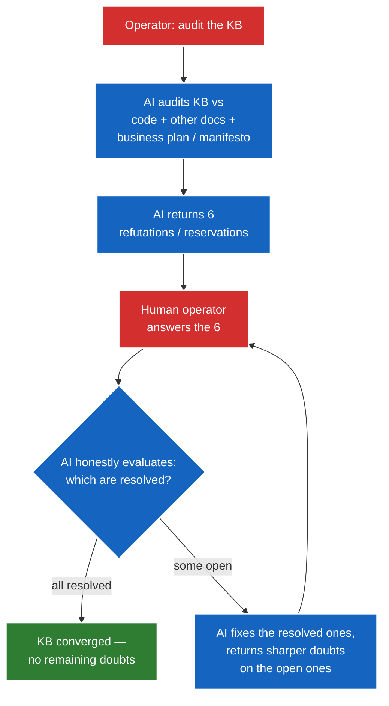

# Human-Assisted KB Repair

The KB is the root of trust — the one assumption the whole AI Use Theory rests on.
But getting a KB 100% accurate is hard, because it is *so much to cover*. A human
can't hold the whole codebase + the whole KB + the business plan in their head and
keep all of it consistent. So the human does not repair the KB alone. The AI
assists: it does the exhaustive *finding*, the human does the *judging*. This doc
is the flow. It is the concrete "human at the base" procedure the theory points to.

## Why the AI is needed

The KB is the base of the pyramid. If it's wrong, everything above it converges to
the wrong target — and no downstream signal (logs, tests) catches it, because they
all check *against* the KB. So the KB has to be right, and it has to *stay* right.
But:

- The surface area is large — every system, every seam, every decision.
- It drifts as the code changes (staleness).
- A human reviewing it alone will miss things; the AI won't, because it can read
  the whole codebase and the whole KB in one pass.

The division of labor: **the AI is the exhaustive auditor** (it finds every
misalignment, contradiction, and doubt); **the human is the authority** (intent,
business alignment, "is this actually true?"). Neither alone is enough — the AI
can't judge intent, the human can't cover the surface area.

## The Flow

### 1. The prompt — the AI audits the KB

The operator gives the AI a prompt that makes it audit the KB across four
dimensions:

- **Code alignment.** Where does the KB not match the current code +
  implementation? (KB says X, code does Y.)
- **Internal consistency.** What is inconsistent *across* the KB, or doubtful on
  its face? (Doc A says X, doc B says Y; or a claim that doesn't hold up.)
- **Business alignment.** Is the KB aligned with the **business plan +
  manifesto**? The KB should keep the product on track with them — flag where it
  has drifted from the strategy.
- **Effectiveness.** Is each piece of knowledge using the *right* knowledge
  theory, writing style, and voice for what it actually is? The test is clarity for
  both readers — what would be most unclear to a human operator, and what to an AI
  operator — *and* trust: does it read like a competent human expert, or like a
  robotic junior engineer trying too hard? The AI's default voice is the failure
  mode — flat, try-hard, cliché (the "You are an expert AI engineer" energy) — and
  a KB that sounds like an AI kills the operator's trust in it. The conventions in
  `knowledge/` are the *menu*: the Why/How/What theories answer "why does this doc
  exist" (and that grounding is what keeps the AI's writing from going generic),
  the writing style answers "how is it structured," the voice answers "who is
  speaking." The AI is the chef picking ingredients for *this* dish, not a machine
  stamping out identical ones. A doc that mechanically matches its siblings but
  explains poorly is a miss; one that breaks house style to explain more clearly is
  a win. The goal is writing that slaps everywhere, not writing that's uniform
  everywhere.

### 2. The AI returns a fixed batch — 6 bullet points

Not a 50-item dump. A small, fixed, tractable number — **6** — each a specific
refutation or reservation: a concrete doubt, misalignment, or inconsistency for
the human to address. The fixed size keeps the exchange focused and stops the
human from being overwhelmed. (6 is the default; the point is a *small fixed
batch*, not a firehose.)

### 3. The human responds

The operator answers the 6 points — with intent, corrections, business context,
or "no, that's actually right, here's why."

### 4. The AI evaluates honestly — the anti-sycophancy gate

The AI comes back on whether the human *sufficiently* answered each point. This
is the load-bearing step and it must be **honest, not agreeable**. If an answer
is hand-wavy, contradicts the code, or doesn't actually resolve the doubt, the AI
says so. A KB-repair loop where the AI just says "great, all fixed!" would
rubber-stamp a bad KB and diverge. The honest pushback is the gradient that drives
convergence.

### 5. Iterate to convergence

The AI applies the points the human nailed (say 4 of 6) and comes back with
*more, sharper doubts* on the points that weren't fully resolved (say 2 of 6).
The operator answers those circled-back doubts. Repeat — each round narrows the
set of open doubts — **until everything makes a ton of sense**: the AI has no
remaining reservations, and the KB aligns with the code, with itself, and with the
business plan + manifesto.

## Why this is the "human at the base" flow

The AI Use Theory says the human sits at the base (the KB) and the parallel agents
work above it. This is *how* the human holds the base: not by reading and editing
the whole KB alone, but by running this audit-and-refine loop with the AI. The AI
covers the surface area; the human supplies the judgment the AI can't. The loop
converges because each round either resolves a doubt or sharpens it — the same
target / altitude / gradient structure as debugging, pointed at the KB instead of
a bug.

## The prompt (starter)

> Audit the knowledge base. For each of these, find concrete problems:
> 1. Where the KB does not match the current code + implementation.
> 2. What is inconsistent across the KB, or doubtful on its face.
> 3. Where the KB has drifted from the business plan + manifesto.
> 4. (Optional) Where a piece of knowledge is explained the wrong way — wrong
>    knowledge theory or writing style for its content, or unclear to a human or
>    AI reader.
>
> Return exactly 6 bullet points — your strongest refutations / reservations,
> most important first. I will answer each; then tell me honestly which of my
> answers actually resolve the doubt and which need more.
