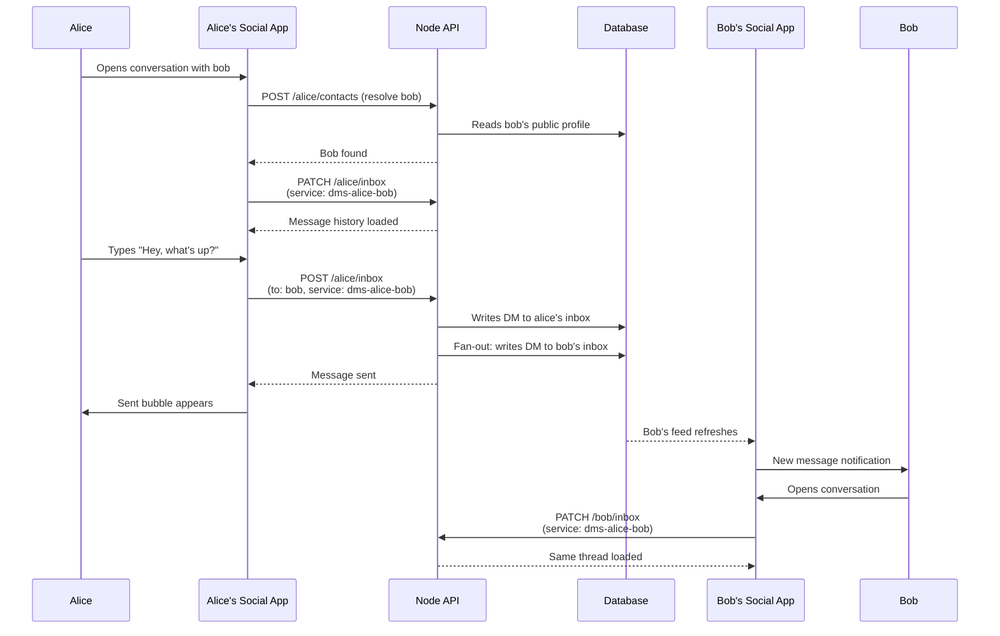
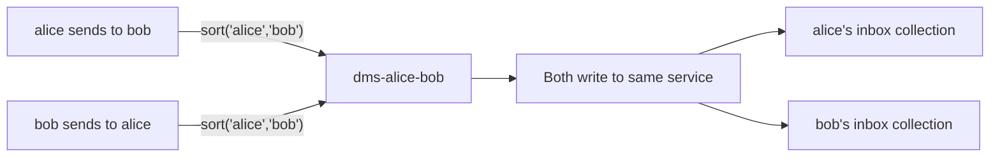
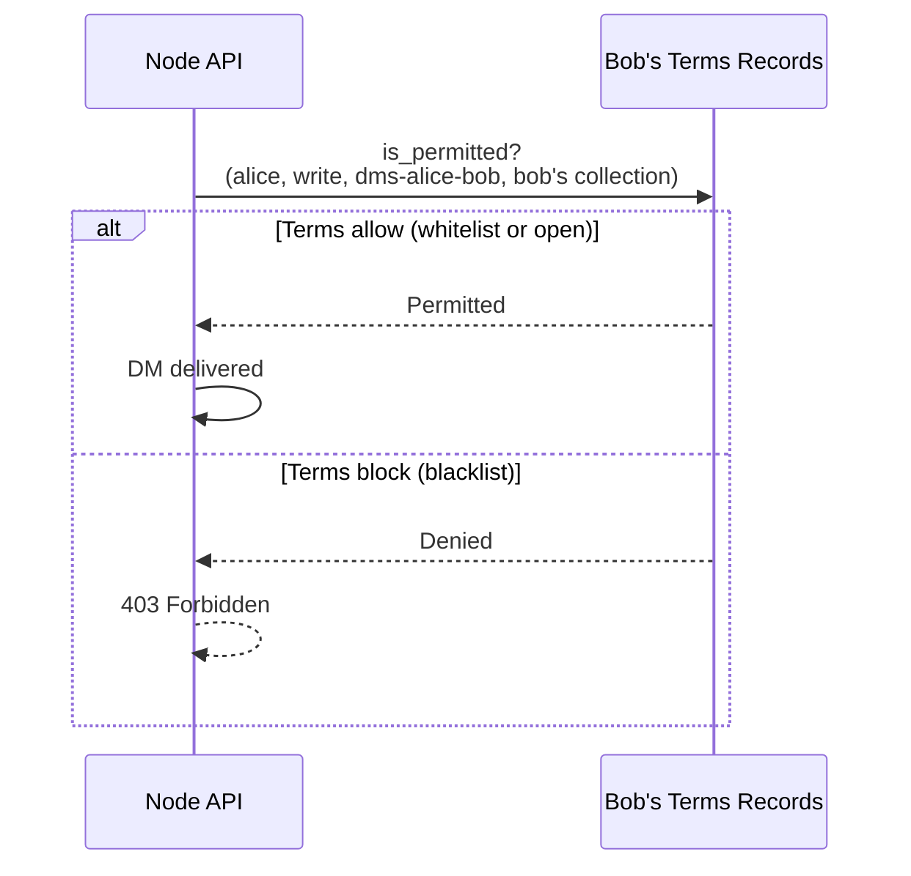

# Direct Messaging

Two people exchange private messages. DMs live as records in each person's `inbox` service. The conversation is deterministic — the service name is derived from both usernames, so both sides see the same thread.

## Conversation Flow

## Deterministic Service Names

The DM service name is derived from both usernames. Both sides write to the same logical conversation. The name is sorted alphabetically so `alice→bob` and `bob→alice` resolve to `dms-alice-bob`.

## Terms for DMs

DMs are gated by terms. Alice can message Bob only if Bob's terms allow it. The `is_permitted()` check runs on every DM write.

## Future: E2E Encryption (Phase 11)

Post-M3, DMs are end-to-end encrypted. The node operator cannot read them. Keys are managed through the mobile encryptor (phone-as-keychain). The WebRTC signaling service (already in `api/rtc/`) becomes the key channel.

```mermaid
graph TB
    subgraph Before["Before E2E (now)"]
        A1["Alice sends plaintext DM"]
        N1["Node stores plaintext"]
        B1["Bob reads plaintext DM"]
        Op1["Node operator CAN read DMs"]
    end

    subgraph After["After E2E (Phase 11)"]
        A2["Alice encrypts DM<br/>(bob's public key)"]
        N2["Node stores ciphertext"]
        B2["Bob decrypts DM<br/>(bob's private key)"]
        Op2["Node operator CANNOT read DMs"]
    end

    A1 --> N1 --> B1
    A2 --> N2 --> B2

    style Op1 fill:#18181b,stroke:#ef4444
    style Op2 fill:#18181b,stroke:#22c55e
```

