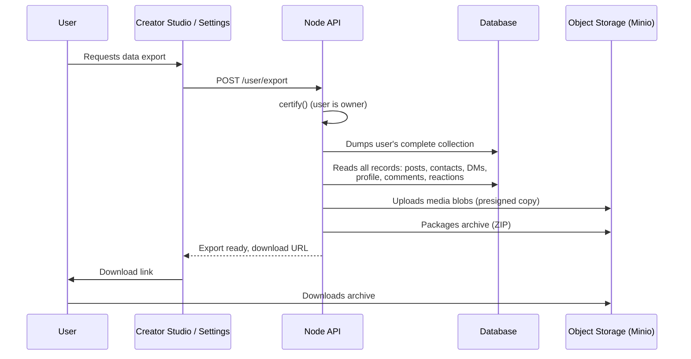
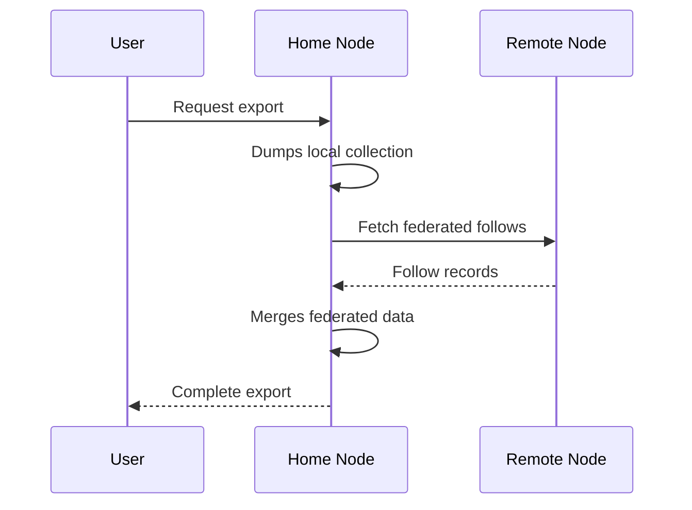

# Exporting Data

A user wants their data. On web10, they own it — literally, it lives in their named collection. Export is a first-class operation: the node dumps their complete collection as a structured archive.

## Export Flow

## What's in the Export

The archive contains the user's complete data — every record in their collection, plus the media blobs they own.

```mermaid
graph TB
    subgraph Archive["Export Archive (ZIP)"]
        subgraph Records["records/"]
            R1["posts.json<br/>(all post records)"]
            R2["contacts.json<br/>(all contacts)"]
            R3["inbox.json<br/>(DMs, received posts)"]
            R4["profile.json<br/>(profile record)"]
            R5["comments.json<br/>(all comments)"]
            R6["reactions.json<br/>(all reactions)"]
        end
        subgraph Media["media/"]
            M1["photos/"]
            M2["videos/"]
        end
        subgraph Meta["metadata.json"]
            T1["exported_at, node, user,<br/>record counts, schema version"]
        end
    end

    style Archive fill:#18181b,stroke:#8b5cf6
```

## Cross-Node Export (Federation)

When a user is on a federated node, the export includes their cross-node relationships: follows on other nodes, posts they've received from other nodes, and the provenance of federated content.

## The Point

On Instagram, you file a "download your information" request and wait days for a zip that arrives in a format only Meta understands. On web10, the export is your actual data — the records that live in your collection, structured, complete, importable elsewhere.