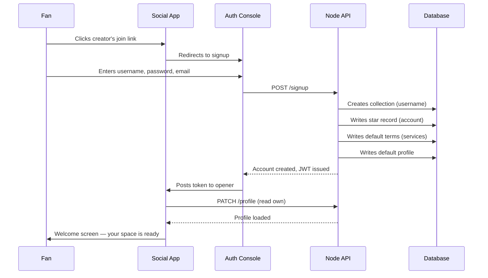
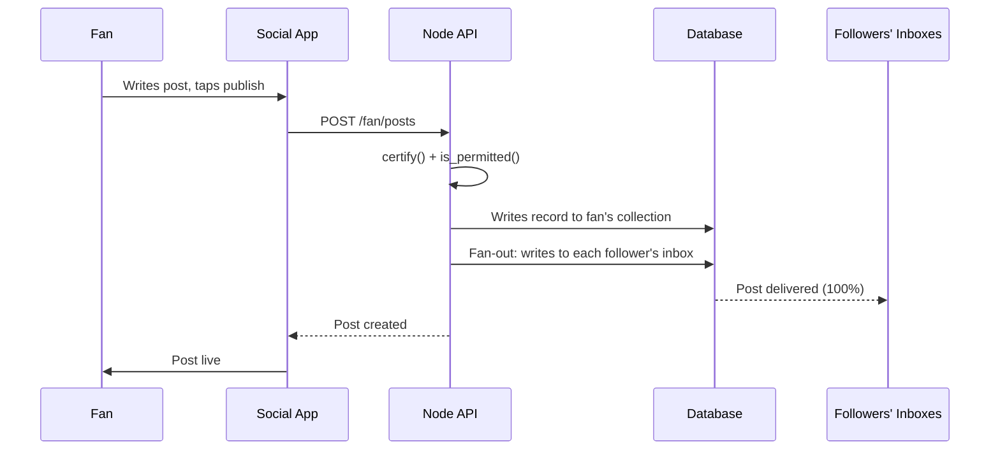

# Fan Joins a Node

A follower clicks a creator's link. They sign up. They get their own space — not just a row in the crowd. Every account is creator-shaped from day one: own page, own followers, own data.

## Signup Flow

## What the Fan Gets

In the same breath as joining, the fan gets their own page. Not a hidden profile — a real space. The aspirant identity is honored at signup:

```mermaid
graph TB
    subgraph FanSpace["Fan's Space (day one)"]
        Profile["Profile page<br/>(banner, bio, stats)"]
        Posts["Posts collection<br/>(empty, ready)"]
        Feed["Feed<br/>(creator's posts + follows)"]
        DMs["Direct messages"]
        Contacts["Contacts"]
    end

    FanSpace -.->|"This is YOUR place,<br/>not just the crowd"| Fan["Fan"]

    style FanSpace fill:#18181b,stroke:#8b5cf6
```

## The First Post

The fan posts. Their followers (maybe zero, maybe five) all see it. The number is real — 100% delivery, no throttle. The throttle hits small accounts hardest on legacy platforms. Here, 5K followers means 5K people actually see you.

## The Flywheel

Every account is already creator-shaped. Today's 5K wannabe is next year's 100K creator who is already home. The WordPress flywheel: nobodies start blogs. The ones who get big never migrate.