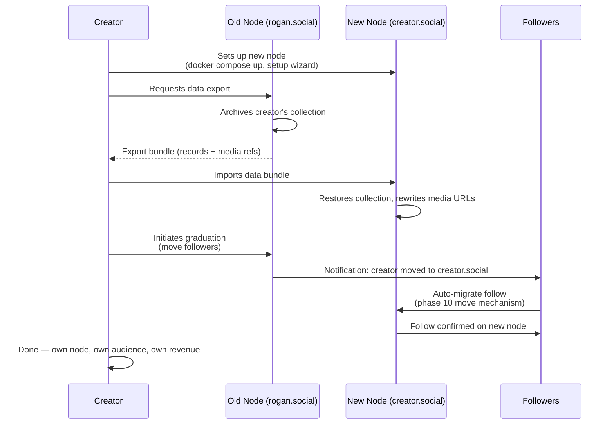
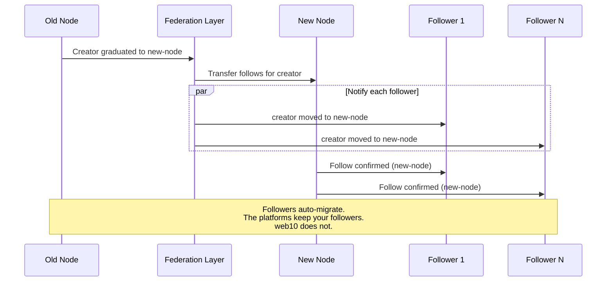

# Graduation: Moving Nodes

A creator grows on someone else's node. They hit 100K followers. It's time for their own node — their own domain, their own brand, their own revenue. On web10, they take their data and their audience with them. Zero friction.

This is the top rung of THE RISE.

## The Graduation Flow

## What Moves

Everything. The creator's data, their followers, their content. The platforms hand you a takeout zip and keep your followers. Here, followers auto-migrate.

```mermaid
graph TB
    subgraph Moves["Moves with the creator"]
        Data["Data collection<br/>(posts, contacts, DMs, profile)"]
        Followers["Followers<br/>(auto-migrate via federation)"]
        Media["Media references<br/>(rewritten to new node)"]
        Terms["Terms/ACLs<br/>(reapplied on new node)"]
    end

    subgraph Stays["Stays on the old node"]
        OldNode["Old node continues<br/>(other users unaffected)"]
    end

    Data --> Creator["Creator's New Node"]
    Followers --> Creator
    Media --> Creator
    Terms --> Creator

    style Moves fill:#18181b,stroke:#22c55e
    style Creator fill:#18181b,stroke:#8b5cf6
```

## The Follow Migration

When a creator graduates, their followers are notified. The follow relationship migrates automatically through federation — the old node tells the new node who follows the creator, and the new node confirms.

## Why This Matters

Graduation is the ownership story proven from the inside. Even the node you're on can't hold you. Every graduate mints a new node — a new hosting customer. The pipeline literally converts.

The failure branch is also a feature: not popping off on one node? Switch sideways. Identity, content, and followers come with you. Scene-market fit becomes searchable. On the platforms, this option does not exist — one house, one dealer, grind the same machine or quit.