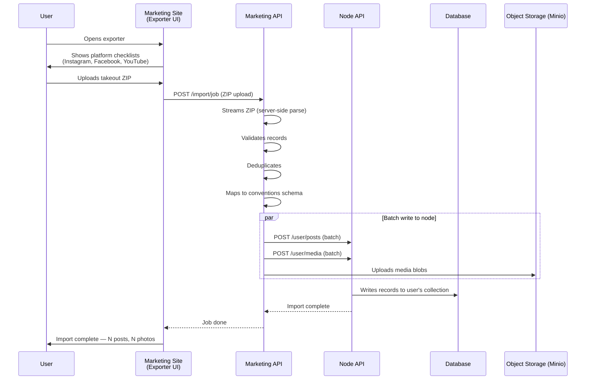
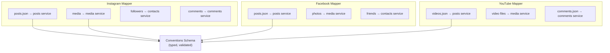

# Importing from Legacy Platforms

A user joins web10 with an empty node. The exporters fix that in one shot: their Instagram, Facebook, or YouTube back catalog imports into their collection. Day one isn't empty.

## The Import Flow

## Platform Mappers

Each legacy platform has a mapper that translates its format into web10's conventions schema. The mappers are fixture-tested (57 tests) and battle-tested against real takeouts.

## Ghost Accounts

Imported comments and interactions that reference users who haven't joined web10 yet show as ghosts — `@username · from instagram`. The origin field carries the provenance. These are archival records, not live graph entries.

Later, if a ghost's original owner joins and imports their own takeout, the system can relink them: both parties' exports agreeing on origin + timestamp + text is the proof.

```mermaid
graph LR
    subgraph Before["Before relink"]
        Ghost["@username<br/>from instagram<br/>(ghost)"]
        Post["Imported post"]
        Post --> Ghost
    end

    subgraph After["After relink"]
        Real["@username<br/>(joined web10,<br/>imported their takeout)"]
        Post2["Imported post"]
        Post2 --> Real
    end

    style Ghost fill:#18181b,stroke:#3f3f46
    style Real fill:#18181b,stroke:#22c55e
```

## Real-World Constraints

- **YouTube takeout** exports videos + metadata but arrives as 50GB+ chunks from days-long jobs. The 24-hour onboarding clock starts when the takeout arrives.
- **The audience never ports** from any platform. No export includes reachable subscriber identities. Content ports. Audiences are pointed — the creator directs their followers to the new home.
- **Imported video** plays as direct MP4 off Minio/R2 until the transcode pipeline exists (Phase 8).

## The Point

On the platforms, your content is trapped. You can export it, but you can't use it anywhere else. On web10, the exporters make onboarding a 24-hour thing: whole back catalog imported in one shot, then it's just one more surface in the posting routine they already have.