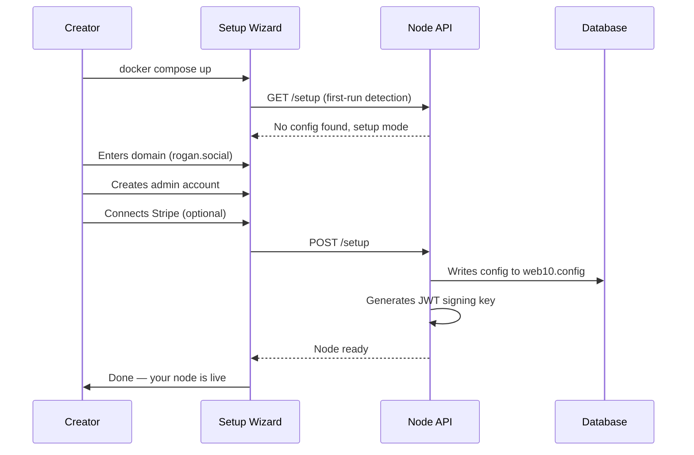
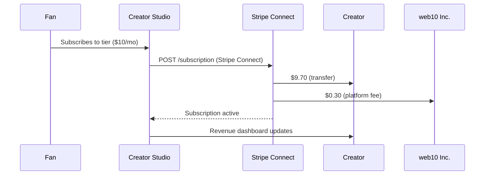

# Influencer Runs a Node

A creator stands up their own node. They own the domain, the brand, the audience relationship, and the revenue. web10 takes a small percentage of revenue flowing through the payment rails.

## Day One: Setup

The creator runs `docker compose up`. The setup wizard walks them through: domain, admin account, optional Stripe/Twilio keys. The node is live.

## The Studio: Monetization Menu

The creator opens the Studio — their console. The monetization menu is a ladder of one-button cards. Rung 0 is available immediately:

- **Memberships** — Stripe Connect, 3% rails fee
- **Amazon Auto-Affiliate** — paste your associates tag, every product link earns
- **Direct Deals** — hand-entered sponsorships

```mermaid
graph TB
    subgraph Studio["Creator Studio"]
        subgraph Rung0["Rung 0 — Available Now"]
            Memberships["Memberships<br/>Stripe Connect, 3%"]
            Affiliate["Auto-Affiliate<br/>Paste tag, earn on every link"]
            Direct["Direct Deals<br/>Hand-entered sponsors"]
        end
        subgraph Rung1["Rung 1 — ~1K Sessions"]
            Contextual["Contextual Display<br/>EthicalAds, zero cookies"]
        end
        subgraph Rung2["Rung 2 — ~10K"]
            Marketplace["Sponsor Marketplace<br/>Cross-node inventory, 3%"]
        end
        subgraph Rung3["Rung 3 — ~25K+"]
            Premium["Premium Programmatic<br/>Operator opt-in only"]
        end
    end

    Rung0 --> Rung1
    Rung1 --> Rung2
    Rung2 --> Rung3

    style Rung0 fill:#18181b,stroke:#22c55e
    style Rung1 fill:#18181b,stroke:#3f3f46
    style Rung2 fill:#18181b,stroke:#3f3f46
    style Rung3 fill:#18181b,stroke:#3f3f46
```

## Revenue Flow

A fan pays for a membership. The money flows: fan → Stripe → creator (97%) + web10 Inc. (3%). The creator sees it in the Studio's revenue dashboard.

## Audience Growth

Fans join through the creator's link. The creator posts. Every post reaches 100% of followers — by architecture, not policy. The inbox pattern (fan-out on write) makes this structural. It cannot be quietly revoked.

```mermaid
graph LR
    Creator["Creator<br/>(rogan.social)"] -->|"Posts once"| API["Node API"]
    API -->|"Fan-out on write"| F1["Fan 1 inbox"]
    API -->|"Fan-out on write"| F2["Fan 2 inbox"]
    API -->|"Fan-out on write"| F3["Fan N inbox"]

    F1 -.->|"100% delivery"| Fan1["Fan 1 sees it"]
    F2 -.->|"100% delivery"| Fan2["Fan 2 sees it"]
    F3 -.->|"100% delivery"| FanN["Fan N sees it"]

    style Creator fill:#18181b,stroke:#8b5cf6
    style Fan1 fill:#18181b
    style Fan2 fill:#18181b
    style FanN fill:#18181b
```

## The Creator's Edge

Compared to Instagram: the creator's 1M followers see 300K of their posts. On their web10 node: 1M followers see 1M posts. The reach gap is the shadow ban. On web10, the shadow ban is architecturally impossible.