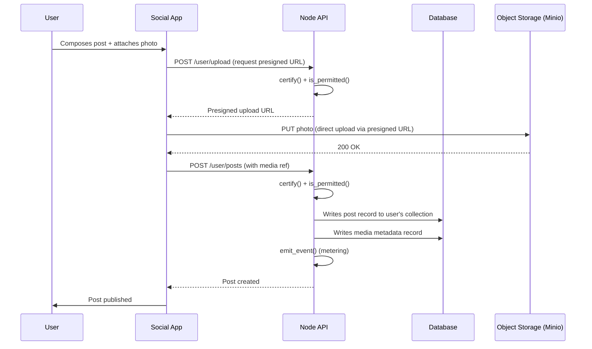
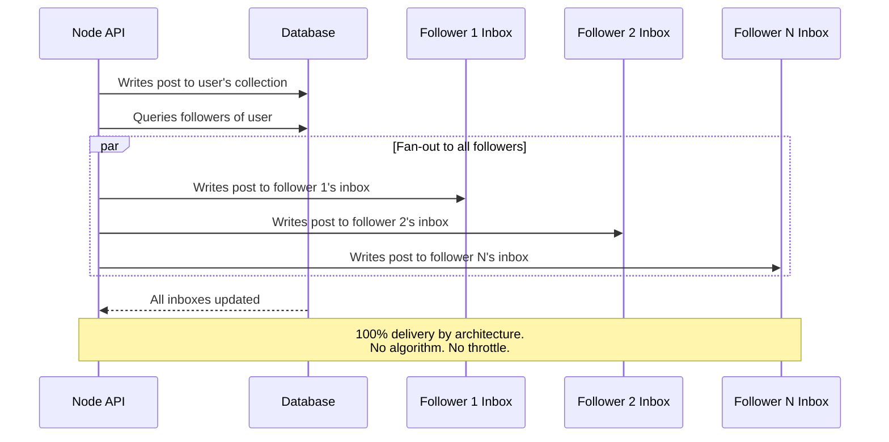
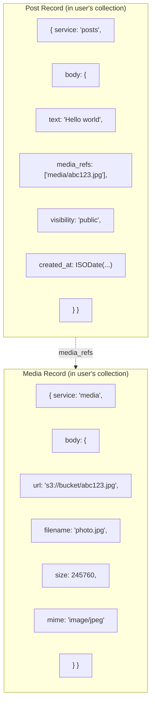
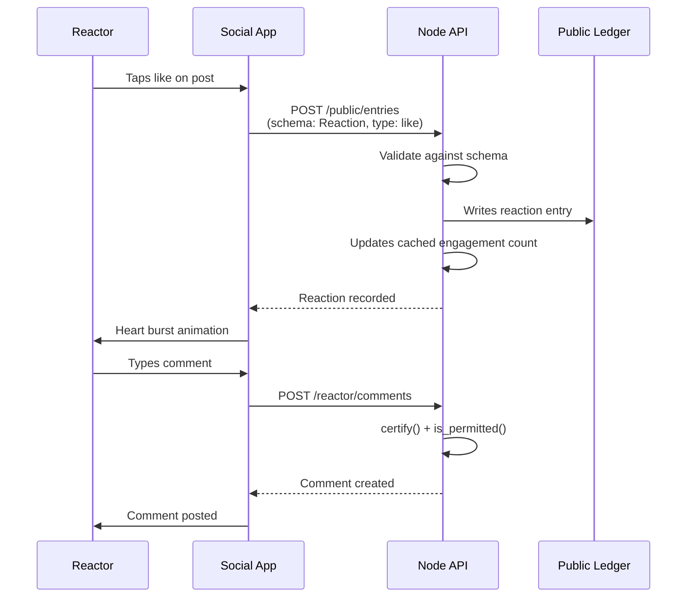

# Posting Content

A user writes a post. The node delivers it to every follower. No algorithm. No throttling. No "reach optimization." The inbox pattern — fan-out on write — makes this structural.

## The Post Flow

## The Inbox Delivery

The post reaches 100% of followers. This is not a policy — it is architecture. The fan-out happens at write time. There is no feed algorithm to demote the post later.

## Post with Media

When a post includes media, the flow adds a presigned upload step. The social app never touches the blob — it uploads directly to Minio. The API writes a metadata record in the user's collection.

## Visibility Toggle

Posts split into `public_posts` and `private_posts` collections. Public posts are discoverable — the discovery index picks them up. Private posts are invisible to anyone without a scoped token.

```mermaid
graph LR
    User["User Posts"] -->|"visibility: public"| Public["public_posts"]
    User -->|"visibility: private"| Private["private_posts"]
    Public --> Discovery["Discovery Index<br/>(searchable, indexable)"]
    Private -.->|"No discovery"| None["—"]
    Public --> Followers["Followers' Inboxes"]
    Private --> Followers

    style Public fill:#18181b,stroke:#22c55e
    style Private fill:#18181b,stroke:#ef4444
```

## Reactions and Comments

Reactions are entries in the public ledger, keyed by schema. Comments are records in the user's collection, threaded on the parent post.

