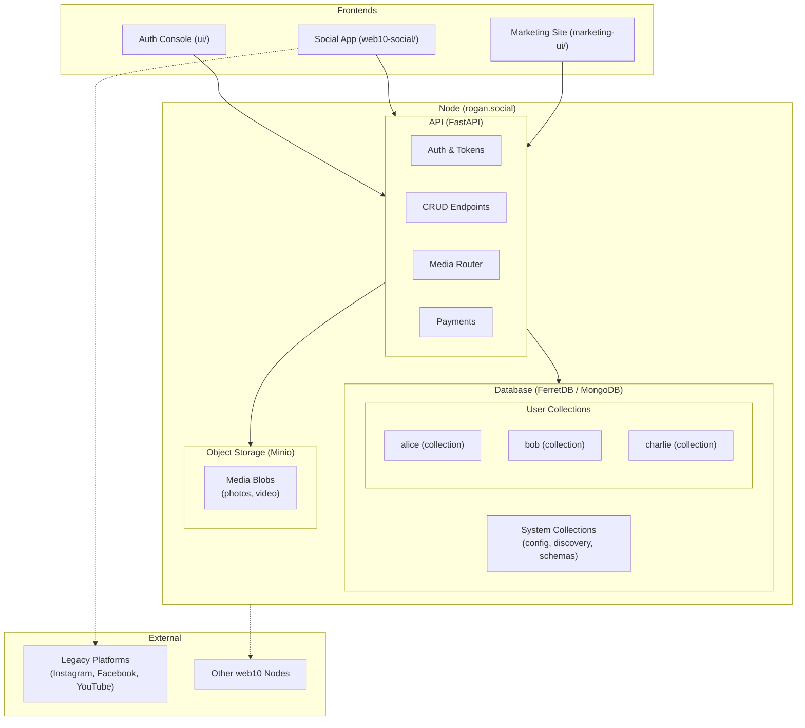
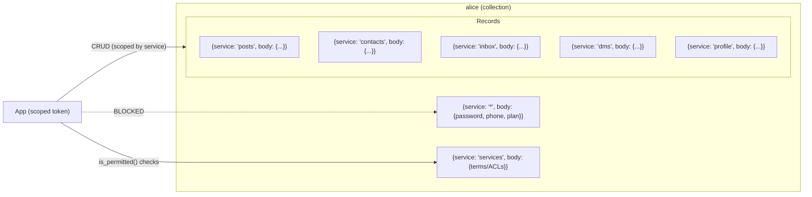
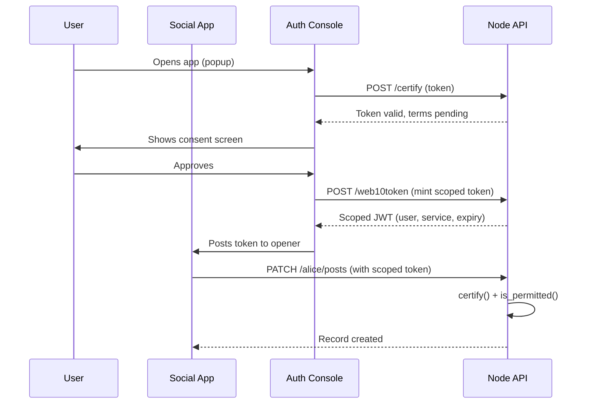

# System Overview

web10 is a creator-owned social platform. Each user owns their data in a personal database collection. Apps are stateless lenses that read and write through a scoped, expiring token. The node operator runs the infrastructure. The user owns the content.

The architecture has three layers: the node (API + database), the apps (React frontends), and the protocol (CRUD + terms + federation).

## The Node

One node = one community. A creator runs a node. Fans join that node. The node serves the API, the auth console, the social app, and media storage.



## The Data Model

Every user gets their own MongoDB collection, named by username. Every document inside is `{service, body}`. The `services` service holds terms/ACL records. The `*` (star) record holds the account — password hash, phone, Stripe IDs. Star protection prevents CRUD from touching it.



## The Token Flow

Apps never hold a user's password. They hold a scoped, expiring JWT. The token carries `username`, `site`, `target`, `provider`, and `expires`. Every request is verified (`certify`) and authorized (`is_permitted` against terms records).



## The Actors

| Actor | Owns | Controls |
|-------|------|----------|
| **User** | Their data collection | Who can read/write their data (terms) |
| **App** | Nothing | A scoped token (revocable, expiring) |
| **Node Operator** | Infrastructure | Policy, signup gates, monetization |
| **web10 Inc.** | Nothing | Payment rails (small % of revenue) |

## Federation (M3)

Nodes talk to each other. A user on `rogan.social` can follow a user on `joe.rodney`. Posts cross nodes via the inbox pattern. Private content is end-to-end encrypted — the node operator cannot read it.

```mermaid
graph TB
    subgraph NodeA["Node A (rogan.social)"]
        Alice["alice's collection"]
        API_A["Node API"]
    end

    subgraph NodeB["Node B (joe.rodney)"]
        Bob["bob's collection"]
        API_B["Node API"]
    end

    Alice -->|"follow: bob@joe.rodney"| API_A
    API_A -->|"federation: fetch feed"| API_B
    API_B -->|"read bob's public posts"| Bob
    API_B -->>|"fan-out: deliver to alice's inbox"| API_A
    API_A -->|"write to alice's inbox"| Alice

    style Alice fill:#18181b
    style Bob fill:#18181b
    style NodeA fill:#09090b,stroke:#8b5cf6
    style NodeB fill:#09090b,stroke:#8b5cf6
```