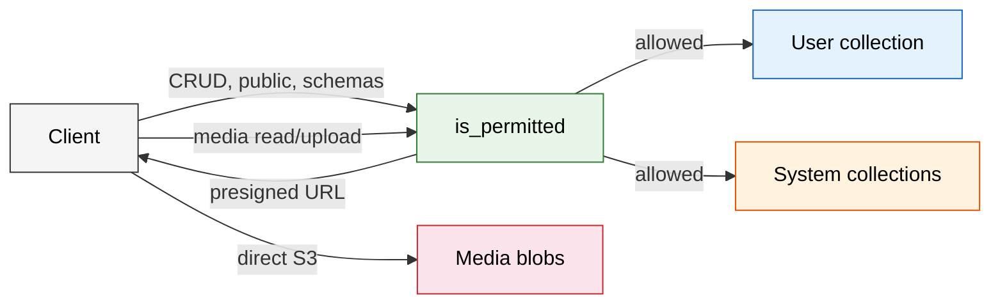

# API Endpoints — The Map

The web10 API is a FastAPI app. Every request carries a JWT token in the body 
(except anon reads and health checks). The token tells the server who you are, 
what node you came from, and what you're allowed to do.

Below is every endpoint, grouped by what it does.

---

## Auth — Identity & Tokens

Get in. Stay in. Recover.

| Method | Path | What It Does | Auth |
|--------|------|-------------|------|
| POST | `/signup` | Create account, provision collection + default service terms | None |
| POST | `/web10token` | Mint JWT — password or existing token | None |
| POST | `/certify` | Verify a token is valid (signature, provider, expiry) | Token |
| POST | `/recovery_prompt` | Send recovery code to phone | None |
| POST | `/recovery_bot` | Twilio webhook for RESET body → generates temp password | None |
| POST | `/change_pass` | Change password (requires old password) | None |
| POST | `/change_phone` | Change phone number (requires password) | None |
| POST | `/mobile_login` | Login via SMS code | None |
| POST | `/send_code` | Send verification code to registered phone | Admin |
| POST | `/verify_code` | Verify phone code | Admin |
| POST | `/set_recovery_phone` | Set recovery phone on star record | Token (own) |
| POST | `/set_email` | Set recovery email, send verification code | Admin |
| POST | `/get_email` | Return user's own email | Admin |
| POST | `/verify_email` | Verify email with code | Admin |

**Key code:** `api/app/endpoints/auth.py`, `api/app/services/auth.py`

---

## CRUD — The Core Five

Every user owns a collection. Every collection has services. Every service has 
a contract. These five endpoints are the entire data layer.

| Method | Path | What It Does | Auth |
|--------|------|-------------|------|
| POST | `/{user}/{service}` | Create records | Token + contract |
| PATCH | `/{user}/{service}` | Read records (query, sort, skip, limit) | Token + contract |
| PUT | `/{user}/{service}` | Update records | Token + contract |
| DELETE | `/{user}/{service}` | Delete records | Token + contract |
| POST | `/{user}/{service}/aggregate` | Run aggregation pipeline (scoped, validated) | Token + contract |

Every CRUD request runs through the same gate:

1. `is_permitted(token, user, service, action)` — check contract
2. `check(user)` — verify, replenish credits, check space
3. Execute against `db[user]`
4. Background tasks: `charge`, `emit_event`, `background_index_post`

**Key code:** `api/app/endpoints/crud.py`, `api/app/services/documentdb.py`

---

## Discovery — Public Board

Cross-user index for public content. Read-only surface, anon-accessible. 
Backed by `web10.discovery_posts` collection.

| Method | Path | What It Does | Auth |
|--------|------|-------------|------|
| PATCH | `/discover/posts` | For-you feed (recent or trending) | Anon OK |
| PATCH | `/discover/users` | Suggested accounts by engagement | Anon OK |
| PATCH | `/discover/search` | Full-text search (text + regex fallback) | Anon OK |
| PATCH | `/discover/topics` | Trending hashtags | Anon OK |
| PATCH | `/discover/post/{user}/{service}/{id}` | Single post lookup | Anon OK |
| PATCH | `/discover/app/{web10apps_post_id}` | App product page data | Anon OK |

**How it works:** CRUD writes → background task → `upsert_discovery_post` → 
discovery index. Reads derive engagement from the public ledger at query time.

**Key code:** `api/app/endpoints/discover.py`, `api/app/services/documentdb.py` (discovery section)

---

## Media — Object Storage

Two-phase upload to S3-compatible storage (MinIO). Metadata lives in user 
collections (`media` or `public_media` service).

| Method | Path | What It Does | Auth |
|--------|------|-------------|------|
| POST | `/{user}/upload` | Request presigned upload URL | Token + media create |
| POST | `/{user}/upload/confirm` | Confirm upload, write metadata record | Token + service create |
| POST | `/{user}/read` | Request presigned read URL | Token + service read |
| POST | `/{user}/list` | List media metadata records | Token + service read |
| DELETE | `/{user}/delete` | Delete media records | Token + media delete |

**Key code:** `api/app/endpoints/media.py`, `api/app/services/media.py`

---

## Public Ledger — Structured Interactions

Write-open, read-public surface for structured data. Backed by 
`web10.public` collection. Schema-validated.

| Method | Path | What It Does | Auth |
|--------|------|-------------|------|
| POST | `/public/entries` | Create entry (schema-validated) | Token |
| PATCH | `/public/entries` | Query entries (filter by schema, target, author) | Anon OK |
| PUT | `/public/entries/{id}` | Update entry | Author only |
| DELETE | `/public/entries/{id}` | Delete entry | Author only |

Used for: reactions, comments, reposts, follows, app ratings — anything that 
needs to be public and structured.

**Key code:** `api/app/endpoints/public.py`, `api/app/services/documentdb.py` (public section)

---

## Schemas — Type Definitions

JSON Schema registry. Any user can register schemas; public ledger entries 
validate against them.

| Method | Path | What It Does | Auth |
|--------|------|-------------|------|
| POST | `/schemas/register` | Register new JSON Schema | Token |
| PATCH | `/schemas/{id}` | Fetch schema | Anon OK |
| PUT | `/schemas/{id}` | Update schema | Author only |
| DELETE | `/schemas/{id}` | Delete schema | Author only |

**Key code:** `api/app/endpoints/schemas.py`, `api/app/services/documentdb.py` (schemas section)

---

## Payments — Stripe Integration

Developer compensation and subscription management. Customer and business IDs 
stored on the star record.

| Method | Path | What It Does | Auth |
|--------|------|-------------|------|
| POST | `/dev_pay` | Create subscription checkout session | Token |
| PATCH | `/dev_pay` | Verify subscription status | Token |
| DELETE | `/dev_pay` | Cancel subscription | Token |
| POST | `/manage_business` | Create Stripe Connect business session | Admin |
| POST | `/business_login` | Stripe Connect login link | Admin |

**Key code:** `api/app/endpoints/payments.py`, `api/app/services/stripe.py`

---

## System — Node Operations

Setup, config, health, stats, app store, moderation. Most are admin-gated.

| Method | Path | What It Does | Auth |
|--------|------|-------------|------|
| GET | `/` | Redirect to `/docs` | None |
| GET | `/setup` | Check if node is configured | None |
| POST | `/setup` | First-run setup (JWT key, config, admin) | None |
| POST | `/config` | Get node config (stripped of secrets) | Admin |
| PATCH | `/config` | Partial config update | Admin |
| POST | `/am_admin` | Check if caller is admin | Token |
| GET | `/ready` | Health check (DB ping) | None |
| POST | `/stats` | Node stats (apps, users, storage) | None |
| GET | `/pwa_listing` | Fetch PWA manifest from URL | None |
| POST | `/register_app` | Register app (starts pending) | None |
| POST | `/apps/admin` | List all apps with review state | Admin |
| POST | `/apps/approve` | Approve/reject app | Admin |
| POST | `/apps/rating` | Submit star rating | Token |
| PATCH | `/apps/ratings/{id}` | Read ratings | Anon OK |
| POST | `/admin/discovery/remove` | Hide post from discovery board | Admin |
| POST | `/admin/discovery/restore` | Restore hidden post | Admin |
| POST | `/admin/discovery/removed` | List hidden posts | Admin |
| POST | `/admin/discovery/migrate_terms` | Migrate public_posts terms | Admin |
| POST | `/admin/discovery/backfill` | Backfill discovery index | Admin |
| POST | `/admin/apps/migrate_v2` | Migrate apps to v2 | Admin |

**Key code:** `api/app/endpoints/system.py`, `api/app/services/config.py`

---

## How Requests Flow

---

## Router Registration Order

`api/app/main.py` registers routers in this order. Specific routes must come 
before the catch-all CRUD router, which matches `/{user}/{service}`:

1. `auth.router` — identity endpoints
2. `payments.router` — stripe endpoints
3. `system.router` — node ops
4. `media.router` — `{user}/upload`, `{user}/read`, etc.
5. `discover.router` — `/discover/*`
6. `schemas.router` — `/schemas/*`
7. `public.router` — `/public/*`
8. `crud.router` — `/{user}/{service}` (catch-all)

If CRUD were registered first, it would shadow everything else.