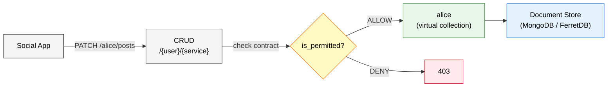
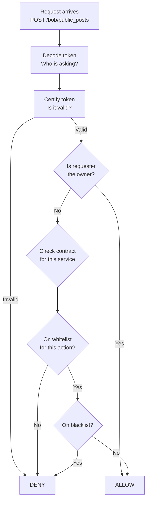
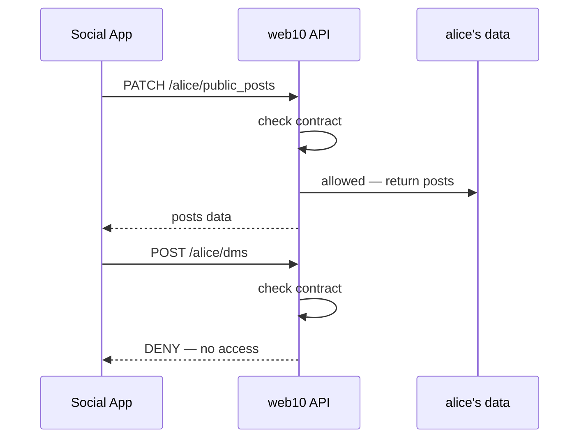

# The CRUD — User-Owned Data Buckets

## The Original Idea

Before social feeds, before discovery, before media uploads — there was just **five endpoints**.

The original web10 was a CRUD API. Not a REST API with resource-specific routes, not a GraphQL schema 
with predefined types. Just five HTTP verbs against a single URL pattern:

```
POST   /{user}/{service}   — create
PATCH  /{user}/{service}   — read
PUT    /{user}/{service}   — update
DELETE /{user}/{service}   — delete
POST   /{user}/{service}/aggregate — query
```

That's it. Five endpoints. One pattern. Every API call in the system routes through this.

## The Insight

The insight was simple: **if you give every user their own data bucket, and let them decide who 
touches it, you don't need a platform.**

On every other internet platform, the company owns the database. You're a row in their table. 
They decide who sees your data, they decide what happens to it, they can change the terms 
overnight. You're a tenant.

On web10, **you are the database**.

## The Architecture

When a user signs up, the system creates a **MongoDB collection named after them**:

```python
# api/app/services/documentdb.py:293
user_col = db[username]
user_col.insert_one(new_user)
```

That's the user's entire data universe. Every record they own lives in `db["alice"]`, 
`db["bob"]`, `db["chimdi"]`. The collection name is the username. There is no shared 
"users" table, no "posts" table, no "messages" table. Just one collection per person.



Inside each user's collection, data is organized by **service**. A service is just a string 
field on every document — `public_posts`, `inbox`, `follows`, `media`, `profile`, `dms`, 
whatever the user or an app needs. The service name is the data bucket.

## The Contracts

Each service has a **term record** — a contract that says who can do what. The term lives in 
the user's own collection, under the `services` service:

```python
# api/app/services/records.py:72-82
def public_posts_term():
    return {
        "service": "public_posts",
        "whitelist": [
            {"username": ".*", "provider": ".*", "read": True},
        ],
        "blacklist": [],
    }
```

This contract says: anyone (`.*`), from any provider (`.*`), can read my public posts. 
Nobody can write, update, or delete them — only the owner can.

The contracts are stored as records in the user's collection. The user can edit them at any 
time. The user can delete them. The user is the only one who can change the rules of their 
own data.

## The Permission Check

Every CRUD request goes through the same gate: `is_permitted()`. This function is the 
enforcement engine — it reads the contract and decides:

```python
# api/app/services/auth.py:118-144
def is_permitted(token: Token, username: str, service: str, action: str) -> bool:
    # Decode the token to find out who's asking
    # Certify the token is valid
    # If the requester owns the data, allow
    # If the requester is on the whitelist for this action, allow
    # If the requester is on the blacklist, deny
```

The flow:



The contract lookup uses regex matching — `.*` means everyone, `alice` means only Alice, 
`family` could be an alias group. The provider field lets you grant access to specific 
nodes. The action field (`create`, `read`, `update`, `delete`) lets you grant exactly 
what you want:

```python
# api/app/services/documentdb.py:608-612
def is_listed(e):
    list_hit = (bool(re.fullmatch(e["username"], username))) and \
               (bool(re.fullmatch(e["provider"], provider)))
    action_permitted = action in e and e[action]
    all_permitted = "all" in e and e["all"]
    return list_hit and (action_permitted or all_permitted)
```

## The Freedom

This is where the idea becomes real:

**The platform cannot read your data unless you whitelist it.** The node operator is not 
special — they're just another user on the whitelist. If you don't grant them access, 
they can't see your records.

**The platform cannot sell your data because they don't have it.** Your data lives in 
your collection. Access is granted by contract, not by employment.

**The platform cannot change the terms because you own the terms.** The service records 
live in your collection. Only you can edit them. If a platform wants to change how your 
data is accessed, they have to ask you to change your contract.

**You can leave and take your data because it's yours.** Export your collection, move it 
to another node, the contracts travel with the records. Your data isn't locked in a 
proprietary format — it's JSON documents in a collection.

## How Apps Work

An app doesn't own your data. An app is just a client that talks to your CRUD endpoints. 
When you install an app, the app creates service term records in your collection — 
contracts that grant the app access to specific services. You can see every contract. 
You can edit every contract. You can revoke every contract.



## The Original CRUD Endpoints

The five endpoints haven't changed. They're still in `api/app/endpoints/crud.py`, 
still five functions, still the same URL pattern. Everything that was added — discovery, 
media, payments, schemas — sits alongside them, never replaces them:

```python
# api/app/endpoints/crud.py — the original five
@router.post("/{user}/{service}")      # create
@router.patch("/{user}/{service})     # read
@router.put("/{user}/{service})       # update
@router.delete("/{user}/{service})    # delete
@router.post("/{user}/{service}/aggregate")  # query
```

Every request hits the same gate:

```python
# api/app/endpoints/crud.py:57
if not is_permitted(token, user, service, "create"):
    raise exceptions.CRUD
```

The permission check is the first thing that runs. Before the database is touched, 
before any business logic executes — the contract is checked. If the contract says no, 
the request dies.

## The Vision

The original README said it plainly:

> Users of the internet solely use the internet as clients through their browser.
> web10.0 is a protocol for supplying internet users with their own personal APIs 
> allowing them to use the internet in a new way.

The CRUD is that personal API. Five endpoints. One collection. Contracts you control. 
Data you own.

If every user on the internet had their own data bucket with their own rules, the 
platforms would have nothing to sell. No attention to auction. No data to mine. 
No leverage to hold over creators.

The internet would be free because the users would own it.

## What Was Added

The CRUD is still the foundation. Everything else is built on top:

- **Discovery** — a cross-user index for public content, fed by background tasks on CRUD writes
- **Media** — S3-compatible object storage with presigned URLs, metadata stored in user collections
- **Public Ledger** — a shared collection for structured interactions (reactions, comments, follows)
- **Schemas** — JSON Schema validation for structured data in the public ledger
- **App Store** — registration, review, and rating of web10 apps
- **Payments** — Stripe integration for subscriptions and developer compensation

None of these change the CRUD. They all use it. A media record lives in your `media` 
service. A reaction lives in the public ledger, but the engagement count is derived 
from it at read time. Discovery is a projection, not the source of truth.

The CRUD is the source of truth. Everything else is a view.