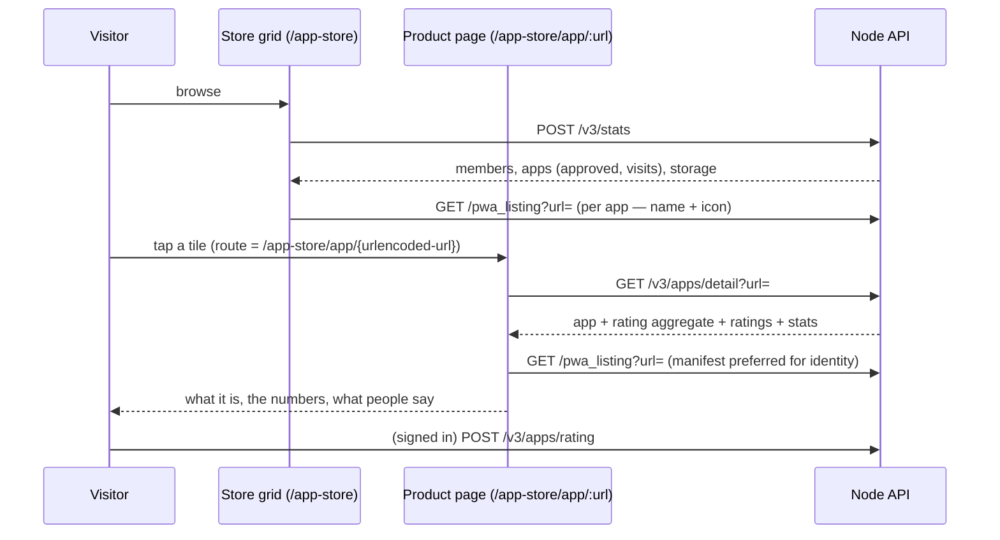

# The App Store's Endpoints

The store's API surface. `overview.md` covers what an app *is* to the store
(identity, registration, the manifest). This doc covers how the store
*serves* it: every endpoint the storefront and the product page talk to,
what they return, and what the numbers mean.

## The Page Is the Product

A visitor is browsing the grid. A tile catches their eye — a name, an icon,
"1,337 visits." Before they tap Open, they want three answers:

1. **What is it?** — the description, the screenshots.
2. **Is it real?** — the numbers. Visits, users, how long it's been around.
3. **What do people say?** — the ratings.

A store that can't answer those three with data is a directory of links.
The App Store answers them with one page and one endpoint: the **product
page** (`/app-store/app/:id`) is served by `GET /v3/apps/detail`. The page
is a URL — refreshable, shareable, bookmarkable. You can send someone the
link to an app, the way you send someone a link to anything else. That is
the "oh, okay" moment: the store is a real place with real pages, not a
list of buttons.

The endpoint behind it is the store's own, and it is the center of gravity
of this doc.

## The Identity Call: the URL Is the Key

The product page is keyed by the **app's URL** — the same identity
registration uses (D47). `https://www.web10.app/docs/notes/` *is* the app,
and the page for it is `/app-store/app/{urlencoded-url}`.

This retires `web10apps_post_id`. The field was a v2 vestige — the
`#web10apps` discovery ledger, dropped in v3 (overview.md). The v3 `apps`
table never had the column; `/v3/stats` was blanking it to `""` for the UI;
the UI's detail route read that blank. The result: the card never linked to
the page, and the page's fetch hit an endpoint that does not exist
(`PATCH /discover/app/{id}` — a phantom). Every tile opened the site; every
page 404'd.

The root cause was an identity gap: the UI wanted a short ID for the route,
but the store's identity is already the URL. Keying the detail endpoint on
the URL deletes the gap instead of papering over it with a second ID
system. No post IDs, no slugs, no numeric IDs. The URL is the app.

## The Surface

All store endpoints live under `/v3/apps`, except the manifest proxy
(`GET /pwa_listing`, system router) and the node stats (`POST /v3/stats`,
system router).

| Endpoint | Auth | Called by | What it does |
|---|---|---|---|
| `POST /v3/apps/register` | anonymous | the SDK, on every `createV3Client()` | registration + visit ping |
| `GET /v3/apps/detail?url=` | anonymous | the product page | the whole page: app + rating aggregate + rating list + stats |
| `POST /v3/apps/list` | anonymous | SDK `getApps()` | approved apps, with visits |
| `POST /v3/apps/rating` | signed | SDK `rateApp()` | upsert a 1–5 star rating, optional comment |
| `POST /v3/apps/ratings` | anonymous | product page, SDK `getAppRatings()` | the rating list for an app |
| `POST /v3/apps/admin` | admin | the node console | every app with approval state + rating aggregate |
| `POST /v3/apps/approve` | admin | the node console | approve / reject |
| `GET /pwa_listing?url=` | anonymous | the store grid, the product page | PWA manifest proxy |
| `POST /v3/stats` | anonymous | the store page | node numbers (members, apps, storage) + the grid's app list |

The auth split is the store's posture: **reads are public, writes are
signed or admin.** The store is a public surface (D41 — the node is
readable by design; discovery, search, auditability). A signed-out visitor
can browse, open a product page, and read every rating. Only *rating*
requires a token — a rating is a user's record, and it carries the author's
name. Only *approval* requires admin.

### `POST /v3/apps/register` — built

Anonymous. Body: `{url, name?, description?, icon_url?, screenshots?}`.

- **First time** — inserts the row: `visits: 1`, `approved: 0`,
  `review_state: 'pending'`. The app is in the node's app list, not yet in
  the public store.
- **Repeat** — appends a new row with `visits + 1` (the
  ReplacingMergeTree dedup keeps the latest per url). Non-empty metadata in
  the body replaces the stored value and bumps `metadata_version`; the
  empty auto-ping keeps what's stored.
- Never blocks app init — the SDK fires it and forgets.

The full model is in overview.md. This doc adds nothing to it.

### `GET /v3/apps/detail?url=` — the product page, missing

**The endpoint this doc exists to specify.** The product page was built
against a phantom (`PATCH /discover/app/{id}` — no such route in the API);
this is the real one. It is a pure read — **no visit bump.** A
product-page view is not an app visit; visits are SDK pings on the app's
own pages, and the counter means what overview.md says it means.

GET, not POST: a pure public read with a query param is the
`/pwa_listing` class — cacheable, no body, no side effect.

Response:

```json
{
  "url": "https://www.web10.app/docs/notes/",
  "name": "Notes",
  "description": "Private notes on your node.",
  "icon_url": "https://www.web10.app/docs/notes/icon-192.png",
  "screenshots": ["https://..."],
  "visits": 1337,
  "review_state": "approved",
  "registered_at": "2026-07-30T01:29:37Z",
  "rating": { "average": 4.6, "count": 12 },
  "ratings": [
    { "author": "alice", "rating": 5, "comment": "fast.", "created_at": "2026-08-01T12:00:00Z" }
  ],
  "stats": {
    "authorized_users": 42,
    "node": { "members": 579, "new_members_30d": 12, "new_members_90d": 40 }
  }
}
```

- Unknown `url` → 404. The page renders its not-found state.
- The UI prefers the PWA manifest for name and icon (via `/pwa_listing`)
  over the stored values — the manifest is the identity source
  (overview.md). The endpoint returns what's stored; the page decides what
  to show.

**What the numbers mean:**

| Field | Source | Meaning |
|---|---|---|
| `visits` | `apps.visits` | Page loads of the app itself (SDK pings). Not product-page views. |
| `rating.average` / `rating.count` | `app_ratings` aggregate | One rating per author — the table's dedup key is `(target_app_id, author)`, so re-rating replaces. |
| `stats.authorized_users` | `app_contracts` | Distinct users holding a live app contract for the app's **origin**. Honest scoping: contracts are origin-scoped (CORS), so two path-apps on one host share this number. It is "users who let this host touch their data," not a per-path count. |
| `stats.node.members` | `users` | Node members, all time. |
| `stats.node.new_members_30d` / `new_members_90d` | `users.created_at` | Members who joined in the window. |

The 30d/90d numbers are **node-level by construction.** There is no
per-app usage log: visits are anonymous pings, so the store knows *how many
times* an app ran, never *who* ran it. Showing node growth on the product
page is context — "this node is alive" — not an app metric. The doc says
so, and the UI labels it so. A per-app user count would require a usage
event the protocol does not have; that is v4 territory if it ever comes.

### `POST /v3/apps/rating` — built, gains a comment

Signed. Body: `{token, body: {target_app_id, rating, comment?}}`.
`target_app_id` is the app's **URL** — the SDK's `rateApp({appId: url})`
already keys on it. `rating` is 1–5. `comment` is optional text.

**Reviews are a rating with words.** No separate reviews table. The
`app_ratings` table gains a `comment String DEFAULT ''` column (an ALTER,
the way `apps.visits` got its column), the rating endpoint accepts it, and
the ratings list returns it. The dedup semantics carry over untouched: one
voice per user per app, latest wins, no history. The store shows the star
first, the text under it.

### `POST /v3/apps/ratings` — built, gains a comment

Anonymous. Body: `{body: {target_app_id}}`. Returns the rating list —
author, rating, comment, created_at — newest first. The product page
renders this as the reviews section; an empty list renders an empty state,
not a gap.

### `POST /v3/apps/list`, `POST /v3/stats`, `GET /pwa_listing` — built

The grid's plumbing, documented in overview.md (registration, the
plug-slot filter, the manifest proxy). The division of labor:

- **`/v3/stats`** serves the store *page* — the header numbers (members,
  app count, storage) and the grid's app list (approved, with visits) in
  one round trip.
- **`/v3/apps/list`** serves the *SDK* — `getApps()`, approved apps for a
  client. The body carries a `token` field (the SDK's `TokenOnly` shape)
  that the endpoint does not verify — public in effect, token-shaped for
  the SDK's uniform call surface.
- **`/pwa_listing`** serves identity — the manifest proxy.

Both list endpoints return the same app shape. The store page uses
`/v3/stats` because it needs the node numbers anyway.

### `POST /v3/apps/admin`, `POST /v3/apps/approve` — built

The operator surface (the node console). The admin list: every app with
approval state, visits, and the rating aggregate. Approve/reject: the
review. Small node, operator's call (overview.md).

## The Product Page Flow



One call for the page. The manifest fetch is the same proxy the grid uses —
the page prefers it for identity and falls back to the stored values.

## What This Is Not

- **Not a usage log.** No per-app, per-user usage tracking. Visits are
  anonymous pings; `authorized_users` comes from contracts, not from "who
  used the app." The store counts *runs* and *consents*, not *users of app
  X*.
- **Not a review platform.** One rating per author, upsert, no history, no
  moderation queue. The operator's approve/reject is the moderation.
- **Not a second ID system.** The URL is the app. Anything that introduces
  a parallel identifier — post IDs, slugs, numeric IDs — is a rejection.
  D47 made the URL the identity, and every store endpoint keys on it.

## Logistics

| Piece | State |
|---|---|
| register / list / rating / ratings / admin / approve | built (v3) |
| `/pwa_listing` manifest proxy | built |
| `/v3/stats` (node numbers + grid list) | built |
| `GET /v3/apps/detail` | **missing** — the product page is built against a phantom endpoint and 404s for every app; this doc is the spec |
| `app_ratings.comment` column; comment in rating / ratings / detail | scoped here, not built |
| `stats.authorized_users` + node 30d/90d members | scoped here, not built (two new ClickHouse queries) |
| UI: card → page wiring (URL-keyed route, drop `web10apps_post_id`) | not built — the stats response's blanked `web10apps_post_id` is why the card opens the site instead of the page today |
