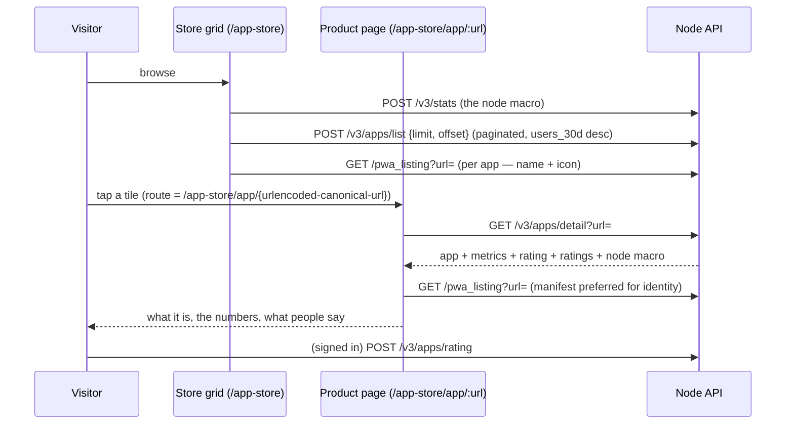

# The App Store's Endpoints

The store's API surface. `overview.md` covers what an app *is* to the store
(identity, registration, the manifest, the metric). This doc covers how the
store *serves* it: every endpoint the storefront and the product page talk
to, what they return, and what the numbers mean.

## The Page Is the Product

A visitor is browsing the grid. A tile catches their eye — a name, an icon,
"128 web10 users · 30d." Before they tap Open, they want three answers:

1. **What is it?** — the description, the screenshots.
2. **Is it real?** — the numbers. Users, visits, how long it's been around.
3. **What do people say?** — the ratings.

A store that can't answer those three with data is a directory of links.
The App Store answers them with one page and one endpoint: the **product
page** (`/app-store/app/:id`) is served by `GET /v3/apps/detail`. The page
is a URL — refreshable, shareable, bookmarkable. You can send someone the
link to an app, the way you send someone a link to anything else. That is
the "oh, okay" moment: the store is a real place with real pages, not a
list of buttons.

The endpoint behind it is the store's own, and it is the center of gravity
of this doc.

## The Identity Call: the URL Is the Key

The product page is keyed by the **app's URL** — the same identity
registration uses (D47), in canonical form (D49 hardening #4: lowercase
host, no `www.`, one trailing slash, no query or fragment).
`https://www.web10.app/docs/notes/` *is* the app, and the page for it is
`/app-store/app/{urlencoded-canonical-url}`.

This retires `web10apps_post_id`. The field was a v2 vestige — the
`#web10apps` discovery ledger, dropped in v3 (overview.md). The v3 `apps`
table never had the column; `list_store_apps` still blanks it to `""` for
the UI; the UI's detail route reads that blank. The result: the card never
links to the page, and the page's fetch hits an endpoint that does not
exist (`PATCH /discover/app/{id}` — a phantom). Every tile opens the site;
every page 404s.

The root cause is an identity gap: the UI wanted a short ID for the route,
but the store's identity is already the URL. Keying the detail endpoint on
the URL deletes the gap instead of papering over it with a second ID
system. No post IDs, no slugs, no numeric IDs. The URL is the app.

## The Surface

All store endpoints live under `/v3/apps`, except the manifest proxy
(`GET /pwa_listing`, system router) and the node stats (`POST /v3/stats`,
system router).

| Endpoint | Auth | Called by | What it does |
|---|---|---|---|
| `POST /v3/apps/register` | anonymous (token rides along when present) | the SDK, on every `createV3Client()` + on sign-in | registration + usage ping (verified tokens only, 3h gate — D49) |
| `GET /v3/apps/detail?url=` | anonymous | the product page | the whole page: app + full metric breakdown + rating aggregate + rating list + node macro |
| `POST /v3/apps/list` | anonymous | the store grid (paginated) | approved apps + realtime metrics, `users_30d` desc, `visits` tiebreak |
| `POST /v3/apps/rating` | signed | SDK `rateApp()` | upsert a 1–5 star rating, optional comment |
| `POST /v3/apps/ratings` | anonymous | product page, SDK `getAppRatings()` | the rating list for an app |
| `POST /v3/apps/admin` | admin | the node console | every app with approval state + rating aggregate |
| `POST /v3/apps/approve` | admin | the node console | approve / reject |
| `GET /pwa_listing?url=` | anonymous | the store grid, the product page | PWA manifest proxy |
| `POST /v3/stats` | anonymous | the store page, the homepage | the node macro: users, documents, groups, app_count, active_users, storage |

The auth split is the store's posture: **reads are public, writes are
signed or admin.** The store is a public surface (D41 — the node is
readable by design; discovery, search, auditability). A signed-out visitor
can browse, open a product page, and read every rating. Only *rating*
requires a token — a rating is a user's record, and it carries the author's
name. Only *approval* requires admin.

### `POST /v3/apps/register` — built

Anonymous by design (the store is a public surface — a signed-out visitor's
app must be able to register). Body: `{url, name?, description?,
icon_url?, screenshots?, token?}`. What the node does with a ping is the
D49 split — two tables, two concerns:

- **`apps` — the stable registration record.** First time: insert the row
  (`review_state: 'pending'`). Repeat with no metadata change: no-op.
  Repeat with new metadata (name/description/icon): a new row,
  `metadata_version` bumped. It never grows with traffic.
- **`app_visits` — the usage log.** Only a ping carrying a *verified*
  token (I2 — signature checked, never an unsigned decode) produces a row,
  and only if the `(app_url, username)` pair was last counted more than 3
  hours ago: **if >3h, insert.** Anon / forged / expired pings are dropped
  at ingest — they keep the registration alive but never count as a user.
- The SDK rides the session token along when one exists, and **re-fires
  the ping on the sign-in transition** — a user's first counted visit
  happens the moment they authenticate, so the metric means "users," not
  "returning users."
- Never blocks app init — the SDK fires it and forgets.

The full model is in overview.md. This doc adds nothing to it.

### `GET /v3/apps/detail?url=` — the product page, missing

**The endpoint this doc exists to specify.** The product page was built
against a phantom (`PATCH /discover/app/{id}` — no such route in the
API); this is the real one. It is a pure read — **no visit bump.** A
product-page view is not an app visit; `app_visits` rows come only from
SDK pings carrying a verified token (D49).

GET, not POST: a pure public read with a query param is the
`/pwa_listing` class — cacheable, no body, no side effect.

Response:

```json
{
  "url": "https://www.web10.app/docs/notes/",
  "name": "Notes",
  "description": "Private notes on your node.",
  "icon_url": "https://www.web10.app/docs/notes/icon-192.png",
  "screenshots": ["https://..."],
  "review_state": "approved",
  "registered_at": "2026-07-30T01:29:37Z",
  "metrics": {
    "visits": 1337,
    "users_1d": 4,
    "users_30d": 128,
    "users_90d": 301,
    "users_1y": 512
  },
  "rating": { "average": 4.6, "count": 12 },
  "ratings": [
    { "author": "alice", "rating": 5, "comment": "fast.", "created_at": "2026-08-01T12:00:00Z" }
  ],
  "node": {
    "users": 579,
    "app_count": 12,
    "active_users": 214,
    "storage": 1234567890
  }
}
```

- Unknown `url` → 404. The page renders its not-found state.
- The UI prefers the PWA manifest for name and icon (via `/pwa_listing`)
  over the stored values — the manifest is the identity source
  (overview.md). The endpoint returns what's stored; the page decides what
  to show.
- `metrics` is the same set the grid shows — D49's item 5: "the grid card
  shows the headline, the app detail page shows the full breakdown." One
  call for the whole page, including the node macro, so the page never
  makes a second round trip for context.

**What the numbers mean:**

| Field | Source | Meaning |
|---|---|---|
| `metrics.visits` | `app_visits` count | The windowed, anon-free rows — sustained activity. Each row is already a 3h-windowed counted session, so this is not raw page loads. |
| `metrics.users_1d` / `users_30d` / `users_90d` / `users_1y` | `app_visits` `countDistinctIf(username, …)` | Distinct real users with a counted visit in the trailing window. Exact (not the approximate `uniq()`), so the numbers a visitor sees are trustworthy. |
| `rating.average` / `rating.count` | `app_ratings` aggregate | One rating per author — the table's dedup key is `(target_app_id, author)`, so re-rating replaces. |
| `ratings[]` | `app_ratings` list | The reviews section: author, stars, comment, date. Newest first. |
| `node.users` / `app_count` / `active_users` / `storage` | `/v3/stats` macro | The node's own numbers, same table and windows as the per-app metrics — consistent by construction. Context for the page, not an app metric. |

The per-app numbers are **real users by construction** (D49): only the
node mints tokens, at login, so an app grows its numbers only by getting
real logged-in web10 users to use it. The honest scoping the page should
carry: the 3h ingest gate means a power user counts once per 3 hours, and
`users_1y` is a long-tail retention stat, never a headline — the headline
is `users_30d`, the same number the grid sorts by.

### `POST /v3/apps/rating` — built, gains a comment

Signed. Body: `{token, body: {target_app_id, rating, comment?}}`.
`target_app_id` is the app's **URL** — the SDK's `rateApp({appId: url})`
already keys on it. `rating` is 1–5. `comment` is optional text.

**Reviews are a rating with words.** No separate reviews table. The
`app_ratings` table gains a `comment String DEFAULT ''` column (an ALTER,
the way `apps.visits` got its column), the rating endpoint accepts it, and
the ratings list returns it. The dedup semantics carry over untouched: one
voice per user per app, latest wins, no history. The store shows the star
first, the text under it.

### `POST /v3/apps/ratings` — built, gains a comment

Anonymous. Body: `{body: {target_app_id}}`. Returns the rating list —
author, rating, comment, created_at — newest first. The product page
renders this as the reviews section; an empty list renders an empty state,
not a gap.

### `POST /v3/apps/list`, `POST /v3/stats`, `GET /pwa_listing` — built

The grid's plumbing, documented in overview.md (registration, the
plug-slot filter, the manifest proxy, the metric). The division of labor:

- **`/v3/apps/list`** is the grid's endpoint — the public store list,
  paginated. Body: `{limit = 20, offset = 0, token?}` (the token is
  reserved, not required — the store is a public surface). Response:
  `{apps: [app + metrics], total}` — approved apps with the realtime
  metric set, sorted by `users_30d` desc with a `visits` tiebreak. The
  grid pages 20 at a time with a load-more instead of rendering every app.
- **`/v3/stats`** is the node macro — `users`, `documents`, `groups`,
  `app_count`, `active_users`, `storage`. The per-app array moved to
  `/v3/apps/list` (pagination); the macro is the same metric query minus
  the `GROUP BY app_url`, so the homepage's "N web10 users · 30d" and the
  per-app numbers are consistent by construction.
- **`/pwa_listing`** serves identity — the manifest proxy.

### `POST /v3/apps/admin`, `POST /v3/apps/approve` — built

The operator surface (the node console). The admin list: every app with
approval state, the retired `visits` counter (kept for the admin view),
and the rating aggregate. Approve/reject: the review. Small node,
operator's call (overview.md).

## The Product Page Flow



One call for the page. The manifest fetch is the same proxy the grid uses —
the page prefers it for identity and falls back to the stored values.

## What This Is Not

- **Not a raw usage log.** `app_visits` is a usage log with an honest
  scoping: verified users only (anon dropped at ingest), one row per
  (app, user) per 3 hours, no per-session granularity. The store counts
  *users*, not *page loads* — the raw ping volume is not a metric the
  store shows (D49).
- **Not a review platform.** One rating per author, upsert, no history, no
  moderation queue. The operator's approve/reject is the moderation.
- **Not a second ID system.** The URL is the app. Anything that introduces
  a parallel identifier — post IDs, slugs, numeric IDs — is a rejection.
  D47 made the URL the identity, and every store endpoint keys on it.

## Logistics

| Piece | State |
|---|---|
| register (stable record + `app_visits` gate) / list (paginated) / rating / ratings / admin / approve | built (D49) |
| `/pwa_listing` manifest proxy | built |
| `/v3/stats` (the node macro) | built |
| `GET /v3/apps/detail` | **missing** — the product page is built against a phantom endpoint and 404s for every app; this doc is the spec. The metric queries it needs already exist (`get_app_metrics`) — the endpoint composes them |
| `app_ratings.comment` column; comment in rating / ratings / detail | scoped here, not built |
| UI: card → page wiring (URL-keyed route, drop `web10apps_post_id`) | not built — `list_store_apps` still blanks `web10apps_post_id` to `""`, which is why the card opens the site instead of the page today |
