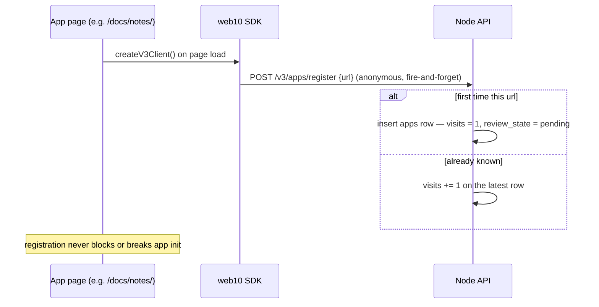

# The App Store

The node's public storefront. Apps register themselves, the node counts how
often they run, and the store shows what people actually use — **sorted by
visits, no algorithm, no promotion.**

This doc is the v3 model: what an app *is* to the store, how it gets there,
how it gets counted, and how it gets shown. The data model (the `apps`
table) lives in `../db/clickhouse.md`; the SDK surface (`registerApp`,
`getApps`, `rateApp`) in `../sdk/api.md`.

## An App Is a URL — Including the Path

The store's identity for an app is its **full URL, path included.**
`https://www.web10.app/docs/notes/` is a different app from
`https://www.web10.app/` and from `https://social.web10.app/`.

That is the load-bearing call (D47). A host can host many apps: the
marketing site's demo apps all live under one host, each on its own path.
Keying registration by host alone would collapse them into one entry — the
notes demo and the messages demo would be the same "app" in the store.
They are not. They are different frontends over the same node, and the
store should say so.

The consequence: **a path is an app.** Any page that runs the SDK and has
its own URL is a registrable app. If it is really a web10 app — it loads
the SDK, it does CRUD, it has a PWA manifest — it belongs in the store.

## Registration Is the Visit Tracker

Registration is not a one-time enrollment. It is a **ping on every run**,
and the node counts pings:

- **First registration** — the app appears in the node's app list with
  `visits: 1` and `review_state: pending`. It is NOT in the public store
  yet.
- **Every repeat registration** — `visits + 1`. The SDK fires this on
  every `createV3Client()` (once per page load), so visits ≈ page loads.
- **Approval** — the node operator reviews pending apps
  (`POST /v3/apps/admin`) and approves or rejects
  (`POST /v3/apps/approve`). The public store lists **approved only.**

This is v2 parity, restored for v3. In v2 the SDK pinged `POST /register_app`
on every `wapiInit` and the store sorted by the accumulated visits. v3
kept the endpoint shape (`/v3/apps/register`, anonymous — the app
identifies itself by URL, no token) and the visit semantics. What v3 lost
in the migration — and what bricked the store — was the visit counter
itself (hardcoded `0`) and the auto-register ping. Both are back.

Registration is **anonymous by design.** The store is a public surface;
gating "this app exists" behind a user token is what left the v3 store
empty — a signed-out visitor's app can never register.

## The PWA Manifest Is the Store's Identity Source

The store shows each app's **name and icon from its PWA manifest**, not
from the host:

1. The app ships `manifest.json` at its own path —
   `https://host/docs/notes/manifest.json` for the notes demo.
2. The marketing site asks the node for it:
   `GET /pwa_listing?url=https://host/docs/notes/`.
3. The node fetches `{url without trailing slash}/manifest.json` and
   proxies the JSON back. The node is the fetcher, so there is no browser
   CORS problem — a third-party app's manifest is readable by the store
   without the app doing anything.
4. The store renders the manifest's `name` (or `short_name`) and picks a
   192/512 icon. If there is no manifest, it falls back to the registered
   `name`, then to the host.

The manifest-URL rule — **strip the trailing slash, then append
`/manifest.json`** — is what makes paths work. A registered URL with a
trailing slash (`/docs/notes/`) and one without (`/docs/notes`) both
resolve to `/docs/notes/manifest.json`. (v2 appended `manifest.json`
blind, which only ever worked for root URLs with a trailing slash.)

A manifest is what makes an app *look* like an app in the store — its own
name, its own icon. A service worker is **not** required for listing; it
is an installability concern the app can add later. The store cares about
identity, not installability.

## What the Store Shows

The marketing site's store page (`marketing-ui`, `/app-store`) has two
layers:

**Plug slots (curated, above the grid).** The first-party catalog,
hand-picked: the social app (flagship), the node console (authenticator),
the importer. These are mapped from the registered list by host — their
visit counts come from the same registration pings as everything else.

**The grid (everything else, sorted by visits).** Every approved
registered app that is not a plug slot. The filter rules:

| Registered URL | In the grid? | Why |
|---|---|---|
| `social.web10.app` (root) | No — plug slot | Infrastructure, curated above |
| `auth.web10.app` (root) | No — plug slot | Infrastructure, curated above |
| `www.web10.app` (root) | No | The marketing site itself |
| `www.web10.app/docs/notes/` (path) | **Yes** | A path on a known host is an app (D47) |
| `realnews10.netlify.app` (third-party) | Yes | Any approved app |
| `anything.localhost/...` | No | Dev hygiene — localhost URLs mean nothing to a visitor |

The rule in one line: **a known host at its root is infrastructure; a
known host with a path is an app.** `.localhost` hosts are filtered
unconditionally — the store is a public surface, and `marketing.localhost`
is not a place a visitor can go.

## The Demos Are First-Party Apps

The demo apps (`/docs/hello/`, `/docs/notes/`, `/docs/messages/`,
`/docs/groups/`, `/docs/media/`, `/docs/feed/`, `/docs/sharing/`,
`/docs/tasks/`) are real web10 apps — each loads the SDK, does real CRUD
against the node, and ships a PWA manifest. They register like any other
app: no special-casing, no hardcoded store entries. They show up in the
grid with their manifest names and icons, and their visit counts are real
page loads.

That is the point of the demos in the store: the storefront demonstrates
the protocol. A visitor sees that a web10 app is just a URL that
registered itself.

## Data Model

`apps` (ClickHouse, `ReplacingMergeTree(updated_at) ORDER BY url`):

| Column | Meaning |
|---|---|
| `url` | Identity — full URL including path |
| `name`, `description`, `icon_url`, `screenshots` | Listing metadata (manifest is preferred by the UI) |
| `visits` | Visit counter — 1 on first registration, +1 per repeat |
| `approved` | Public-store gate (operator-set) |
| `review_state` | `pending` / `approved` / `rejected` |
| `metadata_version` | Bumped when listing metadata changes on a repeat registration |

Repeat registrations append a new row (the visit bump); reads dedup to the
latest row per url (the house pattern — see `../db/clickhouse.md`).
Ratings live in `app_ratings` (1–5 stars, per author, per app).

## What This Is Not

- **Not a discovery feed.** v2 had a `web10apps` post ledger for social
  discovery of apps; v3 drops it (`web10apps_post_id` is a vestigial empty
  field). The store is the surface.
- **Not moderated content.** There is no v2 `pending_on_change` review
  state machine — an approved app's listing updates on repeat
  registration, and the operator's approve/reject is the review. Small
  node, operator's call.
- **Not installable-by-default.** Manifest, yes. Service worker, per-app,
  later.
