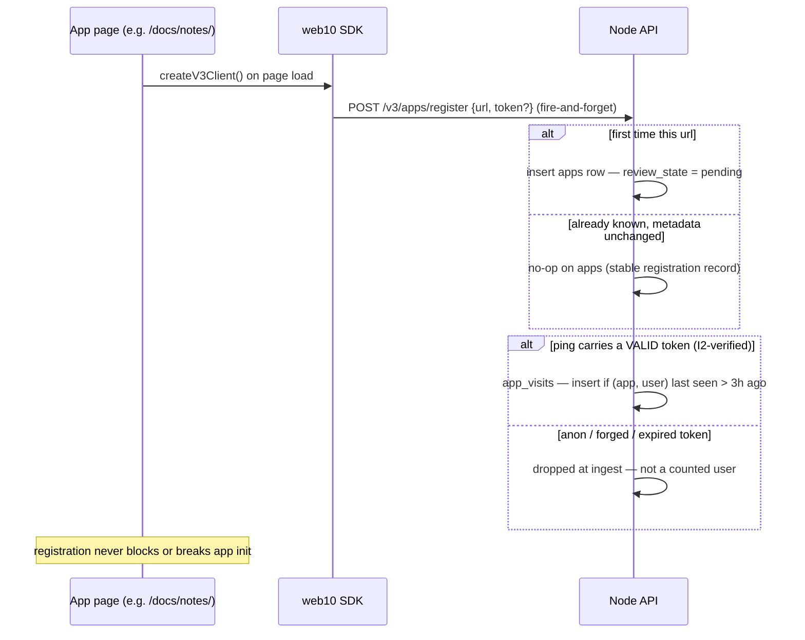

# The App Store

The node's public storefront. Apps register themselves, the node records
which **real web10 users** use them, and the store shows what people
actually use — **sorted by active users, no algorithm, no promotion.**

This doc is the v3 model: what an app *is* to the store, how it gets there,
how it gets counted, and how it gets shown. The data model (the `apps` and
`app_visits` tables) lives in `../db/clickhouse.md`; the SDK surface
(`registerApp`, `getApps`, `rateApp`) in `../sdk/api.md`; the endpoint
surface — every route the storefront and the product page talk to — in
`endpoints.md`.

## An App Is a URL — Including the Path

The store's identity for an app is its **full URL, path included.**
`https://www.web10.app/docs/notes/` is a different app from
`https://www.web10.app/` and from `https://social.web10.app/`.

That is the load-bearing call (D47). A host can host many apps: the
marketing site's demo apps all live under one host, each on its own path.
Keying registration by host alone would collapse them into one entry — the
notes demo and the messages demo would be the same "app" in the store.
They are not. They are different frontends over the same node, and the
store should say so.

The consequence: **a path is an app.** Any page that runs the SDK and has
its own URL is a registrable app. If it is really a web10 app — it loads
the SDK, it does CRUD, it has a PWA manifest — it belongs in the store.

The identity is stored in **canonical form** (hardening #4, folded into
D49): lowercase host, `www.` stripped, exactly one trailing slash, no
query or fragment, and a trailing directory-index file collapsed to its
directory. `APP.com`, `app.com`, `www.app.com/`, `app.com?x=1`, and
`/docs/notes/index.html` are all the same app as their directory form:
`https://app.com/` and `https://dev.web10.app/docs/notes/`. The index-file
collapse is the file-URL version of D47's "a path is an app" — a demo
served at `/docs/notes/index.html` IS the `/docs/notes/` app (same content,
same `manifest.json`); without the fold, loading a demo via its explicit
`index.html` link forks the identity into a second store entry whose
manifest lookup (`.../index.html/manifest.json`) can never resolve.
Normalization is server-side, in `register_app` — and in every URL-taking
entry point (`approve`, `get_app`) — and in the SDK's auto-register ping,
so a client can't fork an identity by spelling. When the fold landed the
tables already held file-URL rows (the docs page linked the explicit
`index.html`), so an idempotent boot-time migration re-homes each live
file-index row onto its directory URL (carrying over name/approval) and
tombstones the file row — the demos keep their approval and icons, and the
icon-less duplicate cards leave the store.

## Registration Is the Door, Not the Counter

Registration is not a one-time enrollment. It is a **ping on every run** —
but what the node does with a ping changed with D49. Two tables, two
concerns:

- **First registration** — the app appears in the node's app list with
  `review_state: pending`. It is NOT in the public store yet.
- **Repeat registration, no metadata change** — a no-op on `apps`. The
  registration record is stable; it does not grow with traffic.
- **Repeat registration with new metadata** (name/description/icon) — a
  new `apps` row, `metadata_version` bumped. The auto-register ping sends
  only the URL, so it never clobbers a listing.
- **A ping with a valid token** — the SDK rides the session token along
  when one exists. The node verifies the signature (I2 — no unsigned
  decode), and if the `(app, user)` pair was last counted more than 3
  hours ago, it appends one `app_visits` row. That is the whole ingest
  gate: **if >3h, insert.** Bounded by construction — a user navigating
  100× in an hour produces one row.
- **Anon pings** — dropped at ingest. They keep the registration alive
  (the `apps` row exists) but never count as a user. The SDK re-fires the
  ping on the sign-in transition (`setToken`), so a user's first counted
  visit happens the moment they authenticate — the metric is "users",
  not "returning users".
- **Approval** — the node operator reviews pending apps
  (`POST /v3/apps/admin`) and approves or rejects
  (`POST /v3/apps/approve`). The public store lists **approved only.**

Registration is **anonymous by design.** The store is a public surface;
gating "this app exists" behind a user token is what left the v3 store
empty — a signed-out visitor's app can never register. The *counting* is
a separate, stricter surface: only a node-minted, signature-verified
token attributes a visit to a user, and only the node mints tokens, at
login. An app cannot mint one for itself — which is what makes the metric
un-gameable (D49).

## The Metric: Real Users, Computed Realtime

The store's numbers are **queries over `app_visits`**, not maintained
counters (D49). Per app, computed on every store load:

| Metric | Meaning |
|---|---|
| `visits` | Count of the windowed, anon-free rows — sustained activity |
| `users_1d` / `users_30d` / `users_90d` / `users_1y` | Distinct real users with a counted visit in the trailing window |

- **Headline + sort key: `users_30d`.** Stable (not spiky like 1d), fair
  to new apps (a full month to build), and un-gameable by construction —
  an app grows the number only by getting real logged-in web10 users to
  use it.
- `users_1y` is a detail stat (long-tail retention), never a headline —
  it drifts toward a tombstone metric.
- The node-level `/v3/stats` exposes the same set **macro** — the query
  minus the `GROUP BY app_url`. The homepage leads with the macro
  `users_30d` ("N web10 users · 30d"), so the node number and the
  per-app numbers are consistent by construction: same table, same
  windows, same trust properties.
- No counters means no increment races, no lost updates, and no table
  that grows with navigation count. The raw ping volume is not a metric
  the store shows.

Why not a visit counter, per-URL rate limiting, or IP-based limiting: the
node sits behind a proxy (the caller's IP is the proxy's; `X-Forwarded-For`
is spoofable on an origin-untrusted API), so the node can only honestly
key on **URL + verified token**. A per-URL global window would saturate
every popular app at the same ceiling and destroy the ranking. The
decision and its rejects are in `../../strategy/decisions.md` (D49).

## The PWA Manifest Is the Store's Identity Source

The store shows each app's **name and icon from its PWA manifest**, not
from the host:

1. The app ships `manifest.json` at its own path —
   `https://host/docs/notes/manifest.json` for the notes demo.
2. The marketing site asks the node for it:
   `GET /pwa_listing?url=https://host/docs/notes/`.
3. The node fetches `{url without trailing slash}/manifest.json` and
   proxies the JSON back. The node is the fetcher, so there is no browser
   CORS problem — a third-party app's manifest is readable by the store
   without the app doing anything.
4. The store renders the manifest's `name` (or `short_name`) and picks a
   192/512 icon. If there is no manifest, it falls back to the registered
   `name`, then to the host.

The manifest-URL rule — **strip the trailing slash, then append
`/manifest.json`** — is what makes paths work. A registered URL with a
trailing slash (`/docs/notes/`) and one without (`/docs/notes`) both
resolve to `/docs/notes/manifest.json`. (v2 appended `manifest.json`
blind, which only ever worked for root URLs with a trailing slash.)

A manifest is what makes an app *look* like an app in the store — its own
name, its own icon. A service worker is **not** required for listing; it
is an installability concern the app can add later. The store cares about
identity, not installability.

## What the Store Shows

The marketing site's store page (`marketing-ui`, `/app-store`) has two
layers:

**Plug slots (curated, above the grid).** The two primary first-party
apps, hand-picked: the social app (**Flagship**) and the node console
(**Core** — the operator surface every node runs). The flagship's user
count comes from its real registration, matched by display name first
then canonical host (the flagship may be registered at a non-canonical
origin). The node console carries no user metric — it's an operator
surface, not a consumer app (a permanent 0 would read as a placeholder).
The importer is first-party too but a marketing page, not a real app, so
it lives in the grid. A registered copy of the flagship (same product,
different URL) is deduped from the grid — the flagship is curated above,
so it never renders twice.

**The grid (everything else, sorted by `users_30d`).** Every approved
registered app that is not a plug slot, server-paginated
(`POST /v3/apps/list` with `limit`/`offset`, the store pages 20 at a
time with a load-more). The filter rules:

| Registered URL | In the grid? | Why |
|---|---|---|
| `social.web10.app` (root) | No — plug slot | Infrastructure, curated above |
| `auth.web10.app` (root) | No — plug slot | Infrastructure, curated above |
| `www.web10.app` (root) | No | The marketing site itself |
| `www.web10.app/docs/notes/` (path) | **Yes** | A path on a known host is an app (D47) |
| `realnews10.netlify.app` (third-party) | Yes | Any approved app |
| `anything.localhost/...` | No | Dev hygiene — localhost URLs mean nothing to a visitor |

The rule in one line: **a known host at its root is infrastructure; a
known host with a path is an app.** `.localhost` hosts are filtered
unconditionally — the store is a public surface, and `marketing.localhost`
is not a place a visitor can go.

## The Demos Are First-Party Apps

The demo apps (`/docs/hello/`, `/docs/notes/`, `/docs/messages/`,
`/docs/groups/`, `/docs/media/`, `/docs/feed/`, `/docs/sharing/`,
`/docs/tasks/`) are real web10 apps — each loads the SDK, does real CRUD
against the node, and ships a PWA manifest. They register like any other
app: no special-casing, no hardcoded store entries. They show up in the
grid with their manifest names and icons, and their user counts are real
web10 users who signed in and used them.

That is the point of the demos in the store: the storefront demonstrates
the protocol. A visitor sees that a web10 app is just a URL that
registered itself.

## Data Model

`apps` (ClickHouse, `ReplacingMergeTree(updated_at) ORDER BY url`) — the
**stable registration record**:

| Column | Meaning |
|---|---|
| `url` | Identity — canonical form (lowercase host, no `www.`, one trailing slash, trailing `/index.html` folded to the directory) |
| `name`, `description`, `icon_url`, `screenshots` | Listing metadata (manifest is preferred by the UI) |
| `visits` | Retired as a store metric (D49) — kept for the admin view, not a counter the store shows |
| `approved` | Public-store gate (operator-set) |
| `review_state` | `pending` / `approved` / `rejected` |
| `metadata_version` | Bumped when listing metadata changes on a repeat registration |

`apps` appends a row only on **first registration or a real metadata
change** — never per ping. Reads dedup to the latest row per url (the
house pattern — see `../db/clickhouse.md`).

`app_visits` (ClickHouse, `ORDER BY (app_url, username, seen_at)`) — the
**usage log**: one row per *counted* ping (`app_url`, `username`,
`seen_at`). Anon pings never reach it; the ingest gate allows one row per
`(app_url, username)` per 3 hours. The store's metrics are realtime
queries over this table (see `../db/clickhouse.md` for the DDL).

Ratings live in `app_ratings` (1–5 stars, per author, per app).

## What This Is Not

- **Not a discovery feed.** v2 had a `web10apps` post ledger for social
  discovery of apps; v3 drops it (`web10apps_post_id` is retired — D52;
  the URL is the key, and the product page is keyed on it). The store is
  the surface.
- **Not moderated content.** There is no v2 `pending_on_change` review
  state machine — an approved app's listing updates on repeat
  registration, and the operator's approve/reject is the review. Small
  node, operator's call.
- **Not installable-by-default.** Manifest, yes. Service worker, per-app,
  later.
