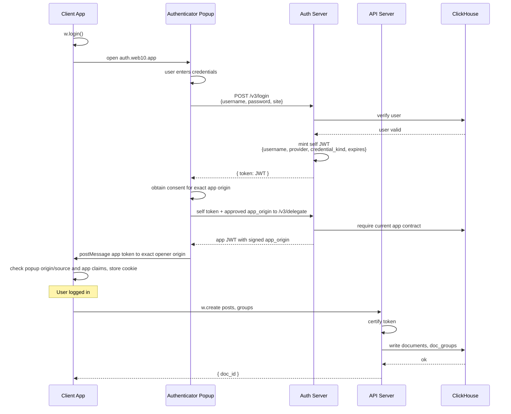

# Authentication

## Overview

web10 uses JWT tokens with a popup-based auth flow. The authenticator keeps a self credential after password login or contact recovery. After the person approves an exact-origin app contract, it obtains a separate app credential from `/v3/delegate` and hands only that credential to the opener. Consumer apps store the app credential in a cookie. See [delegation.md](delegation.md) for the complete consent and management-capability model.

## Token Structure

A web10 JWT carries these claims:

```json
{
  "username": "alice",
  "provider": "api.web10.app",
  "iss": "api.web10.app",
  "site": "https://notes.example.com",
  "credential_kind": "app",
  "app_origin": "https://notes.example.com",
  "expires": "2026-12-01T00:00:00+00:00"
}
```

| Claim | Meaning |
|---|---|
| `username` | The user's web10 username (the `user_key` used everywhere) |
| `provider` | The node that minted the token — also the API host to address |
| `iss` | Local issuer, written by `encode_token`; foreign issuers are rejected |
| `site` | Compatibility/display claim; not the authority selector |
| `credential_kind` | `self` (owner session) or `app` (delegated session); old ambiguous credentials require relogin |
| `app_origin` | Required canonical origin for an app credential, absent for self; selects the exact current contract |
| `expires` | ISO-8601 expiry (NOT the standard numeric `exp` claim) |

**Session verification:** `decode_token` verifies the signature before using claims, requires a local `provider` and local `iss` when present, a nonempty username, no recovery `purpose`, a valid credential kind, and a future ISO `expires` for non-anonymous sessions. A present `target` must equal the local provider; it does not enable federation. Explicit `anon` sessions may omit expiry, while a missing request token is the usual public-read path. A present invalid token is rejected, not downgraded to anonymous.

App origins include scheme and port and must be canonical: HTTPS, no path/query/fragment/userinfo, no redundant default port; HTTP is allowed only for local development hosts. Self sessions have no `app_origin`. The caller's `site` or `Origin` header cannot reconstruct missing credential authority.

`encode_token` uses local RS256 with a configured persistent RSA key of at least 2048 bits and `AUTH_KEY_ID`. Public keys are served at `GET /v3/.well-known/jwks.json`. Verification never follows token-supplied key URLs. Explicit HS256 legacy verification with RSA enabled needs a future `AUTH_LEGACY_VERIFY_UNTIL`; without RSA, configured HS256 legacy mode still exists. See [security operations](../security/operations.md) for provisioning and migration. Foreign issuer acceptance and canonical issuer-qualified principals remain unimplemented, so this is not completed I1 federation.

## Auth Flow



Every checked app request uses the signed `app_origin` to read the latest active contract. Missing/revoked contracts deny access; a supplied mismatching Origin is rejected, and an omitted Origin never bypasses grants. Per-service permissions then intersect with person/group authority. `*` covers document services, not reserved `group`, `node`, `user` or `imports` capabilities. Node management also needs current admin status. The API uses wildcard non-credentialed CORS; CORS is not this authorization check.

### The handoff is idempotent (D45)

The browser SDK accepts auth messages only from a trusted popup with its configured origin and source. Incoming claims must identify an app credential for `window.location.origin`; a different current username is rejected. An identical already accepted token is ignored, but a new same-user token is stored and invokes the callback, including session refresh/legacy-cookie migration. Client claim decoding is not signature verification; the server remains the authorization authority.

### SDK Methods

```ts
const w = createClient({ authUrl: 'https://auth.web10.app' })

// Open popup, wait for login (resolves when token received)
await w.login()

// Listen for sign-in/sign-out events
w.authListen((signedIn) => {
  if (signedIn) {
    const token = w.readToken()
    console.log(token.username, token.provider)
  }
})

// Check state
w.isSignedIn()

// Read decoded token payload
w.readToken() // includes credential_kind and app_origin for an app session

// Logout
w.signOut()
```

### Token Storage

Token stored in a cookie named `token`:
- **Max age:** 60 days (configurable)
- **SameSite:** Lax
- **Secure:** yes (on HTTPS origins)
- **Path:** `/`

No `HttpOnly` — the SDK reads the token client-side to include in API requests.

### The Token Vault (multi-account fast switch)

The authenticator's login screen shows a "Choose an account" picker of the
last few accounts used on that origin. The picker is two-tier:

- **Identifiers only** (`rememberedAccounts`, localStorage) — every account
  ever signed in here. Picking one pre-fills the form; the password is still
  required.
- **Vaulted tokens** (`tokenVault`, localStorage) — the *live* token for the
  last few accounts, keyed by `(provider, username)`, capped at 5, most-recent
  first. Picking a vaulted account switches to it in **one tap, no password**
  — the token IS the proof (it was minted by a real login on this origin).

A vaulted entry is only offered for a one-tap switch when it is a self credential, its `provider`
matches the node the popup is talking to (a token from another node would 401
here) and it has a readable future expiry. App/legacy credentials must not become vaulted owner sessions. A login vaults the new token; the restored
session is vaulted on load (so the live account is always one-tap). The vault
is **persistent** — logging out does not clear it (the account is still a
valid one-tap switch back).

**Trust boundary:** both the cookie and localStorage are readable by scripts on the authenticator origin. The vault retains owner credentials for multiple accounts after logout, increasing persistence and the accounts exposed to origin compromise. A consumer app must never receive a vaulted self credential. See [the threat model](../security/threat-model.md) for stolen-session handling; there is no per-token revocation mechanism.

## Server Endpoints

### Login

```
POST /v3/login
Body: {
  username: "alice",
  password: "secret",
  site: "app.example.com"
}
→ { token: "eyJhbG..." }
```

API verifies `password_hash` from the `users` table. On match, mints a self JWT with `site` set to the provider, regardless of caller-supplied `site`. Password hashing uses bcrypt and explicitly truncates to the first 72 UTF-8 bytes. This login does not grant an app contract or mint an app credential.

### Delegation

`POST /v3/delegate` takes `{ token, app_origin }`. It requires a valid self session and an active exact-origin contract. The app JWT expires at the earlier of the parent's expiry and now plus `TOKEN_EXPIRE_MINUTES`; delegation does not extend the owner's lifetime. Apps cannot delegate again or edit their own grants. Permission changes remain in the live contract, not frozen into the token.

Reserved grants include the structural `group` operations, `node: moderate/manageMonetization`, `user: blockUsers` and `imports: create/read`; the complete exact matrix is in [delegation](delegation.md). Imports are not self-only. Jobs retain verified initiating kind/origin/expiry without retaining the token, restrict app access to that origin's jobs, and recheck current contract/service/group grants, expiry and target authority during worker execution. See [operations](../security/operations.md#delegated-import-jobs).

Group membership does not by itself authorize data access: effective `readAll` and `create` are required for reads and creation/attachment on the actual service. Old custom groups need explicit grants rather than an automatic role upgrade; social's canonical followers reconciliation is app-owned. Media service scope is `media_metadata`/`public_media`, not a body-provided reference or legacy `media` label.

### Signup

```
POST /v3/signup
Body: {
  username: "alice",
  password: "secret",
  betacode: "ABC123",    // optional, if beta gating is active
  phone: "+1234567890"   // optional
}
→ { ok: true }
```

Inserts into `users` table: `INSERT INTO users VALUES (username, password_hash, phone, 0, '', 0, now(), now(), 0)`.

**Validation** — enforced before the insert:

- **Username:** case-insensitive — the input is **lowercased before validation** (so `Alice` signs up as `alice`), and the stored form must match `^[a-z0-9](?:[a-z0-9-]{0,28}[a-z0-9])?$` — lowercase letters, digits, hyphens; no leading/trailing hyphen; 1–30 chars. A value still invalid *after* lowercasing (e.g. `alice_bob`, `日本語`, over-length) → 401 `BAD_USERNAME`, no user created. The same normalization applies to **login** and the recovery **`complete`** username, so the credential is case-insensitive end to end (a user who signs up `Alice` can log in as `Alice` or `alice`).
- **Password:** must be non-empty (whitespace-only rejected). Violation → 401 `BAD_PASSWORD`, no user created. An empty password would otherwise hash fine and log in fine — the check is what keeps it out.
- **Duplicate:** username already in `users` (non-deleted) → 401 `EXISTS`.

### Contact-Anchored Auth (D61)

The account is anchored on a **contact** — a phone number OR an email — verified by a 6-digit code. This is the front door: **enter contact → code → pick an account on that contact (or create a new username) → signed in.** Sign-up, sign-in, and password-change are the same flow. A contact can carry many usernames. The requirement is **node policy (D10)**: the `require_contact` node-config flag; web10.app turns it on.

The three endpoints are **unauthenticated** (the contact + code are the credential):

```
POST /v3/recovery/request
Body: { contact: "+15551234567" | "user@example.com" }
→ { sent: true, kind: "phone" | "email" }
```
Sends a 6-digit code via Twilio Verify — `channel=sms` for a phone, `channel=email` for an email (one provider for both). The contact is validated (a phone matches a number shape; an email matches an email shape); an invalid contact → 401 `BAD_CONTACT`.

```
POST /v3/recovery/verify
Body: { contact, code }
→ { accounts: [{ username, email }], verify_token }
```
Checks the code (Twilio Verify). On a wrong code → 401 `WRONG_CODE`. Returns only accounts whose stored contact matches and is already verified, plus a short-lived (5-min) signed `verify_token`. An empty account list is valid and permits creating a new username through `complete`; it is not `CONTACT_NOT_REGISTERED`.

```
POST /v3/recovery/complete
Body: { verify_token, username, new_password? }
→ { token }
```
Validates `verify_token` (local signature/issuer, finite numeric `exp`, `purpose:"recovery"`, contact and kind). An existing picked account must carry a matching **verified** contact or returns `CONTACT_NOT_LINKED`; mere contact text is insufficient. A new username is created with the OTP-proven contact and then marked verified; failed creation never proceeds to verification/sign-in. A `new_password` sets the password. The result is a self JWT, never an app credential. Recovery proofs are not tracked as one-use tokens.

**Security:** the `verify_token` is the gate — `complete` cannot mint a token without a valid, unexpired `verify_token` for the contact, so a raw `{contact, username}` can't sign in. The picked account must carry the contact (a `verify_token` for phone X can't sign in to an account that doesn't have X). The contact is PII the node holds under terms (thesis: readable-by-design, data-policy not privacy) — it is not a cryptographic secret.

**Node policy (D10):** when `require_contact` is on, `POST /v3/signup` requires a phone or email (401 `CONTACT_REQUIRED` otherwise). The contact flow is the front door; the old username+password login stays as a fallback for accounts without a contact.

### Account Management

```
POST /v3/change-pass   → { token, password, new_pass }
POST /v3/change-phone  → { token, phone }
POST /v3/set-email     → { token, email }
POST /v3/verify-phone  → { token, code }
POST /v3/verify-email  → { token, code }
POST /v3/profile       → { token }
```

These account routes require self sessions. Contact replacement stores a false verification flag; OTP approval for the stored contact is required to set it true. The handler rereads the contact after OTP, but that check and the verification insert are not atomic: concurrent replacement remains a race. Historical flags set without OTP evidence require an operator migration; the code change does not repair those rows. See [operations](../security/operations.md).

Updates append versions to `users` via `ReplacingMergeTree`; correct latest-row behavior must be verified without relying on background merges.

### Billing (Stripe)

```
POST /manage_space         → Stripe checkout for storage
POST /manage_credits       → Stripe checkout for credits
POST /manage_business      → Stripe business portal
POST /manage_subscriptions → Stripe subscription management
POST /business_login       → Business login redirect
POST /get_plan             → { space, credits, plan }
```

## Expiry

The SDK checks expiry client-side:

```ts
// token.ts
function isTokenExpired(token: string): boolean {
  const payload = decodeJwt(token)
  if (!payload || !payload.expires) return false
  return Date.now() >= Date.parse(payload.expires)
}
```

This SDK helper also returns false for unreadable expiry. It is a client UI hint, not an acceptance rule: the server rejects missing/malformed/expired `expires` on non-anonymous sessions. The default server session lifetime is `TOKEN_EXPIRE_MINUTES=87840` (61 days), distinct from the SDK's 60-day cookie lifetime. Logout/password change does not invalidate an already issued JWT server-side; app-contract revocation denies subsequent checked app requests, not individual tokens or already minted media capabilities.

## ACR (App Contract Request)

ACR is the protocol for apps to request access from the authenticator. The app declares which origin it is and what permissions it needs; the user approves or denies. There is no distinction between a "first request" and a "permission change" — both are an ACR that replaces the existing contract for that origin. The `ReplacingMergeTree(updated_at)` engine handles it the same way.

```ts
// App declares what it needs (one ACR per origin)
w.acrOnReady([{
  allowed_origin: 'https://music.web10.com',
  permissions: {
    posts: ['readAll', 'create'],
    playlists: ['readAll', 'create', 'updateOwn', 'deleteOwn'],
  },
}])

// Listen for user's response
w.acrResponseListen((status) => {
  console.log('ACR status:', status)
})
```

The authenticator diffs each ACR against the existing contract for that origin (if any) and shows the user what's changing. If nothing exists, the diff is "everything is new." If a contract exists, added permissions are green and removed permissions are red. Same component, same flow.

ACR is infrastructure trust — "do we want to give this app these permissions?" It does not control who sees data. Groups do that.

## Cross-Node Addressing

Every CRUD call can optionally specify a `username` and `provider`:

```ts
// Read alice's posts on her provider
const posts = await w.read('posts', {}, 'alice', 'api.web10.app')
```

No provider routes to the token's node; an explicit provider selects the destination API. Current v3 transport uses `/v3/...` endpoints, not the legacy `/{username}/{service}` shape. Routing a request to another node does not grant foreign credential acceptance: foreign issuers remain rejected pending canonical principal migration.

## Security

- **Origin/source verification:** `postMessage` tokens require the configured authenticator origin and trusted popup source, plus an app credential bound to the receiving app origin.
- **Opener safety:** bind consent and handoff to the actual opener and exact target origin, never `'*'`; delegation failure never falls back to a self-token handoff.
- **Cookie security:** `SameSite=Lax`, `Secure` on HTTPS, 60-day max age.
- **No session token in URL:** session JWTs travel through popup messages, local storage/cookies and request bodies. HLS signatures and presigned media URLs are separate bearer credentials that do appear in URLs and need log protection.

## See Also

- `../sdk/api.md` — SDK surface (auth methods)
- `../sdk/contracts.md` — service contracts (app trust)
- `../groups/overview.md` — groups (people access)
- `delegation.md` — exact management grants and consent boundaries
- `../security/operations.md` — deploy, rotate, contact migration and live gates
- `../security/threat-model.md` — trusted operator, hostile apps and assurance limits
