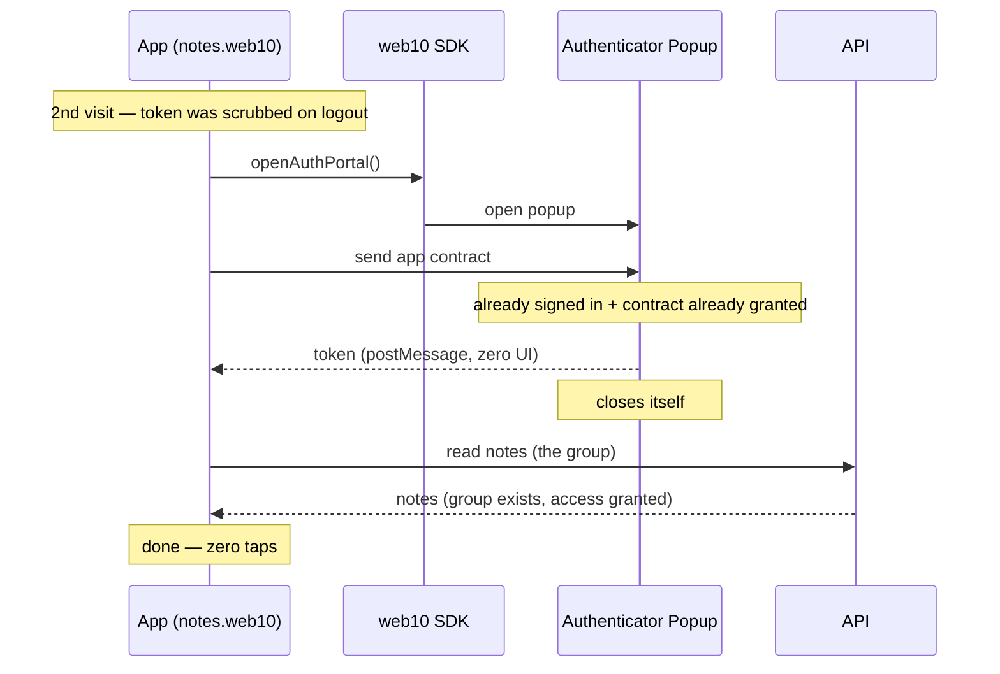
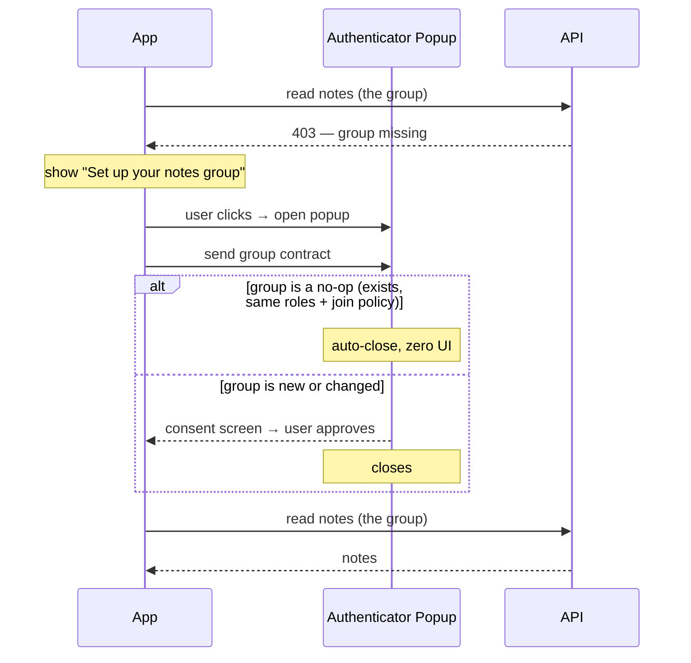

# The Consent Experience

Two contract types, one popup, and a design goal: **ask once, then get out of the way.**

This doc is about how consent *feels* and why it's shaped the way it is. It is not the data model (that's `../sdk/contracts.md`) and not the token flow (that's `auth.md`). Those two tell you what the tables look like and how a token is minted. This one tells you what a user actually experiences when an app asks for access — and what "good" looks like.

## The Ideal

The consent popup is a door you walk through once, not a toll booth you pay at every visit.

- **First run** — one clear, quick "yes." The app says what it wants, the user taps Allow, done.
- **Every run after** — nothing. No "do you still trust this app?" No re-asking. The app just works.
- **Whenever they want** — the authenticator is always there for fine-grained control: revoke an app, change a group's join policy, see exactly who can see what.

The whole deal is **frictionless by default, controllable on demand.** A user should never feel nagged, and never feel locked out of the controls. Consent is a gate you cross once — not a recurring tax, and not a cage.

## The Two Contract Types, Two Different Behaviors

Most of the confusion comes from treating both contract types the same. They are not. They answer different questions and behave differently in the consent flow.

| | **App Contract** | **Group Contract** |
|---|---|---|
| Answers | "What can this *app* do with my data?" | "Who can see my *content*?" |
| Trust type | Infrastructure (CORS-enforced) | Social (role-enforced) |
| Keyed by | Origin — one per app | Group ID — one per group |
| Consent shape | A one-time **grant** | An **action** (create / update / join) |
| Return-run behavior | **Auto-completes** → token + self-close, zero UI | **Not sent until a read fails** (lazy) |
| Duplicate-safe? | Yes — deduped by origin | Yes — `create_group` is idempotent |

The app contract is a *grant*: you give it once and it persists. The group contract is an *action*: the app is asking you to do something (create a group, add a member, change a policy). That difference — grant versus action — is the whole ballgame for the return run.

## The Return Run, Step by Step

The return run is the state a real user is in almost all the time: they used the app before, logged out, and came back. The deal: **if nothing changed, the user taps nothing.**

The login popup (#1) is an **automatic handshake**, not a screen: it checks "signed in? contract granted?" and, when both are yes, hands back the token and closes itself. No "all set" screen, no Close-window button. The user taps nothing.

Then the app just **reads**. A successful read is the confirmation that the group is fine — no popup, no contract, nothing. The group contract is *never* sent on login.

### When a read fails: the lazy group contract

The group contract is **lazy**. It is requested only when a read actually fails with "a group I should have but don't" (the group is missing, or access was revoked). The app shows a button; the user's click opens a second popup (#2) for the group contract. The click is a user gesture, so the popup is never blocked by the browser.

Popup #2 is **consent-only** — the app already holds the token (from popup #1), so #2 never hands a token back. It approves the group contract and closes.

### Why the flow suits the contracts now

The two contract types finally match the two moments they govern:

- **App contract** — infrastructure trust, "can this app talk to my node?" — is a one-time **grant**, decided **at login**, in popup #1.
- **Group contract** — a social action, "who can see my content?" — is decided **after login**, the first time the app actually touches a group, in popup #2.

You don't start doing things to your groups until you're logged in — so the group contract isn't asked for until you are. First-time setup pays two taps once (login/app-consent, then group-consent via the button) to buy zero taps on every return run after.

Three things to notice:

1. **The login popup is a handshake, not a screen.** It checks auth + contract and, when both are satisfied, hands back the token and closes itself. Zero UI. The old "all set" + Close-window button is gone — that button asked the user to tap the one thing the popup already knew how to do.

2. **A successful read is the confirmation.** The app doesn't ask "do I have my group?" — it just reads. If the read works, the group is fine. No popup, no contract round-trip. The group contract is only requested when a read fails.

3. **The group contract is lazy and gesture-driven.** It is requested on read failure, via a button the user clicks. The click is a user gesture, so the popup is never blocked. This is the "controllable on demand" half of the deal: the group consent appears exactly when there's a real gap, and never before.

## The Invariants (why the paranoia is unfounded)

A few guarantees make the re-asking harmless:

- **No duplicate app contracts.** App contracts are keyed by origin. The read dedupes via `row_number() OVER (PARTITION BY allowed_origin ORDER BY updated_at DESC)` — latest wins. One active contract per app, full stop. Re-approving upserts; it never stacks.
- **No duplicate groups.** `create_group` checks the group exists before inserting and the member exists before adding. Re-creating an existing group appends nothing. That guard exists *because* demos re-send it on every login.
- **Deletion is revocation.** If the user revokes an app contract or deletes a group, the next access re-prompts for consent. That is not a bug — "I revoked it" *should* mean "ask me again." Consent is a living agreement, not a one-time checkbox you tick and forget.

## The Gap — closed

The old wart: on a return run, the group contract re-showed and needed a tap, even when nothing had changed. The proposed fix was to filter no-op group contracts (mirror the app-contract filter).

**The lazy design (D42) closes the gap by construction.** The group contract is never sent on login, so it never re-shows on a return run. A return run with an intact group is: login popup (zero UI) → read works → done. Zero taps, no group contract in sight. No-op filtering is no longer the load-bearing fix — it is demoted to a nice-to-have edge case inside popup #2 (e.g. the group exists but its access was revoked and re-granted), not the wall.

## Where We Are

- **Built (D42)** — the automatic handshake (the login popup auto-completes: token + self-close, zero UI), the lazy group contract (requested on read failure, via a gesture-driven button), one self-contained popup per contract, and the consent-only group popup.
- **The identity fix (separate, tracked alongside D42)** — the popup must know who the app is acting for (the opener passes `?as=<username>`) and the SDK must verify the returned token's user before storing it, so a stale session for a different user can't hijack the app or lie "all set." This is what the red cookie-torture e2e tests assert.
- **The direction** — "frictionless by default, controllable on demand," kept whole: zero taps when nothing changed, a real consent screen only when there's a real decision.

## See Also

- `auth.md` — the token flow (how a token is minted and passed back)
- `../sdk/contracts.md` — the data model (the two contract types, tables, queries)
- `../groups/requests.md` — the group consent layer (GCR, auto-approve, bundling)
- `../security/overview.md` — the security invariants
