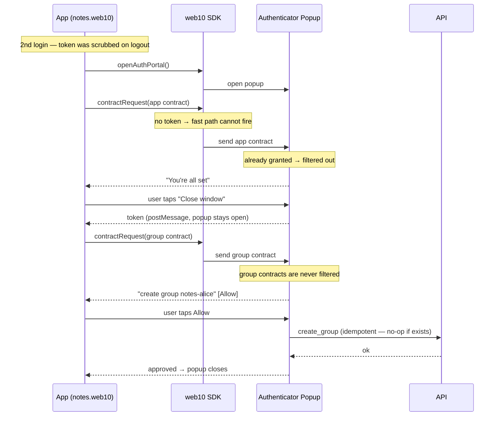

# The Consent Experience

Two contract types, one popup, and a design goal: **ask once, then get out of the way.**

This doc is about how consent *feels* and why it's shaped the way it is. It is not the data model (that's `../sdk/contracts.md`) and not the token flow (that's `auth.md`). Those two tell you what the tables look like and how a token is minted. This one tells you what a user actually experiences when an app asks for access — and what "good" looks like.

## The Ideal

The consent popup is a door you walk through once, not a toll booth you pay at every visit.

- **First run** — one clear, quick "yes." The app says what it wants, the user taps Allow, done.
- **Every run after** — nothing. No "do you still trust this app?" No re-asking. The app just works.
- **Whenever they want** — the authenticator is always there for fine-grained control: revoke an app, change a group's join policy, see exactly who can see what.

The whole deal is **frictionless by default, controllable on demand.** A user should never feel nagged, and never feel locked out of the controls. Consent is a gate you cross once — not a recurring tax, and not a cage.

## The Two Contract Types, Two Different Behaviors

Most of the confusion comes from treating both contract types the same. They are not. They answer different questions and behave differently in the consent flow.

| | **App Contract** | **Group Contract** |
|---|---|---|
| Answers | "What can this *app* do with my data?" | "Who can see my *content*?" |
| Trust type | Infrastructure (CORS-enforced) | Social (role-enforced) |
| Keyed by | Origin — one per app | Group ID — one per group |
| Consent shape | A one-time **grant** | An **action** (create / update / join) |
| Return-run behavior | **Filtered out** → "You're all set" | **Shown again** (re-approved) |
| Duplicate-safe? | Yes — deduped by origin | Yes — `create_group` is idempotent |

The app contract is a *grant*: you give it once and it persists. The group contract is an *action*: the app is asking you to do something (create a group, add a member, change a policy). That difference — grant versus action — is the whole ballgame for the return run.

## The Return Run, Step by Step

The return run is the state a real user is in almost all the time: they used the app before, logged out, and came back. This is where "it worked the first time, then it broke" bugs live — and where the friction shows.

Three things to notice:

1. **The fast path can't fire on a logout→login.** The SDK fast path skips the popup entirely when the user has a token *and* every contract already exists *and* no popup is open. But `signOut()` scrubs the token, so on a fresh login there is no token — the fast path is dead on arrival, and the popup opens. (The fast path *does* earn its keep in the "still signed in, page reloaded" case, where the token is intact.)

2. **The app contract is filtered out.** The popup diffs each app contract against what's already granted. If the origin already holds every requested permission, the row disappears and the popup shows "You're all set." The token still reaches the app via "Close window." No re-approval. This is the ideal working exactly as intended.

3. **The group contract shows again.** The notes demo is stateless — it re-sends the `create_group` contract on every login, because it does not remember "I already made my group." The popup does *not* filter group contracts (they are actions, not grants), so the user taps Allow once more. It is safe — `create_group` is idempotent, so nothing is duplicated — but it is an extra tap the user never asked for.

## The Invariants (why the paranoia is unfounded)

A few guarantees make the re-asking harmless:

- **No duplicate app contracts.** App contracts are keyed by origin. The read dedupes via `row_number() OVER (PARTITION BY allowed_origin ORDER BY updated_at DESC)` — latest wins. One active contract per app, full stop. Re-approving upserts; it never stacks.
- **No duplicate groups.** `create_group` checks the group exists before inserting and the member exists before adding. Re-creating an existing group appends nothing. That guard exists *because* demos re-send it on every login.
- **Deletion is revocation.** If the user revokes an app contract or deletes a group, the next access re-prompts for consent. That is not a bug — "I revoked it" *should* mean "ask me again." Consent is a living agreement, not a one-time checkbox you tick and forget.

## The Gap (and the fix)

The one wart: on a return run, the group contract still shows and needs a tap, even when nothing has changed. It is safe, but it is friction the user did not earn.

The fix is to mirror the app-contract filter for group contracts: if a `create_group` request targets a group that already exists **with the same roles and join policy**, filter it out too. Then a return run is a single "all set" screen — token passed, done, zero taps.

The catch: you may only auto-filter the *no-op* cases. A `create_group` for a genuinely new group, or an `update_group` that changes roles or join policy, must still show — that is a real decision the user owes themselves. The filter is "is this a no-op?", not "is this a group contract?"

## Where We Are

- **Built** — app-contract filtering (return runs show "all set"), idempotent `create_group`, the SDK fast path (skip the popup when token + contracts exist and no popup is open), deletion-as-revocation.
- **The gap** — group contracts re-show on a return run (one extra tap).
- **The direction** — filter no-op group contracts so return runs are fully invisible, and keep the authenticator as the always-available fine-grained control surface. That is the "frictionless by default, controllable on demand" deal, kept whole.

## See Also

- `auth.md` — the token flow (how a token is minted and passed back)
- `../sdk/contracts.md` — the data model (the two contract types, tables, queries)
- `../groups/requests.md` — the group consent layer (GCR, auto-approve, bundling)
- `../security/overview.md` — the security invariants
