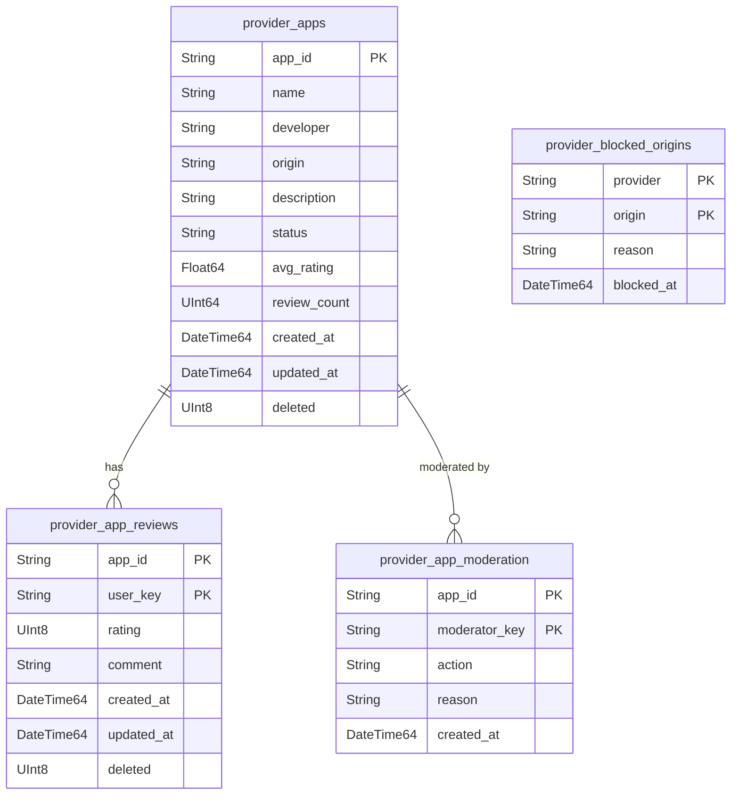

# ClickHouse Schema

The data model. Every table, every index, every pattern.

## User Schema

User-owned data, accounts, groups, access control, monetization, and moderation.

```mermaid
erDiagram
    user_accounts {
        String user_key PK
        String password_hash
        String phone
        String phone_verified
        String email
        String display_name
        String bio
        String avatar_ref
        String customer_id
        String business_id
        Float64 credits_spent
        Float64 credit_limit
        Float64 space_used
        Float64 space_limit
        DateTime64 last_replenish
        DateTime64 created_at
        DateTime64 updated_at
        UInt8 deleted
    }
    documents {
        String doc_id PK
        String author_key PK
        String collection_name
        String body
        String ref_value
        "Array(String)" tags
        DateTime64 created_at
        DateTime64 updated_at
        UInt8 deleted
    }
    doc_groups {
        String doc_id PK
        String group_id PK
        DateTime64 created_at
        DateTime64 updated_at
        UInt8 deleted
    }
    group_contracts {
        String group_id PK
        String roles
        String join_policy
        DateTime64 created_at
        DateTime64 updated_at
        UInt8 deleted
    }
    group_members {
        String group_id PK
        String member_key PK
        String role
        DateTime64 joined_at
        DateTime64 updated_at
        UInt8 deleted
    }
    group_join_requests {
        String group_id PK
        String requester_key PK
        String status
        DateTime64 requested_at
        DateTime64 resolved_at
        DateTime64 updated_at
        UInt8 deleted
    }
    group_hidden_docs {
        String group_id PK
        String doc_id PK
        moderator_key String
        hidden_at DateTime64
        updated_at DateTime64
        UInt8 deleted
    }
    service_contracts {
        String user_key PK
        String service_name PK
        String allowed_origin PK
        DateTime64 created_at
        DateTime64 updated_at
        UInt8 deleted
    }
    user_blacklist {
        String user_key PK
        String blocked_key PK
        DateTime64 created_at
    }
    group_blacklist {
        String user_key PK
        String group_id PK
        String blocked_key PK
        DateTime64 created_at
    }
    user_group_sharing {
        String user_key PK
        String group_id PK
        UInt8 sharing_enabled
        DateTime64 created_at
        DateTime64 updated_at
        UInt8 deleted
    }
    credits_ledger {
        String user_key PK
        Float64 amount
        String action
        DateTime64 created_at
    }
    subscriptions {
        String subscriber_key PK
        String creator_key PK
        String title
        UInt64 price_cents
        String status
        String stripe_subscription_id
        DateTime64 created_at
        DateTime64 updated_at
        UInt8 deleted
    }
    tips {
        String tip_id PK
        String tipper_key
        String receiver_key
        UInt64 amount_cents
        String message
        String stripe_payment_id
        DateTime64 created_at
    }
    sponsor_deals {
        String deal_id PK
        String sponsor_key
        String creator_key
        String deal_type
        UInt64 amount_cents
        String status
        DateTime64 start_date
        DateTime64 end_date
        DateTime64 created_at
        DateTime64 updated_at
        UInt8 deleted
    }
    sponsored_products {
        String doc_id PK
        String product_name
        String product_url
        String affiliate_link
        Float64 commission_pct
        DateTime64 created_at
        DateTime64 updated_at
        UInt8 deleted
    }
    ad_campaigns {
        String campaign_id PK
        String advertiser_key
        String name
        String status
        UInt64 daily_budget_cents
        UInt64 total_budget_cents
        String bid_model
        UInt64 bid_amount_cents
        DateTime64 start_date
        DateTime64 end_date
        DateTime64 created_at
        DateTime64 updated_at
        UInt8 deleted
    }
    ad_targeting {
        String campaign_id PK
        String targeting_type
        String targeting_value
        DateTime64 created_at
    }
    ad_creative {
        String creative_id PK
        String campaign_id
        String format
        String media_url
        String headline
        String body
        String cta_text
        String landing_url
        DateTime64 created_at
        DateTime64 updated_at
        UInt8 deleted
    }
    ad_inventory {
        String slot_id PK
        String placement
        String format
        String audience_scope
        DateTime64 created_at
        DateTime64 updated_at
        UInt8 deleted
    }
    ad_impressions {
        String impression_id PK
        String campaign_id
        String creative_id
        String slot_id
        String user_key
        String creator_key
        Float64 revenue_cents
        DateTime64 created_at
    }
    ad_clicks {
        String click_id PK
        String impression_id
        String campaign_id
        String user_key
        DateTime64 created_at
    }
    ad_conversions {
        String conversion_id PK
        String click_id
        String campaign_id
        String conversion_type
        UInt64 value_cents
        DateTime64 created_at
    }
    ad_partners {
        String partner_id PK
        String name
        String partner_type
        String api_endpoint
        String status
        Float64 revenue_share_pct
        DateTime64 created_at
        DateTime64 updated_at
        UInt8 deleted
    }
    ad_revenue {
        String revenue_id PK
        String campaign_id
        String creative_id
        String creator_key
        String partner_id
        UInt64 gross_cents
        UInt64 platform_cents
        UInt64 creator_cents
        UInt64 partner_cents
        String status
        DateTime64 period_start
        DateTime64 period_end
        DateTime64 created_at
        DateTime64 updated_at
        UInt8 deleted
    }

    user_accounts ||--o{ documents : "authors"
    user_accounts ||--o{ service_contracts : "owns"
    user_accounts ||--o{ credits_ledger : "spends"
    user_accounts ||--o{ subscriptions : "subscribes"
    user_accounts ||--o{ subscriptions : "receives"
    user_accounts ||--o{ tips : "tips"
    user_accounts ||--o{ tips : "receives tips"
    user_accounts ||--o{ ad_campaigns : "runs"
    user_accounts ||--o{ ad_revenue : "earns"
    documents ||--o{ doc_groups : "attached to"
    doc_groups }o--|| group_contracts : "maps to"
    group_contracts ||--o{ group_members : "has"
    group_contracts ||--o{ group_join_requests : "receives"
    group_contracts ||--o{ group_hidden_docs : "moderates"
    documents }o--|| user_blacklist : "author blocked by"
    documents }o--|| group_blacklist : "author blocked in group"
    documents }o--|| group_hidden_docs : "hidden from group"
    documents ||--o{ sponsored_products : "tags"
    ad_campaigns ||--o{ ad_targeting : "targets"
    ad_campaigns ||--o{ ad_creative : "has"
    ad_campaigns ||--o{ ad_impressions : "generates"
    ad_campaigns ||--o{ ad_clicks : "generates"
    ad_campaigns ||--o{ ad_conversions : "generates"
    ad_campaigns ||--o{ ad_revenue : "earns"
    ad_inventory ||--o{ ad_impressions : "serves"
    ad_partners ||--o{ ad_revenue : "shares"
```

## Provider Schema

Platform-level: app store, origin blacklist, operator-controlled.



**User schema (27 tables):** one for accounts, one for content, one for visibility, three for groups, one for moderation, two for app trust, two for blocking, one for sharing control, one for metering, one for subscriptions, one for tips, one for sponsor deals, one for sponsored products, one for ad campaigns, one for ad targeting, one for ad creative, one for ad inventory, one for ad impressions, one for ad clicks, one for ad conversions, one for ad partners, one for ad revenue.

**Provider schema (4 tables):** one for the app store, one for app reviews, one for app moderation, one for the origin blacklist.

Thirty-one tables. Everything else is a query.

## User Schema Tables

### Documents

Everything structured. One table. JSON body for schema flexibility. `ref_value` is the universal link — any document can point to any other.

```sql
CREATE TABLE documents (
    doc_id String,
    author_key String,
    collection_name String,
    body String,
    ref_value String DEFAULT '',
    tags Array(String),
    created_at DateTime64(3),
    updated_at DateTime64(3),
    deleted UInt8 DEFAULT 0
) ENGINE = ReplacingMergeTree(updated_at)
ORDER BY (author_key, doc_id)
TTL created_at + INTERVAL 90 DAY;
```

**Primary key:** `(author_key, doc_id)` — fast lookups by author and by document ID.

**ReplacingMergeTree:** updates are inserts with higher `updated_at`. The engine keeps the latest version. Old versions are garbage collected on merge.

**Tombstones:** deletes are inserts with `deleted = 1` and higher `updated_at`. Queries filter `WHERE deleted = 0`. TTL physically removes old data after 90 days.

**`ref_value`:** the universal link. The API writes it on create (extracts the `ref` from the JSON body). Indexed by the primary key scan — instant lookups for counting references. Comments, reactions, replies, quotes, bookmarks, votes — all just documents with a `ref`.

**`collection_name`:** low cardinality. The API uses it to distinguish posts, reactions, comments, outbox, profile — all in the same table.

**`tags`:** freeform labels. Fast filtering with `has(tags, 'jazz')`.

## Doc Groups

Document-to-group mapping. Groups define who can see the document.

```sql
CREATE TABLE doc_groups (
    doc_id String,
    group_id String,
    created_at DateTime64(3),
    updated_at DateTime64(3),
    deleted UInt8 DEFAULT 0
) ENGINE = ReplacingMergeTree(updated_at)
ORDER BY (doc_id, group_id);
```

**Primary key:** `(doc_id, group_id)` — fast lookups for "which groups is this document in?" and "which documents are in this group?" (via JOIN).

**No `permission` column.** Roles define access, not per-attachment permissions. The group contract holds the roles. The doc_groups table just maps documents to groups.

## Group Contracts

People + policy. Service-scoped roles.

```sql
CREATE TABLE group_contracts (
    group_id String,           -- 'web10.app/groups/jacoby149/abacus-enthusiasts'
    roles String,              -- JSON array of roles with services + permissions
    join_policy String,        -- 'open', 'request', 'invite_only'
    created_at DateTime64(3),
    updated_at DateTime64(3),
    deleted UInt8 DEFAULT 0
) ENGINE = ReplacingMergeTree(updated_at)
ORDER BY group_id;
```

**`roles` is JSON.** Each role defines the services it touches and the permissions it grants. See `../sdk/contracts.md` for the full role model.

## Group Members

Active members. One role per member per group. If you need different permissions across services, define a richer role — don't stack multiple roles on one person.

```sql
CREATE TABLE group_members (
    group_id String,
    member_key String,
    role String,               -- role name from the contract (e.g. 'owner', 'member')
    joined_at DateTime64(3),
    updated_at DateTime64(3),
    deleted UInt8 DEFAULT 0
) ENGINE = ReplacingMergeTree(updated_at)
ORDER BY (group_id, member_key);
```

**Primary key:** `(group_id, member_key)` — one row per member. Promoting a member is a new insert with a higher `updated_at` and the new role name.

## Group Join Requests

Pending join requests for "request" join policy.

```sql
CREATE TABLE group_join_requests (
    group_id String,
    requester_key String,
    status String,             -- 'pending', 'approved', 'denied'
    requested_at DateTime64(3),
    resolved_at DateTime64(3),
    updated_at DateTime64(3),
    deleted UInt8 DEFAULT 0
) ENGINE = ReplacingMergeTree(updated_at)
ORDER BY (group_id, requester_key);
```

## Service Contracts

App Trust. Binary infrastructure toggle. CORS. Browser-enforced.

```sql
CREATE TABLE service_contracts (
    user_key String,
    service_name String,
    allowed_origin String,
    created_at DateTime64(3),
    updated_at DateTime64(3),
    deleted UInt8 DEFAULT 0
) ENGINE = ReplacingMergeTree(updated_at)
ORDER BY (user_key, service_name, allowed_origin);
```

## User Group Sharing

Per-user, per-group toggle. "Pause sharing without leaving."

```sql
CREATE TABLE user_group_sharing (
    user_key String,
    group_id String,
    sharing_enabled UInt8,     -- 1 = sharing, 0 = blocked
    created_at DateTime64(3),
    updated_at DateTime64(3),
    deleted UInt8 DEFAULT 0
) ENGINE = ReplacingMergeTree(updated_at)
ORDER BY (user_key, group_id);
```

## Blacklists

Two levels of blocking.

```sql
CREATE TABLE user_blacklist (
    user_key String,
    blocked_key String,
    created_at DateTime64(3)
) ENGINE = MergeTree()
ORDER BY (user_key, blocked_key);

CREATE TABLE group_blacklist (
    user_key String,
    group_id String,
    blocked_key String,
    created_at DateTime64(3)
) ENGINE = MergeTree()
ORDER BY (user_key, group_id, blocked_key);
```

## Group Hidden Docs

Moderation. A moderator with `hideAll` hides a document from the group's discover. The document stays in the author's collection and in other groups — it is only hidden from this group. Reversible.

```sql
CREATE TABLE group_hidden_docs (
    group_id String,
    doc_id String,
    moderator_key String,
    hidden_at DateTime64(3),
    updated_at DateTime64(3),
    deleted UInt8 DEFAULT 0
) ENGINE = ReplacingMergeTree(updated_at)
ORDER BY (group_id, doc_id);
```

### User Accounts

The star record replacement. One row per user. Holds identity, credentials, Stripe IDs, and metering state.

```sql
CREATE TABLE user_accounts (
    user_key String,
    password_hash String,
    phone String,
    phone_verified UInt8,
    email String,
    display_name String,
    bio String,
    avatar_ref String,
    customer_id String,       -- Stripe Customer ID
    business_id String,       -- Stripe Connect Express Account ID
    credits_spent Float64,
    credit_limit Float64,
    space_used Float64,
    space_limit Float64,
    last_replenish DateTime64(3),
    created_at DateTime64(3),
    updated_at DateTime64(3),
    deleted UInt8 DEFAULT 0
) ENGINE = ReplacingMergeTree(updated_at)
ORDER BY user_key;
```

**Primary key:** `user_key`. The account record. Protected from CRUD modification — only the auth endpoints can write to it.

**Stripe IDs are auto-created.** `customer_id` is created on first payment (buying a subscription, tipping, upgrading credits/space). `business_id` is created on first sale (receiving a subscription payment, being tipped). Both are stored here so the API can look them up without calling Stripe.

**Metering is materialized.** `credits_spent` is incremented per CRUD operation. `credit_limit` and `space_limit` are set by the operator (or updated by Stripe webhook on upgrade). `last_replenish` tracks the monthly reset. The API checks `credits_spent < credit_limit` and `space_used < space_limit` before allowing CRUD.

### Credits Ledger

Append-only event log of credit spending. Every CRUD operation that costs credits appends an event.

```sql
CREATE TABLE credits_ledger (
    user_key String,
    amount Float64,
    action String,             -- 'create', 'update', 'read', 'delete', 'aggregate'
    created_at DateTime64(3)
) ENGINE = MergeTree()
ORDER BY (user_key, created_at);
```

**Primary key:** `(user_key, created_at)`. Immutable — no tombstones, no updates. The `credits_spent` on `user_accounts` is the materialized state; this table is the audit trail. `SELECT sum(amount) FROM credits_ledger WHERE user_key = :user AND created_at >= :month_start` gives the current month's spend.

### Subscriptions

Creator↔fan memberships. The dev_pay flow. Fans subscribe to creators; Stripe Connect routes ~97% to the creator.

```sql
CREATE TABLE subscriptions (
    subscriber_key String,
    creator_key String,
    title String,              -- membership tier name
    price_cents UInt64,
    status String,             -- 'active', 'canceled', 'past_due', 'trialing'
    stripe_subscription_id String,
    created_at DateTime64(3),
    updated_at DateTime64(3),
    deleted UInt8 DEFAULT 0
) ENGINE = ReplacingMergeTree(updated_at)
ORDER BY (subscriber_key, creator_key);
```

**Primary key:** `(subscriber_key, creator_key)` — one subscription per fan per creator. Status updates are new inserts with higher `updated_at`. Canceling is a status change to `'canceled'`, not a tombstone. The Stripe webhook drives status transitions.

### Tips

One-time payments. Fans tip creators directly. Stripe Connect handles payout.

```sql
CREATE TABLE tips (
    tip_id String,
    tipper_key String,
    receiver_key String,
    amount_cents UInt64,
    message String,
    stripe_payment_id String,
    created_at DateTime64(3)
) ENGINE = MergeTree()
ORDER BY (tip_id, created_at);
```

**Primary key:** `tip_id`. Immutable — no tombstones, no updates. The audit trail for one-time payments.

### Sponsor Deals

Sponsor marketplace. Brands sponsor creators. The "profiling engine" matches sponsors with creators.

```sql
CREATE TABLE sponsor_deals (
    deal_id String,
    sponsor_key String,
    creator_key String,
    deal_type String,          -- 'sponsored_post', 'product_placement', 'affiliate'
    amount_cents UInt64,
    status String,             -- 'active', 'completed', 'canceled', 'pending'
    start_date DateTime64(3),
    end_date DateTime64(3),
    created_at DateTime64(3),
    updated_at DateTime64(3),
    deleted UInt8 DEFAULT 0
) ENGINE = ReplacingMergeTree(updated_at)
ORDER BY deal_id;
```

**Primary key:** `deal_id`. Status updates are new inserts with higher `updated_at`. The platform takes a ~3% cut of the deal amount.

### Sponsored Products

Affiliate tags on posts. The "auto-affiliate-everything" pattern. Posts can carry product tags with affiliate links.

```sql
CREATE TABLE sponsored_products (
    doc_id String,
    product_name String,
    product_url String,
    affiliate_link String,
    commission_pct Float64,
    created_at DateTime64(3),
    updated_at DateTime64(3),
    deleted UInt8 DEFAULT 0
) ENGINE = ReplacingMergeTree(updated_at)
ORDER BY doc_id;
```

**Primary key:** `doc_id` — one product tag per post. The "poster's-tag-wins-else-house-tag" revenue routing: if the post author adds an affiliate link, they get the commission. If not, the platform's house affiliate link applies.

### Ad Campaigns

Programmatic advertising. Advertisers create campaigns with budgets, targeting, and creative. Bidding models: CPM (cost per mille), CPC (cost per click), CPA (cost per action).

```sql
CREATE TABLE ad_campaigns (
    campaign_id String,
    advertiser_key String,
    name String,
    status String,             -- 'active', 'paused', 'completed', 'rejected'
    daily_budget_cents UInt64,
    total_budget_cents UInt64,
    bid_model String,          -- 'cpm', 'cpc', 'cpa'
    bid_amount_cents UInt64,
    start_date DateTime64(3),
    end_date DateTime64(3),
    created_at DateTime64(3),
    updated_at DateTime64(3),
    deleted UInt8 DEFAULT 0
) ENGINE = ReplacingMergeTree(updated_at)
ORDER BY campaign_id;
```

**Primary key:** `campaign_id`. Status updates are new inserts with higher `updated_at`. Budgets are enforced at serve time — if daily or total budget is exhausted, the campaign stops serving.

### Ad Targeting

Targeting criteria for campaigns. Demographic, interest, behavioral, geographic, and audience-based targeting.

```sql
CREATE TABLE ad_targeting (
    campaign_id String,
    targeting_type String,     -- 'demographic', 'interest', 'behavioral', 'geographic', 'audience'
    targeting_value String,    -- JSON: { age_range, gender } or { interests: [...] } or { group_id }
    created_at DateTime64(3)
) ENGINE = MergeTree()
ORDER BY (campaign_id, targeting_type);
```

**Primary key:** `(campaign_id, targeting_type)`. Multiple targeting rows per campaign — all must match (AND logic) or any can match (OR logic, controlled by the campaign). `targeting_value` is JSON for flexibility: `{ "age_min": 18, "age_max": 35 }`, `{ "interests": ["jazz", "music"] }`, `{ "group_id": "web10.app/groups/alice/followers" }`.

**Audience targeting is the killer feature.** An advertiser can target a creator's followers group directly. The creator owns that audience — they can allow or deny ad targeting of their followers. Revenue splits between creator and platform.

### Ad Creative

The ad content. Images, videos, text, links, landing pages.

```sql
CREATE TABLE ad_creative (
    creative_id String,
    campaign_id String,
    format String,             -- 'image', 'video', 'carousel', 'text'
    media_url String,
    headline String,
    body String,
    cta_text String,          -- 'Shop Now', 'Learn More', 'Sign Up'
    landing_url String,
    created_at DateTime64(3),
    updated_at DateTime64(3),
    deleted UInt8 DEFAULT 0
) ENGINE = ReplacingMergeTree(updated_at)
ORDER BY creative_id;
```

**Primary key:** `creative_id`. Multiple creatives per campaign (A/B testing). The API rotates between them and tracks performance.

### Ad Inventory

Where ads can appear. Feed slots, sidebar slots, between posts, story ads.

```sql
CREATE TABLE ad_inventory (
    slot_id String,
    placement String,          -- 'feed', 'sidebar', 'between_posts', 'story', 'search'
    format String,             -- 'image', 'video', 'carousel', 'text'
    audience_scope String,     -- 'public', 'group', 'personalized'
    created_at DateTime64(3),
    updated_at DateTime64(3),
    deleted UInt8 DEFAULT 0
) ENGINE = ReplacingMergeTree(updated_at)
ORDER BY slot_id;
```

**Primary key:** `slot_id`. Defines where and how ads can appear. `audience_scope` controls targeting depth: `public` (anyone), `group` (group members only), `personalized` (user-specific based on behavior).

### Ad Impressions

When an ad is shown to a user. Immutable audit trail.

```sql
CREATE TABLE ad_impressions (
    impression_id String,
    campaign_id String,
    creative_id String,
    slot_id String,
    user_key String,
    creator_key String,       -- the creator whose audience was served (for revenue split)
    revenue_cents Float64,    -- revenue earned from this impression
    created_at DateTime64(3)
) ENGINE = MergeTree()
ORDER BY (impression_id, created_at);
```

**Primary key:** `impression_id`. Immutable — no tombstones, no updates. High volume: millions per day. `creator_key` is the creator whose audience was served (e.g., the ad appeared in a follower's feed while they were viewing the creator's content). Revenue splits: creator gets a share of `revenue_cents`, platform keeps the rest.

### Ad Clicks

When a user clicks an ad. Immutable audit trail.

```sql
CREATE TABLE ad_clicks (
    click_id String,
    impression_id String,
    campaign_id String,
    user_key String,
    created_at DateTime64(3)
) ENGINE = MergeTree()
ORDER BY (click_id, created_at);
```

**Primary key:** `click_id`. Immutable. Links back to the impression that generated the click. Used for CPC billing and CTR calculation.

### Ad Conversions

When a click leads to a desired action (purchase, sign-up, etc.). Immutable audit trail.

```sql
CREATE TABLE ad_conversions (
    conversion_id String,
    click_id String,
    campaign_id String,
    conversion_type String,    -- 'purchase', 'sign_up', 'lead', 'custom'
    value_cents UInt64,
    created_at DateTime64(3)
) ENGINE = MergeTree()
ORDER BY (conversion_id, created_at);
```

**Primary key:** `conversion_id`. Immutable. Links back to the click that led to the conversion. Used for CPA billing and ROAS calculation.

### Ad Partners

Third-party ad networks, DSPs, and ad exchanges.

```sql
CREATE TABLE ad_partners (
    partner_id String,
    name String,
    partner_type String,       -- 'dsp', 'ssp', 'exchange', 'direct'
    api_endpoint String,
    status String,             -- 'active', 'suspended', 'pending'
    revenue_share_pct Float64, -- what % of revenue this partner gets
    created_at DateTime64(3),
    updated_at DateTime64(3),
    deleted UInt8 DEFAULT 0
) ENGINE = ReplacingMergeTree(updated_at)
ORDER BY partner_id;
```

**Primary key:** `partner_id`. Revenue share is negotiated per partner. A DSP might get 70% of the revenue they bring in, keeping 30% for the platform.

### Ad Revenue

Revenue routing and splits. How money flows from ad partner → platform → creator.

```sql
CREATE TABLE ad_revenue (
    revenue_id String,
    campaign_id String,
    creative_id String,
    creator_key String,
    partner_id String,
    gross_cents UInt64,
    platform_cents UInt64,
    creator_cents UInt64,
    partner_cents UInt64,
    status String,             -- 'pending', 'settled', 'paid'
    period_start DateTime64(3),
    period_end DateTime64(3),
    created_at DateTime64(3),
    updated_at DateTime64(3),
    deleted UInt8 DEFAULT 0
) ENGINE = ReplacingMergeTree(updated_at)
ORDER BY revenue_id;
```

**Primary key:** `revenue_id`. Aggregated from impressions, clicks, and conversions. `gross_cents = platform_cents + creator_cents + partner_cents`. Settlement is periodic (daily/weekly/monthly). Status transitions: `pending` → `settled` → `paid`. The API reconciles this against Stripe payouts.

---

## Provider Schema Tables

### Provider Apps

The app store. Platform-level registry of apps approved to run on this provider.

```sql
CREATE TABLE provider_apps (
    app_id String,
    name String,
    developer String,
    origin String,
    description String,
    status String,             -- 'active', 'delisted', 'pending_review'
    avg_rating Float64,        -- cached average rating (0.0 if unrated)
    review_count UInt64,       -- total reviews (for display)
    created_at DateTime64(3),
    updated_at DateTime64(3),
    deleted UInt8 DEFAULT 0
) ENGINE = ReplacingMergeTree(updated_at)
ORDER BY app_id;
```

**`status` is the gate.** `active` — the app is listed and discoverable. `delisted` — removed from the store, existing users keep access (their service contracts are untouched). `pending_review` — submitted, awaiting approval.

**Ratings are cached.** `avg_rating` and `review_count` are materialized at write time. When a review is added or updated, the API recomputes the average and tombstones + re-inserts the app row with the new values. Read is O(1).

### Provider App Reviews

User reviews and ratings for apps in the store.

```sql
CREATE TABLE provider_app_reviews (
    app_id String,
    user_key String,
    rating UInt8,              -- 1 to 5
    comment String,
    created_at DateTime64(3),
    updated_at DateTime64(3),
    deleted UInt8 DEFAULT 0
) ENGINE = ReplacingMergeTree(updated_at)
ORDER BY (app_id, user_key);
```

**Primary key:** `(app_id, user_key)` — one review per user per app. Updating a review is a new insert with a higher `updated_at`. Deleting is a tombstone. The API recomputes `avg_rating` and `review_count` on the `provider_apps` row after each write.

### Provider App Moderation

Audit trail for provider-level app moderation. Who did what, when, and why.

```sql
CREATE TABLE provider_app_moderation (
    app_id String,
    moderator_key String,
    action String,             -- 'delist', 'restore', 'suspend', 'approve'
    reason String,
    created_at DateTime64(3)
) ENGINE = MergeTree()
ORDER BY (app_id, moderator_key);
```

**Primary key:** `(app_id, moderator_key)` — one action per moderator per app. Immutable — no tombstones, no updates. The provider operator is the only writer. Re-reading this table gives the full moderation history for any app.

### Provider Blocked Origins

Provider-level origin blacklist. Server-enforced. Overrides service contracts. If an origin is blocked at the provider level, no user can grant it access — not even the owner.

```sql
CREATE TABLE provider_blocked_origins (
    provider String,
    origin String,
    reason String,
    blocked_at DateTime64(3)
) ENGINE = MergeTree()
ORDER BY (provider, origin);
```

**Primary key:** `(provider, origin)`. Checked before service contracts. If present, the request is rejected regardless of the user's service contract. The provider operator is the only writer.

## Patterns

Every table follows the same conventions:

| Pattern | How | Why |
|---|---|---|
| **Updates** | `ReplacingMergeTree(updated_at)` — insert new row with higher `updated_at` | Append-only. No race conditions. The engine keeps the latest. |
| **Deletes** | Insert with `deleted = 1` and higher `updated_at` | Tombstones. Queries filter `WHERE deleted = 0`. TTL cleans up. |
| **No row = denied** | Missing row in service_contracts = app blocked | Explicit allowlist. Default deny. |
| **No row = enabled** | Missing row in user_group_sharing = sharing on | Opt-out model. Default on. |
| **TTL** | `TTL created_at + INTERVAL 90 DAY` on documents | Physical cleanup. Old data disappears automatically. |
| **Background compaction** | Tables without TTL get a background job | Tombstones take space. Compact on schedule. |

## Indexes

ClickHouse uses primary keys for indexing. No secondary indexes needed for the core patterns:

| Query | Indexed by |
|---|---|
| Read by author | `(author_key, doc_id)` — primary key |
| Read by doc_id | `(author_key, doc_id)` — primary key (needs author_key) |
| Read by collection | `collection_name` — low cardinality, cached |
| Read by tags | `has(tags, 'x')` — array scan, fast |
| Ref count | `ref_value` — subquery on the already-filtered result set |
| Group membership | `(group_id, member_key)` — primary key |
| Doc-to-group | `(doc_id, group_id)` — primary key |

For `ref_count` ranking: the result set is already filtered by group membership (typically 50 rows). A subquery on `ref_value = :doc_id` against the reactions/comments collection is fast because `ref_value` is a column, not buried in JSON.

## Data Flow

```mermaid
graph TB
    subgraph Create["CREATE — w.create posts, groups"]
        C1["INSERT documents<br/>doc_id, author, body, ref, tags"]
        C2["INSERT doc_groups<br/>one row per group"]
        C1 --> C2
    end

    subgraph Read["READ — w.read posts, groups"]
        R1["SELECT documents"]
        R2["JOIN doc_groups<br/>WHERE group IN ..."]
        R3["JOIN group_members<br/>WHERE member = :user"]
        R4["WHERE deleted = 0"]
        R5["EXCEPT group_hidden_docs<br/>moderator hid this doc"]
        R6["ORDER BY $sort<br/>LIMIT $limit"]
        R1 --> R2 --> R3 --> R4 --> R5 --> R6
    end

    subgraph Update["UPDATE — w.update posts, groups"]
        U1["Tombstone old documents row"]
        U2["INSERT new documents row<br/>higher updated_at"]
        U3["Tombstone old doc_groups"]
        U4["INSERT new doc_groups"]
        U1 --> U2 --> U3 --> U4
    end

    subgraph Delete["DELETE — w.delete posts"]
        D1["Tombstone documents row"]
        D2["Tombstone doc_groups rows"]
        D1 --> D2
    end

    subgraph Moderate["HIDE — moderator hides doc"]
        M1["INSERT group_hidden_docs<br/>group_id, doc_id, moderator"]
        M2["Read query excludes<br/>hidden docs for this group"]
        M1 --> M2
    end

    style Create fill:#e8f5e9,stroke:#2e7d32,color:#000
    style Read fill:#e3f2fd,stroke:#1565c0,color:#000
    style Update fill:#fff3e0,stroke:#e65100,color:#000
    style Delete fill:#ffebee,stroke:#c62828,color:#000
    style Moderate fill:#f3e5f5,stroke:#6a1b9a,color:#000
```



Create: one insert into documents, N inserts into doc_groups. Read: one SELECT with two JOINs, filtered by membership, tombstones, and moderator hides (`group_hidden_docs`). Update: tombstone old, insert new. Delete: tombstone both. Moderate: insert into `group_hidden_docs`, read query excludes it. All append-only. `ReplacingMergeTree` keeps the latest version. Background job compacts tombstones on schedule.

## See Also

- `../sdk/contracts.md` — full contract tables (service, provider, group, sharing, blacklists)
- `../sdk/api.md` — SDK surface (CRUD, groups, sort, match)
- `../sdk/implementation.md` — SQL behind every SDK call