# ClickHouse Schema

The data model. Every table, every index, every pattern.

**v3 is ClickHouse-only.** FerretDB and Postgres have been removed from the stack. Every operation — auth, CRUD, groups, contracts, media, accounts — goes through ClickHouse. No MongoDB. No DocumentDB. One database, one query engine, one deployment.

## Schema Architecture

```mermaid
erDiagram
    documents {
        String doc_id PK
        String author_key PK
        String collection_name
        String body
        String ref_value
        "Array(String)" tags
        "DateTime64" created_at
        "DateTime64" updated_at
        "UInt8" deleted
    }
    doc_groups {
        String doc_id PK
        String group_id PK
        "DateTime64" created_at
        "DateTime64" updated_at
        "UInt8" deleted
    }
    group_contracts {
        String group_id PK
        String roles
        String join_policy
        "DateTime64" created_at
        "DateTime64" updated_at
        "UInt8" deleted
    }
    group_members {
        String group_id PK
        String member_key PK
        String role
        "DateTime64" joined_at
        "DateTime64" updated_at
        "UInt8" deleted
    }
    group_join_requests {
        String group_id PK
        String requester_key PK
        String status
        "DateTime64" requested_at
        "DateTime64" resolved_at
        "DateTime64" updated_at
        "UInt8" deleted
    }
    group_hidden_docs {
        String group_id PK
        String doc_id PK
        String moderator_key
        "DateTime64" hidden_at
        "DateTime64" updated_at
        "UInt8" deleted
    }
    app_contracts {
        String user_key PK
        String allowed_origin PK
        String permissions
        "DateTime64" created_at
        "DateTime64" updated_at
        "UInt8" deleted
    }
    user_blacklist {
        String user_key PK
        String blocked_key PK
        "DateTime64" created_at
    }
    group_blacklist {
        String user_key PK
        String group_id PK
        String blocked_key PK
        "DateTime64" created_at
    }
    user_group_sharing {
        String user_key PK
        String group_id PK
        "UInt8" sharing_enabled
        "DateTime64" created_at
        "DateTime64" updated_at
        "UInt8" deleted
    }
    users {
        String username PK
        String password_hash
        String phone
        "UInt8" phone_verified
        String email
        "UInt8" email_verified
    }
    apps {
        String url PK
        String name
        String description
        String icon_url
        String screenshots
        "UInt8" approved
        String review_state
    }
    app_ratings {
        String target_app_id PK
        String author PK
        "UInt8" rating
        String provider
    }

    documents ||--o{ doc_groups : "attached to"
    doc_groups }o--|| group_contracts : "maps to"
    group_contracts ||--o{ group_members : "has"
    group_contracts ||--o{ group_join_requests : "receives"
    group_contracts ||--o{ group_hidden_docs : "moderates"
    documents }o--|| user_blacklist : "author blocked by"
    documents }o--|| group_blacklist : "author blocked in group"
    documents }o--|| group_hidden_docs : "hidden from group"
    app_ratings }o--|| apps : "rates"
    users ||--o{ app_ratings : "authors"
```

One table for content. One table for visibility. Five tables for groups. One table for app trust. Two tables for blocking. One table for sharing control. One table for accounts. Two tables for the app store. **13 tables.** Everything else is a query.

## Documents

Everything structured. One table. JSON body for schema flexibility. `ref_value` is the universal link — any document can point to any other.

```sql
CREATE TABLE documents (
    doc_id String,
    author_key String,
    collection_name String,
    body String,
    ref_value String DEFAULT '',
    tags Array(String),
    created_at DateTime64(3),
    updated_at DateTime64(3),
    deleted UInt8 DEFAULT 0
) ENGINE = ReplacingMergeTree(updated_at)
ORDER BY (author_key, doc_id)
TTL created_at + INTERVAL 90 DAY;
```

**Primary key:** `(author_key, doc_id)` — fast lookups by author and by document ID.

**ReplacingMergeTree:** updates are inserts with higher `updated_at`. The engine keeps the latest version.

**Tombstones:** deletes are inserts with `deleted = 1`. Queries filter `WHERE deleted = 0`. TTL physically removes old data after 90 days.

**`ref_value`:** the universal link. Comments, reactions, replies, quotes, bookmarks, votes — all just documents with a `ref`.

**`collection_name`:** low cardinality. Distinguishes posts, reactions, comments, outbox, profile — all in the same table.

**`tags`:** freeform labels. Fast filtering with `has(tags, 'jazz')`.

## Doc Groups

Document-to-group mapping. Groups define who can see the document.

```sql
CREATE TABLE doc_groups (
    doc_id String,
    group_id String,
    created_at DateTime64(3),
    updated_at DateTime64(3),
    deleted UInt8 DEFAULT 0
) ENGINE = ReplacingMergeTree(updated_at)
ORDER BY (doc_id, group_id);
```

**Primary key:** `(doc_id, group_id)`. No `permission` column — roles define access, not per-attachment permissions.

## Group Contracts

People + policy. Service-scoped roles.

```sql
CREATE TABLE group_contracts (
    group_id String,
    roles String,              -- JSON: roles with services + permissions
    join_policy String,        -- 'open', 'request', 'invite_only'
    created_at DateTime64(3),
    updated_at DateTime64(3),
    deleted UInt8 DEFAULT 0
) ENGINE = ReplacingMergeTree(updated_at)
ORDER BY group_id;
```

## Group Members

Active members. One role per member per group.

```sql
CREATE TABLE group_members (
    group_id String,
    member_key String,
    role String,
    joined_at DateTime64(3),
    updated_at DateTime64(3),
    deleted UInt8 DEFAULT 0
) ENGINE = ReplacingMergeTree(updated_at)
ORDER BY (group_id, member_key);
```

**Primary key:** `(group_id, member_key)`. Promoting a member is a new insert with higher `updated_at` and the new role name.

## Group Join Requests

Pending join requests for "request" join policy.

```sql
CREATE TABLE group_join_requests (
    group_id String,
    requester_key String,
    status String,             -- 'pending', 'approved', 'denied'
    requested_at DateTime64(3),
    resolved_at DateTime64(3),
    updated_at DateTime64(3),
    deleted UInt8 DEFAULT 0
) ENGINE = ReplacingMergeTree(updated_at)
ORDER BY (group_id, requester_key);
```

## Group Hidden Docs

Moderation. A moderator with `hideAll` hides a document from the group's discover. The document stays in the author's collection and other groups. Reversible.

```sql
CREATE TABLE group_hidden_docs (
    group_id String,
    doc_id String,
    moderator_key String,
    hidden_at DateTime64(3),
    updated_at DateTime64(3),
    deleted UInt8 DEFAULT 0
) ENGINE = ReplacingMergeTree(updated_at)
ORDER BY (group_id, doc_id);
```

The read query excludes hidden documents:
```sql
AND (doc_id, group_id) NOT IN (
  SELECT doc_id, group_id FROM group_hidden_docs WHERE deleted = 0
)
```

## App Contracts

App Trust. One contract per app. Per-service permissions. CORS. Browser-enforced.

Services are infinite — any string in `collection_name` is a valid service. `posts`, `playlists`, `comments`, `notes`, `reactions` — no schema migration, no approval. ClickHouse doesn't care. The `app_contracts` table stores a JSON permissions object mapping service names to operations. The API checks the JSON at query time. Infinite services, finite apps, one sieve of joins.

```sql
CREATE TABLE app_contracts (
    user_key String,
    allowed_origin String,
    permissions String,        -- JSON: { "posts": ["readAll", "create"], "playlists": ["readAll"] }
    created_at DateTime64(3),
    updated_at DateTime64(3),
    deleted UInt8 DEFAULT 0
) ENGINE = ReplacingMergeTree(updated_at)
ORDER BY (user_key, allowed_origin);
```

## User Group Sharing

Per-user, per-group toggle. "Pause sharing without leaving."

```sql
CREATE TABLE user_group_sharing (
    user_key String,
    group_id String,
    sharing_enabled UInt8,     -- 1 = sharing, 0 = blocked
    created_at DateTime64(3),
    updated_at DateTime64(3),
    deleted UInt8 DEFAULT 0
) ENGINE = ReplacingMergeTree(updated_at)
ORDER BY (user_key, group_id);
```

## Users

Account data. Every user on the node.

```sql
CREATE TABLE users (
    username String,
    password_hash String,
    phone String DEFAULT '',
    phone_verified UInt8 DEFAULT 0,
    email String DEFAULT '',
    email_verified UInt8 DEFAULT 0,
    created_at DateTime64(3),
    updated_at DateTime64(3),
    deleted UInt8 DEFAULT 0
) ENGINE = ReplacingMergeTree(updated_at)
ORDER BY username;
```

**Primary key:** `username` — unique, fast lookup.

**Tombstones:** account deletion is `deleted = 1`. Queries filter `WHERE deleted = 0`.

**Phone/Email:** stored unverified by default. Verification codes sent via Twilio/email. `phone_verified` / `email_verified` set to 1 on code confirmation.

## Apps

Registered apps in the provider app store.

```sql
CREATE TABLE apps (
    url String,
    name String DEFAULT '',
    description String DEFAULT '',
    icon_url String DEFAULT '',
    screenshots String DEFAULT '',
    approved UInt8 DEFAULT 0,
    review_state String DEFAULT 'pending',
    metadata_version UInt32 DEFAULT 1,
    created_at DateTime64(3),
    updated_at DateTime64(3),
    deleted UInt8 DEFAULT 0
) ENGINE = ReplacingMergeTree(updated_at)
ORDER BY url;
```

**Primary key:** `url` — the app's origin.

**`review_state`:** `pending`, `approved`, `pending_on_change`, `rejected`.

**`screenshots`:** JSON array of screenshot URLs.

## App Ratings

Star ratings for apps. One per (author, target_app).

```sql
CREATE TABLE app_ratings (
    author String,
    target_app_id String,
    rating UInt8,
    provider String,
    created_at DateTime64(3),
    updated_at DateTime64(3),
    deleted UInt8 DEFAULT 0
) ENGINE = ReplacingMergeTree(updated_at)
ORDER BY (target_app_id, author);
```

**Primary key:** `(target_app_id, author)` — one rating per user per app. Upsert on update.

## Bug Reports

User-submitted bug reports with optional base64-encoded screenshots. Separate from user data — append-only, no tombstones needed.

```sql
CREATE TABLE bug_reports (
    report_id String,
    username String DEFAULT '',
    email String DEFAULT '',
    description String,
    page_url String DEFAULT '',
    app_version String DEFAULT '',
    device_info String DEFAULT '',
    browser_info String DEFAULT '',
    error_message String DEFAULT '',
    stack_trace String DEFAULT '',
    screenshots String DEFAULT '',
    created_at DateTime64(3),
    updated_at DateTime64(3),
    deleted UInt8 DEFAULT 0
) ENGINE = ReplacingMergeTree(updated_at)
ORDER BY report_id;
```

**Primary key:** `report_id` — unique per report.

**`screenshots`:** JSON array of base64-encoded image strings, each with `data:image/png;base64,...` or `data:image/jpeg;base64,...` prefix. Stored inline — no separate blob store needed.

**`username`:** optional — reports can be submitted anonymously. When authenticated, the username is auto-populated.

## Blacklists

Two levels of blocking.

```sql
CREATE TABLE user_blacklist (
    user_key String,
    blocked_key String,
    created_at DateTime64(3)
) ENGINE = MergeTree()
ORDER BY (user_key, blocked_key);

CREATE TABLE group_blacklist (
    user_key String,
    group_id String,
    blocked_key String,
    created_at DateTime64(3)
) ENGINE = MergeTree()
ORDER BY (user_key, group_id, blocked_key);
```

## Logs (Signal Router)

Unified log store. Every request, SDK event, and E2E test capture lands here. One table, one query, full incident timeline.

```sql
CREATE TABLE logs (
    ts DateTime64(6),
    service LowCardinality(String) DEFAULT 'api',
    level LowCardinality(String) DEFAULT 'info',
    method LowCardinality(String) DEFAULT '',
    path LowCardinality(String) DEFAULT '',
    status UInt16 DEFAULT 0,
    latency_ms UInt32 DEFAULT 0,
    user_key String DEFAULT '',
    origin String DEFAULT '',
    message String DEFAULT '',
    request_body String DEFAULT '',
    response_body String DEFAULT '',
    meta String DEFAULT ''
) ENGINE = MergeTree
PARTITION BY toYYYYMMDD(ts)
ORDER BY (ts)
TTL ts + INTERVAL 30 DAY;
```

**Not tombstoned.** Append-only. TTL handles cleanup. No `deleted` column, no ReplacingMergeTree.

### Sources

| `service` | Source | How |
|---|---|---|
| `api` | API middleware (`app/middleware.py`) | Every HTTP request: method, path, status, latency, user_key, origin, truncated bodies (4KB), error detail in `message` |
| `sdk` | Browser SDK via `POST /v3/logs` | Console logs tee'd from the demo app. Tagged with `user_key` + `origin` |
| `e2e` | Playwright runner via `POST /v3/logs` | Captured browser console + network logs after each test. Tagged with `test_name` in `meta` |

### The `POST /v3/logs` endpoint

Lightweight, no auth. Accepts a batch of log entries:

```json
{
  "service": "sdk",
  "user_key": "api.localhost/alice",
  "origin": "http://marketing.localhost",
  "entries": [
    { "level": "error", "message": "[notes-demo] readNotes FAILED: 403", "meta": "{\"status\":403}" },
    { "level": "info", "message": "[notes-demo] showFixAccess — showing fix button" }
  ]
}
```

### Debugging queries

**Full incident timeline for a user (the one that replaces four `docker exec` calls):**
```sql
SELECT ts, service, level, method, path, status, user_key, origin, message
FROM logs
WHERE user_key = 'api.localhost/alice'
  AND ts > now() - INTERVAL 10 MINUTE
ORDER BY ts;
```

**All 403s in the last hour (contract issues):**
```sql
SELECT ts, user_key, origin, message
FROM logs
WHERE status = 403 AND ts > now() - INTERVAL 1 HOUR
ORDER BY ts DESC;
```

**Join logs with contract state (why was this origin denied?):**
```sql
SELECT l.ts, l.origin, l.message, c.deleted, c.updated_at
FROM logs l
LEFT JOIN (
    SELECT allowed_origin, deleted, updated_at
    FROM (SELECT *, row_number() OVER (PARTITION BY user_key, allowed_origin ORDER BY updated_at DESC) AS rn
          FROM app_contracts WHERE user_key = 'api.localhost/alice')
    WHERE rn = 1
) c ON c.allowed_origin = l.origin
WHERE l.user_key = 'api.localhost/alice' AND l.status = 403
ORDER BY l.ts DESC;
```

**E2E test failures with browser console context:**
```sql
SELECT ts, level, message, meta
FROM logs
WHERE service = 'e2e' AND meta LIKE '%notes-demo%'
  AND ts > now() - INTERVAL 1 HOUR
ORDER BY ts;
```

### Design decisions

- **API inserts directly.** No shipper, no logging driver, no extra container. The API already has a CH connection — one `INSERT` per request is negligible overhead.
- **Fire-and-forget.** The middleware uses `asyncio.create_task` — if CH is down, the log is lost but the request still succeeds. Logging must never break the API.
- **Truncated bodies.** Request/response bodies capped at 4KB. Media uploads go through S3 presigned URLs (not the API body), so this is safe.
- **30-day TTL.** Enough for debugging, not enough to fill the disk. Old logs are gone — that's fine, they were signal, not state.
- **`user_key` is the join key.** Every log row carries the user's key (extracted from the JWT, signature not verified — this is logging, not auth). That's what makes the JOIN queries possible.

## Patterns

| Pattern | How | Why |
|---|---|---|
| **Updates** | `ReplacingMergeTree(updated_at)` — insert new row with higher `updated_at` | Append-only. No race conditions. Engine keeps latest. |
| **Deletes** | Insert with `deleted = 1` and higher `updated_at` | Tombstones. Queries filter `WHERE deleted = 0`. TTL cleans up. |
| **No row = denied** | Missing row in app_contracts = app blocked | Explicit allowlist. Default deny. |
| **No row = enabled** | Missing row in user_group_sharing = sharing on | Opt-out model. Default on. |
| **TTL** | `TTL created_at + INTERVAL 90 DAY` on documents | Physical cleanup. Old data disappears automatically. |
| **Background compaction** | Tables without TTL get a background job | Tombstones take space. Compact on schedule. |

### Critical: Tombstone Read Invariant

**All read paths over tombstoned tables must dedup-then-filter, never filter-then-dedup.**

The tombstone pattern inserts a new row with `deleted = 1` and a higher `updated_at`. To read the "current" state, you must first identify the latest row per key, *then* check if it's deleted. If you filter `WHERE deleted = 0` first, the tombstone row is invisible and the old (still `deleted = 0`) row wins — the delete silently doesn't take effect.

**Correct (dedup-then-filter):**
```sql
SELECT permissions FROM (
    SELECT permissions, deleted,
           row_number() OVER (PARTITION BY user_key, allowed_origin ORDER BY updated_at DESC) AS rn
    FROM app_contracts
    WHERE user_key = %(user_key)s
) WHERE rn = 1 AND deleted = 0
```

**Wrong (filter-then-dedup) — the tombstone is invisible:**
```sql
SELECT permissions FROM app_contracts
WHERE user_key = %(user_key)s AND deleted = 0
ORDER BY updated_at DESC LIMIT 1
```

This applies to every table with a `deleted` column: `documents`, `doc_groups`, `group_contracts`, `group_members`, `app_contracts`, `provider_service_contracts`, `user_blacklist`, `group_blacklist`, `user_group_sharing`, `service_contracts`, `group_join_requests`, `group_hidden_docs`.

**Timestamp precision:** tombstone inserts must use `now64(6)` (microsecond), not `now()` (second). If the original row and the tombstone share the same `updated_at`, the dedup can't distinguish them and either row may win non-deterministically.

## Indexes

ClickHouse uses primary keys for indexing. No secondary indexes needed for the core patterns:

| Query | Indexed by |
|---|---|
| Read by author | `(author_key, doc_id)` — primary key |
| Read by doc_id | `(author_key, doc_id)` — primary key (or via `read-by-id` with group permission check) |
| Read by collection | `collection_name` — low cardinality, cached |
| Read by tags | `has(tags, 'x')` — array scan, fast |
| Ref count | `ref_value` — subquery on the already-filtered result set |
| Group membership | `(group_id, member_key)` — primary key |
| Doc-to-group | `(doc_id, group_id)` — primary key |

## Data Flow

```mermaid
graph TB
    subgraph Create["CREATE — w.create posts, groups"]
        C1["INSERT documents<br/>doc_id, author, body, ref, tags"]
        C2["INSERT doc_groups<br/>one row per group"]
        C1 --> C2
    end

    subgraph Read["READ — w.read posts, groups"]
        R1["SELECT documents"]
        R2["JOIN doc_groups<br/>WHERE group IN ..."]
        R3["JOIN group_members<br/>WHERE member = :user"]
        R4["WHERE deleted = 0"]
        R5["EXCEPT group_hidden_docs"]
        R6["ORDER BY $sort<br/>LIMIT $limit"]
        R1 --> R2 --> R3 --> R4 --> R5 --> R6
    end

    subgraph Update["UPDATE — w.update posts, groups"]
        U1["Tombstone old documents row"]
        U2["INSERT new documents row<br/>higher updated_at"]
        U3["Tombstone old doc_groups"]
        U4["INSERT new doc_groups"]
        U1 --> U2 --> U3 --> U4
    end

    subgraph Delete["DELETE — w.delete posts"]
        D1["Tombstone documents row"]
        D2["Tombstone doc_groups rows"]
        D1 --> D2
    end

    subgraph Moderate["HIDE — moderator hides doc"]
        M1["INSERT group_hidden_docs<br/>group_id, doc_id, moderator"]
        M1 --> M2["Read query excludes<br/>hidden docs for this group"]
    end

    style Create fill:#e8f5e9,stroke:#2e7d32,color:#000
    style Read fill:#e3f2fd,stroke:#1565c0,color:#000
    style Update fill:#fff3e0,stroke:#e65100,color:#000
    style Delete fill:#ffebee,stroke:#c62828,color:#000
    style Moderate fill:#f3e5f5,stroke:#6a1b9a,color:#000
```



Create: one insert into documents, N inserts into doc_groups. Read: one SELECT with two JOINs, filtered by membership, tombstones, and moderator hides. Update: tombstone old, insert new. Delete: tombstone both. All append-only. `ReplacingMergeTree` keeps the latest version. Background job compacts tombstones on schedule.

## v4 Tables (not in this doc)

Monetization, ads, marketplace, and provider app store tables are in `../web10-v4/db/clickhouse-v4.md`:

- **Monetization:** user_accounts (full), credits_ledger, subscriptions, tips, sponsor_deals, sponsored_products
- **Provider app store:** provider_apps, provider_app_reviews, provider_app_moderation, provider_blocked_origins
- **Ads:** ad_campaigns, ad_targeting, ad_creative, ad_inventory, ad_impressions, ad_clicks, ad_conversions, ad_partners, ad_revenue
- **Marketplace:** marketplace_products, marketplace_orders, marketplace_reviews

## See Also

- `../sdk/contracts.md` — full contract tables (app, provider, group, sharing, blacklists)
- `../sdk/api.md` — SDK surface (CRUD, groups, sort, match)
- `../sdk/implementation.md` — SQL behind every SDK call