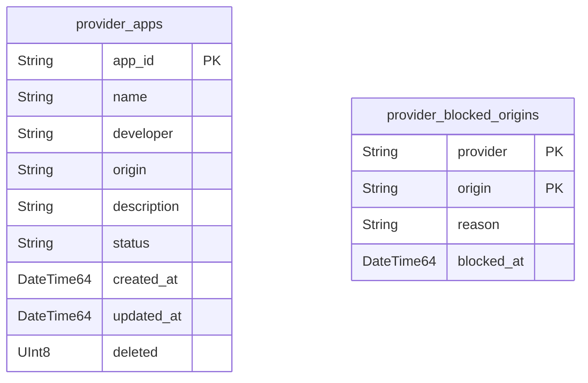

# ClickHouse Schema

The data model. Every table, every index, every pattern.

## User Schema

User-owned data, groups, access control, and moderation.

```mermaid
erDiagram
    documents {
        String doc_id PK
        String author_key PK
        String collection_name
        String body
        String ref_value
        "Array(String)" tags
        DateTime64 created_at
        DateTime64 updated_at
        UInt8 deleted
    }
    doc_groups {
        String doc_id PK
        String group_id PK
        DateTime64 created_at
        DateTime64 updated_at
        UInt8 deleted
    }
    group_contracts {
        String group_id PK
        String roles
        String join_policy
        DateTime64 created_at
        DateTime64 updated_at
        UInt8 deleted
    }
    group_members {
        String group_id PK
        String member_key PK
        String role
        DateTime64 joined_at
        DateTime64 updated_at
        UInt8 deleted
    }
    group_join_requests {
        String group_id PK
        String requester_key PK
        String status
        DateTime64 requested_at
        DateTime64 resolved_at
        DateTime64 updated_at
        UInt8 deleted
    }
    group_hidden_docs {
        String group_id PK
        String doc_id PK
        moderator_key String
        hidden_at DateTime64
        updated_at DateTime64
        UInt8 deleted
    }
    service_contracts {
        String user_key PK
        String service_name PK
        String allowed_origin PK
        DateTime64 created_at
        DateTime64 updated_at
        UInt8 deleted
    }
    user_blacklist {
        String user_key PK
        String blocked_key PK
        DateTime64 created_at
    }
    group_blacklist {
        String user_key PK
        String group_id PK
        String blocked_key PK
        DateTime64 created_at
    }
    user_group_sharing {
        String user_key PK
        String group_id PK
        UInt8 sharing_enabled
        DateTime64 created_at
        DateTime64 updated_at
        UInt8 deleted
    }

    documents ||--o{ doc_groups : "attached to"
    doc_groups }o--|| group_contracts : "maps to"
    group_contracts ||--o{ group_members : "has"
    group_contracts ||--o{ group_join_requests : "receives"
    group_contracts ||--o{ group_hidden_docs : "moderates"
    documents }o--|| user_blacklist : "author blocked by"
    documents }o--|| group_blacklist : "author blocked in group"
    documents }o--|| group_hidden_docs : "hidden from group"
```

## Provider Schema

Platform-level: app store, origin blacklist, operator-controlled.



**User schema (11 tables):** one for content, one for visibility, three for groups, one for moderation, two for app trust, two for blocking, one for sharing control.

**Provider schema (2 tables):** one for the app store, one for the origin blacklist.

Thirteen tables. Everything else is a query.

## User Schema Tables

### Documents

Everything structured. One table. JSON body for schema flexibility. `ref_value` is the universal link — any document can point to any other.

```sql
CREATE TABLE documents (
    doc_id String,
    author_key String,
    collection_name String,
    body String,
    ref_value String DEFAULT '',
    tags Array(String),
    created_at DateTime64(3),
    updated_at DateTime64(3),
    deleted UInt8 DEFAULT 0
) ENGINE = ReplacingMergeTree(updated_at)
ORDER BY (author_key, doc_id)
TTL created_at + INTERVAL 90 DAY;
```

**Primary key:** `(author_key, doc_id)` — fast lookups by author and by document ID.

**ReplacingMergeTree:** updates are inserts with higher `updated_at`. The engine keeps the latest version. Old versions are garbage collected on merge.

**Tombstones:** deletes are inserts with `deleted = 1` and higher `updated_at`. Queries filter `WHERE deleted = 0`. TTL physically removes old data after 90 days.

**`ref_value`:** the universal link. The API writes it on create (extracts the `ref` from the JSON body). Indexed by the primary key scan — instant lookups for counting references. Comments, reactions, replies, quotes, bookmarks, votes — all just documents with a `ref`.

**`collection_name`:** low cardinality. The API uses it to distinguish posts, reactions, comments, outbox, profile — all in the same table.

**`tags`:** freeform labels. Fast filtering with `has(tags, 'jazz')`.

## Doc Groups

Document-to-group mapping. Groups define who can see the document.

```sql
CREATE TABLE doc_groups (
    doc_id String,
    group_id String,
    created_at DateTime64(3),
    updated_at DateTime64(3),
    deleted UInt8 DEFAULT 0
) ENGINE = ReplacingMergeTree(updated_at)
ORDER BY (doc_id, group_id);
```

**Primary key:** `(doc_id, group_id)` — fast lookups for "which groups is this document in?" and "which documents are in this group?" (via JOIN).

**No `permission` column.** Roles define access, not per-attachment permissions. The group contract holds the roles. The doc_groups table just maps documents to groups.

## Group Contracts

People + policy. Service-scoped roles.

```sql
CREATE TABLE group_contracts (
    group_id String,           -- 'web10.app/groups/jacoby149/abacus-enthusiasts'
    roles String,              -- JSON array of roles with services + permissions
    join_policy String,        -- 'open', 'request', 'invite_only'
    created_at DateTime64(3),
    updated_at DateTime64(3),
    deleted UInt8 DEFAULT 0
) ENGINE = ReplacingMergeTree(updated_at)
ORDER BY group_id;
```

**`roles` is JSON.** Each role defines the services it touches and the permissions it grants. See `../sdk/contracts.md` for the full role model.

## Group Members

Active members. One role per member per group. If you need different permissions across services, define a richer role — don't stack multiple roles on one person.

```sql
CREATE TABLE group_members (
    group_id String,
    member_key String,
    role String,               -- role name from the contract (e.g. 'owner', 'member')
    joined_at DateTime64(3),
    updated_at DateTime64(3),
    deleted UInt8 DEFAULT 0
) ENGINE = ReplacingMergeTree(updated_at)
ORDER BY (group_id, member_key);
```

**Primary key:** `(group_id, member_key)` — one row per member. Promoting a member is a new insert with a higher `updated_at` and the new role name.

## Group Join Requests

Pending join requests for "request" join policy.

```sql
CREATE TABLE group_join_requests (
    group_id String,
    requester_key String,
    status String,             -- 'pending', 'approved', 'denied'
    requested_at DateTime64(3),
    resolved_at DateTime64(3),
    updated_at DateTime64(3),
    deleted UInt8 DEFAULT 0
) ENGINE = ReplacingMergeTree(updated_at)
ORDER BY (group_id, requester_key);
```

## Service Contracts

App Trust. Binary infrastructure toggle. CORS. Browser-enforced.

```sql
CREATE TABLE service_contracts (
    user_key String,
    service_name String,
    allowed_origin String,
    created_at DateTime64(3),
    updated_at DateTime64(3),
    deleted UInt8 DEFAULT 0
) ENGINE = ReplacingMergeTree(updated_at)
ORDER BY (user_key, service_name, allowed_origin);
```

## User Group Sharing

Per-user, per-group toggle. "Pause sharing without leaving."

```sql
CREATE TABLE user_group_sharing (
    user_key String,
    group_id String,
    sharing_enabled UInt8,     -- 1 = sharing, 0 = blocked
    created_at DateTime64(3),
    updated_at DateTime64(3),
    deleted UInt8 DEFAULT 0
) ENGINE = ReplacingMergeTree(updated_at)
ORDER BY (user_key, group_id);
```

## Blacklists

Two levels of blocking.

```sql
CREATE TABLE user_blacklist (
    user_key String,
    blocked_key String,
    created_at DateTime64(3)
) ENGINE = MergeTree()
ORDER BY (user_key, blocked_key);

CREATE TABLE group_blacklist (
    user_key String,
    group_id String,
    blocked_key String,
    created_at DateTime64(3)
) ENGINE = MergeTree()
ORDER BY (user_key, group_id, blocked_key);
```

## Group Hidden Docs

Moderation. A moderator with `hideAll` hides a document from the group's discover. The document stays in the author's collection and in other groups — it is only hidden from this group. Reversible.

```sql
CREATE TABLE group_hidden_docs (
    group_id String,
    doc_id String,
    moderator_key String,
    hidden_at DateTime64(3),
    updated_at DateTime64(3),
    deleted UInt8 DEFAULT 0
) ENGINE = ReplacingMergeTree(updated_at)
ORDER BY (group_id, doc_id);
```

**Primary key:** `(group_id, doc_id)` — one hide per document per group. Un-hiding is a tombstone (`deleted = 1`). The read query excludes hidden documents:

```sql
SELECT FROM documents
  JOIN doc_groups
  JOIN group_members
  WHERE deleted = 0
    AND member = :user
    AND (doc_id, group_id) NOT IN (
      SELECT doc_id, group_id FROM group_hidden_docs WHERE deleted = 0
    )
```

---

## Provider Schema Tables

### Provider Apps

The app store. Platform-level registry of apps approved to run on this provider.

```sql
CREATE TABLE provider_apps (
    app_id String,
    name String,
    developer String,
    origin String,
    description String,
    status String,             -- 'active', 'delisted', 'pending_review'
    created_at DateTime64(3),
    updated_at DateTime64(3),
    deleted UInt8 DEFAULT 0
) ENGINE = ReplacingMergeTree(updated_at)
ORDER BY app_id;
```

**`status` is the gate.** `active` — the app is listed and discoverable. `delisted` — removed from the store, existing users keep access (their service contracts are untouched). `pending_review` — submitted, awaiting approval.

### Provider Blocked Origins

Provider-level origin blacklist. Server-enforced. Overrides service contracts. If an origin is blocked at the provider level, no user can grant it access — not even the owner.

```sql
CREATE TABLE provider_blocked_origins (
    provider String,
    origin String,
    reason String,
    blocked_at DateTime64(3)
) ENGINE = MergeTree()
ORDER BY (provider, origin);
```

**Primary key:** `(provider, origin)`. Checked before service contracts. If present, the request is rejected regardless of the user's service contract. The provider operator is the only writer.

## Patterns

Every table follows the same conventions:

| Pattern | How | Why |
|---|---|---|
| **Updates** | `ReplacingMergeTree(updated_at)` — insert new row with higher `updated_at` | Append-only. No race conditions. The engine keeps the latest. |
| **Deletes** | Insert with `deleted = 1` and higher `updated_at` | Tombstones. Queries filter `WHERE deleted = 0`. TTL cleans up. |
| **No row = denied** | Missing row in service_contracts = app blocked | Explicit allowlist. Default deny. |
| **No row = enabled** | Missing row in user_group_sharing = sharing on | Opt-out model. Default on. |
| **TTL** | `TTL created_at + INTERVAL 90 DAY` on documents | Physical cleanup. Old data disappears automatically. |
| **Background compaction** | Tables without TTL get a background job | Tombstones take space. Compact on schedule. |

## Indexes

ClickHouse uses primary keys for indexing. No secondary indexes needed for the core patterns:

| Query | Indexed by |
|---|---|
| Read by author | `(author_key, doc_id)` — primary key |
| Read by doc_id | `(author_key, doc_id)` — primary key (needs author_key) |
| Read by collection | `collection_name` — low cardinality, cached |
| Read by tags | `has(tags, 'x')` — array scan, fast |
| Ref count | `ref_value` — subquery on the already-filtered result set |
| Group membership | `(group_id, member_key)` — primary key |
| Doc-to-group | `(doc_id, group_id)` — primary key |

For `ref_count` ranking: the result set is already filtered by group membership (typically 50 rows). A subquery on `ref_value = :doc_id` against the reactions/comments collection is fast because `ref_value` is a column, not buried in JSON.

## Data Flow

```mermaid
graph TB
    subgraph Create["CREATE — w.create posts, groups"]
        C1["INSERT documents<br/>doc_id, author, body, ref, tags"]
        C2["INSERT doc_groups<br/>one row per group"]
        C1 --> C2
    end

    subgraph Read["READ — w.read posts, groups"]
        R1["SELECT documents"]
        R2["JOIN doc_groups<br/>WHERE group IN ..."]
        R3["JOIN group_members<br/>WHERE member = :user"]
        R4["WHERE deleted = 0"]
        R5["EXCEPT group_hidden_docs<br/>moderator hid this doc"]
        R6["ORDER BY $sort<br/>LIMIT $limit"]
        R1 --> R2 --> R3 --> R4 --> R5 --> R6
    end

    subgraph Update["UPDATE — w.update posts, groups"]
        U1["Tombstone old documents row"]
        U2["INSERT new documents row<br/>higher updated_at"]
        U3["Tombstone old doc_groups"]
        U4["INSERT new doc_groups"]
        U1 --> U2 --> U3 --> U4
    end

    subgraph Delete["DELETE — w.delete posts"]
        D1["Tombstone documents row"]
        D2["Tombstone doc_groups rows"]
        D1 --> D2
    end

    subgraph Moderate["HIDE — moderator hides doc"]
        M1["INSERT group_hidden_docs<br/>group_id, doc_id, moderator"]
        M2["Read query excludes<br/>hidden docs for this group"]
        M1 --> M2
    end

    style Create fill:#e8f5e9,stroke:#2e7d32,color:#000
    style Read fill:#e3f2fd,stroke:#1565c0,color:#000
    style Update fill:#fff3e0,stroke:#e65100,color:#000
    style Delete fill:#ffebee,stroke:#c62828,color:#000
    style Moderate fill:#f3e5f5,stroke:#6a1b9a,color:#000
```



Create: one insert into documents, N inserts into doc_groups. Read: one SELECT with two JOINs, filtered by membership, tombstones, and moderator hides (`group_hidden_docs`). Update: tombstone old, insert new. Delete: tombstone both. Moderate: insert into `group_hidden_docs`, read query excludes it. All append-only. `ReplacingMergeTree` keeps the latest version. Background job compacts tombstones on schedule.

## See Also

- `../sdk/contracts.md` — full contract tables (service, provider, group, sharing, blacklists)
- `../sdk/api.md` — SDK surface (CRUD, groups, sort, match)
- `../sdk/implementation.md` — SQL behind every SDK call