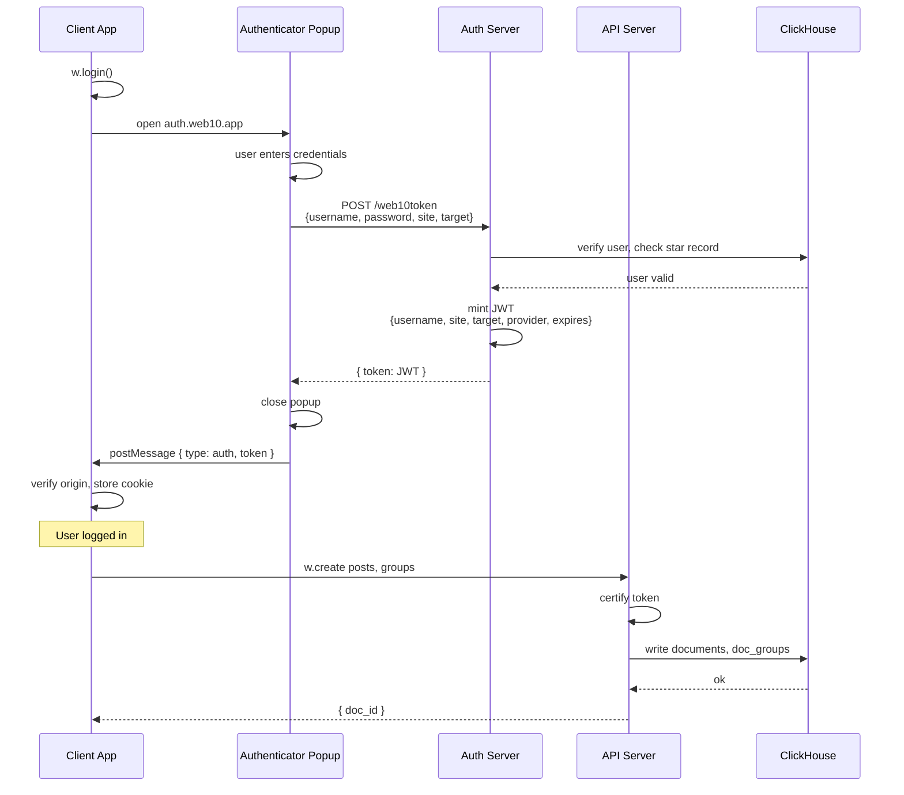

# Authentication

## Overview

web10 uses JWT tokens with a popup-based auth flow. The authenticator is a separate app (e.g., `auth.web10.app`) that handles login, signup, and token minting. Consumer apps open the authenticator in a popup, wait for a token via `postMessage`, then store it in a cookie.

## Token Structure

A web10 JWT carries these claims:

```json
{
  "username": "alice",
  "provider": "api.web10.app",
  "site": "twitter-clone.web10.com",
  "target": "api.web10.app",
  "expires": "2025-12-01T00:00:00.000Z",
  "type": "tiered"
}
```

| Claim | Meaning |
|---|---|
| `username` | The user's web10 username (the `user_key` used everywhere) |
| `provider` | The node that minted the token — also the API host to address |
| `site` | The app/site hostname the token is scoped to |
| `target` | Target provider (for tiered/cross-node tokens) |
| `expires` | ISO-8601 expiry (NOT the standard numeric `exp` claim) |
| `type` | Token type hint (e.g., `"tiered"`) |

**Note:** web10 uses `expires` (ISO string), not the standard JWT `exp` (numeric). The SDK parses `expires` with `Date.parse()`.

## Auth Flow



Popup opens. User authenticates. Server mints a scoped JWT. Popup posts the token back to the opener. The app verifies the origin, stores it in a cookie, and is done. Every subsequent API call carries the token. The API certifies it before touching data.

### SDK Methods

```ts
const w = createClient({ authUrl: 'https://auth.web10.app' })

// Open popup, wait for login (resolves when token received)
await w.login()

// Listen for sign-in/sign-out events
w.authListen((signedIn) => {
  if (signedIn) {
    const token = w.readToken()
    console.log(token.username, token.provider)
  }
})

// Check state
w.isSignedIn()

// Read decoded token payload
w.readToken() // → { username, site, target, provider, expires, type }

// Logout
w.signOut()
```

### Token Storage

Token stored in a cookie named `token`:
- **Max age:** 60 days (configurable)
- **SameSite:** Lax
- **Secure:** yes (on HTTPS origins)
- **Path:** `/`

No `HttpOnly` — the SDK reads the token client-side to include in API requests.

## Server Endpoints

### Login

```
POST /web10token
Body: {
  username: "alice",
  password: "secret",
  token: null,           // null for login; existing JWT for tiered mint
  site: "app.example.com",
  target: null           // null for self-token; provider hostname for tiered
}
→ { token: "eyJhbG..." }
```

### Signup

```
POST /signup
Body: {
  username: "alice",
  password: "secret",
  betacode: "ABC123",    // optional, if beta gating is active
  phone: "+1234567890"   // optional
}
→ { ok: true }
```

### Tiered Token (Cross-App)

```
POST /web10token
Body: {
  username: "alice",
  password: null,
  token: "existing-jwt",  // the user's current session token
  site: "other-app.com",  // the app requesting access
  target: "api.web10.app" // the target provider
}
→ { token: "eyJhbG..." }  // new token scoped to other-app.com
```

Tiered tokens let one app request access to another provider on behalf of the user. The authenticator mints a scoped token with the `site` and `target` claims.

### Account Management

```
POST /change_pass    → { username, password, new_pass }
POST /change_phone   → { username, password, phone }
POST /send_code      → { token }
POST /verify_code    → { token, query: { code } }
```

### Billing (Stripe)

```
POST /manage_space         → Stripe checkout for storage
POST /manage_credits       → Stripe checkout for credits
POST /manage_business      → Stripe business portal
POST /manage_subscriptions → Stripe subscription management
POST /business_login       → Business login redirect
POST /get_plan             → { space, credits, plan }
```

## Expiry

The SDK checks expiry client-side:

```ts
// token.ts
function isTokenExpired(token: string): boolean {
  const payload = decodeJwt(token)
  if (!payload || !payload.expires) return false
  return Date.now() >= Date.parse(payload.expires)
}
```

Fail-open: if the token has no `expires` claim, it's treated as valid (matches server behavior for "anon" tokens).

## SMR (Service Modification Request)

SMR is the protocol for apps to request service access from the authenticator. The app declares what services it needs; the user approves or denies.

```ts
// App declares services it needs
w.smrOnReady([{
  service: 'posts',
  cross_origins: ['your-domain.com'],
}])

// Listen for user's response
w.smrResponseListen((status) => {
  console.log('SMR status:', status)
})
```

SMR is infrastructure trust — "do we want to spin up these data buckets for this app?" It does not control who sees data. Groups do that.

## Cross-Node Addressing

Every CRUD call can optionally specify a `username` and `provider`:

```ts
// Read alice's posts on her provider
const posts = await w.read('posts', {}, 'alice', 'api.web10.app')
```

No provider = hits your own node (from the token's `provider` claim). Provider = routes to that node's origin. The SDK constructs the URL as `${protocol}//${provider}/${username}/${service}`.

## Security

- **Origin verification:** `postMessage` tokens are only accepted from the configured `authOrigin`. Messages from other origins are ignored.
- **Opener safety:** tokens are posted only to the referrer origin, never to `'*'`. If there's no trustworthy referrer, the token is not sent.
- **Cookie security:** `SameSite=Lax`, `Secure` on HTTPS, 60-day max age.
- **No token in URL:** tokens travel in cookie and request body only.

## See Also

- `../sdk/api.md` — SDK surface (auth methods)
- `../sdk/contracts.md` — service contracts (app trust)
- `../groups/overview.md` — groups (people access)
