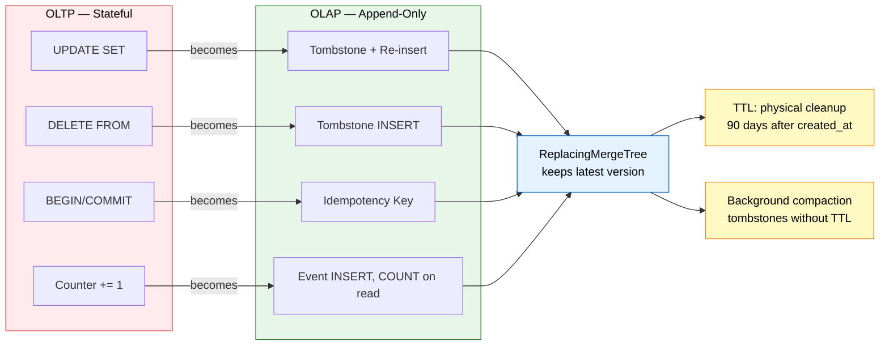

# OLTP to OLAP: Developer Patterns

## The Mindset Shift

OLTP: `UPDATE users SET balance = balance - 50 WHERE id = 123`
OLAP: `INSERT INTO ledger (account: 123, amount: -50)`

You don't update rows. You append events. You don't delete rows. You tombstone them. You don't hold state. You derive it.

## Pattern 1: Updates → Tombstone + Re-insert

**OLTP:**
```sql
UPDATE users SET display_name = 'Alice Smith' WHERE user_key = 'alice'
```

**OLAP:**
```sql
INSERT INTO users (user_key: 'alice', display_name: 'Alice Smith', deleted: 1, updated_at: now())
INSERT INTO users (user_key: 'alice', display_name: 'Alice Smith', deleted: 0, updated_at: now())
```

**Read the current value:**
```sql
SELECT display_name FROM users
WHERE user_key = 'alice' AND deleted = 0
ORDER BY updated_at DESC LIMIT 1
```

**The rule:** never `UPDATE`. Always tombstone the old row, insert the new row. `ORDER BY updated_at DESC LIMIT 1` gets the current value. Always accurate.

## Pattern 2: Deletes → Tombstones

**OLTP:**
```sql
DELETE FROM posts WHERE doc_id = 'post-123'
```

**OLAP:**
```sql
INSERT INTO posts (doc_id: 'post-123', deleted: 1, updated_at: now())
```

**Read live data:**
```sql
SELECT * FROM posts WHERE deleted = 0
```

**The rule:** never `DELETE`. Always tombstone. Queries filter `WHERE deleted = 0`. TTL cleans tombstones after 90 days.

## Pattern 3: Point Queries → Indexed Scans

**OLTP:**
```sql
SELECT * FROM users WHERE id = 123
```

**OLAP:**
```sql
SELECT * FROM users
WHERE user_key = 'alice' AND deleted = 0
ORDER BY updated_at DESC LIMIT 1
```

**The rule:** primary key is `(user_key, doc_id)`. Filter on the key, filter on `deleted = 0`, order by `updated_at DESC LIMIT 1`. Fast. ~1ms. Not Postgres-fast (~0.1ms). Fast enough.

## Pattern 4: Read-Modify-Write → Append-Only Events

**OLTP:**
```sql
UPDATE accounts SET balance = balance - 50 WHERE account = '123'
```

**OLAP:**
```sql
INSERT INTO ledger (account: '123', amount: -50, id: 1001, timestamp: now())
```

**Read the balance:**
```sql
SELECT sum(amount) FROM ledger WHERE account = '123' AND deleted = 0
```

**The rule:** never update state. Append events. Derive state from events. Two concurrent withdrawals? Both INSERT. Both survive. The sum is correct. No race condition.

## Pattern 5: Counters → Aggregates

**OLTP:**
```sql
UPDATE posts SET reaction_count = reaction_count + 1 WHERE doc_id = 'post-123'
```

**OLAP:**
```sql
INSERT INTO reactions (doc_id: 'post-123', type: 'like', id: 5001, timestamp: now())
```

**Read the count:**
```sql
SELECT count() FROM reactions WHERE doc_id = 'post-123' AND deleted = 0
```

**The rule:** never increment counters. Append events. Count on read. ClickHouse handles billions of rows per second. The count is fast. Always accurate.

## Pattern 6: Transactions → Idempotency Keys

**OLTP:**
```sql
BEGIN;
INSERT INTO ledger (account: '123', amount: -50);
INSERT INTO ledger (account: '456', amount: +50);
COMMIT;
```

**OLAP:**
```sql
INSERT INTO ledger (idempotency_key: 'txn-abc-123', account: '123', amount: -50, id: 1001)
INSERT INTO ledger (idempotency_key: 'txn-abc-123', account: '456', amount: +50, id: 1002)
```

**The rule:** every transaction has an idempotency key. Duplicate inserts are harmless. ReplacingMergeTree keeps the latest. Safe to retry.

## Pattern 7: Materialized State → Write-Time Caching

**OLTP:**
```sql
SELECT balance FROM accounts WHERE account = '123'
```

**OLAP:**
```sql
-- Write: compute delta, tombstone old balance, insert new balance
INSERT INTO balances (account: '123', balance: 950, deleted: 1, updated_at: now())
INSERT INTO balances (account: '123', balance: 900, deleted: 0, updated_at: now())

-- Read: O(1), always accurate
SELECT balance FROM balances
WHERE account = '123' AND deleted = 0
ORDER BY updated_at DESC LIMIT 1
```

**The rule:** if you need fast reads, materialize the state at write time. Compute delta, tombstone old, insert new. Read is O(1). Always accurate.

## The Anti-Patterns

### Don't UPDATE
```sql
-- WRONG
UPDATE posts SET body = 'new text' WHERE doc_id = 'post-123'

-- RIGHT
INSERT INTO posts (doc_id: 'post-123', body: 'new text', deleted: 1, updated_at: now())
INSERT INTO posts (doc_id: 'post-123', body: 'new text', deleted: 0, updated_at: now())
```

### Don't DELETE
```sql
-- WRONG
DELETE FROM posts WHERE doc_id = 'post-123'

-- RIGHT
INSERT INTO posts (doc_id: 'post-123', deleted: 1, updated_at: now())
```

### Don't Hold State
```sql
-- WRONG
UPDATE accounts SET balance = 950 WHERE account = '123'

-- RIGHT
INSERT INTO ledger (account: '123', amount: -50, id: 1001)
SELECT sum(amount) FROM ledger WHERE account = '123'
```

### Don't Increment Counters
```sql
-- WRONG
UPDATE posts SET reaction_count = reaction_count + 1 WHERE doc_id = 'post-123'

-- RIGHT
INSERT INTO reactions (doc_id: 'post-123', type: 'like', id: 5001)
SELECT count() FROM reactions WHERE doc_id = 'post-123'
```

## The Summary

| OLTP | OLAP |
|---|---|
| `UPDATE` | Tombstone + re-insert |
| `DELETE` | Tombstone |
| `SELECT WHERE id = ?` | `SELECT WHERE key = ? AND deleted = 0 ORDER BY updated_at DESC LIMIT 1` |
| `UPDATE x = x + 1` | `INSERT event`, `SELECT count()` |
| `UPDATE balance = balance - 50` | `INSERT event`, `SELECT sum(amount)` |
| `BEGIN/COMMIT` | Idempotency keys |

One database. Append-only. Compute-on-read. Tombstoning. TTL cleanup. No sync. No drift. No pipeline.

## The Architecture



No UPDATE. No DELETE. No transactions. No counters. Just INSERTs. `ReplacingMergeTree` keeps the latest. TTL cleans the rest. Background jobs compact what TTL doesn't cover.

OLTP is dead. OLAP only.