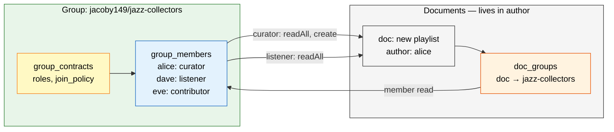
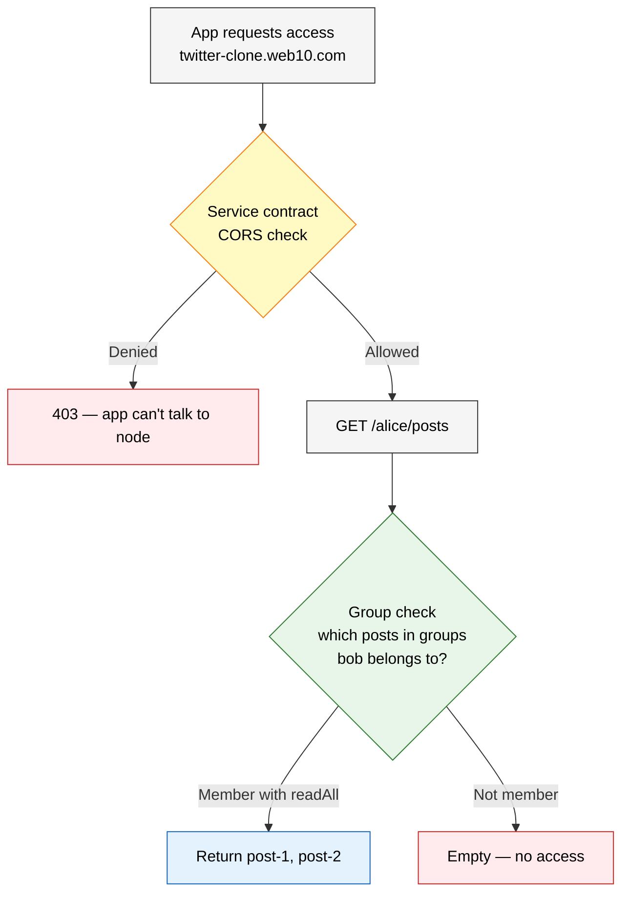

# Groups: Policy Containers

Groups are not data containers. They are policy containers — they define who gets what access to content that lives elsewhere. But they're more than that. A group is an **owned audience relationship**. The owner holds the membership list. They can see who's in it, reach out to them, and that relationship belongs to them — not the platform.

## What Groups Are

A group is a collection of web10 users operating on data services. It doesn't hold posts, files, or playlists. It holds people and roles. Three things happen when a group exists:

1. **Discovery** — content attached to the group is visible to members. This is how people find creators, and how creators reach their audience.
2. **Policy** — roles define what each member can do. Service-scoped permissions control access.
3. **Ownership** — the group owner holds the audience relationship. They can see every member's web10 identity, reach out directly, and that list is theirs.



The group doesn't hold the data. It holds people and rules. The data lives in the author's collection. `doc_groups` is the bridge — it maps documents to groups. A member sees a document because they're in a group it's attached to, and their role grants `readAll` on the relevant service.

```
Group "jazz-collectors":
  roles: [curator, listener, contributor]
  members: alice (curator), dave (listener), eve (contributor)
```

The group owner can query the membership list. They see web10 usernames, emails (if set), phone numbers (if set). They can text a follower, email a fan, message a member — directly, through web10, no platform gatekeeping the relationship. On legacy platforms, your followers are the platform's asset. You can't export them. You can't message them without the platform's permission. Here, the group membership is yours.

**Service-scoped roles.** Each group defines its own roles. Each role lists the services it applies to and the explicit permissions it grants. One group. No parent-child chains. Multiple roles per user — a user can hold different roles for different services in the same group.

**Roles are generic.** There are no predefined roles. A group defines whatever roles make sense for its purpose. A music group might have `curator`, `listener`, and `contributor`. A project group might have `admin`, `reviewer`, and `editor`. A followers group might have `owner` and `member`. The platform doesn't care what you call them or what they do.

**Permissions are explicit.** Each role lists exactly which permissions it grants on which services. No inheritance. No hidden defaults. What you see is what you get.

**The owner sees the audience.** The group owner can read the full membership list — every member's web10 identity and any contact info they've made available (email, phone). This is the audience relationship. The influencer owns it. They can reach out directly. No platform approval. No rate limits on relationship-building.

```json
{
  "roles": [
    {
      "name": "curator",
      "services": ["playlists", "comments"],
      "permissions": ["readAll", "create", "updateOwn", "deleteOwn", "hideAll"]
    },
    {
      "name": "listener",
      "services": ["playlists"],
      "permissions": ["readAll"]
    }
  ]
}
```

Alice attaches a post, a file, and a playlist to this group. Dave and eve can see what their roles allow. Same group. Different doc types. The group doesn't care what the document is.

## Two Contract Types

v3 has two contract types. They control completely different concerns. One is infrastructure. The other is social.



**Service contract** — App Trust (Infrastructure). "Do we want to spin up these data buckets for this app?"
Binary toggle. CORS. Browser-enforced. No data permissions involved. If you turn it off, the app can't even talk to your node.

```
service:posts → allowed: twitter-clone.web10.com
service:playlists → allowed: music.web10.com
```

**Provider level** — Node Trust. Server-enforced. Which apps are allowed to participate on this node at all.

```
provider-a:
  allowed apps: twitter-clone.web10.com, music.web10.com
  blocked apps: spamapp.com
```

**Group contract** — People Access (Social). "Who do we want this data to reach?"
Granular, user-controlled social policy. Roles define access, scoped to services. Content is attached to groups. Members discover it based on their role.

```
jazz-collectors → members: alice, dave, eve
```

**The separation:** Service contracts decide if an app gets a bucket. Group contracts decide who gets to look inside it.

```
service:posts → allowed: twitter-clone.web10.com → GET /alice/posts?discover=true
  1. Service contract: origin allowed? → yes
  2. Groups: which posts are in groups bob belongs to? → post-1, post-2
  3. Return post-1, post-2
```

The service contract is the outer wall. The groups are the inner permissions.

## Posting to Groups

When you create content, you pick the groups it belongs to. Those groups already define who sees it through their roles.

```ts
await createDocument({
  text: "behind the scenes",
  groups: ["alice.close-friends"]
});
```

Bob sees it because he's a member with `readAll` on the relevant service. Eve doesn't see it because she's not in the group.

Content can belong to multiple groups:
```ts
await createDocument({
  text: "team update",
   groups: ["alice.close-friends", "charlie/st-louis-chess-club"]
});
```

Anyone in either group with the right role and permissions can read it. Union of members.

Content with no groups is private — only the author sees it.

## Join Policies

Groups have three join policies:

| Policy | How it works |
|---|---|
| Open | Anyone joins automatically |
| Request | Anyone can request, owner approves or denies |
| Invite only | Only people explicitly added can join |

**Open** — anyone can join instantly. No gatekeeping. Used for public boards, open communities, public follower groups.

**Request** — someone requests to join, the group owner approves or denies. Used for private follower groups, curated communities.

**Invite only** — only people the owner explicitly adds can join. Used for close friends, private circles, invited communities.

## Moderation

Group roles can include moderation permissions. A role with `hideAll` can hide content from the group's discover — hiding it from group members. Roles cannot edit content they don't own. Roles cannot escalate their own permissions.

```
Moderation role can:
  ✓ Hide content from group discover
  ✓ Remove a member (if role grants revokeRoles)
  ✗ Edit content they don't own
  ✗ Escalate their own permissions
```

Content still exists in the author's collection. It's just removed from that group's discover. The group is a curation layer, not an ownership layer.

## Blocking

Two levels of blocking. The author controls both.

**User-wide blacklist** — block someone entirely. They can't see any of your content, anywhere.

```
user-wide blacklist:
  blocked: bob, charlie
```

**Per-group blacklist** — block someone from seeing your content in a specific group. They're still in the group. They still see everyone else's content. Just not yours.

```
jazz-collectors → per-group blacklist: dave
  dave is still a member
  dave sees everyone's content in jazz-collectors
  dave does NOT see alice's content in jazz-collectors
```

The per-group blacklist is the nuance. You can be in a group with someone you don't want seeing your content. You don't have to leave the group. You don't have to kick them out. You just block them from your content in that group.

## Group URLs

Free — namespaced by creator:
```
web10.app/groups/jacoby149/abacus-enthusiasts
web10.app/groups/alice/jazz-collectors
```

No fighting over names. Anyone can claim any slug under their username.

Premium — vanity URL (paid to node owner):
```
web10.app/groups/abacus-enthusiasts
```

Bare name, no username prefix. Status as a service. Redirects to the canonical `:username/:slug` URL. Node owner collects revenue.

## Cross-App Identity

Groups carry across apps. The same membership works everywhere:

```
jacoby149/abacus-enthusiasts:
  members: alice, dave, eve

Social app → dave sees alice's posts in this group
Music app  → dave sees alice's playlists in this group
Doc app    → dave sees alice's files in this group
```

One membership. Infinite apps. The group is managed once, at the platform level.

Collections use the same pattern — `jacoby149/posts`, `alice/posts`. Multiple apps can target the same collection. That's a feature: shared format means interoperability. Collision is a mosh pit, not a problem.

## The Authenticator — Group Management

The web10 authenticator is where you manage groups and take charge of your data.

**Groups you manage** — you control membership and roles. You see your audience.
```
alice.close-friends → owner: you, invite only
  members: bob, charlie, dave
  [Add member] [Remove member] [Edit roles] [View audience]
```

The owner can see the full membership list — web10 usernames, emails (if set), phone numbers (if set). This is the audience relationship. The influencer owns it.

**Groups you belong to** — you can view membership, leave, or control sharing.
```
jazz-collectors → owner: dave, request
  members: alice (you), dave, eve
  [View members] [Block sharing] [Leave]
```

**Block sharing** — pause sharing with a group without leaving. You stay a member. You still see their content. They can't see yours. Reversible.

```
jazz-collectors → [Block sharing]
  Your content: hidden from group
  Their content: still visible to you
  [Unblock]
```

**Opt out all documents** — bulk remove every piece of content you've attached to a group. Reversible.

**Make everything private** — remove all groups from all your content. One click. Everything goes dark.

**Turn off all service contracts** — no website touches your data. Ever. Kill switch.

## Scale

No mailing list limits. A group can have 100k members. ClickHouse filters it in milliseconds. One insert serves everyone. No fan-out.

```
alice.followers → 50k members
charlie/st-louis-chess-club → 100k members
jazz-collectors → 500k members
```

Content attached to any of these groups is discoverable by all members with the right role. One insert. Zero fan-out. The query filters at read time.

**The audience is the asset.** At scale, the group membership list is the influencer's most valuable thing. 50k followers isn't a vanity number — it's 50k people the influencer can reach directly. Their web10 usernames, emails, phones. The influencer can message them, email them, text them. On legacy platforms, 50k followers is a number the platform controls. The influencer can't export the list, can't message them without the platform's permission, can't take the relationship if they leave. Here, the group membership is owned data. It moves with the influencer. It's the difference between renting an audience and owning one.

## Summary

Groups are policy containers, discovery mechanisms, and owned audience relationships. They hold people, not data. Any document from any service can be attached to any group. Groups define their own roles with service-scoped permissions. One membership. Infinite apps.

For the group owner, the membership list is the audience. Web10 usernames, emails, phones — directly accessible. The influencer owns that relationship. They can reach out, export it, and take it with them. No platform gatekeeping.

Service contracts control which websites can access your data. Group contracts control which people can see your content. Both must pass. Browser enforces the outer wall. Server enforces the inner permissions.

The authenticator is where you take charge: block sharing, opt out, privatize all, kill switch. One toggle. Everything goes dark.