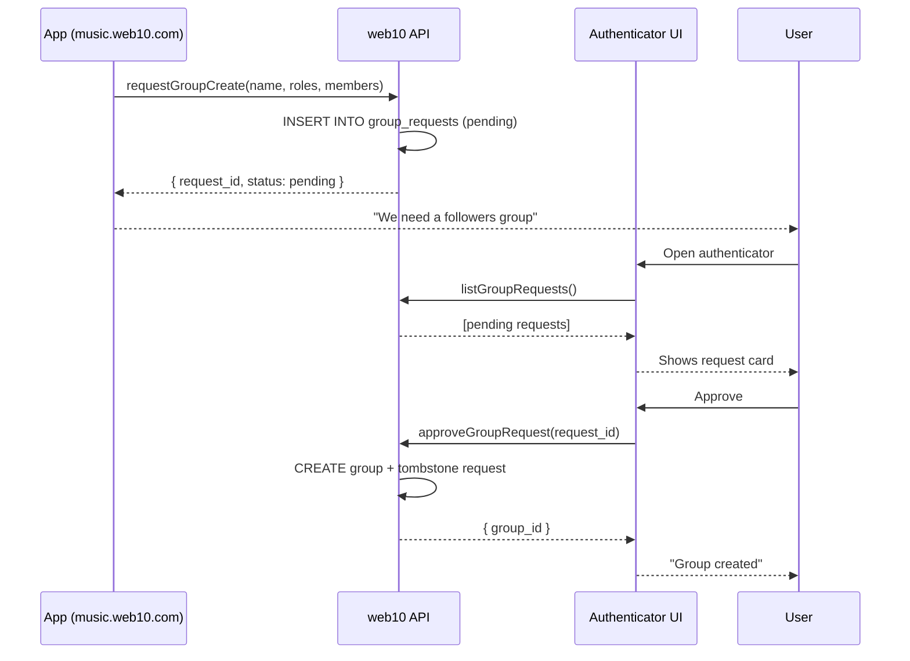

# Group Requests: App-to-User Consent for Groups

Apps need to create and modify groups on behalf of users. A social app needs you to create a followers group. A music app needs you to create a listeners group. A DM app needs to create invite-only groups per conversation.

But groups are your audience — your most valuable owned relationship. An app should never be able to create, modify, or destroy a group without your explicit consent.

## The Problem

Without a consent layer, any app with a service contract could:
- Create groups in your name
- Add/remove members from your groups
- Change join policies
- Modify roles
- Delete groups

This is unacceptable. Groups are not data buckets — they are audience relationships. The authenticator must mediate every group operation that an app requests.

## The Solution: Group Requests

Just as app contracts have **ACR** (App Contract Request), groups have **GCR** (Group Contract Request). An app cannot directly create or modify a group. It must request the operation, and the authenticator UI presents the request to the user for approval.



## The Data Model

```sql
CREATE TABLE group_requests (
    request_id String,          -- unique ID for the request
    user_key String,            -- whose groups are being affected
    app_origin String,          -- which app is requesting (CORS origin)
    action String,              -- 'create_group', 'update_group', 'add_member', 'remove_member', 'invite_member', 'delete_group'
    params String,              -- JSON: the parameters of the requested operation
    status String,              -- 'pending', 'approved', 'denied'
    requested_at DateTime64(3),
    resolved_at DateTime64(3),
    updated_at DateTime64(3),
    deleted UInt8 DEFAULT 0
) ENGINE = ReplacingMergeTree(updated_at)
ORDER BY (user_key, request_id);
```

**One request per operation.** An app that needs to create a group and add members sends two requests. The user can approve them separately. This is deliberate — granular consent.

## Request Types

| Action | What the app is asking | What the user sees |
|---|---|---|
| `create_group` | "Create a new group" | Group name, join policy, roles, initial members |
| `update_group` | "Modify a group" | What's changing: join policy, roles |
| `add_member` | "Add someone to a group" | Group, person, role |
| `remove_member` | "Remove someone from a group" | Group, person |
| `invite_member` | "Invite someone to a group" | Group, person, role offered |
| `delete_group` | "Delete a group" | Group name (destructive — highlighted in red) |

## The Authenticator UI — Group Requests

The authenticator has a **Requests** tab (alongside Contracts, Groups, Settings). This is where pending group requests appear.

**Pending group request card:**
```
music.web10.com is requesting:
  Create group "alice/listeners"
  Join policy: open
  Roles: owner (you), member
  [Approve] [Deny]
```

**Pending join request card** (someone wants to join your group):
```
bob wants to join "alice/followers"
  [Approve] [Deny]
```

The user approves or denies each request. Approved requests are executed and tombstoned. Denied requests are tombstoned.

## The API Flow

### App requests a group operation

```ts
// App wants to create a followers group
const req = await w.requestGroupCreate({
  name: 'followers',
  join_policy: 'open',
  roles: [
    { name: 'owner', services: ['*'], permissions: ['readAll', 'create', 'updateOwn', 'deleteOwn', 'manageRoles', 'assignRoles', 'revokeRoles', 'deleteGroup'] },
    { name: 'member', services: ['posts'], permissions: ['readAll'] },
  ],
  members: [{ member_key: 'alice', role: 'owner' }],
})
// → { request_id: 'req-abc', status: 'pending' }
```

The API inserts a row into `group_requests` with `status: 'pending'`. The app gets a request ID. The app can poll for status or redirect the user to the authenticator.

### App polls for status

```ts
const status = await w.getGroupRequestStatus('req-abc')
// → { request_id: 'req-abc', status: 'pending' }
// → { request_id: 'req-abc', status: 'approved', group_id: 'web10.app/groups/alice/followers' }
// → { request_id: 'req-abc', status: 'denied' }
```

### Authenticator lists pending requests

```ts
const requests = await w.listGroupRequests()
// → [
//      { request_id: 'req-abc', app_origin: 'music.web10.com', action: 'create_group', params: {...}, status: 'pending' },
//      { request_id: 'req-def', app_origin: 'social.web10.com', action: 'add_member', params: {...}, status: 'pending' }
//    ]
```

### Authenticator approves/denies

```ts
await w.approveGroupRequest('req-abc')
// → { request_id: 'req-abc', status: 'approved', group_id: 'web10.app/groups/alice/followers' }

await w.denyGroupRequest('req-def')
// → { request_id: 'req-def', status: 'denied' }
```

## Join Requests (People → Groups)

Separate from app requests. When someone requests to join a group with `request` policy, the group owner sees it in the authenticator.

```
bob requests to join "alice/followers"
  [Approve] [Deny]
```

This is the existing `group_join_requests` table. The authenticator UI queries it for each group the user manages and shows pending requests.

## Auto-Approve (Optional, Risky)

A user can set an app as trusted for group operations. This auto-approves requests from that app for specific actions.

```
Trusted apps for group operations:
  music.web10.com → auto-approve: create_group, add_member
  social.web10.com → auto-approve: none (manual review)
```

This is a security risk. If an app is compromised, it can create groups, add members, etc. without the user knowing. The default is **no auto-approve**. The user must explicitly opt in.

**Auto-approve settings live in the authenticator, not the app.** The app cannot set or change auto-approve. Only the user, through the authenticator UI, can grant it.

## Bundling Group Permissions with App Contracts (Convenience vs. Risk)

The most convenient place to grant group management permissions is during the app contract approval flow. When an app asks for access to your data, it could also request permission to manage groups on your behalf.

```
music.web10.com is requesting:
  ✓ posts → read, create
  ✓ playlists → read, create, update own, delete own
  ☐ Create and manage groups (followers, listeners)
  ☐ Add/remove group members
```

**The convenience:** One approval for everything the app needs. No separate group request queue for routine operations. The app can create your followers group, add members, etc. as part of normal operation.

**The risk:** You're granting broad authority over your audience relationships. If the app is compromised, or if you revoke the service contract later, there's a window where the app could abuse group access. A malicious app could create groups, add random people, change join policies — all without your knowledge.

**The recommendation:** Bundle group permissions with service contracts for **trusted apps** that you actively use. Never bundle for unknown or one-off apps. The authenticator UI should make this distinction clear — a prominent warning when an app requests group permissions alongside data access.

```
⚠️ This app is requesting permission to manage your groups.
This means it can create groups, add/remove members, and change settings
without asking you each time. Only grant this to apps you trust.
```

**Revocation:** When you revoke an app contract, all bundled group permissions are revoked too. The app can no longer create or modify groups on your behalf. Existing groups are not affected — only future operations are blocked.

## Why This Matters

Groups are audience relationships. On legacy platforms, your followers are the platform's asset. You can't export them, can't message them without the platform's permission, can't take the relationship if you leave.

Here, the group membership is yours. The group is created in your name, under your username namespace. The audience is your asset. That means every group operation must go through you — the owner — not the app. The app is a tool. You are the owner.

## Summary

- Apps cannot directly create or modify groups
- Apps must request operations through `group_requests`
- The authenticator UI presents pending requests for approval
- Join requests (people → groups) appear in the same Requests tab
- Auto-approve is optional and risky — default is manual review
- The user is always the final authority on their groups