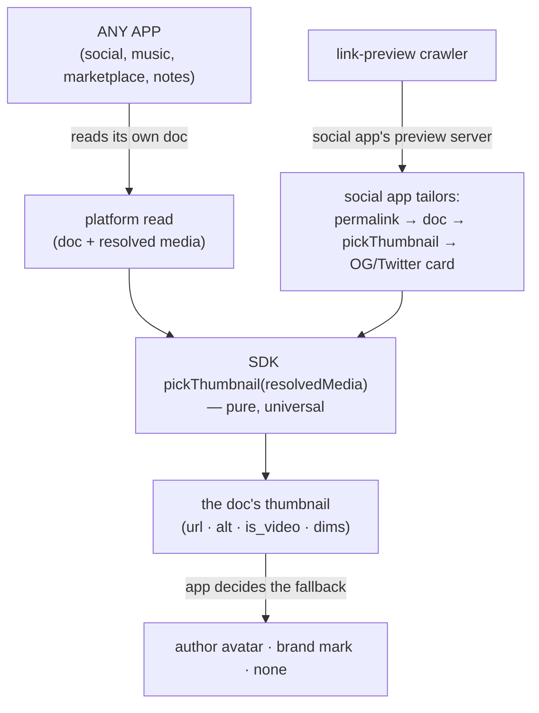

# Thumbnailing — the generic "what's the picture for this doc"

The transcoding docs decide what a video *is* on the wire and how it gets
rendered. This doc decides the one thing they do not: **how any app asks the
node for the picture that represents a document** — the thumbnail. A post's
first image, a video's poster frame, a group cover, an ad's creative. The
thumbnail is a *universal* concept: any document that carries media has one,
regardless of which app authored it. This doc makes thumbnailing a platform
primitive instead of a per-app reimplementation.

## The use case

Any app on the node stores documents with media. When that document's link
leaves the app — shared to iMessage, Slack, Discord — or when the app itself
needs to render a small representative image (a feed card, a composer preview,
a directory tile), it wants *the picture for this doc*. Today every app that
needs a picture re-derives it: web10-social's share endpoint hardcodes
"first image, else the video's poster, else the author's avatar, else the
brand mark," and it hardcodes the *social* shape of the doc (a `posts` service,
a `profile` with `avatar_ref`/`bio`, the `/u/:username` permalink). A music
app, a marketplace, a notes app with images — none of them can use that. It is
wired to one app's schema.

## The problem: thumbnailing is a universal primitive, not a social feature

D60 is the law here: *the platform API exposes only universal primitives; it
does not expose app-specific concepts.* A "thumbnail" is universal — it is a
property of *any* document with media, derived from the generic media model
(`mime_type`, `read_url`, `thumbnail_url`). It is not a property of a *post* or
a *profile*. The moment the platform grows an endpoint that knows about
`posts`, `profile`, `avatar_ref`, or the social permalink, it has stopped being
universal — the same leak D60 reversed for group identity and the session
oracle. The power-mean ranked read is the precedent for the right shape: *a
generic utility — any app supplies its own config; it is not social-specific.*

> **The rule.** The platform answers *"what is the thumbnail for this
> document?"* — a universal question over the generic media model. It does not
> answer *"what is the social card for this post?"* — that is the app's
> question, and the app composes the answer from the platform's primitive.

## The generic primitive: `pickThumbnail`

The selection is a **pure function over already-resolved media** — no I/O, no
schema knowledge. It operates on the resolved media shape the platform read
already produces (`resolve_media_urls`): `{doc_id, mime_type, read_url,
thumbnail_url, width, height, alt_text, …}`.

Selection, in order (the same logic the social share endpoint uses today,
lifted out of it):

| Resolved media item | `pickThumbnail` returns |
|---|---|
| First item is an **image** (`mime_type` `image/*`, or any non-video with a `read_url`) | that item's `read_url` |
| First item is a **video** with a `thumbnail_url` (the D44 poster) | the `thumbnail_url` |
| First item is a **video** with no poster yet (transcode pending) | fall through to the next item |
| No item yields a usable image | `null` |

The return is `{url, alt, is_video, width, height, mime_type}` or `null`.
**The fallback is not the primitive's job.** "No thumbnail → use the author's
avatar → use the brand mark" is an *app* decision (the social app knows what an
author's avatar is; a marketplace does not). The primitive returns `null` and
lets the app decide. That split — *the node picks the doc's own picture; the
app decides what to show when there isn't one* — is what keeps it universal.

**Why pure, over the resolved media?** The platform read already resolves a
doc's media to fresh presigned URLs on every read (the document-typing rule —
the document never stores a live URL). The thumbnail is just "the best one of
those." So the selection needs no second read, no second presign, no access
check — the caller already holds the resolved media from the read it did to get
the doc. A pure function over that is the cheapest, most reusable form: it runs
client-side in the SDK, server-side in the app's preview, or anywhere.

## The platform surface

Two thin, universal pieces. Neither knows about posts, profiles, or permalinks.

**1. The SDK primitive (the delivery).** `pickThumbnail(resolvedMedia)` — the
pure selection above, exported by the SDK so *any* app can call it on the
resolved media it already has from a doc read. No network call. This is the
"the SDK delivers it" half: the app reads its doc (the generic read, which
resolves media), and asks the SDK for the thumbnail.

**2. The convenience endpoint (the one-call form).** `POST /v3/media/thumbnail`
with `{doc_id}` — for the caller that wants the thumbnail without reading the
whole doc. It reads the doc **access-checked (I3)** — you can only thumbnail a
doc you can read — resolves its media, runs `pickThumbnail`, and returns
`{thumbnail: {url, alt, is_video, width, height, mime_type} | null}`. A public
doc thumbnails token-less (the crawler case); a private doc requires a token.
It is a thin wrapper over the existing generic primitives (`read_document_by_id`
+ `resolve_media_urls` + `pickThumbnail`) — no new schema, no new table, no
app concept. A doc with no media (or only poster-less video) returns
`{thumbnail: null}`; a doc the caller cannot read is a normal I3 403/404.

Both are universal. A music app thumbnails its track-cover doc the same way a
social app thumbnails a post. The node never learns what a "post" or a "profile"
is.

## The social app tailors it

web10-social is the frontier app built on the primitive, not the other way
around. It composes the social card from the platform's thumbnail:

- **Client-side (the UI).** A feed card, a composer preview, a directory tile —
  the app reads the doc (media resolved), calls `pickThumbnail`, and renders the
  picture. When it is `null`, the app applies *its* fallback (the author's
  avatar, then the brand mark) — the social-app-specific part, living in the
  social app.
- **Server-side (the link-preview card).** When a social permalink
  (`/u/:username/p/:postId`, `/u/:username`) is fetched by a crawler, the
  **social app's own preview server** renders the Open Graph / Twitter Card:
  map the permalink → the doc → read it (media resolved) → `pickThumbnail` →
  the social fallback (author avatar / brand mark) → the card HTML (title from
  the post text, `og:type`, the canonical URL). The social app owns the
  permalink shape, the card shape, and the fallback — all social concepts. The
  platform contributes exactly one thing: the thumbnail.

## The card's home: decided — Option A (the social app's preview server)

The generic primitive + SDK + endpoint are unambiguous and shipped. The one
open call was **where the server-side link-preview card lives**, because
crawlers need server-side rendering and the social app is today a static PWA:

- **Option A — the social app gets a preview server (full D60).** A small
  preview server co-located with the social app owns the permalink → doc →
  `pickThumbnail` → card path. The social nginx User-Agent split proxies crawler
  requests to *it*, not the platform. The platform's `share.py` is deleted. This
  is the D60 end state: the platform is generic, the social app owns its card.
  Cost: a new server + deploy for the social app.
- **Option B — the card stays in the platform, refactored onto the primitive
  (pragmatic).** The platform keeps a *clearly-labeled social* preview module.
  Known D60 debt (a social shape in the platform), but no new server.

**Decided: Option A.** The platform's `share.py` is **deleted** — the node has
zero social concepts. The split is clean:

- **The platform (100% generic)** contributes two universal primitives:
  - `pickThumbnail` + `POST /v3/media/thumbnail` — "what's the picture for this
    doc?" (its own media, or a media doc's own image).
  - `POST /v3/preview/render` — "render a card from this spec" (title,
    description, image, url, type → the OG/Twitter HTML). Schema-free: it knows
    nothing about posts, profiles, or permalinks. The app supplies the content;
    the platform renders the card (the universal web standard).
- **The social app (the social-specific tail)** is a small Node preview server
  (`marketing/web10-social/preview/` — `card.mjs` the card logic, `server.mjs`
  the transport) that runs in the social container alongside nginx. It maps the
  social permalink → a doc, reads the doc via the generic read (anon-capable),
  picks the thumbnail via the generic `media/thumbnail`, applies the social
  fallback (author avatar → brand mark), and asks the generic `preview/render`
  for the card HTML. The social nginx User-Agent split proxies crawler requests
  to it (same container, localhost); browsers get the SPA.

The card deploys with the app it represents (one service, version with it, dies
with it). The node never learns what a "post" or a "profile" is.

## What this is not

- **Not a new media type.** The thumbnail is a *selection* over the existing
  resolved media (the D44 poster, the presigned `read_url`). No new storage, no
  new transcoding, no new column.
- **Not the link-preview card.** The OG/Twitter card (title, description,
  `og:type`, the canonical URL) is an *app* concern — the social app tailors it.
  The platform answers "what's the picture," not "what's the social card."
- **Not a privacy loosening.** The convenience endpoint is access-checked (I3):
  a doc you cannot read does not thumbnail for you. The pure primitive inherits
  the read's access (it only ever sees media the caller was already granted).
- **Not a fallback engine.** "No picture → author avatar → brand mark" is the
  app's decision, not the platform's. The platform returns `null` and steps
  back.

## Open questions

Decided: the pure `pickThumbnail` primitive (the selection table); the SDK
delivery; the access-checked convenience endpoint; the "the app decides the
fallback" split; the generic card renderer (`POST /v3/preview/render`); and
the card's home — **Option A** (the social card lives in the social app's
preview server; the platform's `share.py` is deleted; the platform keeps only
the generic thumbnail + the generic renderer). The **group permalink's card**
is built on the same server (a new `/groups/:groupId` route) — the group's
face (cover → avatar → brand mark) read from the `web10-social-group-identity`
doc (D60), the same generic primitives, a different doc.

Still open:

- **A preview for the app's own root** (`social.web10.app/`) — a static brand
  card. Cheap; the `index.html` static tags cover it.

## Reference

- The D60 law this doc enforces (universal platform, app concepts in services):
  `../../../../knowledge/strategy/decisions.md` (D60)
- The media model the thumbnail is selected from (`thumbnail_object_key`, the
  presigned read, the D44 poster): `./transcoding-foundation.md`
- The existing social card this refactors (the bespoke `share.py` it replaces):
  `../social/share-preview.md`
- The generic read + media resolution the endpoint wraps: `../db/clickhouse.md`
- The SDK seam the primitive ships through: `../sdk/api.md`
