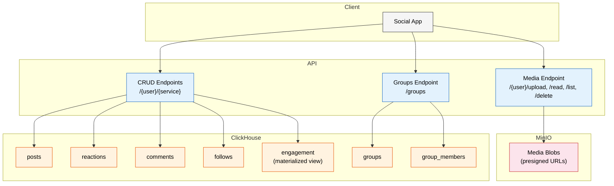
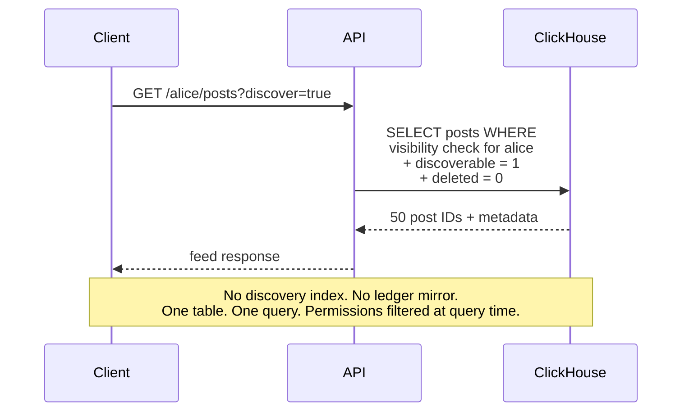
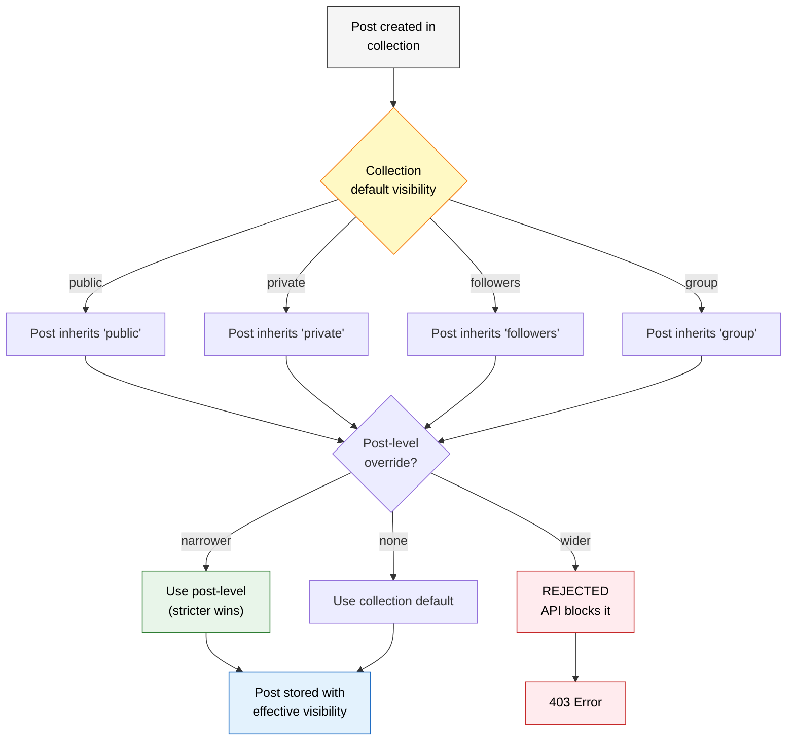
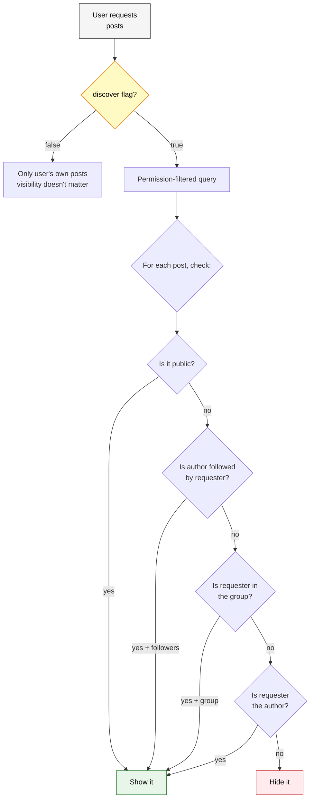
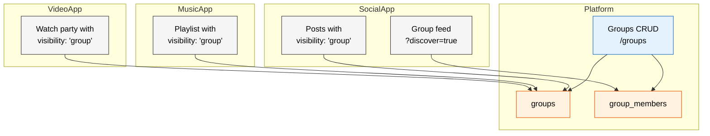
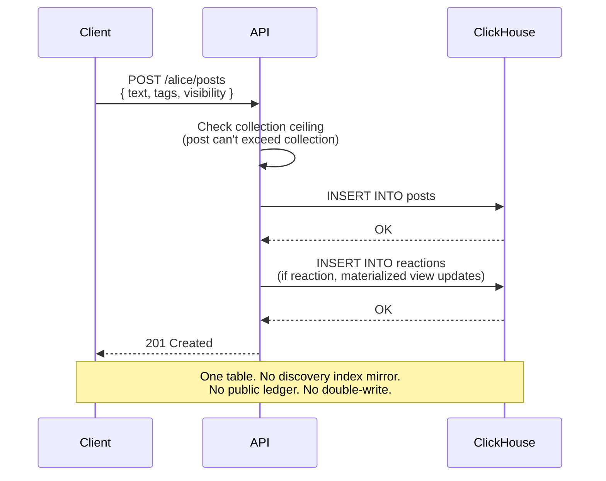
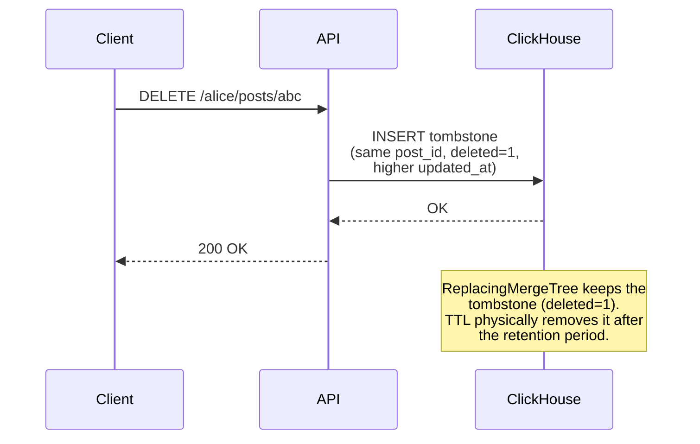

# web10 v3: ClickHouse + MinIO

## The Stack

Two services. That's it.

```
ClickHouse  — everything structured (posts, reactions, comments, follows, groups, permissions)
MinIO       — every blob (images, video, audio)
```

No MongoDB. No Postgres. No FerretDB. No CDC. No Kafka. No discovery index mirror. No public ledger.

## The Problem v2 Solved (and Broke)

v2 uses MongoDB with one collection per user. Personal data is sovereign — the user owns their collection, controls access via term records. But cross-user queries are impossible. You can't scan `alice.reactions` + `bob.reactions` + `charlie.reactions` to get engagement counts.

The workaround: system collections. `web10.discovery_posts` mirrors public posts. `web10.public` mirrors reactions, comments, follows. The client writes to both. The sync breaks.

v3 eliminates the workaround. One database. One table. Cross-user queries are native.

## Architecture



## The Tables

```sql
-- Posts: everything. JSON body for schema flexibility.
CREATE TABLE posts (
    post_id String,
    author_key String,
    collection_name String,     -- 'public_posts', 'private_posts', etc.
    body String,                -- JSON: full post content
    visibility String,          -- 'public', 'private', 'followers', 'group'
    visibility_scope String,    -- group_id, if group
    discoverable UInt8,         -- can this post appear in feeds?
    tags Array(String),
    created_at DateTime64(3),
    updated_at DateTime64(3),
    deleted UInt8 DEFAULT 0
) ENGINE = ReplacingMergeTree(updated_at)
ORDER BY (author_key, post_id)
TTL created_at + INTERVAL 90 DAY;

-- Reactions: append-only. Tombstone deletes.
CREATE TABLE reactions (
    reaction_id String,
    actor_key String,
    target_post_id String,
    type String,                -- 'like', 'love', 'laugh', etc.
    created_at DateTime64(3),
    deleted UInt8 DEFAULT 0
) ENGINE = MergeTree()
ORDER BY (target_post_id, created_at);

-- Comments: append-only. ReplacingMergeTree for edits.
CREATE TABLE comments (
    comment_id String,
    actor_key String,
    target_post_id String,
    parent_comment_id String,   -- for threading
    body String,                -- JSON: comment content
    created_at DateTime64(3),
    updated_at DateTime64(3),
    deleted UInt8 DEFAULT 0
) ENGINE = ReplacingMergeTree(updated_at)
ORDER BY (target_post_id, created_at);

-- Follows: the social graph.
CREATE TABLE follows (
    follower_key String,
    following_key String,
    created_at DateTime64(3),
    deleted UInt8 DEFAULT 0
) ENGINE = MergeTree()
ORDER BY (follower_key, following_key);

-- Groups: platform primitive. Cross-app identity.
CREATE TABLE groups (
    group_id String,
    name String,
    description String,
    admin_key String,
    settings String,            -- JSON: join_policy, post_policy
    created_at DateTime64(3),
    updated_at DateTime64(3),
    deleted UInt8 DEFAULT 0
) ENGINE = ReplacingMergeTree(updated_at)
ORDER BY group_id;

-- Group membership.
CREATE TABLE group_members (
    group_id String,
    member_key String,
    role String,                -- 'admin', 'member'
    joined_at DateTime64(3),
    updated_at DateTime64(3),
    deleted UInt8 DEFAULT 0
) ENGINE = ReplacingMergeTree(updated_at)
ORDER BY (group_id, member_key);

-- Collection permissions (the ceiling).
CREATE TABLE collection_permissions (
    author_key String,
    collection_name String,
    visibility String,          -- default visibility for this collection
    visibility_scope String,    -- group_id, if group
    updated_at DateTime64(3),
    deleted UInt8 DEFAULT 0
) ENGINE = ReplacingMergeTree(updated_at)
ORDER BY (author_key, collection_name);

-- Engagement: materialized view, auto-updates on reaction insert.
CREATE MATERIALIZED VIEW engagement
TO engagement_base
AS SELECT
    target_post_id AS record_id,
    count() AS reaction_count,
    count() * 1.0 AS score,
    now() AS updated_at
FROM reactions
WHERE deleted = 0
GROUP BY target_post_id;
```

## Discovery: `?discover=true`

`/discover` and `/public` endpoints disappear. Discovery is a CRUD parameter. One endpoint. One table.



The query ClickHouse runs:

```sql
SELECT post_id, author_key, body, tags, created_at
FROM posts
WHERE deleted = 0
  AND discoverable = 1
  AND (
    -- Public posts from anyone
    visibility = 'public'
    AND collection_visibility = 'public'

    OR

    -- Followers-only: Alice sees them if she follows the author
    (visibility = 'followers'
     AND author_key IN (
       SELECT following_key FROM follows
       WHERE follower_key = 'alice' AND deleted = 0
     ))

    OR

    -- Group posts: Alice sees them if she's a member
    (visibility = 'group'
     AND visibility_scope IN (
       SELECT group_id FROM group_members
       WHERE member_key = 'alice' AND deleted = 0
     ))

    OR

    -- Alice's own posts (always visible)
    author_key = 'alice'
  )
ORDER BY created_at DESC
LIMIT 50;
```

The `discoverable` flag is per-record. The author controls it. `discoverable: false` means the post exists but doesn't appear in feeds — only visible by direct link or to the author.

## Layered Permissions: Collection Ceiling + Post Narrowing

The collection is the ceiling. The post can only narrow, never widen. Strictest wins.



The visibility hierarchy (most permissive to least):

```
public > followers > group > private
```

A post in `public_posts` can be `public` or `followers` or `group` or `private`. A post in `private_posts` can only be `private`. The API enforces this at write time.

## Private Post Viewing

Private posts are only visible to the author. The discover query includes the author's own posts regardless of visibility.



## Groups: Platform Primitive

Groups are managed by the platform. Membership carries across app experiences. One group, infinite apps.



Alice creates a group. Bob and Charlie join. Now any app on web10 can scope content to that group. The social app posts to it. The music app shares a playlist. The video app hosts a watch party. Same group. Same membership. Managed once.

## The Write Flow

One insert. One table. No mirrors.



## The Delete Flow

Tombstone. Append-only. TTL cleans up.



## What Disappears From v2

| v2 (MongoDB) | v3 (ClickHouse) |
|---|---|
| One collection per user | One table for everything |
| Term records (whitelist/blacklist) | `visibility` column + `collection_permissions` |
| `/discover` endpoint | `?discover=true` on CRUD |
| `/public` endpoint | Gone (visibility filter) |
| Discovery index table | Gone (posts table IS the index) |
| Public ledger | Gone (reactions table + materialized view) |
| Client-side ledger mirrors | Gone (server writes once) |
| Server-side indexing hooks | Gone (single insert) |
| FerretDB translation layer | Gone |
| DocumentDB/Postgres | Gone |
| `web10.discovery_posts` | Gone |
| `web10.public` | Gone |
| `web10.schemas` | Gone (JSON body) |
| `web10.metering_events` | Gone (ClickHouse table) |

## What Stays

- **The CRUD pattern.** `/{user}/{service}` is still the API surface. The dev writes to it. The API routes to ClickHouse.
- **The sovereignty story.** Collections set the default. Posts can only narrow. The privacy panel manages collections. The user controls their data.
- **The layered permissions model.** Collection ceiling + post-level narrowing. Apps get scoped access. The user can revoke. The platform can't read data without permission.
- **Groups as platform primitive.** One membership, infinite apps. Cross-app identity.

## Summary

ClickHouse + MinIO. Two services. One table for posts. One table for reactions. One table for comments. One table for follows. One table for groups. One table for group membership. Materialized views for engagement. TTL for cleanup. Tombstones for deletes. JSON columns for schema flexibility. Inverted index for search.

No mirrors. No sync. No double-write. No discovery index. No ledger. No FerretDB. No MongoDB. No Postgres.

One CRUD endpoint. `?discover=true` for cross-user visibility. `visibility` column for permissions. `collection_permissions` for the ceiling. Strictest wins.

Groups are a platform primitive. One membership. Infinite apps. The building block for teams, communities, circles.

The dev calls `createPost({ text, tags, visibility })`. The API writes one row. ClickHouse queries it. That's it.