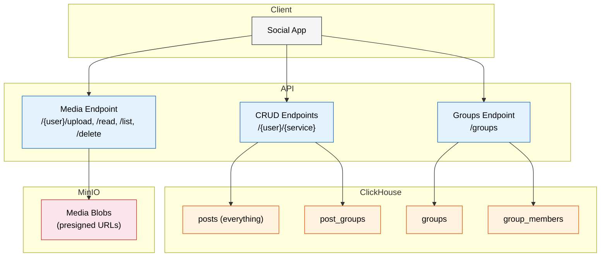
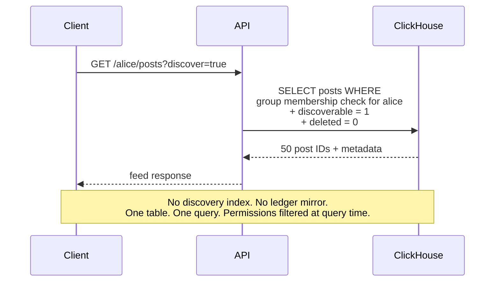
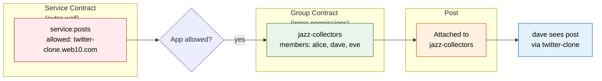
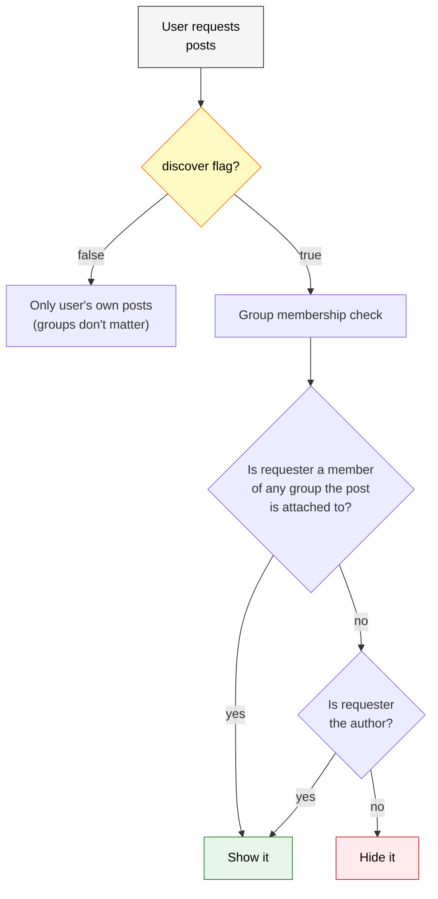
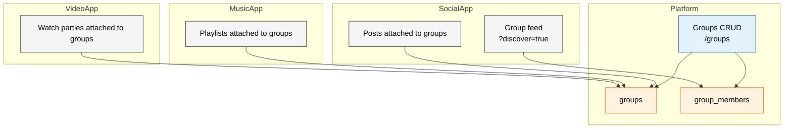
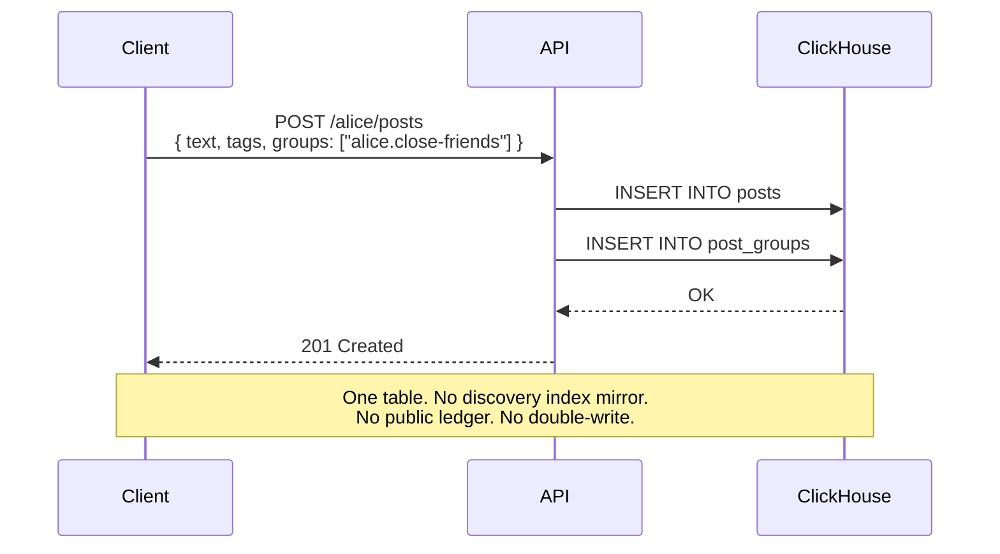
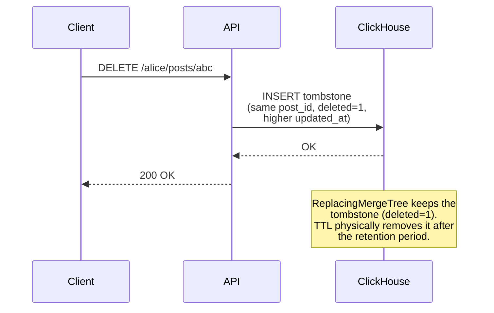

# web10 v3: ClickHouse + MinIO

## The Stack

Two services. That's it.

```
ClickHouse  — everything structured (posts, reactions, comments, groups, permissions)
MinIO       — every blob (images, video, audio)
```

No MongoDB. No Postgres. No FerretDB. No CDC. No Kafka. No discovery index mirror. No public ledger.

## The Problem v2 Solved (and Broke)

v2 uses MongoDB with one collection per user. Personal data is sovereign — the user owns their collection, controls access via term records. But cross-user queries are impossible. You can't scan `alice.reactions` + `bob.reactions` + `charlie.reactions` to get engagement counts.

The workaround: system collections. `web10.discovery_posts` mirrors public posts. `web10.public` mirrors reactions, comments, follows. The client writes to both. The sync breaks.

v3 eliminates the workaround. One database. One table. Cross-user queries are native.

## Architecture



## The Tables

```sql
-- Posts: everything. JSON body for schema flexibility.
CREATE TABLE posts (
    post_id String,
    author_key String,
    collection_name String,     -- 'public_posts', 'private_posts', etc.
    body String,                -- JSON: full post content
    discoverable UInt8,         -- can this post appear in feeds?
    tags Array(String),
    created_at DateTime64(3),
    updated_at DateTime64(3),
    deleted UInt8 DEFAULT 0
) ENGINE = ReplacingMergeTree(updated_at)
ORDER BY (author_key, post_id)
TTL created_at + INTERVAL 90 DAY;

-- Post-to-group mapping. Groups define who can see the post.
CREATE TABLE post_groups (
    post_id String,
    group_id String,
    permission String,          -- 'read', 'write' — author decides at attachment time
    created_at DateTime64(3),
    updated_at DateTime64(3),
    deleted UInt8 DEFAULT 0
) ENGINE = ReplacingMergeTree(updated_at)
ORDER BY (post_id, group_id);

-- Service contracts. Which websites can access your service. CORS.
CREATE TABLE service_contracts (
    user_key String,
    service_name String,        -- 'posts', 'mail', 'notes'
    allowed_origin String,      -- 'twitter-clone.web10.com'
    created_at DateTime64(3),
    updated_at DateTime64(3),
    deleted UInt8 DEFAULT 0
) ENGINE = ReplacingMergeTree(updated_at)
ORDER BY (user_key, service_name, allowed_origin);

-- Provider service contracts. Which apps can participate on this node.
CREATE TABLE provider_service_contracts (
    provider_key String,
    allowed_origin String,
    created_at DateTime64(3),
    updated_at DateTime64(3),
    deleted UInt8 DEFAULT 0
) ENGINE = ReplacingMergeTree(updated_at)
ORDER BY (provider_key, allowed_origin);

-- Group contracts. Join policy, settings.
CREATE TABLE group_contracts (
    group_id String,
    name String,
    admin_key String,
    join_policy String,         -- 'open', 'request', 'invite_only'
    settings String,            -- JSON
    created_at DateTime64(3),
    updated_at DateTime64(3),
    deleted UInt8 DEFAULT 0
) ENGINE = ReplacingMergeTree(updated_at)
ORDER BY group_id;

-- Group join requests. Pending approvals for "request" join policy.
CREATE TABLE group_join_requests (
    group_id String,
    requester_key String,
    status String,              -- 'pending', 'approved', 'denied'
    requested_at DateTime64(3),
    resolved_at DateTime64(3),
    updated_at DateTime64(3),
    deleted UInt8 DEFAULT 0
) ENGINE = ReplacingMergeTree(updated_at)
ORDER BY (group_id, requester_key);

-- User-group sharing toggle. Block sharing without leaving.
CREATE TABLE user_group_sharing (
    user_key String,
    group_id String,
    sharing_enabled UInt8,      -- 1 = sharing, 0 = blocked
    created_at DateTime64(3),
    updated_at DateTime64(3),
    deleted UInt8 DEFAULT 0
) ENGINE = ReplacingMergeTree(updated_at)
ORDER BY (user_key, group_id);

-- User-wide blacklist. Blocks someone entirely.
CREATE TABLE user_blacklist (
    user_key String,
    blocked_key String,
    created_at DateTime64(3)
) ENGINE = MergeTree()
ORDER BY (user_key, blocked_key);

-- Per-group blacklist. Blocks someone from your content in one group.
CREATE TABLE group_blacklist (
    user_key String,
    group_id String,
    blocked_key String,
    created_at DateTime64(3)
) ENGINE = MergeTree()
ORDER BY (user_key, group_id, blocked_key);

-- Groups: policy containers. Hold people, not data.
-- (Metadata like join_policy lives in group_contracts table)
CREATE TABLE groups (
    group_id String,
    admin_key String,
    created_at DateTime64(3),
    updated_at DateTime64(3),
    deleted UInt8 DEFAULT 0
) ENGINE = ReplacingMergeTree(updated_at)
ORDER BY group_id;

-- Group membership.
CREATE TABLE group_members (
    group_id String,
    member_key String,
    role String,                -- 'admin', 'member'
    joined_at DateTime64(3),
    updated_at DateTime64(3),
    deleted UInt8 DEFAULT 0
) ENGINE = ReplacingMergeTree(updated_at)
ORDER BY (group_id, member_key);
```

## Everything Is a Post

No dedicated reactions table. No dedicated comments table. No dedicated follows table. No dedicated social media endpoints. One table. One CRUD. One permission model.

**A reaction is a post:**
```json
{
  "post_id": "react-abc",
  "author_key": "bob",
  "collection_name": "reactions",
  "body": {
    "ref": {"type": "ref", "value": "post-123"},
    "reaction_type": {"type": "text", "value": "like"}
  }
}
```

**A comment is a post:**
```json
{
  "post_id": "comment-xyz",
  "author_key": "charlie",
  "collection_name": "comments",
  "body": {
    "ref": {"type": "ref", "value": "post-123"},
    "parent_ref": {"type": "ref", "value": "comment-abc"},
    "text": {"type": "text", "value": "great post!"}
  }
}
```

**A follow is a group membership:**
```
alice.followers → members: bob, charlie
```

The `ref` type (see `document-typing.md`) is the universal pointer. Any post can reference any other post. The API resolves refs on read. The app decides what a ref means — reaction, comment, reply, quote, remix. The platform doesn't care.

**Engagement is a query, not a table:**
```sql
-- Reaction count for post-123
SELECT count(), any(body)
FROM posts
WHERE deleted = 0
  AND collection_name = 'reactions'
  AND hasToken(body, 'post-123');  -- ref contains the target post_id
```

**Comments for a post:**
```sql
SELECT post_id, author_key, body, created_at
FROM posts
WHERE deleted = 0
  AND collection_name = 'comments'
  AND hasToken(body, 'post-123')
ORDER BY created_at ASC;
```

The `hasToken` function scans the JSON body for the ref value. ClickHouse can index JSON paths for faster lookup. No dedicated table. No dedicated endpoint. Just posts with refs.

## Media Library

Media is a separate endpoint. Users upload media, get stable URLs. Documents reference those URLs.

```
POST /alice/upload → web10.app/alice/photo.jpg
POST /alice/upload → web10.app/alice/video.mp4
```

The media library is independent. Media can be shared across multiple documents. Media has its own groups/permissions.

**Document references media:**
```json
{
  "text": "check this out",
  "media": [
    "web10.app/alice/photo.jpg",
    "web10.app/alice/video.mp4"
  ]
}
```

**The API converts URLs:**
```
1. Request: GET /alice/posts/123
2. API: check group permissions → allowed
3. API: scan JSON for web10.app/alice/* URLs
4. API: convert to presigned MinIO URLs
5. Return document with temporary URLs
```

If permissions fail, the whole document is hidden. No URLs exposed. Clean.

## Discovery: `?discover=true`

`/discover` and `/public` endpoints disappear. Discovery is a CRUD parameter. One endpoint. One table.



The query ClickHouse runs:

```sql
SELECT p.post_id, p.author_key, p.body, p.tags, p.created_at
FROM posts p
JOIN post_groups pg ON p.post_id = pg.post_id
JOIN group_members gm ON pg.group_id = gm.group_id
WHERE p.deleted = 0
  AND p.discoverable = 1
  AND gm.member_key = 'alice'
  AND gm.deleted = 0
  AND NOT EXISTS (
    SELECT 1 FROM user_blacklist
    WHERE user_key = p.author_key AND blocked_key = 'alice'
  )
  AND NOT EXISTS (
    SELECT 1 FROM group_blacklist
    WHERE user_key = p.author_key
      AND group_id = pg.group_id
      AND blocked_key = 'alice'
  )
ORDER BY p.created_at DESC
LIMIT 50;
```

Alice sees every post attached to a group she belongs to. No visibility column. No collection ceiling. Just group membership.

The `discoverable` flag is per-record. The author controls it. `discoverable: false` means the post exists but doesn't appear in feeds — only visible by direct link or to the author.

## Permissions: Service Contracts + Groups

Two contract types. They control different things.

**Service contract** — which websites can access your service. CORS. App-level.

```
service:posts → allowed: twitter-clone.web10.com
service:playlists → allowed: music.web10.com
```

The browser enforces this. Turn off all service contracts → no website touches your data. Kill switch.

**Provider level** — which apps can participate on this node. Server-enforced. A bad app floods the network → providers block it at the node level.

```
provider-a:
  allowed apps: twitter-clone.web10.com, music.web10.com
  blocked apps: spamapp.com
```

The provider protects itself. The user protects their data. Two layers.

**Group contract** — which people can see which content. Sharing. People-level.

```
jazz-collectors → members: alice, dave, eve
```

Both must pass. The app needs a service contract to even make the call. The groups decide what's visible.



A post with no groups is private. Attaching it to a group makes it visible to group members. The author decides the permission level (read/write). The group admin manages membership and can moderate (remove from discover, not edit).

## Private Post Viewing

A post is private by default. Attaching it to a group makes it visible to group members.



## Groups: Policy Containers

Groups are not data containers. They hold people and permissions. Any document from any service can be attached to any group. The group's policy decides who sees it.



Alice creates a group. Bob and Charlie join. Now any app on web10 can attach content to that group. The social app posts to it. The music app shares a playlist. The video app hosts a watch party. Same group. Same membership. Managed once.

### Follows Are Groups

Follows are groups. `alice.followers` is a group where Alice is the admin. Bob requests to join → Alice approves → Bob is a member → Bob sees posts attached to that group.

```ts
await followUser('alice');        // request to join alice.followers
await approveFollower('bob');     // approve bob into alice.followers
await unfollow('alice');          // leave alice.followers
```

No separate follows table. Groups handle it.

### The Authenticator

Two views:

**Groups you administer** — you control membership.
```
alice.close-friends → admin: you, invite only
alice.public        → admin: you, open
```

**Groups you belong to** — you can view, leave, or opt out your posts.
```
jazz-collectors → admin: dave, request
web10-dev       → admin: charlie, open
```

**Opt out all posts** — bulk remove every post you've attached to a group. Reversible.
**Make everything private** — remove all groups from all your posts. One click.

## The Write Flow

One insert. One table. No mirrors.



## The Delete Flow

Tombstone. Append-only. TTL cleans up.



## What Disappears From v2

| v2 (MongoDB) | v3 (ClickHouse) |
|---|---|
| One collection per user | One table for everything |
| Term records (whitelist/blacklist) | Service contracts + group contracts |
| `/discover` endpoint | `?discover=true` on CRUD |
| `/public` endpoint | Gone (group membership filter) |
| Discovery index table | Gone (posts table IS the index) |
| Public ledger | Gone (posts with `ref` type) |
| Client-side ledger mirrors | Gone (server writes once) |
| Server-side indexing hooks | Gone (single insert) |
| FerretDB translation layer | Gone |
| DocumentDB/Postgres | Gone |
| `web10.discovery_posts` | Gone |
| `web10.public` | Gone |
| `web10.schemas` | Gone (JSON body) |
| `web10.metering_events` | Gone (ClickHouse table) |

## What Stays

- **The CRUD pattern.** `/{user}/{service}` is still the API surface. The dev writes to it. The API routes to ClickHouse.
- **The sovereignty story.** Service contracts control which apps access your data. Groups control which people see your content. The authenticator manages both — block sharing, opt out, privatize all, kill switch. The user controls their data.
- **Groups as platform primitive.** One membership, infinite apps. Cross-app identity.

## Summary

ClickHouse + MinIO. Two services. One table for everything structured. One table for posts — reactions, comments, notes, mail, everything is a post. The `ref` type in the JSON body links posts together. Groups. Group membership. Post-to-group mapping. Service contracts. Group contracts. Blacklist tables. Sharing toggle. TTL for cleanup. Tombstones for deletes. JSON body for schema flexibility.

No mirrors. No sync. No double-write. No discovery index. No ledger. No FerretDB. No MongoDB. No Postgres. No dedicated reactions table. No dedicated comments table. No dedicated social media endpoints.

One CRUD endpoint. `?discover=true` for cross-user visibility. Service contracts control app access. Groups control people access. Both must pass.

Groups are policy containers. They hold people, not data. One membership. Infinite apps. Follows are groups. The authenticator manages everything — block sharing, opt out, privatize all, kill switch.

**Additional docs in this directory:**
- `groups.md` — policy containers, join policies, moderation, blocking, authenticator
- `contract-schemas.md` — full table schemas for service contracts, group contracts, join requests, sharing toggle
- `cross-app-sharing.md` — mailer pattern, saved mail, DMs, comments, notes
- `federated-groups.md` — federation across providers, remote() queries
- `document-typing.md` — leaf-level type convention, the `ref` type, planned schemas
- `tombstone-cleanup.md` — append-only write pattern, TTL cleanup, background compaction
- `real-time-feeds.md` — Redis cache, WebSocket push, hot group scaling
- `manifesto-additions.md` — internet permanence, sender deletion, groups on the internet
- `skeptical-points-addressed.md` — concerns from the v2-to-v3 transition, resolved

The dev calls `createPost({ text, tags, groups: ["alice.close-friends"] })`. A reaction is `createPost({ ref: "post-123", reaction_type: "like" })`. A comment is `createPost({ ref: "post-123", text: "great!" })`. Same endpoint. Same table. Same permissions. That's it.