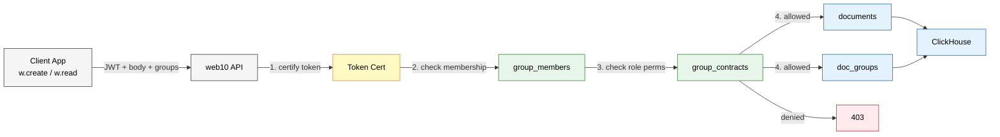
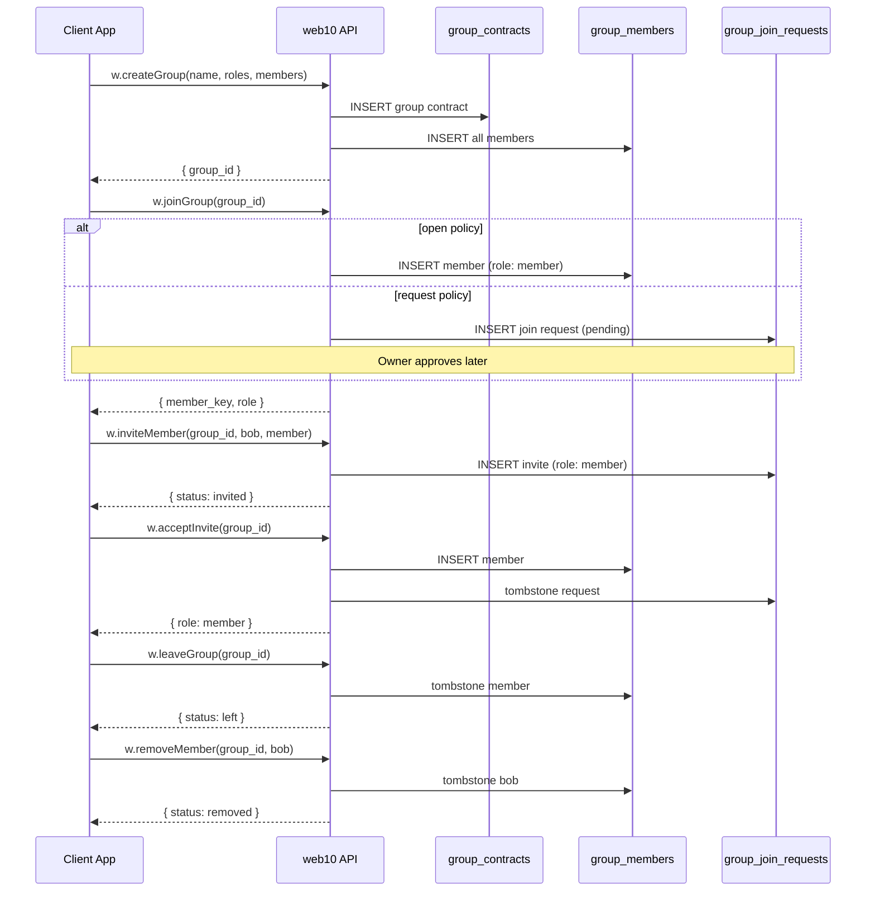

# web10 SDK v3

The JavaScript/TypeScript SDK. One client. Groups are baked into every verb.

## Request Flow

Every SDK call follows the same path: client → API → ClickHouse. Groups are not a separate surface — they are metadata on CRUD operations that the API validates before touching data.



Create inserts one row into `documents`, then one row per group into `doc_groups`. Read joins `documents` → `doc_groups` → `group_members` and filters by your membership. Update tombstones old rows, inserts new. Delete tombstones. All append-only. `ReplacingMergeTree` keeps the latest.

## Installation

```bash
npm install web10-npm
```

```ts
import { createClient } from 'web10-npm'
```

## Creating a Client

```ts
const w = createClient({ authUrl: 'https://auth.web10.app' })
```

Optional `apiOrigin` overrides the node host. Defaults to `api.web10.app`.

## Auth

```ts
// Open popup, wait for login
await w.login()

// Listen for sign-in/sign-out
w.authListen((signedIn) => {
  if (signedIn) {
    const token = w.readToken()
    console.log(token.username, token.provider)
  }
})

// Check state
w.isSignedIn()

// Logout
w.signOut()
```

## Service Contracts (App Trust)

Thin layer. CORS. Browser-enforced. Declares which services your app needs. The user approves or denies in the authenticator.

```ts
w.smrOnReady([{
  service: 'posts',
  cross_origins: ['your-domain.com'],
}])
```

This is infrastructure trust — "do we want to spin up these data buckets for this app?" It does not control who sees data. Groups do that.

## CRUD With Groups

The four verbs. Groups change everything.

### Create

The document body is typed content. Groups are metadata — a separate part of the request the API validates. The API checks membership and role permissions before attaching.

```ts
const doc = await w.create('posts', {
  // Typed document body — leaf-level types
  text: { type: 'text', value: 'just shipped the new groups feature' },
  media: [{ type: 'minio', value: 'jacoby149/media/img-abc.jpg' }],
}, {
  // Metadata — API validates membership + permissions
  groups: [
    'web10.app/groups/web10/discover',
    'web10.app/groups/jacoby149/followers',
  ],
})
```

The API checks each group:
1. Is the user a member?
2. Does their role grant `create` on that service?

If a check fails, the attachment is rejected. The document still creates — just not attached to that group.

No groups = private. Only the author sees it.

Multiple groups = union of members. Anyone in either group with the right role can read it.

Behind the scenes the API inserts one row into `documents`, then one row per group into `doc_groups`. One transaction. No fan-out.

### Read

Every read is group-filtered. You see a document because you're a member of a group it's attached to — even your own posts.

**Personal read** — `me` is a reserved group that returns your own documents, regardless of group attachment:

```ts
const myPosts = await w.read('posts', {
  groups: ['me'],
  $sort: { created_at: -1 },
  $limit: 50,
})
```

The API knows `me` means "documents where `author_key = :user`". No group join. Same query shape. Consistent.

**Group-filtered read** — the discover query. Pass groups, get documents attached to those groups:

```ts
// Discover — public board
const posts = await w.read('posts', {
  groups: ['web10.app/groups/web10/discover'],
  $sort: { created_at: -1 },
  $limit: 50,
})
```

The API translates `groups` into a join against `doc_groups` → `group_members`. You get documents where the group matches and you're a member. Blacklists are checked automatically.

**Feed pattern** — read across multiple groups:

```ts
const posts = await w.read('posts', {
  groups: [
    'web10.app/groups/web10/discover',
    'web10.app/groups/alice/followers',
    'web10.app/groups/charlie/st-louis-chess-club',
  ],
  $sort: { created_at: -1 },
  $limit: 50,
})
```

Union of all groups. One query.

**Sorting** — `$sort` is always an object. Two types:

```ts
// Simple sort — priority order (dictionary-style)
const posts = await w.read('posts', {
  groups: feedGroups,
  $sort: {
    type: 'simple',
    fields: ['created_at:desc', 'author_key:asc'],
  },
  $limit: 50,
})

// Power mean sort — weighted ranking (v4 feature, see `../../web10-v4/sdk/advanced.md`)
const posts = await w.read('posts', {
  groups: feedGroups,
  $sort: {
    type: 'powerMean',
    fields: [
      { field: 'created_at', type: 'time', weight: 0.6, half_life: 24, boost: 1 },
      { field: 'ref_count', type: 'ref_count', collection: 'reactions', weight: 0.6, boost: 2 },
    ],
    balance: -1,
  },
  $limit: 50,
})
```

`powerMean` sorting is a v4 feature — weighted ranking with configurable signals, `half_life` decay, `boost` multipliers, and `balance` to control how signals combine. See `../../web10-v4/sdk/advanced.md` for the full spec.

**Filtering** — `$match` filters documents before sorting. Fast on indexed fields, works (but scans) on the JSON body:

```ts
const posts = await w.read('posts', {
  groups: feedGroups,
  $match: {
    author_key: 'alice',
    tags: ['jazz'],
    'body.media.type': 'minio',
  },
  $limit: 50,
})
```

| Field | Speed | How |
|---|---|---|
| `author_key`, `collection_name`, `created_at` | Fast | Indexed (primary key) |
| `tags` | Fast | `has(tags, 'jazz')` |
| `body.*` (JSON path) | Slow | `extractJSONString` scan |

For page-sized results, JSON body filters are fine. For filtering millions of rows, use tags or dedicated columns.

See `feed-lens-integration.md` in brainstorm for the full feed tuning plan (lens as user-owned config, 5-knob UI, mix codes).

### Update

Same separation. Body changes in the first arg. Group changes in the options:

```ts
await w.update('posts', { _id: 'doc-123' }, {
  $set: { text: { type: 'text', value: 'updated content' } },
}, {
  $groups: ['web10.app/groups/web10/discover'],
})
```

`$groups` replaces the group attachment list. API validates membership on each. Remove a group → the document disappears from that group's discover. Add a group → it appears.

### Delete

Tombstone. Insert a deleted marker. The document disappears from all groups:

```ts
await w.delete('posts', { _id: 'doc-123' })
```

The API tombstones the `documents` row and all `doc_groups` rows. Background job compacts on schedule.

## Group Operations

Groups are first-class. The SDK exposes them directly.

### Group Lifecycle



### Create a Group

Explicit roles. Explicit members. The API doesn't assume anything — you assign every role, including yourself.

```ts
const group = await w.createGroup({
  name: 'St. Louis Chess Club',
  join_policy: 'invite_only',
  roles: [
    {
      name: 'admin',
      services: ['*'],
      permissions: [
        // Content
        'readAll', 'create', 'updateOwn', 'updateAll', 'deleteOwn', 'deleteAll', 'hideAll',
        // Group management
        'manageRoles', 'assignRoles', 'revokeRoles', 'deleteGroup', 'modifyJoinPolicy',
      ],
    },
    {
      name: 'member',
      services: ['posts', 'comments'],
      permissions: ['readAll', 'create', 'updateOwn', 'deleteOwn'],
    },
  ],
  members: [
    { member_key: 'jacoby149', role: 'admin' },
  ],
})
// → { group_id: 'web10.app/groups/jacoby149/st-louis-chess-club' }
```

The `members` array is required. **The creator automatically receives a role with all five group management permissions** (`manageRoles`, `assignRoles`, `revokeRoles`, `deleteGroup`, `modifyJoinPolicy`). You cannot create a group you can't fully manage — the API adds these permissions to the creator's role regardless of what the role definition lists.

Group management permissions are separate from content permissions:

| Permission | What it does |
|---|---|
| `manageRoles` | Add, rename, or remove role definitions |
| `assignRoles` | Add members or promote existing members |
| `revokeRoles` | Remove members or demote roles |
| `deleteGroup` | Delete the group (tombstone) |
| `modifyJoinPolicy` | Change open/request/invite_only |

### Get Groups

```ts
// All groups the user belongs to (full details)
const groups = await w.getGroups({ member: 'jacoby149' })
// → [
//    { group_id: 'web10.app/groups/web10/discover', name: 'Discover', join_policy: 'open', member_count: 1200000, my_role: null },
//    { group_id: 'web10.app/groups/jacoby149/followers', name: 'Followers', join_policy: 'open', member_count: 342, my_role: 'admin' },
//    { group_id: 'web10.app/groups/jacoby149/close-friends', name: 'Close Friends', join_policy: 'invite_only', member_count: 12, my_role: 'admin' },
//    { group_id: 'web10.app/groups/charlie/st-louis-chess-club', name: 'St. Louis Chess Club', join_policy: 'invite_only', member_count: 47, my_role: 'member' }
//  ]

// Groups where you manage membership
const managed = await w.getGroups({ manages: 'jacoby149' })
```

### Join a Group

```ts
// Open policy — instant
const joined = await w.joinGroup('web10.app/groups/alice/followers')
// → { group_id: 'web10.app/groups/alice/followers', member_key: 'jacoby149', role: 'member' }

// Request policy — pending until owner approves
const pending = await w.requestJoin('web10.app/groups/alice/followers')
// → { group_id: 'web10.app/groups/alice/followers', status: 'pending' }
```

### Leave a Group

```ts
await w.leaveGroup('web10.app/groups/alice/followers')
// → { group_id: 'web10.app/groups/alice/followers', member_key: 'jacoby149', status: 'left' }
```

### Invite a Member

Sends an invite. The target user receives it with the role offered. They can accept or decline.

```ts
await w.inviteMember('web10.app/groups/jacoby149/close-friends', 'bob', 'member')
// → Bob receives an invite
// → Bob accepts → added to group_members
// → Bob declines → invite expires, not added
```

### Accept / Decline Invite

```ts
const result = await w.acceptInvite('web10.app/groups/jacoby149/close-friends')
// → { group_id: 'web10.app/groups/jacoby149/close-friends', role: 'member' }

await w.declineInvite('web10.app/groups/jacoby149/close-friends')
// → { group_id: 'web10.app/groups/jacoby149/close-friends', status: 'declined' }
```

### Remove Member

Direct remove. Only works if your role has `revokeRoles`.

```ts
await w.removeMember('web10.app/groups/jacoby149/close-friends', 'bob')
// → { group_id: 'web10.app/groups/jacoby149/close-friends', member_key: 'bob', status: 'removed' }
```

### Get Members

```ts
const members = await w.getMembers('web10.app/groups/jacoby149/followers')
// → [{ member_key: 'alice', role: 'admin' },
//    { member_key: 'bob', role: 'member' },
//    { member_key: 'charlie', role: 'member' }]
```

### Update Group

```ts
const updated = await w.updateGroup('web10.app/groups/jacoby149/close-friends', {
  join_policy: 'request',
})
```

## Query (v4)

Full ClickHouse SQL with CTE-wrapped permissions is a v4 feature. See `../../web10-v4/sdk/advanced.md`.

## Media

Three-step upload: request presigned URL, upload to MinIO, confirm.

```ts
// Convenience — does all three
const record = await w.upload(file, {
  filename: 'photo.jpg',
  mimeType: 'image/jpeg',
  altText: 'screenshot',
})

// Manual flow
const presigned = await w.requestUploadUrl({
  filename: 'photo.jpg',
  mimeType: 'image/jpeg',
  sizeBytes: file.size,
})
// POST FormData to presigned.upload_url
const record = await w.confirmUpload({
  url: presigned.upload_url,
  filename: 'photo.jpg',
  mimeType: 'image/jpeg',
  sizeBytes: file.size,
})

// Read URL (presigned GET, cached)
const { readUrl } = await w.getReadUrl(record.object_key)
```

## What ClickHouse Happens

Each SDK call triggers specific ClickHouse operations:

| SDK call | ClickHouse |
|---|---|
| `w.create('posts', ..., { groups })` | `INSERT INTO documents` + `INSERT INTO doc_groups` (N rows) |
| `w.read('posts', { groups: ['me'] })` | `SELECT FROM documents WHERE author_key = :user` (reserved group, no join) |
| `w.read('posts', { groups })` | `SELECT FROM documents JOIN doc_groups JOIN group_members WHERE member = :user AND group IN (...)` |
| `w.update('posts', ..., { $groups })` | `INSERT INTO documents` (new version) + tombstone old `doc_groups` + new `doc_groups` |
| `w.delete('posts', ...)` | `INSERT INTO documents` (tombstone) + tombstone `doc_groups` |
| `w.createGroup(...)` | `INSERT INTO group_contracts` + `INSERT INTO group_members` (all members) |
| `w.joinGroup(...)` | `INSERT INTO group_members` (open) or `INSERT INTO group_join_requests` (request) |
| `w.inviteMember(...)` | `INSERT INTO group_join_requests` |
| `w.acceptInvite(...)` | `INSERT INTO group_members` |
| `w.getGroups({ member })` | `SELECT group_id, name, member_count, my_role FROM group_contracts JOIN group_members WHERE member_key = :user` |
| `w.getMembers(...)` | `SELECT member_key, role FROM group_members WHERE group_id = :group` |

Everything is append-only. Updates are new inserts. Deletes are tombstones. `ReplacingMergeTree` keeps the latest version. Background job compacts on schedule.

## Cross-Node Addressing (v4)

Optional `username` and `provider` on CRUD calls is a v4 feature. See `../../web10-v4/sdk/advanced.md`.

## Summary

v3 SDK vs v2 SDK:

| v2 | v3 |
|---|---|
| `create(service, body)` — no groups | `create(service, { body, groups: [...] })` — groups required for visibility |
| `read(service, query)` — raw collection | `read(service, { groups: [...] })` — always group-filtered. `['me']` for your own data. |
| `update(service, query, update)` — no groups | `update(service, query, { $set, $groups })` — group changes |
| SMR contracts control data access | SMR is CORS only. Groups control data access. |
| Separate follow/friend APIs | Follow = join group. Friends = group membership. |
| `discoverable` boolean | No boolean. Groups handle it. `web10/discover` = public board. |

Groups are not a separate API surface. They are baked into the verbs. Create carries groups. Read filters by groups. Update changes groups. The SDK doesn't have a "groups API" — it has CRUD that understands groups.