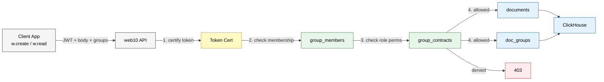
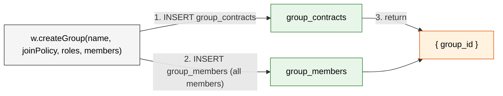
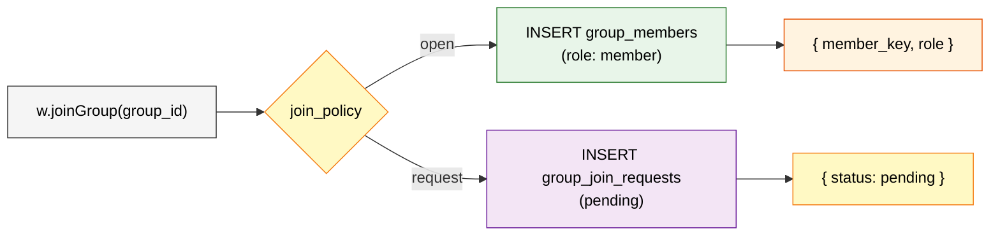
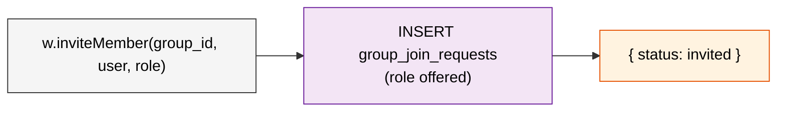
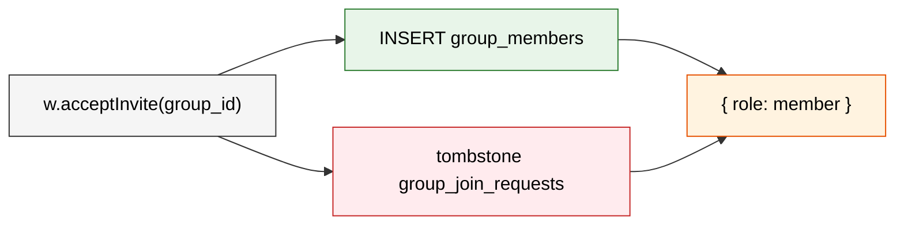
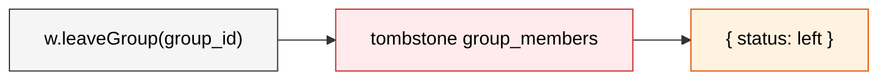
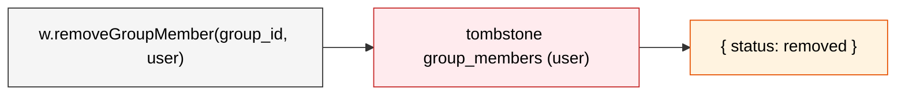

# web10 SDK v3

The JavaScript/TypeScript SDK. One client. Groups are baked into every verb.

## Request Flow

Every SDK call follows the same path: client → API → ClickHouse. Groups are not a separate surface — they are metadata on CRUD operations that the API validates before touching data.



Create inserts one row into `documents`, then one row per group into `doc_groups`. Read joins `documents` → `doc_groups` → `group_members` and filters by your membership. Update tombstones old rows, inserts new. Delete tombstones. All append-only. `ReplacingMergeTree` keeps the latest.

## Installation

```bash
npm install web10-npm
```

```ts
import { createV3Client } from 'web10-npm'
```

## Creating a Client

```ts
const w = createV3Client({ apiOrigin: 'https://api.web10.app' })
```

`apiOrigin` is the node's API host (defaults to `api.web10.app`). `token` pre-sets a token (server-side / pre-auth scenarios); `rtcServer` sets the RTC host (for `web10-npm/rtc`).

## Auth

Two ways in. **Direct login** (username + password → a token) and the **consent flow** (the auth popup, where the user signs in *and* grants the app's contracts).

```ts
// Direct login — returns a token
const { token } = await w.login('alice', 'password')

// The consent flow — open the auth UI, send the app's contract requests
// (ACR for app access, GCR for group ops), wait for the user's decision.
w.contractRequest(
  [{ kind: 'app', app_origin: 'https://myapp.com', permissions: { posts: ['readAll', 'create'] } }],
  'https://auth.web10.app',
  (resp) => {
    if (resp.status === 'approved') {
      const t = w.readToken()  // the signed-in token
      console.log(t.username, t.provider)
    }
  },
)

// Check state / read the token
w.isSignedIn()
const t = w.readToken()  // → { username, provider, site, target, expires } | null

// Logout
w.signOut()
```

`contractRequest` is the unified consent protocol (ACR + GCR, one flow): it opens the authenticator in a popup, sends all the contract requests, and the callback fires with `{ status: 'approved' | 'denied' | 'error', errors? }`. `login` is the direct path (no consent UI) — for apps that manage their own auth. `readToken` decodes the JWT locally (no network); `isSignedIn` checks for a live token. The browser IIFE (`window.web10`, the self-hosted `wapi.js`) additionally exposes `openAuthPortal` + `authListen` for the sign-in transition (D45: fires on a real transition; D42: a delivery for a different user is rejected).

## App Contracts

Services are infinite. `posts`, `playlists`, `comments`, `notes`, `reactions` — any app can invent new ones. They're just data labels in the `collection_name` column. No schema migration. No limit. ClickHouse handles any number of services with its sieve of joins.

Apps are the constraint. One contract per app. Per-service permissions. The user approves or denies in the authenticator.

```ts
// App declares what it needs (one call, all services)
await w.addAppContract('music.web10.com', {
  posts: ['readAll', 'create'],
  playlists: ['readAll', 'create', 'updateOwn', 'deleteOwn'],
  comments: ['readAll'],
})

// List active contracts
const contracts = await w.listAppContracts()
// → [{ allowed_origin: 'music.web10.com', permissions: { posts: [...], playlists: [...] } }]

// Revoke (one click per app)
await w.revokeAppContract('music.web10.com')
```

This is infrastructure trust — "what can this app do with my data?" Per-service, per-operation. Groups control who sees data. The contract is with the app, not the service.

## Access Health (verifyAccess)

The confirmatory access check. Instead of an app guessing from status codes (a `401` on this node means "bad token" **or** "no permission" **or** "user not found" — the information is destroyed at the boundary), the server runs the ACTUAL checks it would run on a real request and reports each as a stable code, plus the ordered recovery `actions` the client should execute. The app's `verifyAndRecover` (in `access.ts`) executes those actions — the client never reverse-engineers a status code. There is no "guard" — `verifyAccess` is the oracle (the node reports state), `verifyAndRecover` is the recovery (the app acts on it).

**Generic by design (D60).** It checks only *universal* legs — `token`, `user`, `contract`. It does **not** know about any app's groups (no "followers group" check). App-specific recovery (e.g. the social app healing its own followers group) is the **app's** job, client-side — the app is the one that knows what its groups are.

```ts
const verdict = await w.verifyAccess({ services: ['posts', 'profile'] })
// → {
//     status: 'ok' | 'degraded' | 'invalid' | 'inconclusive',
//     token:    'valid' | 'expired' | 'invalid' | 'missing',
//     user:     'exists' | 'not_found' | 'unknown',
//     contract: { state: 'granted' | 'partial' | 'missing' | 'unknown' | 'not_checked',
//                 missing_services: string[] },
//     actions:  ('reauth' | 'signout')[],
//     username: string | null,
//     provider: string | null,
//   }
```

Read-only and idempotent — safe to call at mount and after any failure. The app declares the `services` it needs (the signal is platform-level, the policy is per-app); omit them for a health probe.

### The load-bearing rule: definite NO vs. UNKNOWN

Every store-backed field separates a **decisive** answer (the check ran clean and found nothing) from **`unknown`** (the check couldn't run — the store was unreadable). Only decisive negatives drive `actions`; `unknown` never does. A failed health *check* must not be handled like a failed health *answer*: a deploy window that takes the contract store down yields `contract: unknown` + `status: inconclusive` + `actions: []` — **not** `contract: missing`. That is what keeps a transient blip from churning every user into a re-auth loop.

### `status` (precedence: invalid > degraded > inconclusive > ok)

| status | means |
|---|---|
| `invalid` | the session itself is dead — `token` is `expired`/`invalid`/`missing`, or `user` is `not_found` |
| `degraded` | session alive but can't do work — `contract` is `missing`/`partial` |
| `inconclusive` | a check couldn't run (some field `unknown`) and nothing is decisively wrong — take no action, retry later |
| `ok` | every check decisive + healthy |

### `actions` (ordered, decisive problems only)

| action | when | what the client does |
|---|---|---|
| `reauth` | `token` dead, or `contract` `missing`/`partial` | re-derive the session through the rooted authenticator (fresh token + contract). Near-silent when the authenticator already has the root session; degrades to a login otherwise. **Replace-on-arrival** — the handed-back token overwrites the stale cookie; never clear-then-restore (a blocked popup must not strand the user signed-out) |
| `signout` | `user` `not_found` | terminal — a deleted account can't be re-authed. Clear the session, show login. The only action that is a true sign-out |

App-specific recovery (e.g. the social app re-creating/joining its followers group) is **not** an oracle action — the app does it client-side in its own `verifyAndRecover`, after `reauth` if needed. The oracle stays generic (D60).

### What it is not

- Not a new auth system — it reuses `jwt.decode`, the users lookup, and the app-contract check. All the logic exists; this stops throwing it away.
- Not app-specific — it never inspects an app's groups. A messaging app, a notes app, and the social app all get the same generic verdict (token + user + contract); each app layers its own group recovery on top.
- Not a substitute for the reactive path — a verdict is a snapshot; state can change before the next real operation. The reactive path carries its own typed reason (see `Web10Error.code`), so you never fall back to status-code guessing there either.

## CRUD With Groups

The four verbs. Groups change everything.

### Create

The document body is typed content. Groups are metadata — a separate part of the request the API validates. The API checks membership and role permissions before attaching.

```ts
const doc = await w.create('posts', {
  // Typed document body — leaf-level types
  text: { type: 'text', value: 'just shipped the new groups feature' },
  media: [{ type: 'minio', value: 'jacoby149/media/img-abc.jpg' }],
}, {
  // Metadata — API validates membership + permissions
  groups: [
    '{provider}/groups/web10/discover',
    'web10.app/groups/jacoby149/followers',
  ],
})
```

The API checks each group:
1. Is the user a member?
2. Does their role grant `create` on that service?

If a check fails, the attachment is rejected. The document still creates — just not attached to that group.

No groups = private. Only the author sees it.

Multiple groups = union of members. Anyone in either group with the right role can read it.

Behind the scenes the API inserts one row into `documents`, then one row per group into `doc_groups`. One transaction. No fan-out.

### Read

Every read is group-filtered. You see a document because you're a member of a group it's attached to — even your own posts. The read opts are `{ groups, limit?, offset?, ref? }` — `groups` is required; `limit`/`offset` paginate; `ref` filters to docs whose `ref_value` matches (the engagement shape).

**Personal read** — `me` is a reserved group that returns your own documents, regardless of group attachment:

```ts
const myPosts = await w.read('posts', { groups: ['me'], limit: 50 })
```

The API knows `me` means "documents where `author_key = :user`". No group join. Same query shape. Consistent.

**Group-filtered read** — the discover query. Pass groups, get documents attached to those groups:

```ts
const posts = await w.read('posts', {
  groups: ['{provider}/groups/web10/discover'],
  limit: 50,
})
```

The API translates `groups` into a join against `doc_groups` → `group_members`. You get documents where the group matches and you're a member. Blacklists are checked automatically.

**Feed pattern** — read across multiple groups (union):

```ts
const posts = await w.read('posts', {
  groups: [
    '{provider}/groups/web10/discover',
    'web10.app/groups/alice/followers',
    'web10.app/groups/charlie/st-louis-chess-club',
  ],
  limit: 50,
  offset: 0,
})
```

**The ref filter** — return only the docs whose `ref_value` matches (a single `doc_id` or a list). This is how you read a post's comments/reactions without pulling the whole service:

```ts
const comments = await w.read('comments', {
  groups: ['{provider}/groups/web10/discover'],
  ref: postDocId,
})
```

**Sorting / filtering** — the read returns docs in the node's default order (newest first); there's no client-side `$sort`/`$match`. For custom sorting, filtering, aggregation, or cross-service joins, use the **flexible read** (`w.query`, below) — a ClickHouse `SELECT` over your services, scoped to your groups.

**Engagement counts** — `readRefCounts` returns `{ ref_value: count }` for a set of posts (the server runs `GROUP BY ref_value` through the safe-query engine — exact, no cap):

```ts
const counts = await w.readRefCounts('reactions', {
  groups: ['{provider}/groups/web10/discover'],
  ref: [postDocId1, postDocId2],
})  // → { [postDocId1]: 12, [postDocId2]: 7 }
```

### Update

Body changes in the second arg. Group changes in the options:

```ts
await w.update('doc-123', {
  text: { type: 'text', value: 'updated content' },
}, {
  groups: ['{provider}/groups/web10/discover'],
})
```

`groups` replaces the group attachment list. The API validates membership on each. Remove a group → the document disappears from that group's discover. Add a group → it appears.

### Delete

Tombstone. Insert a deleted marker. The document disappears from all groups:

```ts
await w.delete('doc-123')
```

The API tombstones the `documents` row and all `doc_groups` rows. Background job compacts on schedule.

## Group Operations

Groups are first-class. The SDK exposes them directly.

### Create Group



### Join Group



### Invite Member



### Accept Invite



### Leave Group



### Remove Member



### Create a Group

Explicit roles. Explicit members. The API doesn't assume anything — you assign every role, including yourself. Roles use the **D58 per-service permission map**: each role is `{ name, permissions }` where `permissions` maps a service (or the `group` structural key) to the ops granted.

```ts
const group = await w.createGroup(
  'St. Louis Chess Club',
  'invite_only',
  [
    {
      name: 'admin',
      permissions: {
        posts: ['readAll', 'create', 'updateOwn', 'deleteOwn', 'hideAll'],
        comments: ['readAll', 'create', 'updateOwn', 'deleteOwn'],
        group: ['manageRoles', 'assignRoles', 'revokeRoles', 'deleteGroup', 'modifyJoinPolicy'],
      },
    },
    {
      name: 'member',
      permissions: {
        posts: ['readAll', 'create', 'updateOwn', 'deleteOwn'],
        comments: ['readAll', 'create'],
      },
    },
  ],
  [{ member_key: 'jacoby149', role: 'admin' }],
)
// → { group_id: 'web10.app/groups/jacoby149/st-louis-chess-club' }
```

The `members` array is required. **The creator automatically receives a role with all five group management permissions** (`manageRoles`, `assignRoles`, `revokeRoles`, `deleteGroup`, `modifyJoinPolicy`). You cannot create a group you can't fully manage — the API adds these permissions to the creator's role regardless of what the role definition lists.

Group management permissions are separate from content permissions:

| Permission | What it does |
|---|---|
| `manageRoles` | Add, rename, or remove role definitions |
| `assignRoles` | Add members or promote existing members |
| `revokeRoles` | Remove members or demote roles |
| `deleteGroup` | Delete the group (tombstone) |
| `modifyJoinPolicy` | Change open/request/invite_only |

### Get Groups

```ts
// All groups the user belongs to
const groups = await w.getMyGroups()
// → [
//    { group_id: '{provider}/groups/web10/discover', join_policy: 'open', member_count: 1200000, my_role: null },
//    { group_id: 'web10.app/groups/jacoby149/followers', join_policy: 'open', member_count: 342, my_role: 'admin' },
//  ]

// Groups where you manage membership
const managed = await w.getGroupsManages()
```

### Join a Group

```ts
// Open policy — instant
const joined = await w.joinGroup('web10.app/groups/alice/followers')
// → { group_id: 'web10.app/groups/alice/followers', member_key: 'jacoby149', role: 'member' }

// Request policy — pending until owner approves
const pending = await w.requestJoin('web10.app/groups/alice/followers')
// → { group_id: 'web10.app/groups/alice/followers', status: 'pending' }
```

### Leave a Group

```ts
await w.leaveGroup('web10.app/groups/alice/followers')
// → { group_id: 'web10.app/groups/alice/followers', member_key: 'jacoby149', status: 'left' }
```

### Invite a Member

Sends an invite. The target user receives it with the role offered. They can accept or decline.

```ts
await w.inviteMember('web10.app/groups/jacoby149/close-friends', 'bob', 'member')
// → Bob receives an invite
// → Bob accepts → added to group_members
// → Bob declines → invite expires, not added
```

### Accept / Decline Invite

```ts
const result = await w.acceptInvite('web10.app/groups/jacoby149/close-friends')
// → { group_id: 'web10.app/groups/jacoby149/close-friends', role: 'member' }

await w.declineInvite('web10.app/groups/jacoby149/close-friends')
// → { group_id: 'web10.app/groups/jacoby149/close-friends', status: 'declined' }
```

### Remove Member

Direct remove. Only works if your role has `revokeRoles`.

```ts
await w.removeGroupMember('web10.app/groups/jacoby149/close-friends', 'bob')
// → { group_id: 'web10.app/groups/jacoby149/close-friends', member_key: 'bob', ... }
```

### Get Members

```ts
const members = await w.getGroupMembers('web10.app/groups/jacoby149/followers')
// → [{ member_key: 'alice', role: 'admin' },
//    { member_key: 'bob', role: 'member' },
//    { member_key: 'charlie', role: 'member' }]
```

### Update Group

```ts
const updated = await w.updateGroup('web10.app/groups/jacoby149/close-friends', {
  join_policy: 'request',
})
```

## Query — the flexible read (v3)

Write a ClickHouse `SELECT` over your services and the node runs it. Read-only by construction: the safe-query engine rejects anything but a single `SELECT`, raw node tables, and table functions before anything executes. Every service name is replaced by an API-built **boundary CTE** filtered to the groups you can read that service in — so aggregations, self-joins, subqueries, and your own CTEs all work, and none can leak past your groups (the raw tables are unreachable, a wall not a membrane).

Each service CTE exposes: `doc_id`, `author_key`, `body` (a JSON string — use `JSONExtractString(body, 'field', 'value')` for fields), `ref_value`, `tags`, `created_at`, `updated_at`.

Works without a token (anon reads the public board) — the same rule as `read`. An unbounded query gets `LIMIT 1000` appended server-side; a `LIMIT` you write is honored as-is. A caller-SQL failure (a column the CTE doesn't expose, a bad function arg) is a **400**; an unsafe query (non-SELECT, raw table, table function) is a **403**.

```ts
// Trending posts — cross-service self-join + aggregation
const { rows, count } = await w.query(`
  SELECT p.doc_id, p.author_key, count() AS reactions
  FROM posts p
  JOIN reactions r ON r.ref_value = p.doc_id
  GROUP BY p.doc_id, p.author_key
  ORDER BY reactions DESC
  LIMIT 20
`)

// Reaction breakdown by type — JSON body fields
const { rows } = await w.query(`
  SELECT JSONExtractString(body, 'reaction_type', 'value') AS type, count() AS n
  FROM reactions
  WHERE ref_value = '${postDocId}'
  GROUP BY type
`)

// Your own CTEs + subqueries
const { rows } = await w.query(`
  WITH hot AS (
    SELECT ref_value, count() AS n FROM reactions GROUP BY ref_value HAVING n > 10
  )
  SELECT p.doc_id, p.body FROM posts p
  WHERE p.doc_id IN (SELECT ref_value FROM hot)
  ORDER BY p.created_at DESC
`)
```

`rows` is keyed by the query's column names (a `body` column comes back parsed, datetimes ISO-8601 UTC); `count` is the number of rows. Scope the read to specific groups with `w.query(sql, { groups: [...] })` (default: all the reader's groups). Spec'd in `query-engine.md` + `safe-query.md`.

## Media

Three-step upload: request a presigned URL, upload to object storage, confirm.

```ts
// 1. Request a presigned upload URL
const presigned = await w.requestMediaUploadUrl({
  filename: 'photo.jpg',
  mimeType: 'image/jpeg',
  sizeBytes: file.size,
})
// → { upload_url, fields, object_key, content_type }

// 2. POST the file (FormData) to presigned.upload_url
const formData = new FormData()
for (const [k, v] of Object.entries(presigned.fields || {})) formData.append(k, v)
formData.append('file', file, 'photo.jpg')
await fetch(presigned.upload_url, { method: 'POST', body: formData })

// 3. Confirm — store the reference (the object key), not a URL. Returns a doc.
const record = await w.confirmMediaUpload({
  object_key: presigned.object_key,
  filename: 'photo.jpg',
  mime_type: 'image/jpeg',
})

// Read URL (presigned GET — the doc stores the object key, not a live URL)
const { read_url } = await w.getMediaReadUrl(record.body.object_key)

// List / delete your media
const media = await w.listMedia({ limit: 50 })
await w.deleteMedia(record.doc_id)
```

## Account

```ts
// Signup (positional)
await w.signup('alice', 'secret', '+1234567890', 'alice@example.com')

// Direct login (returns a token)
const { token } = await w.login('alice', 'password')

// Change password
await w.changePassword('old', 'new')

// Change phone / set email
await w.changePhone('+1987654321')
await w.setEmail('alice@example.com')

// Send a verification code, then verify
await w.sendCode()
await w.verifyPhone('123456')
await w.verifyEmail('654321')

// Set recovery phone (authenticated)
await w.setRecoveryPhone('+1987654321')

// Profile
const profile = await w.getProfile()
```

The contact-anchored recovery flow (D61) is separate from these account methods: the unauthenticated `/v3/recovery/{request,verify,complete}` endpoints (enter contact → code → pick an account) are the front door; the SDK's `sendCode`/`verifyPhone`/`verifyEmail`/`setRecoveryPhone` manage the contact on an authenticated account.

## App Store

```ts
// Register an app (anonymous — the app identifies itself by url)
await w.registerApp({
  url: 'https://myapp.com',
  name: 'My App',
  description: 'A web10 app',
  icon_url: 'https://myapp.com/icon.png',
})

// List approved apps
const apps = await w.getApps()

// Rate an app (1-5 stars, positional)
await w.rateApp('https://myapp.com', 5)

// Read ratings
const ratings = await w.getAppRatings('https://myapp.com')
```

## What ClickHouse Happens

Each SDK call triggers specific ClickHouse operations:

| SDK call | ClickHouse |
|---|---|
| `w.create('posts', body, { groups })` | `INSERT INTO documents` + `INSERT INTO doc_groups` (N rows) |
| `w.read('posts', { groups: ['me'] })` | `SELECT group_ids FROM group_members WHERE member = :user`, then discover query |
| `w.read('posts', { groups })` | `SELECT FROM documents JOIN doc_groups JOIN group_members WHERE member = :user AND group IN (...)` |
| `w.query(sql)` | the safe-query engine compiles to boundary-CTE SQL, run with `max_execution_time` |
| `w.update(docId, body, { groups })` | `INSERT INTO documents` (new version) + tombstone old `doc_groups` + new `doc_groups` |
| `w.delete(docId)` | `INSERT INTO documents` (tombstone) + tombstone `doc_groups` |
| `w.createGroup(...)` | `INSERT INTO group_contracts` + `INSERT INTO group_members` (all members) |
| `w.joinGroup(...)` | `INSERT INTO group_members` (open) or `INSERT INTO group_join_requests` (request) |
| `w.inviteMember(...)` | `INSERT INTO group_join_requests` |
| `w.acceptInvite(...)` | `INSERT INTO group_members` |
| `w.getMyGroups()` | `SELECT group_id, join_policy, member_count, my_role FROM group_contracts JOIN group_members WHERE member_key = :user` |
| `w.getGroupMembers(...)` | `SELECT member_key, role FROM group_members WHERE group_id = :group` |

Everything is append-only. Updates are new inserts. Deletes are tombstones. `ReplacingMergeTree` keeps the latest version. Background job compacts on schedule.

## Cross-Node Addressing (v4)

Optional `username` and `provider` on CRUD calls is a v4 feature. See `../../web10-v4/sdk/advanced.md`.

## Summary

v3 SDK vs v2 SDK:

| v2 | v3 |
|---|---|
| `create(service, body)` — no groups | `create(service, body, { groups: [...] })` — groups required for visibility |
| `read(service, query)` — raw collection | `read(service, { groups: [...] })` — always group-filtered. `['me']` for your own data. Plus `w.query(sql)` for the flexible read. |
| `update(service, query, update)` — no groups | `update(docId, body, { groups })` — group changes |
| SMR contracts control data access | App contracts are per-app with per-service permissions. `contractRequest` is the consent protocol. Groups control data access. |
| Separate follow/friend APIs | Follow = join group. Friends = group membership. |
| `discoverable` boolean | No boolean. Groups handle it. `web10/discover` = public board. |

Groups are not a separate API surface. They are baked into the verbs. Create carries groups. Read filters by groups. Update changes groups. The SDK doesn't have a "groups API" — it has CRUD that understands groups.