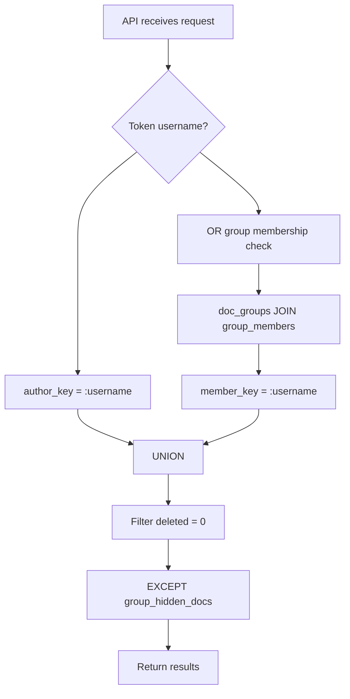
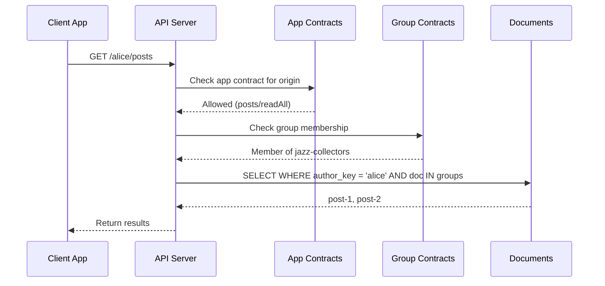

# Security Model

web10 nodes hold people's data and creators' money. The security model is defined as five invariants. Every architectural decision is judged against them.

## The Invariants

Five guarantees that must hold every phase. The conformance/permission test suite enforces them mechanically.

| Invariant | Guarantee |
|---|---|
| **I1** | A provider verifies any token's issuer cryptographically, without trusting the token's own claims. |
| **I2** | Authorization decisions use only verified token data — never an unsigned decode. |
| **I3** | No query returns documents for an `author_key` the token doesn't own, unless group membership grants access. |
| **I4** | Private content is unreadable by the node operator (end-to-end encryption). |
| **I5** | Every actor (app, agent, LLM) acts under a scoped, expiring, revocable token enforced by app contracts. |

**Known gap:** I1 is partially broken — symmetric HS256 signing means providers can't verify each other's tokens. The fix (RS256/EdDSA + JWKS, D7) is in flight. Do not add code that deepens the HS256 assumption.

## How ClickHouse Enforces I3

v3 uses a single `documents` table. There is no per-user collection to isolate access. The enforcement is query-level:

```
Every read query must:
  1. Filter by author_key = token.username (own documents), OR
  2. Traverse through doc_groups + group_members (group-discovered documents)
```

There is no sandboxed aggregation pipeline (v2). There is no cross-collection stage (v2). The ClickHouse queries are constructed by the API layer — they always include the `author_key` or group membership filter.



## Two-Contract Access Model

v3 has two contract types that enforce completely different concerns. Both must pass for a request to succeed.



**App contract** — Infrastructure trust. "What can this app do with my data?"
- One contract per origin
- Per-service permissions: `readAll`, `create`, `updateOwn`, `deleteOwn`
- CORS-enforced in the browser
- Server-enforced on every API call
- Stored in `app_contracts` table

**Group contract** — Social access. "Who gets to see this content?"
- Roles define permissions scoped to services
- Membership defines who is in the group
- Content is attached to groups via `doc_groups`
- Read queries filter through group membership
- Stored in `group_contracts` + `group_members` tables

## Token Security

JWT tokens carry `username`, `site`, `target`, `provider`, `expires`. The SDK stores them in a `SameSite=Lax`, `Secure` cookie (60-day max age).

Server-side verification:
- `decode_token` verifies the JWT signature before extracting claims
- Token username is used to scope all queries
- Token expiry is checked on every request

Client-side:
- `postMessage` tokens are only accepted from the configured `authOrigin`
- Tokens are posted only to the referrer origin, never to `'*'`
- No token in URL — cookie and request body only

## Blocking and Sharing

Two levels of user-controlled blocking:

**User-wide blacklist** — block someone entirely. They can't see any of your content, anywhere. Stored in `user_blacklist`.

**Per-group blacklist** — block someone from seeing your content in a specific group. They're still a member. They still see everyone else's content. Just not yours. Stored in `group_blacklist`.

**Sharing toggle** — per-user, per-group. "Pause sharing without leaving." You stay a member. You still see their content. They can't see yours. Stored in `user_group_sharing`.

## E2E Encryption (I4 — future)

Planned but not implemented. The model: phone is the keychain (secure enclave). Node stores ciphertext. Two modes — wrapped-key (keys wrapped to each friend's pubkey, friends decrypt without your phone online) and live-handout (key handed out P2P per read). Key backup is passphrase-wrapped and escrowed with a party separate from the node (trust splitting).

## Federation (I1 — in flight)

The federation signing weakness is being fixed: HS256 → RS256/EdDSA + JWKS. Asymmetric signing, per-node keypair, public keys published at a well-known JWKS URL, offline verification. Dual-verify during migration, then drop HS256.

## See Also

- `../encryption/auth.md` — auth flow, token structure, ACR
- `../db/clickhouse.md` — schema: documents, doc_groups, group_contracts, group_members, app_contracts
- `../groups/overview.md` — group contracts, roles, join policies
- `../sdk/contracts.md` — app contracts, group contracts, blacklists
- `../sdk/implementation.md` — SQL behind every SDK call (author_key + group membership filters)
