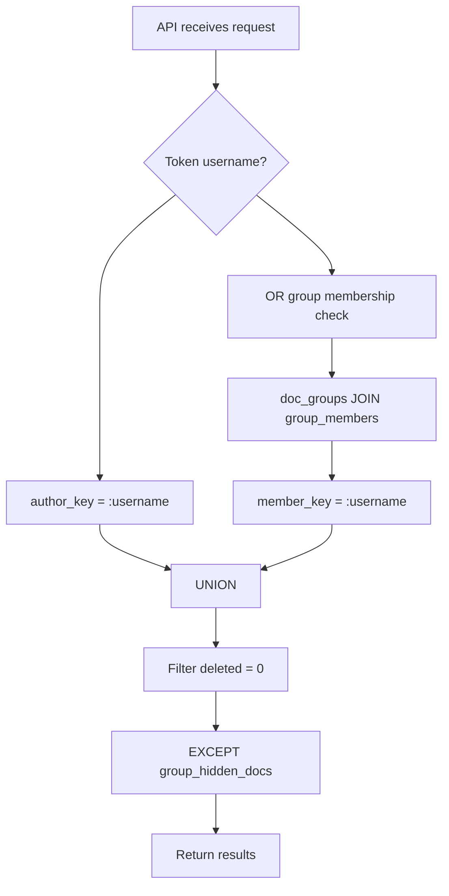
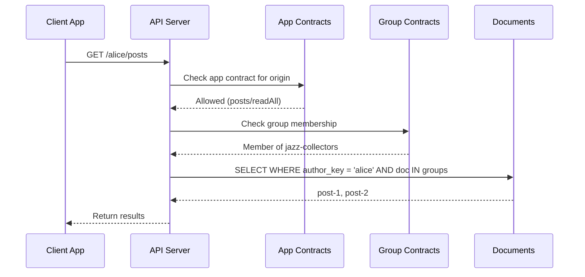

# Security Model

web10 nodes hold people's data and creators' money. The security model is defined as six invariants. Every architectural decision is judged against them.

## Implementation Map

This page states the guarantees and their qualifications. For implementation
details and the October repair record, read:

- [credentials.md](credentials.md): password/session custody, popup trust,
  cookie/runtime/vault storage, recipient trust, logout, and diagnostic risks.
- [rtc-admission.md](rtc-admission.md): exact one-use ticket exchange,
  pre-upgrade enforcement, reconnect, resource limits, and deployment/scale.
- [logging.md](logging.md): credential fields/echo redaction, response
  preservation, pathological-body handling, and the limits of the sanitizer.
- [audit-runbook.md](audit-runbook.md): negative-test matrix, executable
  commands, receipt scope, and separately approved historical-exposure work.
- [hardening-2026-10.md](hardening-2026-10.md): findings, repairs, current
  evidence, unresolved boundaries, and rollout requirements for this cohort.

An invariant is the target, not proof of universal enforcement. The known
issuer gap and the shared-helper custom-expiry gap below remain open.

## The Invariants

Six guarantees that must hold every phase. The conformance/permission suites
exercise covered paths; they do not replace a caller audit or prove the absence
of the known enforcement gaps recorded below.

| Invariant | Guarantee |
|---|---|
| **I1** | A provider verifies any token's issuer cryptographically, without trusting the token's own claims. |
| **I2** | Authorization decisions use only verified token data — never an unsigned decode. |
| **I3** | No query returns documents for an `author_key` the token doesn't own, unless group membership grants access. |
| **I4** | The node is a readable, accountable broker: content is node-readable by design (discovery, search, auditability). Operator-blindness is explicitly **not** a goal (D41). Access is controlled by terms (I3); the operator is legally liable for hosted data. |
| **I5** | Every actor (app, agent, LLM) acts under a scoped, expiring, revocable token enforced by app contracts. |
| **I6** | The cross-node boundary is the HTTP API + a verified token. No node ever queries another node's ClickHouse; remote data is content, never control (never query input, never a key into the local store, never a grant). |

**Known gap:** I1 is partially broken — symmetric HS256 signing means providers can't verify each other's tokens. The fix (RS256/EdDSA + JWKS, D7) is in flight. Do not add code that deepens the HS256 assumption.

**I6 (federation, D84):** the multi-node read model is **client-side fan-out** — the user's client queries each node and merges; a node never proxies another's data. The cross-node boundary is the HTTP API with a JWKS-verified token (I1), **never** a cross-ClickHouse query (`remote()`/`cluster()` are for trusted clusters and are rejected for federation). The feed merge is a result-set *union* of independently I3-authorized reads, so a foreign node's data can't steer what the local node queries — a data reference is not a grant (the same property that stops a local user reading other posts). Full model + the "mine Node A from Node B" walk-through: `knowledge/strategy/multi-node.md`.

## How ClickHouse Enforces I3

v3 uses a single `documents` table. There is no per-user collection to isolate access. The enforcement is query-level:

```
Every read query must:
  1. Filter by author_key = token.username (own documents), OR
  2. Traverse through doc_groups + group_members (group-discovered documents)
```

There is no sandboxed aggregation pipeline (v2). There is no cross-collection stage (v2). The ClickHouse queries are constructed by the API layer — they always include the `author_key` or group membership filter.

**The membership check includes the reserved principal-class rows (D58).** A reader reads a group's documents if they're a literal member (`member_key = reader`) **OR** the group carries the `anyone` grant (always — the public class) **OR** the `authenticated` grant (real users only). This is why the public (discover) board is anon-readable: the discover group's public member is the `anyone` class (the legacy `anon` row was renamed), not a literal `anon` membership. Every read path — the group read, the **read-by-id** (`read_document_by_id`, the watch page's post read), the people directory — applies this same principal-class gate. A read path that checks only literal membership (`member_key = reader`) silently 404s for anon on public groups (the watch-page bug, 3.172.1).


```mermaid
flowchart TD
    A["API receives request"] --> B{"Token username?"}
    B --> C["author_key = :username"]
    B --> D["OR group membership check"]
    D --> E["doc_groups JOIN group_members"]
    E --> F["member_key = :username"]
    C --> G["UNION"]
    F --> G
    G --> H["Filter deleted = 0"]
    H --> I["EXCEPT group_hidden_docs"]
    I --> J["Return results"]
```

## Two-Contract Access Model

v3 has two contract types that enforce completely different concerns. Both must pass for a request to succeed.


```mermaid
sequenceDiagram
    participant App as Client App
    participant API as API Server
    participant AC as App Contracts
    participant GC as Group Contracts
    participant D as Documents

    App->>API: GET /alice/posts
    API->>AC: Check app contract for origin
    AC-->>API: Allowed (posts/readAll)
    API->>GC: Check group membership
    GC-->>API: Member of jazz-collectors
    API->>D: SELECT WHERE author_key = 'alice' AND doc IN groups
    D-->>API: post-1, post-2
    API-->>App: Return results
```

**App contract** — Infrastructure trust. "What can this app do with my data?"
- One contract per origin
- Per-service permissions: `readAll`, `create`, `updateOwn`, `deleteOwn`
- CORS-enforced in the browser
- Server-enforced on every API call
- Stored in `app_contracts` table

**Group contract** — Social access. "Who gets to see this content?"
- Roles define permissions scoped to services
- Membership defines who is in the group
- Content is attached to groups via `doc_groups`
- Read queries filter through group membership
- Stored in `group_contracts` + `group_members` tables

## Token Security

JWT tokens carry `username`, `site`, `target`, `provider`, `expires`. The SDK stores them in a `SameSite=Lax`, `Secure` cookie (60-day max age).

Server-side verification:
- `decode_token(..., private_key=True)` verifies the JWT signature before extracting claims; its default unsigned decode is metadata-only, never authority
- Token username is used to scope all queries
- `certify` checks the local provider and custom `expires` claim; RTC authorization and the repaired group-detail path explicitly use it

**Known I5 enforcement gap:** `v3/endpoints/auth_helper.py` `user` and
`user_or_anon` call verified decode but do not themselves check custom
`expires` or provider. PyJWT's standard `exp` validation does not enforce a
field named `expires`. A local synthetic session with `expires` in 2000 was
still returned as a principal by `user_or_anon`. This repair does not establish
expiry enforcement on every other caller; shared-helper repair and a caller
audit remain urgent follow-ups. See the current hardening receipt.

Client-side:
- `postMessage` tokens, readiness, and consent responses require both the configured `authOrigin` and the actual SDK-opened popup window. Without an active popup, token handoff fails closed.
- Tokens are posted only to the referrer origin, never to `'*'`
- No session token in URL - cookie and request body only. RTC URLs carry only single-use signaling admission tickets.

**RTC admission (06.10.2026):** the SDK exchanges its session JWT in a POST
body to the configured RTC host's `/ticket`. RTC calls only its configured
trusted API's `/rtc/authorize` (never an unsigned provider's URL), which
verifies the session and derives the peer ID. RTC issues a cryptographically
random opaque ticket, bound to that ID, valid for 30 seconds and consumed
atomically before the WebSocket upgrade. Tickets cannot authenticate API
requests. They grant one signaling admission, not data access; established
sockets are not terminated when the admission window expires. Invalid,
expired, wrong-ID, or replayed tickets never reach PeerJS. Ticket state is
bounded and local to the RTC process: restart revokes all tickets; a replicated
deployment requires instance affinity or a shared atomic ticket store. SDK
reconnects exchange a fresh ticket, never reusing the URL credential. Production
requires HTTPS/WSS; insecure signaling is allowed only on localhost.

**Group-detail transport:** the social app uses SDK `getGroupDetail`, which
POSTs `{group_id, token?}`. GET remains anonymous; either method rejects a
`token` query parameter. Invalid present body credentials are rejected, not
downgraded to anonymous. Both methods share the existing detail read and do not
change membership/listing semantics; see [../groups/detail.md](../groups/detail.md).

HTTP SDK requests reject redirects and
omit ambient cookies so a 307/308 cannot replay credential-bearing bodies.
The JavaScript-readable token cookie is not an XSS boundary: all same-page
scripts, including telemetry vendors, remain trusted with the session.

API request logging recursively redacts credential fields and their echoed
values from request/response bodies, validation inputs, errors, and metadata
before truncation. Non-JSON bodies are omitted from logs. Response bytes are
unchanged. This prevents new credential logs; it does not erase historical
records or revoke credentials already exposed.

## Blocking and Sharing

Two levels of user-controlled blocking:

**User-wide blacklist** — block someone entirely. They can't see any of your content, anywhere. Stored in `user_blacklist`.

**Per-group blacklist** — block someone from seeing your content in a specific group. They're still a member. They still see everyone else's content. Just not yours. Stored in `group_blacklist`.

**Sharing toggle** — per-user, per-group. "Pause sharing without leaving." You stay a member. You still see their content. They can't see yours. Stored in `user_group_sharing`.

## No E2E by design (D41)

web10 is a data-policy platform, not a privacy platform (D41, `thesis.md`). The
node is readable by design — discovery, search, and auditability all require it,
and "discoverable" and "hidden from the node" are mutually exclusive. Access is
controlled by the terms/permission model (I3), not by cryptography; trust in the
operator is legal (they can be sued), not cryptographic.

E2E is not banned — it is not the default and not our product. A user or third
party may build their own e2e layer on the SDK + WebRTC. If a real creator asks
for operator-blind DMs, that becomes an opt-in tier, never the default. The
former e2e design (phone-as-keychain, wrapped keys, CP-ABE, MLS) was reversed in
D41; the mobile encryptor app is deleted.

## Federation (I1 — in flight)

The federation signing weakness is being fixed: HS256 → RS256/EdDSA + JWKS. Asymmetric signing, per-node keypair, public keys published at a well-known JWKS URL, offline verification. Dual-verify during migration, then drop HS256.

## See Also

- `../auth/auth.md` — auth flow, token structure, ACR
- `../db/clickhouse.md` — schema: documents, doc_groups, group_contracts, group_members, app_contracts
- `../groups/overview.md` — group contracts, roles, join policies
- `../sdk/contracts.md` — app contracts, group contracts, blacklists
- `../sdk/implementation.md` — SQL behind every SDK call (author_key + group membership filters)
