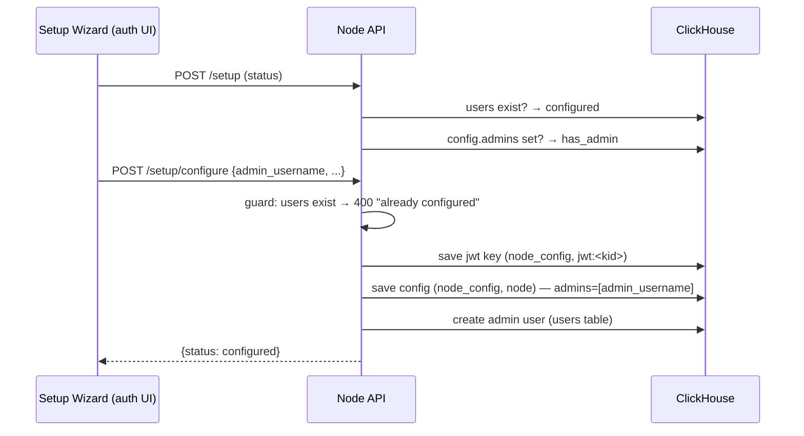

# Node Config & Setup

The node's operator configuration: who the admins are, the provider
identity, and the setup state. It lives in ClickHouse — the
`node_config` table (D48). One store, like everything else in v3.

## What's in the config

The node config is a single JSON document (`config_id='node'`):

| Field | Meaning |
|---|---|
| `admins` | Usernames allowed to read/write node config (the admin panel gate) |
| `provider` | The node's API identity (baked into tokens) |
| `private_key`, `algorithm` | JWT signing (v3 auth uses the `settings.PRIVATE_KEY` default; the saved key is the v2 carry-over) |
| `beta_required`, `verify_required`, `pay_required` | Signup gates |
| `cors_service_managers` | Hosts allowed to mint tokens (the authenticators) |
| `s3_*`, `db_*`, `twilio_*` | Integration credentials |

The JWT key records live alongside, at `config_id='jwt:<kid>'`.

## Admin-ness: the config list, unioned with the baseline

Being an admin is **not** a user attribute — the v3 `users` table has no
admin flag. Admin-ness is node-global operator config:

```
is_admin(username) = username ∈ (DEFAULT_ADMINS ∪ config.admins)
```

- **`settings.DEFAULT_ADMINS`** (env-overridable, default
  `["jacoby149"]`) is the **baseline** — always included, even before
  setup saves a list. This is the lockout-proof: a fresh node is
  operable from the first boot.
- **`config.admins`** is set by `/setup/configure` (the wizard's admin
  account) and takes the union from there on.
- Owning your own collection is NOT admin — on a shared node any user
  owns a collection, and that must not unlock Stripe keys and CORS.

`check_admin` (the API gate for every admin endpoint) enforces exactly
this: token verified → `provider` matches → username in the union.

## The setup flow



- **`POST /setup`** — status only: `configured` = the users table has
  rows; `has_admin` = the config has an admins list. Both ClickHouse.
- **`POST /setup/configure`** — first-run only (the guard is the users
  table, so a node with any user is "already in use"). Saves the JWT key
  + config (ClickHouse) and creates the admin as a **ClickHouse user** —
  the only store `/v3/login` reads, so the wizard's admin can actually
  log in.
- **`POST /config`** / **`POST /config/update`** — admin-gated read /
  partial update. The read returns the **effective config**: `settings.py`
  (env-overridden — what the node actually runs) overlaid with the saved
  `node_config`, so a fresh node's admin panel shows its live values
  (provider, ClickHouse URL, MinIO) instead of blanks. Only
  `private_key` is stripped — the panel is the operator's own surface, and
  its job is to show what the node runs.

## The admin panel gate

The auth UI shows the **Node Config** nav item only for admins. The check
is `POST /am_admin` — any authenticated user asks whether *they* are an
admin; the response is `{admin: bool}` and the endpoint **never errors**
(a config-read failure returns `false`, never a 500). That contract is
what the panel depends on: the check must degrade to "not admin", never
to an error that hides the panel (the bug D48 fixes).

## What this is not

- **Not user permissions.** Admin = node operator (config, billing,
  CORS). Per-user access is the group/contract model
  (`../security/overview.md`).
- **Not per-collection config.** There is one config per node.
