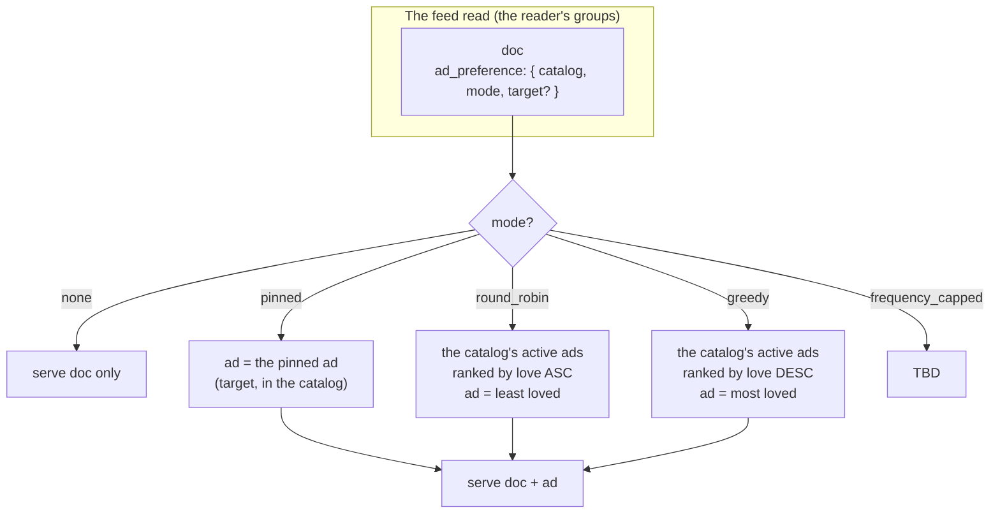

# Ad Dissemination: The Ad Preference on the Document

> **Design under discussion** (converging, 27.08.2026). This doc captures how a
> document's ad gets chosen — and it has converged on a concrete shape. It is
> **not** a locked decision; the serious questions at the bottom are open. The
> open `curateAds` PR (the client-side SDK helper, 3.26.0) is largely
> superseded by this. Read `ads.md` (the ad object, D55) and `ads-catalog.md`
> (the catalog + composer) first.

## The Design

**Every document has an `ad_preference`.** It says which **catalog** to curate
from, a **mode** (a `signal` × `strategy` pair, expandable), a **scope**, and a
target (for `pinned`):

```
ad_preference: {
  catalog: <catalog>,                // which catalog to curate from
  mode: { signal, strategy },        // the curation (see below)
  scope: global | per_viewer,        // same ad for all, or hash the viewer in
  target?: <ad doc_id>               // for pinned: the specific ad
}
```

**A user has multiple ad catalogs** — the Spotify-playlist model. The master
list is all their ads (their `posts` tagged `ad`, D55). They organize ads into
named **catalogs** (playlists); an ad can be in several catalogs at once (a
song in multiple playlists). A doc points at one catalog + a mode.

**The mode is two independent, expandable dimensions** — "reaction round
robin," "comment round robin," you name it:

- **`signal`** (what "love" is) — `reactions` | `comments` | `composite` (the
  feed's power-mean score) | … you name it. The engagement the pick is ordered
  by.
- **`strategy`** (how to pick from the catalog):
  - `round_robin` — the **least**-loved active ad (equalize exposure; new /
    underperforming ads get a shot)
  - `greedy` — the **most**-loved active ad (show the proven best)
  - `pinned` — the specific ad (`target`)
  - `frequency_capped` — TBD (the one that needs a data-layer definition)

So "reaction round robin" = `{ signal: reactions, strategy: round_robin }`,
"comment greedy" = `{ signal: comments, strategy: greedy }`. Independent
dimensions, so it expands without a combinatorial explosion in the enum.

**`scope`** — `global` (the same ad for every viewer at a given time, a pure
function of the data) or `per_viewer` (hash the viewer into the pick, for
per-viewer variety).

**On read, ClickHouse curates the ad and serves it with the doc.** For each doc
in the reader's groups, the read (1) rolls the **node-level ad density** (below)
to decide whether this doc gets an ad at all, and (2) if so, looks at its
`ad_preference`, pulls the author's ads from the chosen catalog, selects one per
the mode, and returns the doc **with** its ad. No ad (the density roll says no,
or there's no preference) → the doc comes back with no ad.

**"Love" is the `signal`** — the engagement on the ad (reactions / comments /
the power-mean composite), the same ref-count machinery the feed's power-mean
ranking already reads. It is a property of the data, not of the viewer.

## The Shape of It



## The Node-Level Ad Density

Separate from the per-doc preference, the **node** has a setting: the percent of
the time a post gets an ad at all. If the node is set to `40%`, then when you
read posts, each post has a 40% chance of being joined to its ad and a 60%
chance of coming back with no ad.

This is a **node-operator control on ad density** — it protects the reader
experience (not every post is an ad) and is independent of what any creator set.
The two layers:

- **Node-level** (the operator): *how often* a post gets an ad (the density %).
- **Per-doc** (the creator): *which* ad, from which catalog, by which mode.

**The implementation question:** a true random roll is non-deterministic (the
read is no longer a pure function of the data). The "ClickHouse-y" way is a
**deterministic pseudo-random** — a hash of `(doc, time_bucket)` (and the viewer,
if `scope: per_viewer`) modulo 100, compared to the density %. It *looks* random
(~40% of posts get ads) but is a function of the data, so it stays in the query
and is reproducible. Granularity is open: per-read (true-random feel),
per-time-bucket (consistent density over a window), or per-viewer.

## Why "Love" Dissolves the Wall

The earlier objection (this doc's first draft) was that round-robin and
frequency-capping need **per-viewer state** — "which ad showed last," "how many
times this session" — and a stateless ClickHouse query can't hold that. That is
the same wall D55 hit with the `stats` counters (a per-view fact is a write on a
read path).

The resolution is to stop tracking the viewer and start reading the data:
**least-loved / most-loved is a deterministic function of current engagement.**
No state, no write-on-read, no per-viewer memory. `round_robin` means "show the
ad that has gotten the least love" (so exposure equalizes as an ad's love
rises); `greedy` means "show the ad that has gotten the most love." Both are
computed from the engagement the node already stores.

This is not a new capability — it is **the power-mean ranking pattern** (3.18.2 /
3.21.1) turned onto the ad catalog. That query already joins exact
reaction/comment counts and ranks in SQL. Curation is the same join, pointed at
the author's ads, ordered by love per the doc's mode.

## ClickHouse Feasibility (the honest engineering read)

**Yes, this is very doable, and it is the house pattern.** The read already does
read-time projections (media-URL resolution, HLS manifest minting, power-mean
ranking), so "the read curates the ad" is the same category — not a
scanner-doctrine break.

Concretely, the selection is a per-doc pick from the author's catalog, which is
a window-function + join (not a correlated scalar subquery — ClickHouse can't
decorrelate those, and the codebase already works around it with `QUALIFY` +
`row_number()`):

1. Rank the author's active ads in the chosen catalog by love
   (`row_number() OVER (PARTITION BY author, catalog ORDER BY love ASC/DESC)`).
2. Join the feed docs to that ranking on `(author, catalog)`, selecting the row
   where `rn = 1` (round_robin/greedy) or `ad_doc_id = target` (pinned).
3. Serve the doc + the ad's body.

The one real cost: the read query gets heavier (an extra join to the ad catalog
+ engagement). That is the same cost the ranked feed already pays, so it is
accepted, not novel.

## The Authenticator UI (the new surface)

The authenticator (the Studio, `ui/src/components/Studio/`) gets a new **Ads**
tab — the management surface for the catalog + catalogs:

- **Ads upload** (the ingest) — create ads: upload media, define the offer
  (kind / partner / link / cta / disclosure), set status. Writes the `posts`
  docs tagged `ad` (D55).
- **Catalog making** — create and manage catalogs (playlists): name a catalog,
  add / remove ads to / from it. This is what makes catalogs **first-class**
  (a thing you make in the UI), which leans the representation toward a catalog
  doc over bare tags.

This is a work item, gated on the design locking.

## Greedy: Not a Bug, a Different Job

The cold-start "problem" with `greedy` (most-loved never shows a new ad) is
actually the *distinction* between `greedy` and `round_robin`:

- `round_robin` (least-loved) = "give everything a fair shot" — new and
  underperforming ads get exposure.
- `greedy` (most-loved) = "show my proven best" — the historical winner.

They're complementary, not competing: an influencer uses `round_robin` to give
new ads a chance and `greedy` to feature their best. The "cold start" is a
feature of `greedy` (it shows the best, full stop). Open: keep `greedy` as the
"featured / best" mode, or cut it for v0 (the operator is wary — "maybe a bad
idea").

## The Value Proposition (why this is big)

This is **for advertising, a lot.** Any piece of content an influencer creates
can carry their monetized link, curated automatically by the data and scoped to
a catalog. The influencer sets a preference once — "this catalog, round-robin"
— and every post in it monetizes with zero per-post effort. No platform ad
network, no bidding, no shadow ban: the creator owns the audience *and* the
monetization, and the link is theirs (D55). That is the influencer value prop,
made mechanical.

## The Serious Questions

**Resolved this exchange:**

- **Catalog representation** → first-class (the authenticator gets a
  catalog-making tab) → leaning a **catalog doc** over bare tags.
- **What is "love"** → an expandable **`signal` enum** (`reactions` / `comments`
  / `composite` / you name it).
- **Per-viewer variety** → a **`scope` enum** (`global` / `per_viewer`).
- **Ad fatigue** → a **node-level ad density** setting (the % of posts that get
  an ad) — the operator's throttle so users don't get fatigued.

**Still open:**

1. **Where does `ad_preference` live?** A column on `documents` (queryable, the
   query filters/joins on it directly — the "ClickHouse-y" way) vs. a body field
   (no schema change, but the query parses JSON). Leaning column.
2. **`frequency_capped` — what does it mean in the data-layer model?** The one
   mode that doesn't fit cleanly (it was per-session = stateful). Redefine it
   (cap ads per feed read?), or cut it for v0?
3. **Greedy — keep or cut?** Keep as the "featured / best" mode, or cut for v0
   (the operator is wary of the cold-start).
4. **Node-level density — true random or deterministic pseudo-random?** And the
   granularity: per-read / per-time-bucket / per-viewer?
5. **Cold start.** `round_robin` (least-loved) always shows a new ad until it
   gets love — a new ad can monopolize the slot. Floor / recency boost, or let it
   ride?
6. **Scope.** "Every document in all of web10" is the vision. Does v0 start with
   `posts` and generalize, or is the preference a universal `documents` field
   from day one?
7. **The read's shape.** Doc + ad **inline** (the full ad body) vs. doc + ad
   **ref** (the app resolves it). Inline is "free for all apps"; a ref keeps the
   read leaner.
8. **I3 / group scoping.** The ad is the author's. Served only to readers who can
   see the doc (the doc's group)? (Believed yes — the ad rides the doc's
   visibility.)
9. **The write path.** The composer control: pick a catalog + a mode (+ the
   target ad for `pinned`). The web10-social composer integration.
10. **What happens to `curateAds` (3.26.0)?** The curation moves to the data
    layer. Does the client-side helper die, stay as a reference implementation
    the query mirrors, or get repurposed?
