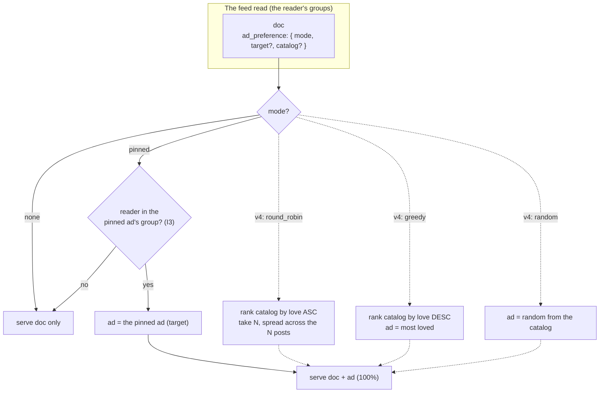

# Ad Dissemination: The Ad Preference on the Document

> **Design** (27.08.2026). How a document's ad gets chosen. **v3 is mad simple**
> — `pinned` | `none`: the creator pins an ad to a post, or doesn't. The rest of
> the doc is the **v4 vision** (the full curation engine: `round_robin` /
> `greedy` / `random`, the node-level density, the `signal` × `strategy` enums)
> — documented so the v4 push has the map. The open `curateAds` PR (the
> client-side SDK helper, 3.26.0) is superseded by this. Read `ads.md` (the ad
> object, D55) and `ads-catalog.md` (the catalog + composer) first.

## v3 Scope (what we're building now)

**Mad simple.** A document's `ad_preference` is one of two things:

```
ad_preference: {
  mode: none | pinned,        // v3: that's the whole enum
  target?: <ad doc_id>,       // for pinned: the specific ad
  catalog?: <catalog>         // kept for v4 (the curation modes curate from a catalog)
}
```

- **`pinned`** — the creator pins a specific ad (from their catalog) to the post.
  The read serves the doc **with** that ad, 100% of the time.
- **`none`** — no ad. The doc comes back plain.

That's it. No `round_robin`, no `greedy`, no `random`, no node-level density in
v3 — those are the v4 engine (below). The creator just pins an ad on their posts
(or doesn't). Every pinned post shows its ad, every time.

**What stays in v3:**

- **The ad catalogs** — the Spotify-playlist model (the master list of the
  creator's ads, organized into named catalogs; an ad in several). The
  authenticator's Ads tab manages them. v3 pins a specific ad; v4 curates from a
  catalog. The structure is built now so v4 is an enum expansion, not a rebuild.
- **The I3 check** — the pinned ad is a doc with its own group attachments. The
  read serves it **only if the reader is a member of the ad's group** (the ad
  rides the reader's access, not just the doc's). A pinned ad the reader can't
  see → the doc comes back with no ad. This is required, not optional — it's a
  security invariant, not a nicety.

**Why this is the right v3 cut:** it delivers the core value (a creator pins
their monetized link to their content, served by the data, free for all apps)
with the simplest possible read (a join to the pinned ad — no ranking, no
density roll). It sidesteps the round-robin/greedy complexity entirely (the
"love" signal doesn't close the loop in v0 — see the v4 note), and it keeps the
full engine as a clean v4 expansion.

## The v4 Vision (the bigger picture)

The full curation engine, documented for the push. This is where the
"expandable enums" live.

**The `ad_preference` grows to:**

```
ad_preference: {
  catalog: <catalog>,                // which catalog to curate from
  mode: { signal, strategy },        // the curation (see below)
  scope: global | per_viewer,        // same ad for all, or hash the viewer in
  target?: <ad doc_id>               // for pinned: the specific ad
}
```

**The mode is two independent, expandable dimensions** — "reaction round
robin," "comment round robin," you name it:

- **`signal`** (what "love" is) — `reactions` | `comments` | `composite` (the
  feed's power-mean score) | … you name it. The engagement the pick is ordered
  by.
- **`strategy`** (how to pick from the catalog):
  - `round_robin` — the **least**-loved active ad
  - `greedy` — the **most**-loved active ad
  - `random` — a random ad from the catalog
  - `pinned` — the specific ad (`target`)
  - `frequency_capped` — TBD (the one that still needs a data-layer definition)

So "reaction round robin" = `{ signal: reactions, strategy: round_robin }`,
"comment greedy" = `{ signal: comments, strategy: greedy }`. Independent
dimensions, so it expands without a combinatorial explosion in the enum.

**`scope`** — `global` (the same ad for every viewer at a given time, a pure
function of the data) or `per_viewer` (hash the viewer into the pick, for
per-viewer variety).

**The node-level ad density** — the node's setting: the percent of posts that
get an ad at all (the operator's fatigue throttle, so users don't get fatigued).
v3 shows ads 100% of the time; the density roll is v4. A true random roll is
non-deterministic; the "ClickHouse-y" way is a deterministic pseudo-random (a
hash of `(doc, time_bucket)` modulo 100 vs. the density %).

### The "love" loop hole (why v3 skips round_robin / greedy)

The curation picks by the ad post's engagement (its reactions/comments). But
that engagement comes from the ad post's *own feed presence* — **not** from being
served as a block. The ad block has no reaction/comment mechanism in v0, and
link clicks aren't tracked (no `stats`, D55). So serving an ad generates **zero**
love on the ad post. Consequence: "least-loved" is always the *same* ad — it
doesn't rotate, because showing it doesn't raise its love. Per-post `round_robin`
is really "always show my least-popular ad post," not equal-exposure rotation.

**The v4 fix (operator's idea):** don't curate per-post — curate the **batch**.
Rank the catalog's ads by least-loved, take N (the feed size), and distribute
them across the N posts so each post gets a *different* ad. That makes the feed
show a spread of the catalog, not the same ad repeated. (It still doesn't fully
close the love loop — true lifetime-equalizing rotation needs the ad block's
exposure to feed a signal, which is a counter on a read path, the D55 wall. So v4
`round_robin` is "spread the catalog across the feed," not "equalize lifetime
exposure.")

`greedy` (most-loved) is the complement — "show my proven best." Its cold-start
(new ads never show) is the distinction, not a bug. Both are static-by-popularity
in v0; the batch spread is what makes them useful.

### Why "love" is still the right v4 signal (despite the loop hole)

Even static, "by popularity" is a meaningful curation: show the ad the audience
responds to most (`greedy`), or spread the catalog (`round_robin` batch). And it
is **the power-mean ranking pattern** (3.18.2 / 3.21.1) turned onto the ad
catalog — a window-function + join, the house pattern. The read already does
read-time projections (media URLs, HLS minting, ranking), so "the read curates
the ad" is the same category, not a scanner-doctrine break.

## The Shape of It (v3 solid, v4 dashed)



## The Authenticator UI (the new surface)

The authenticator (the Studio, `ui/src/components/Studio/`) gets a new **Ads**
tab — the management surface for the catalog + catalogs:

- **Ads upload** (the ingest) — create ads: upload media, define the offer
  (kind / partner / link / cta / disclosure), set status. Writes the `posts`
  docs tagged `ad` (D55).
- **Catalog making** — create and manage catalogs (playlists): name a catalog,
  add / remove ads to / from it. Makes catalogs **first-class** (a thing you
  make in the UI).
- **Pin an ad to a post** (v3) — the composer control: pick an ad (from a
  catalog) to pin to the post, or none.

This is a work item, gated on the design locking.

## The Value Proposition (why this is big)

This is **for advertising, a lot.** Any piece of content an influencer creates
can carry their monetized link, served by the data, free for all apps. The
creator pins their link to their content (v3) — or sets a curation preference
(v4) — and it monetizes with zero per-post effort after the first. No platform
ad network, no bidding, no shadow ban: the creator owns the audience *and* the
monetization, and the link is theirs (D55). That is the influencer value prop,
made mechanical. And it's the **opposite of adblock**: the ad is built in and
owned by the creator, so there's nothing to block.

## The Serious Questions

**Resolved (the v3 cut):**

- **v3 modes** → `pinned` | `none`. Creators pin ads on their posts.
- **v3 density** → 100% (every pinned post shows its ad). The node-level density
  roll is v4.
- **The round_robin / greedy loop hole** → sidestepped in v3 (not implemented);
  the v4 fix is batch curation (spread the catalog across the feed).
- **Catalogs** → kept (the structure + the authenticator Ads tab), so v4 is an
  enum expansion, not a rebuild.

**Still open (a couple v3, the rest v4):**

1. **Where does `ad_preference` live?** A column on `documents` (queryable — the
   "ClickHouse-y" way) vs. a body field (no schema change). Leaning column. (v3)
2. **The catalog representation.** A catalog doc (first-class, for the UI, but
   the query parses JSON) vs. tags on the ads (clean for the query, weak for the
   UI). In tension. (v3 structure, v4 curation)
3. **The read's shape.** Doc + ad **inline** (the full ad body) vs. doc + ad
   **ref** (the app resolves it). Inline is "free for all apps." (v3)
4. **Scope.** v3 on `posts`; the universal-documents vision is later. (v3)
5. **`frequency_capped` / `random`** — the v4 modes that still need definitions.
   (v4)
6. **Node-level density** — true random vs. deterministic pseudo-random;
   granularity (per-read / per-time-bucket / per-viewer). (v4)
7. **What happens to `curateAds` (3.26.0)?** Superseded by the data layer. Does
   it die, or stay as a v4 reference? (v4)