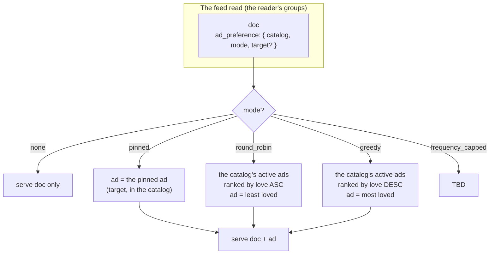

# Ad Dissemination: The Ad Preference on the Document

> **Design under discussion** (converging, 27.08.2026). This doc captures how a
> document's ad gets chosen — and it has converged on a concrete shape. It is
> **not** a locked decision; the serious questions at the bottom are open. The
> open `curateAds` PR (the client-side SDK helper, 3.26.0) is largely
> superseded by this. Read `ads.md` (the ad object, D55) and `ads-catalog.md`
> (the catalog + composer) first.

## The Design

**Every document has an `ad_preference`.** It says which **catalog** to curate
from and a **mode** (+ a target, for `pinned`):

```
ad_preference: { catalog: <catalog>, mode: none | pinned | round_robin | greedy | frequency_capped, target?: <ad doc_id> }
```

**A user has multiple ad catalogs** — the Spotify-playlist model. The master
list is all their ads (their `posts` tagged `ad`, D55). They organize ads into
named **catalogs** (playlists); an ad can be in several catalogs at once (a
song in multiple playlists). A doc points at one catalog + a mode.

**On read, ClickHouse curates the ad and serves it with the doc.** For each doc
in the reader's groups, the read looks at its `ad_preference`, pulls the
author's ads from the chosen catalog, selects one per the mode, and returns the
doc **with** its ad. `none` → the doc comes back with no ad.

The modes, and how the data picks the ad from the catalog:

| mode | the pick | needs state? |
|---|---|---|
| `none` | no ad | — |
| `pinned` | the specific ad (`target`) | no |
| `round_robin` | the catalog's **least-loved** active ad | no — love is data |
| `greedy` | the catalog's **most-loved** active ad | no — love is data |
| `frequency_capped` | TBD (see questions) | the open one |

**"Love" is the engagement on the ad** — its reactions/comments, the same
ref-count machinery the feed's power-mean ranking already reads. It is a
property of the data, not of the viewer.

## The Shape of It



## Why "Love" Dissolves the Wall

The earlier objection (this doc's first draft) was that round-robin and
frequency-capping need **per-viewer state** — "which ad showed last," "how many
times this session" — and a stateless ClickHouse query can't hold that. That is
the same wall D55 hit with the `stats` counters (a per-view fact is a write on a
read path).

The resolution is to stop tracking the viewer and start reading the data:
**least-loved / most-loved is a deterministic function of current engagement.**
No state, no write-on-read, no per-viewer memory. `round_robin` means "show the
ad that has gotten the least love" (so exposure equalizes as an ad's love
rises); `greedy` means "show the ad that has gotten the most love." Both are
computed from the engagement the node already stores.

This is not a new capability — it is **the power-mean ranking pattern** (3.18.2 /
3.21.1) turned onto the ad catalog. That query already joins exact
reaction/comment counts and ranks in SQL. Curation is the same join, pointed at
the author's ads, ordered by love per the doc's mode.

## ClickHouse Feasibility (the honest engineering read)

**Yes, this is very doable, and it is the house pattern.** The read already does
read-time projections (media-URL resolution, HLS manifest minting, power-mean
ranking), so "the read curates the ad" is the same category — not a
scanner-doctrine break.

Concretely, the selection is a per-doc pick from the author's catalog, which is
a window-function + join (not a correlated scalar subquery — ClickHouse can't
decorrelate those, and the codebase already works around it with `QUALIFY` +
`row_number()`):

1. Rank the author's active ads in the chosen catalog by love
   (`row_number() OVER (PARTITION BY author, catalog ORDER BY love ASC/DESC)`).
2. Join the feed docs to that ranking on `(author, catalog)`, selecting the row
   where `rn = 1` (round_robin/greedy) or `ad_doc_id = target` (pinned).
3. Serve the doc + the ad's body.

The one real cost: the read query gets heavier (an extra join to the ad catalog
+ engagement). That is the same cost the ranked feed already pays, so it is
accepted, not novel.

## The Value Proposition (why this is big)

This is **for advertising, a lot.** Any piece of content an influencer creates
can carry their monetized link, curated automatically by the data and scoped to
a catalog. The influencer sets a preference once — "this catalog, round-robin"
— and every post in it monetizes with zero per-post effort. No platform ad
network, no bidding, no shadow ban: the creator owns the audience *and* the
monetization, and the link is theirs (D55). That is the influencer value prop,
made mechanical.

## The Serious Questions

1. **Where does `ad_preference` live?** A column on `documents` (queryable, the
   query filters/joins on it directly — the "ClickHouse-y" way) vs. a body field
   (no schema change, but the query parses JSON). Leaning column.
2. **How is a catalog represented?** The Spotify many-to-many (an ad in several
   catalogs). Options: **tags on the ads** (each ad tagged with the catalogs it
   is in — simplest, tags are the house primitive) vs. **a catalog doc** (a
   `posts` doc tagged `ad_catalog` that lists its ads — first-class, can carry
   name/description/order) vs. a group (reuses the primitive, but groups are for
   social access, not content organization). Tags for v0, catalog-doc as the
   upgrade if catalogs need metadata?
3. **What exactly is "love"?** Reactions only? Reactions + comments? A
   power-mean composite (the feed's existing score)? This sets the
   round_robin/greedy ordering.
4. **`frequency_capped` — what does it mean here?** The original was per-session
   (stateful). In the data-layer model it doesn't fit cleanly. Options: drop it
   (v4), redefine it (cap the number of ads per feed read, not per ad), or
   approximate it. Needs a decision.
5. **Cold start.** `greedy` (most-loved) never shows a new ad (0 love) — new ads
   starve. `round_robin` (least-loved) always shows a new ad until it gets love
   — a new ad can monopolize the slot. Do we want a minimum-exposure floor, a
   recency boost, or a blend?
6. **Scope.** "Every document in all of web10" is the vision. Does v0 start with
   `posts` (social content) and generalize, or is the preference a universal
   `documents` field from day one?
7. **Determinism across viewers.** The pick is a function of the data, so every
   viewer sees the same ad for a doc at a given time (no per-viewer variety).
   Fine for equalizing exposure; if we want variety, hash the viewer into the
   pick. Which do we want?
8. **The read's shape.** Doc + ad **inline** (the full ad body: offer, status,
   media) vs. doc + ad **ref** (the app resolves it). Inline is "free for all
   apps"; a ref keeps the read leaner. The reframe reads inline.
9. **I3 / group scoping.** The ad is the author's. Is it served only to readers
   who can see the doc (the doc's group)? (I believe yes — the ad rides the doc's
   visibility.) Confirm.
10. **The write path.** The composer control: pick a catalog + a mode (+ the
    target ad for `pinned`). This is the web10-social composer integration.
11. **What happens to `curateAds` (3.26.0)?** The curation moves to the data
    layer. Does the client-side helper die, stay as a reference implementation
    the query mirrors, or get repurposed for the stateful modes?
