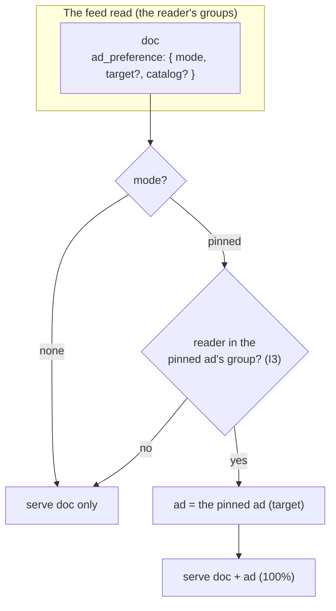

# Ad Dissemination (v3): The Ad Preference on the Document

> **v3 design** (27.08.2026). How a document's ad gets chosen in v3 — **mad
> simple**: `pinned` | `none`. The creator pins an ad to a post, or doesn't. The
> full curation engine (`round_robin` / `greedy` / `random`, the node-level
> density, the `signal` × `strategy` enums) is the **v4 vision** — see
> [`../../web10-v4/social/ads-dissemination.md`](../../web10-v4/social/ads-dissemination.md).
> Read `ads.md` (the ad object, D55) and `ads-catalog.md` (the catalog +
> composer) first.

## The Design

A document's `ad_preference` is one of two things:

```
ad_preference: {
  mode: none | pinned,        // v3: that's the whole enum
  target?: <ad doc_id>,       // for pinned: the specific ad
  catalog?: <catalog>         // kept for v4 (the curation modes curate from a catalog)
}
```

- **`pinned`** — the creator pins a specific ad (from their catalog) to the post.
  The read serves the doc **with** that ad, 100% of the time.
- **`none`** — no ad. The doc comes back plain.

That's it. No `round_robin`, no `greedy`, no `random`, no node-level density in
v3 — those are the v4 engine. The creator just pins an ad on their posts (or
doesn't). Every pinned post shows its ad, every time.

**What stays in v3:**

- **The ad albums** — Apple-Photos-style albums: first-class, named, manageable
  (make an album, sort by album or "all"). An ad carries a **tag-like field**
  saying which albums it's in — an ad can be in a few (a photo in multiple
  albums). The authenticator's Ads tab manages them. v3 pins a specific ad; v4
  curates from an album. The structure is built now so v4 is an enum expansion,
  not a rebuild.
- **The I3 check** — the pinned ad is a doc with its own group attachments. The
  read serves it **only if the reader is a member of the ad's group** (the ad
  rides the reader's access, not just the doc's). A pinned ad the reader can't
  see → the doc comes back with no ad. This is required, not optional — it's a
  security invariant, not a nicety.

**Locked (the three open questions, resolved):**

- **`ad_preference` lives in a column on `documents`** — not a body field. The
  query filters/joins on it directly (the "ClickHouse-y" way). Two columns:
  `ad_mode String DEFAULT 'none'` + `ad_target String DEFAULT ''` (the target
  ad's `doc_id`). The boot self-heal `ADD COLUMN IF NOT EXISTS`'s them onto
  pre-existing volumes.
- **Albums are first-class, the ad→album link is tag-like** — an album is a
  `posts` doc tagged `ad_album` (the name in the body); each ad carries an
  `album:<album doc_id>` tag per album it's in (the house `tags` column — the
  query filters ads by album with `has(tags, 'album:<id>')`). An ad in a few
  albums.
- **The read returns the docs *and* the ads inline** — no ref. The pinned ad's
  full body comes back with the doc (`doc.ad`), so any app gets the ad for
  free. The single-doc read (the post detail deep link) serves it too — a read
  is a read.

**Why this is the right v3 cut:** it delivers the core value (a creator pins
their monetized link to their content, served by the data, free for all apps)
with the simplest possible read (a join to the pinned ad — no ranking, no
density roll). It sidesteps the round-robin/greedy complexity entirely (the
"love" signal doesn't close the loop in v0 — see the v4 doc), and it keeps the
full engine as a clean v4 expansion.

## The Shape of It



## The Authenticator UI (the new surface)

The authenticator (the Studio, `ui/src/components/Studio/`) gets a new **Ads**
tab — the management surface for the catalog + catalogs:

- **Ads upload** (the ingest) — create ads: upload media, define the offer
  (kind / partner / link / cta / disclosure), set status. Writes the `posts`
  docs tagged `ad` (D55).
- **Catalog making** — create and manage catalogs (playlists): name a catalog,
  add / remove ads to / from it. Makes catalogs **first-class** (a thing you
  make in the UI).
- **Pin an ad to a post** (v3) — the composer control: pick an ad (from a
  catalog) to pin to the post, or none.

This is a work item, gated on the design locking.

## The Value Proposition (why this is big)

This is **for advertising, a lot.** Any piece of content an influencer creates
can carry their monetized link, served by the data, free for all apps. The
creator pins their link to their content (v3) — or sets a curation preference
(v4) — and it monetizes with zero per-post effort after the first. No platform
ad network, no bidding, no shadow ban: the creator owns the audience *and* the
monetization, and the link is theirs (D55). That is the influencer value prop,
made mechanical. And it's the **opposite of adblock**: the ad is built in and
owned by the creator, so there's nothing to block.

## The Serious Questions (v3)

**Resolved (the v3 cut):**

- **v3 modes** → `pinned` | `none`. Creators pin ads on their posts.
- **v3 density** → 100% (every pinned post shows its ad).
- **`ad_preference` lives in a column on `documents`** (not a body field) — the
  query filters/joins on it directly.
- **Albums are first-class, the ad→album link is tag-like** — an album is a
  named, manageable entity (the UI); each ad carries a tag-like field listing
  the albums it's in (the query filters ads by album); an ad in a few albums.
- **The read returns the docs *and* the ads inline** — no ref.
- **Catalogs/albums** → kept (the structure + the authenticator Ads tab), so v4
  is an enum expansion, not a rebuild.

**Still open (v3):**

1. **Scope.** v3 on `posts`; the universal-documents vision is later.