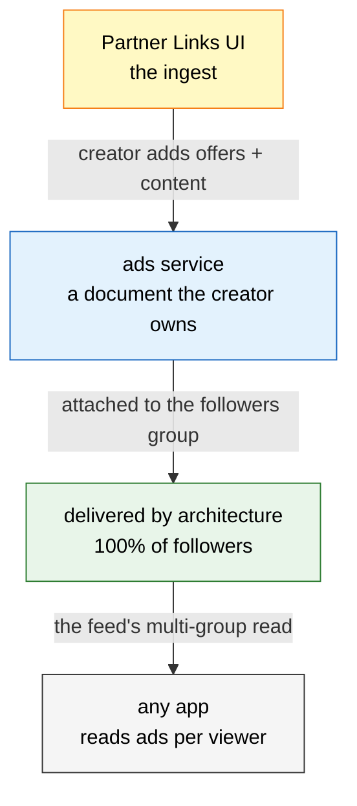

# Web10 Ads

An ad is a document in the `ads` service. It is content — a video, a photo, a post — that carries a monetizable link: an affiliate tag, a direct brand deal, the creator's own store. The creator owns it, scopes it to their audience, and it is delivered to their followers by architecture, the same way a post is. Any app that holds `ads: [readAll]` in its contract picks up the ads for a viewer and renders them.

This is the **creator-owned** ad layer. It is not an ad network — no exchange, no bidding, no third-party targeting. The only sponsors a viewer sees are the ones the creator chose. The ad-network layer (campaigns, targeting, DSP/SSP, revenue split) is a separate v4 concern — see the two-layer note at the bottom.

## The Model



One service. One table. The ad is a document — `collection_name = 'ads'`, `author_key` = the creator. It rides the same delivery as a post: attach it to the creator's followers group (and/or the discover group) and every follower sees it. No ad slot. No inventory. No auction.

## The Standard Ad Object

The `body` follows the leaf-typing convention (`../sdk/document-typing.md`). Two parts: the **creative** (the media) and the **offer** (the monetizable link).

```json
{
  "creative": {
    "format":   { "type": "text",  "value": "video" },
    "media":    [ { "type": "minio", "value": "alice/ads/ad-123.mp4" } ],
    "headline": { "type": "text",  "value": "My whole setup, 2026" },
    "body":     { "type": "text",  "value": "Everything I use, linked." }
  },
  "offer": {
    "kind":       { "type": "text", "value": "affiliate" },
    "partner":    { "type": "text", "value": "Amazon" },
    "link":       { "type": "text", "value": "https://amzn.to/abc?tag=alice-20" },
    "cta":        { "type": "text", "value": "Get it" },
    "disclosure": { "type": "text", "value": "I may earn a commission." }
  },
  "stats": {
    "impressions": { "type": "number", "value": 0 },
    "clicks":      { "type": "number", "value": 0 }
  }
}
```

**`creative`** — the content. `format` is `video` | `image` | `carousel` | `text`. `media` is `minio`-typed, so the API presigns it on read — the same machinery as posts, zero new media code. A video ad references the HLS pipeline (`../media/transcoding.md`): the ad doc carries the media ref, the transcode worker does the rest.

**`offer`** — the monetizable link. `kind` is `affiliate` | `direct` | `own_store`. That is the whole "you name it": an Amazon tag, a brand the creator DM'd, the creator's own store — all the same shape. `link` is the URL that pays the creator. `disclosure` is the auto-shown FTC line. The platform never rewrites the link, never cloaks it, never inserts its own — the creator's link is the link.

**`stats`** — materialized counters, kept in the doc for v0 (a click is a counter bump — a tombstone + new insert, fine at creator-ad volume). High-volume impression/click/conversion tracking and revenue settlement are the v4 layer, not here.

## How It Maps to the Data Model

| Field | Value | Why |
|---|---|---|
| `collection_name` | `ads` | the default service. apps request `ads: [readAll]` |
| `author_key` | the creator | the creator owns the ad, scoped to them |
| `doc_groups` | the creator's followers group (and/or discover) | delivery by architecture — followers see it |
| `tags` | `['ad', 'affiliate', 'amazon']` | fast filtering (`has(tags, 'ad')`) |
| `ref_value` | optional — a related post | an ad can point at the post it accompanies |

No new tables. No new indexes. It is a document, and the house read (dedup-then-filter, group membership, hidden-doc exclusion) already handles it.

## Picking Up Ads Per User

The "ads for this viewer" query is the feed query filtered to the service. The feed already does one combined multi-group read over the viewer's discover group + every followed followers group (`overview.md`, the feed-demo pattern). Ads ride the same read:

```sql
SELECT doc_id, author_key, body, tags, created_at
FROM (
  SELECT d.*, row_number() OVER (PARTITION BY d.author_key, d.doc_id
         ORDER BY d.updated_at DESC) AS rn
  FROM documents d
  WHERE d.collection_name = 'ads'
    AND d.doc_id IN (
      SELECT doc_id FROM doc_groups
      WHERE group_id IN (<viewer's discover + followed followers groups>)
        AND deleted = 0
    )
)
WHERE rn = 1 AND deleted = 0
  AND (doc_id, group_id) NOT IN (
    SELECT doc_id, group_id FROM group_hidden_docs WHERE deleted = 0
  )
ORDER BY created_at DESC
LIMIT $limit
```

(dedup-then-filter per the tombstone invariant in `../db/clickhouse.md`; the group-membership and hidden-doc exclusions are the same joins the feed read already does.) The app renders each ad: the creative (media + headline + body), the offer (link + CTA), and the disclosure.

Because the read is group-scoped, an ad is only ever visible to the creator's audience (or the public, if attached to discover). I3 holds: a viewer who does not follow the creator never sees the ad.

## Dissemination (per-creator)

How a creator's ads get mixed into a viewer's feed is a **per-creator choice**, not a platform decision. Each creator sets how *their own* ads rotate to *their own* audience — that's ownership, not an ad network. No global algorithm, no per-viewer logic: for each creator the viewer follows, the feed curates *that* creator's ads per *that* creator's setting.

**The setting** lives on the creator's `settings` doc (the service the social app already uses):

```json
{
  "ads": {
    "dissemination": { "type": "text", "value": "round_robin" },
    "cap":           { "type": "number", "value": 3 }
  }
}
```

`dissemination` is `round_robin` | `greedy` | `pinned` | `frequency_capped` (+ params like `cap`). The creator picks it in the Partner Links card.

**The feed + ads join.** Ads and posts are the same `documents` table with the same group delivery, so "posts + the ads from the users you follow" is one ClickHouse query — the feed read with `collection_name IN ('posts', 'ads')` over the viewer's groups:

```sql
WHERE d.collection_name IN ('posts', 'ads')
  AND d.doc_id IN (
    SELECT doc_id FROM doc_groups
    WHERE group_id IN (<viewer's discover + followed followers groups>)
  )
```

One combined stream, each row tagged with its `collection_name` so the app knows how to render it. A post can also `ref` an ad directly (`ref_value` — the universal link), so a post can *be* the ad, *carry* one, or *link* to one.

**Where the curation happens — a shared SDK helper, not the SQL.** The stateful algorithms (round-robin needs "which ad showed last," greedy needs the performance numbers) don't belong in a query. The server serves the per-creator read — creator X's ads + X's setting, a plain read. The curation is a deterministic SDK helper:

```
curateAds(creatorAds, creatorSetting) → the ordered subset to show
```

- **round_robin** — rotate the creator's active ads so each gets equal exposure (state in the app: memory/localStorage)
- **greedy** — weight by performance (clicks/impressions from the ad doc's `stats`)
- **pinned** — the creator picks which ad is live
- **frequency_capped** — don't show the same ad more than `cap`× per session

Because the helper is shared and deterministic, every app curates a given creator's ads identically — consistent across apps, no stateful ClickHouse logic.

## The Partner Links UI (the ingest)

The Studio's monetization screen has one card for this: **Partner Links** (it was "Amazon Associates" + "Direct Deals" — collapsed, because they are the same primitive: a link that pays the creator). The card is the ingest:

- the creator adds their offers — an Amazon tag, a direct brand deal, their own store. Each is an `offer` (kind, partner, link, cta, disclosure).
- the creator attaches an offer to content (a video, a photo, a post) → an `ads` document is written, scoped to the creator, attached to their followers group.
- the card shows the running numbers (impressions, clicks, sales-remaining on the Amazon tag) — the doc's `stats` + the offer's state.

The Memberships & Tips card (the Patreon-shaped one) is the other rung-0 card and a separate concern — Stripe Connect subscriptions + tips, already scoped. Partner Links is the link side; Memberships is the subscription side.

## Two Layers (keep these straight)

| | creator-owned `ads` service (this doc) | v4 ad network (`../../web10-v4/db/clickhouse-v4.md`) |
|---|---|---|
| who buys | nobody — the creator posts their own link | brands buy inventory |
| exchange / bidding | none | CPM/CPC/CPA, DSP/SSP partners |
| targeting | the creator's followers (by architecture) | demographic / interest / behavioral |
| revenue | the creator's own affiliate/deal payout | platform + creator + partner split |
| thesis | aligned — "the only sponsors you'll ever see are ones the creator chose" | the paved model, later (M3 sponsor marketplace) |

The `ads` default service ships now, on v3, with no new tables. The v4 ad tables are the exchange layer for when brands buy inventory directly — a different product, a later milestone. Do not build the v4 tables to serve creator ads; that is the wrong layer.

## Summary

An ad is a document in the `ads` service: content + a monetizable link, owned by the creator, delivered to their followers by architecture. Any app with `ads: [readAll]` picks them up per viewer with the same multi-group read the feed uses. The Partner Links UI is the ingest. No new tables, no ad network, no targeting — the creator is the ad channel.

For the group/follow model, see `overview.md`. For the data model + the tombstone read invariant, see `../db/clickhouse.md`. For the leaf-typing convention, see `../sdk/document-typing.md`. For the v4 ad-network layer, see `../../web10-v4/db/clickhouse-v4.md`.
