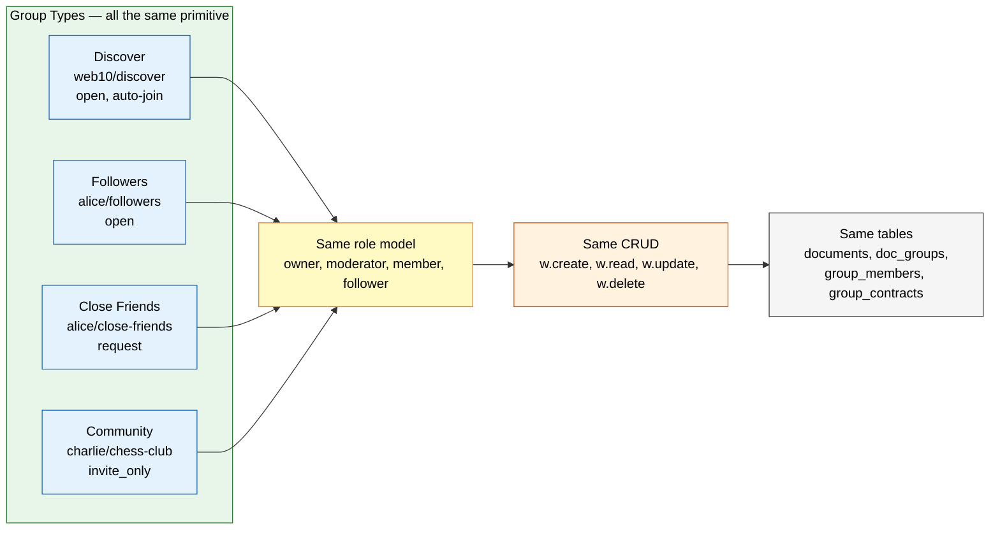

# Web10 Social Groups

Web10-social is an app that runs on the web10 platform. It uses groups the same way any app does — groups are generic policy containers. Web10-social just happens to define specific roles for social use cases.

## How Social Maps to Groups



One primitive. Four social patterns. Same tables, same CRUD, same roles. The only difference is the join policy and who the members are. No follows table. No inbox table. No discover index. Just groups.

This doc explains how web10-social uses groups. The generic group model is in `../groups/overview.md`.

## Web10-Social Roles

Web10-social defines these roles for its groups. They are not platform roles — they are choices the social app makes.

**Owner** — all services (`"*"`), full permissions. The group creator. Manages roles, membership, and group lifecycle.

```json
{
  "name": "owner",
  "permissions": {
    "*": ["readAll", "create", "updateOwn", "updateAll", "deleteOwn", "deleteAll", "hideAll"],
    "group": ["manageRoles", "assignRoles", "revokeRoles", "deleteGroup"]
  }
}
```

**Moderator** — `posts`, `comments`; can moderate content and manage roles.

```json
{
  "name": "moderator",
  "permissions": {
    "posts": ["readAll", "create", "updateOwn", "deleteOwn", "hideAll"],
    "comments": ["readAll", "create", "updateOwn", "deleteOwn", "hideAll"],
    "group": ["assignRoles", "revokeRoles"]
  }
}
```

**Page Curator** — `group-identity-service`; manages group banner, name, website.

```json
{
  "name": "page-curator",
  "permissions": {
    "group-identity-service": ["readAll", "create", "updateOwn", "deleteOwn"]
  }
}
```

**Member** — `posts`, `comments`; can view, create, edit own content.

```json
{
  "name": "member",
  "permissions": {
    "posts": ["readAll", "create", "updateOwn", "deleteOwn"],
    "comments": ["readAll", "create", "updateOwn", "deleteOwn"]
  }
}
```

**Follower** — `posts`; read-only. Can see what the author shares, not post or modify.

```json
{
  "name": "member",
  "permissions": {
    "posts": ["readAll"]
  }
}
```

## Web10-Social Group Types

Web10-social uses groups for different social scenarios. Each scenario defines its own roles and join policy.

### Community Group

A community with an owner, moderators, curators, and members. Used for topic-based communities, interest groups, and curated spaces.

```json
{
  "group_id": "web10.app/groups/jacoby149/abacus-enthusiasts",
  "join_policy": "request",
  "roles": [
    { "name": "owner", "permissions": { "*": ["readAll", "create", "updateOwn", "updateAll", "deleteOwn", "deleteAll", "hideAll"], "group": ["manageRoles", "assignRoles", "revokeRoles", "deleteGroup"] } },
    { "name": "moderator", "permissions": { "posts": ["readAll", "create", "updateOwn", "deleteOwn", "hideAll"], "comments": ["readAll", "create", "updateOwn", "deleteOwn", "hideAll"], "group": ["assignRoles", "revokeRoles"] } },
    { "name": "page-curator", "permissions": { "group-identity-service": ["readAll", "create", "updateOwn", "deleteOwn"] } },
    { "name": "member", "permissions": { "posts": ["readAll", "create", "updateOwn", "deleteOwn"], "comments": ["readAll", "create", "updateOwn", "deleteOwn"] } }
  ]
}
```

**How it works:**
- `join_policy: "request"` — members request to join, owner or moderator approves
- Owner has full control, moderators can hide content and manage roles
- Page curators manage the group identity without touching posts
- Members can post, comment, and edit their own content

### Discover (Public Board)

The public board. Everyone is a member by default. Replaces the `discover: true` boolean. The board's id is provider-derived — `{provider}` is the node's configured `PROVIDER` (its API host), so each node's board has a unique global id.

```json
{
  "group_id": "{provider}/groups/web10/discover",
  "join_policy": "open",
  "roles": [
    { "name": "member", "permissions": { "posts": ["readAll", "create", "updateOwn", "deleteOwn"] } }
  ]
}
```

**How it works:**
- `join_policy: "open"` + auto-enrollment on signup = everyone is a member by default
- `readAll` = anyone can see anything posted here. This **is** the public board.
- `create`, `updateOwn`, `deleteOwn` = you can post to it and manage your own stuff
- No moderators. No owners. One role. Everyone shares it.

**Discovery is group membership.** No `discover` boolean. No separate discover index logic. Posts attached to the discover group are public. Posts without it are private.

### Private Circle

A private group. The creator is the only owner. Approved friends are members. Members can see private posts.

```json
{
  "group_id": "web10.app/groups/jacoby149/close-friends",
  "join_policy": "request",
  "roles": [
    { "name": "owner", "permissions": { "*": ["readAll", "create", "updateOwn", "updateAll", "deleteOwn", "deleteAll", "hideAll"], "group": ["manageRoles", "assignRoles", "revokeRoles", "deleteGroup"] } },
    { "name": "member", "permissions": { "posts": ["readAll", "create", "updateOwn", "deleteOwn"] } }
  ]
}
```

**How it works:**
- `join_policy: "request"` + no auto-enrollment = private by default
- Owner posts private content to the group
- Friends request to join. Owner approves. They become `member`
- Members get `readAll` on posts, so they can see the owner's private posts
- No moderators. No curators. Just owner + members

### Follow a Public Profile

Following a public profile is a group join. The user's followers group uses `join_policy: "open"`, so the follow is instant — no approval needed. The follower is added as a `member` and can see posts the author attaches to that group. But the followers group is more than a content distribution channel. **It is the influencer's owned audience.**

```json
{
  "group_id": "web10.app/groups/coolguydavid/followers",
  "join_policy": "open",
  "roles": [
    { "name": "owner", "permissions": { "*": ["readAll", "create", "updateOwn", "updateAll", "deleteOwn", "deleteAll", "hideAll"], "group": ["manageRoles", "assignRoles", "revokeRoles", "deleteGroup"] } },
    { "name": "member", "permissions": { "posts": ["readAll"] } }
  ]
}
```

**How it works:**
- `join_policy: "open"` = instant follow. Click follow → you are added as a `member` of `coolguydavid/followers`. No request. No approval.
- The follower's `member` role only grants `readAll` on `posts` — they can see what the author shares, not post or modify.
- The author posts by attaching content to the `followers` group. Members discover it via group membership.
- Unfollow is just leaving the group. No approval needed.

**The audience is the asset.** The owner (coolguydavid) can read the full membership list. Every follower's web10 username, email (if set), phone (if set). They can message a follower, email a fan, text a supporter — directly, through web10. That list is theirs. They can export it. They can take it if they move nodes. On legacy platforms, followers are the platform's asset — you can't export them, can't message them without the platform's permission, can't take them if you leave. Here, the followers group membership is owned data.

**Public vs private profile is the join policy.** The same group shape works for both:
- `join_policy: "open"` → public profile. Anyone can follow instantly.
- `join_policy: "request"` → private profile. Follow requires the author's approval.

**Follows are groups.** No follows table. No follows endpoint. One group membership, one set of roles, one permission model. The author controls the join policy. The follower gets `readAll` on posts. The author owns the audience relationship. That's the entire follow mechanic.

## Summary

Web10-social uses groups for communities, discovery, private circles, and follows. The roles are choices the social app makes — not platform requirements. Any app can define its own roles for its own groups. The platform doesn't care what you call them or what they do.

For the generic group model, see `../groups/overview.md`. For contract schemas, see `../sdk/contracts.md`.