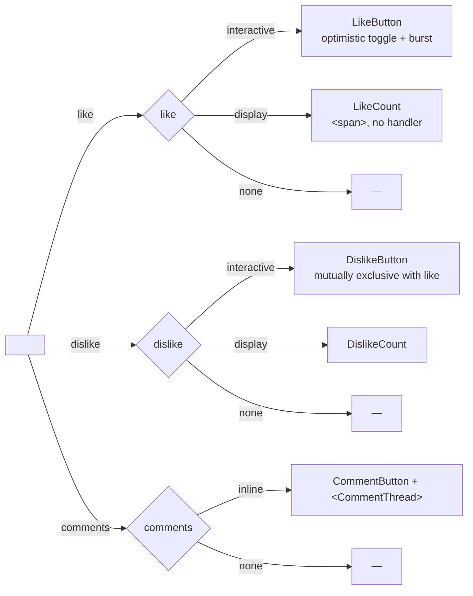

# Post Actions — one shared engagement bar for every post

The engagement model (D62, `../overview.md` + the decisions doc) decides what a like, a dislike, or a comment *is* on the wire: documents in the engager's own service, joined to their target by `ref_value`. The feed, Discover, and groups docs decide *where* a post is shown. This doc decides the one thing none of them do: **how the web10-social client renders the engagement row** — the like/dislike, the comment entry, the counts. Because that is where the slop was.

## The use case

A fan is scrolling. They want to react the way they do everywhere — tap the heart, tap the thumb, tap the comment — and they want it to *feel* the same whether the post is in the feed, in Discover, in a group, or open in the lightbox. One post, one way of reacting, everywhere it shows. And a reaction should be a reaction: if they change their mind from like to dislike, the like goes away. No double-counting, no ghost state.

That is the whole goal. Everything below is in service of it.

## The problem: N copies, already drifting

The client did not have one way to render the engagement row. It had several, copy-pasted, and they had already gone their separate ways:

| Copy | Where | Like | Dislike | Comments |
|---|---|---|---|---|
| `PostCard` action row | Feed | **interactive** — `toggleReaction` + heart-burst + optimistic rollback | — | `CommentThread` inline |
| `PostLightbox` | Profile grid / deep-link | **interactive** — a *second* copy of the same optimistic toggle + burst + rollback | — | `CommentThread` |
| `DiscoverCard` engagement bar | Discover | **display-only** — a `<span>`, no handler (the drift bug) | — | `CommentThread` |
| `GroupPostCard` | Groups | absent | — | absent |

Three implementations of "the row under a post," and they disagreed on the one thing that matters: whether the like does anything. Discover's is a dead `<span>` — you can see the count, you can't tap it. Groups gave up entirely. And the one piece of *logic* that's fiddly — the optimistic toggle (flip the icon, bump the count, call `toggleReaction`, roll back on error) — is duplicated verbatim in the feed and the lightbox. Fix it in one, forget the other, drift.

`<CommentThread>` is, to its credit, already shared by the three surfaces that have it. The slop is the **like + counts row** — the chrome around the thread — which is triplicated and has already produced a real bug (the dead Discover like).

## The rule

> **No surface owns the engagement row. Every surface composes `<PostActions>`.**

That single rule is what kills the drift. A surface says *what* it wants — which post, whether the like is tappable, whether comments expand inline, which layout — and does not say *how* the heart gets its burst. When the like logic changes, it changes in one place, and every surface gets it at once.

## The component: three axes

`<PostActions>` is factored along the axes that actually vary. Not one mega-component with an `if` for everything, and not N copies — one thin component that renders the **reaction pair**, the **comment entry**, and the **counts**, then delegates the thread to the already-shared `<CommentThread>`.



**Axis 1 — `like`** (the heart):

| `like` | Renders | Behavior |
|---|---|---|
| `interactive` | `LikeButton` | optimistic toggle + heart-burst + rollback on error. The feed / lightbox behavior. |
| `display` | `LikeCount` | a `<span>` with the count. No handler. The Discover behavior — but now it's an *explicit* choice, not an accident of copy-paste. |
| `none` | — | the slot is absent. |

**Axis 2 — `dislike`** (the thumb): the same three values, a `ThumbsDown` button. **Mutually exclusive with `like`** — see the invariant below. A user has at most one reaction per post: liking clears a dislike, disliking clears a like, tapping the active one clears it.

**Axis 3 — `comments`**:

| `comments` | Renders | Behavior |
|---|---|---|
| `inline` | `CommentButton` + `<CommentThread>` | the count toggles the thread open/closed inline. The feed / Discover / lightbox behavior. |
| `none` | — | the slot is absent. |

Plus one layout prop: `layout` (`row` — the feed card's compact row; `bar` — Discover's border-t engagement bar; `bare` — just the slots, `display:contents`, no container chrome — for a surface that provides its own bar). The counts themselves come from the surface (in-payload `post.likes` / `post.comments`, or a ref-count read) — the component formats and displays, it doesn't fetch.

Three seams the surfaces needed beyond the axes:

- **`trailing`** — extra bar slots the surface owns, rendered after the shared ones in the same bar (Discover's repost/share signal). The bar stays one shared component; the surface just contributes its own slots.
- **`groups`** — the group the post lives in. Group posts pass `[groupId]` so reactions + comments attach to the group, not the discover board (the data layer's `groups` param, threaded through `CommentThread` + `toggleReactionKind`).
- **`defaultOpen`** — start the thread open (the lightbox's `?comment=` deep link auto-opens + anchors the comment).

A surface is therefore a one-liner (as built):

```
Feed:      <PostActions post liked disliked reactionCount commentCount onToggleReaction layout="row" />
Discover:  <PostActions post like="display" reactionCount commentCount layout="bar" trailing={repost+share} />
Lightbox:  <PostActions post liked disliked reactionCount commentCount onToggleReaction defaultOpen={!!anchor} trailing={share} />
Groups:    <PostActions post liked disliked reactionCount commentCount onToggleReaction groups={[groupId]} />
```

## The like/dislike invariant (one reaction per user)

This is the part that is *not* free, and it's why the logic lives in the data layer, not the component.

The data model already allows it: `ReactionRecord.type` is a free-form string (`types.ts`), and `toggleReaction(targetId, type, …)` accepts any type — `'dislike'` works today with zero node changes. But `toggleReaction` only toggles *one* type: it adds or removes the type you pass, and says nothing about the other. So a user could end up with both a like and a dislike on the same post, and the counts would double-count them.

The invariant: **a user has at most one reaction per target — `like` XOR `dislike` XOR none.** The component's `onToggleReaction('like' | 'dislike')` therefore means *set*, not *toggle-one*:

| Current | Tap like | Tap dislike |
|---|---|---|
| none | add like | add dislike |
| like | remove like | remove like, add dislike |
| dislike | remove dislike, add like | remove dislike |

That's two new data-layer helpers. `setReaction(targetId, 'like' \| 'dislike' \| null, …)` is the primitive — it reads the user's existing reaction on the target, deletes whichever of the two is present, and creates the new one if the target isn't `null` (composing `readReactions` + `deleteReaction` + `createReaction`). `toggleReactionKind(targetId, 'like' \| 'dislike', …)` is the tap handler the component calls — it resolves the tap against the user's current reaction (tap the active one → clear; tap the other → swap) and delegates to `setReaction`. The old `toggleReaction` stays (it's correct for the single-type case and other callers). The mutual exclusion is a property of the data layer, so it holds no matter which surface drives it.

**The "mine" match is username-alone (the v3 ownership rule).** The node writes `author_key = token.username` — a bare username, the provider implicit — so a reaction's derived `author_provider` is the v2 fallback (`'web10'`) and **never** equals the token's real provider. Matching "is this my reaction?" on `author_username === token.username && author_provider === token.provider` (the v2 rule) makes the user's own reaction unfindable: every tap falls through to the create branch and stacks a fresh reaction doc per tap (the 28-likes bug, 3.87.2 — the same class as the feed's `isOwnPost` fix, 3.79.3). The rule: **match on `author_username === token.username` alone.** A v2-shaped `provider/username` key still matches (the username is the last segment either way). The initial-state loads (lightbox, group detail) run the same rule — otherwise the heart renders un-filled on a post the user already liked.

The **count** shows likes (the heart's number). Dislikes are tappable but their count is not displayed on the bar — the signal to the author is the notification nudge (D69), not a public "N people hated this" tally. If a surface ever wants the dislike count, `getReactionCounts` already groups by type.

## How this differs from `<VideoPlayer>`

Same disease, same cure, different shape. The differences are worth stating, because they're easy to get wrong:

| | `<VideoPlayer>` (3.81.0) | `<PostActions>` (this doc) |
|---|---|---|
| **What's shared** | the *pixels* — the `<video>` element and its control surface | the *state + chrome* — the reaction pair, the counts, the thread mount |
| **The axes** | `source` (where bytes come from) × `mode` (how it presents) | `like` / `dislike` / `comments` (what's shown) × `layout` (how it's arranged) |
| **The logic that lives in the component** | none — playback is delegated to `HlsVideoPlayer` / native `<video>` | the optimistic toggle + burst + rollback, and the `toggleReactionKind` mutual-exclusion call |
| **What it delegates** | the actual player | the actual thread (`<CommentThread>`, already shared) |
| **The invariant that becomes a property** | a tap on the video never reaches the card (`stopPropagation`) | a user has at most one reaction per post (like XOR dislike) |

Two things are deliberately *not* copied from the VideoPlayer shape:

1. **`<PostActions>` owns state, `<VideoPlayer>` doesn't.** A video is stateless from the component's view — it renders bytes. An engagement row is *stateful* — it holds `liked`, the counts, the open/closed thread, and the optimistic-update-in-flight flag. So `<PostActions>` is a controlled component: the surface owns the state (it already does — the feed holds `likedMap` / `reactionMap` / `commentMap`), and the component takes it as props and reports intent back via `onToggleReaction`. The VideoPlayer has no `onChange` because a video doesn't have one.

2. **The axes are *presence* axes, not *renderer* axes.** `source`/`mode` pick a renderer (hls.js vs native, inline vs full rack). `like`/`dislike`/`comments` pick *whether a slot exists at all* and whether it's live. There's no "renderer" to swap — there's one heart, one thumb, one comment button. The variation is which of the three the surface wants and in what layout.

What *is* copied, on purpose: the rule's shape ("no surface owns X; every surface composes X"), the one-liner-per-surface surface map, the "what this is not" scope fence, and the insistence that the fiddly invariant be a property of the shared piece, not a per-surface discipline.

## Trace: a fan changes their mind on a group post

1. The group detail renders `GroupPostCard`, which composes `<PostActions post liked={false} reactionCount={3} commentCount={1} onToggleReaction comments="inline">`.
2. The fan taps the heart. `toggleReactionKind(postId, 'like')` — no existing reaction, so it creates one. The heart fills, bursts, the count ticks to 4. The author gets the D69 nudge.
3. The fan taps the comment count. `CommentThread` drops open below the row, inline. They type, send, the count ticks to 2.
4. The fan has second thoughts and taps the thumb. `toggleReactionKind(postId, 'dislike')` — the data layer sees the existing `like`, deletes it, creates the `dislike`. The heart un-fills, the thumb fills, the like count ticks back to 3. One reaction, not two.
5. The same post, seen later in the feed, shows the same row, the same state, the same behavior. It's the same component.

## Surface map

| Surface | Like | Dislike | Comments | Layout |
|---|---|---|---|---|
| Feed | interactive | interactive | inline | row |
| Discover | display | display | inline | bar |
| Lightbox / deep-link | interactive | interactive | inline | row |
| Groups | interactive | interactive | inline | row |

Discover is `display` for both reactions *today* — it's the public board, the engagement is a signal for ranking, not a tap target. Flipping it to `interactive` later is a prop change, not a reimplementation. (Whether the public board should take reactions at all is an open question, not a rendering one.)

## What this is not

- **Not a rewrite of `<CommentThread>`.** It's kept as-is and is the `comments="inline"` renderer — `<PostActions>` mounts it, doesn't re-implement it. The thread's own logic (read, create, the reply nudge) is untouched.
- **Not a change to the node.** `ReactionRecord.type` is already a free string; `setReaction` composes the existing `readReactions` / `deleteReaction` / `createReaction`. No new endpoint, no new table, no schema change.
- **Not the whole card.** The card still owns its header, media (`<VideoPlayer>` / `MediaCarousel`), tags, ad block, and owner kebab. `<PostActions>` is the engagement row and nothing more. The seam is the row, not the card.
- **Not a public dislike count.** The thumb is tappable; its count is not on the bar. The author sees it as a nudge, not a tally.

## Open questions

Decided and built: the one-component / three-axes shape; the like/dislike mutual-exclusion invariant (one reaction per user, enforced in the data layer via `setReaction` + the tap-handler `toggleReactionKind`); the `display` vs `interactive` split (Discover's dead-like became an explicit prop); Groups gaining the full row (group-scoped via `groups`); the dislike count staying off the bar; the `trailing` / `defaultOpen` / `bare` seams. The four surfaces (Feed, Discover, PostLightbox, Groups) compose it; the optimistic toggle + burst + rollback lives once in the component.

Still open:

- **Discover reactivity** — should the public board take live reactions, or stay a read-only signal? A prop flip if the answer is yes.
- **Reactions on comments** — `ReactionRecord.target_service` already allows `'comments'`; the bar doesn't render a reaction pair on individual comments yet. A later surface, same component.

## Reference

- The engagement model (reactions + comments as documents, the `ref_value` join): `../overview.md` + `../../decisions.md` (D62)
- The notifications nudge a reaction fires (D69): `../notifications.md`
- The shared comment thread this composes: `../../../../marketing/web10-social/src/components/Feed/CommentThread.tsx`
- The reaction data layer this builds on: `../../../../marketing/web10-social/src/data/reactions.ts`
- The precedent this mirrors (the shared video surface): `./video-player.md`
- The visual bar (tokens, the heart-burst, states, the screenshot test): `../../../strategy/design.md`
