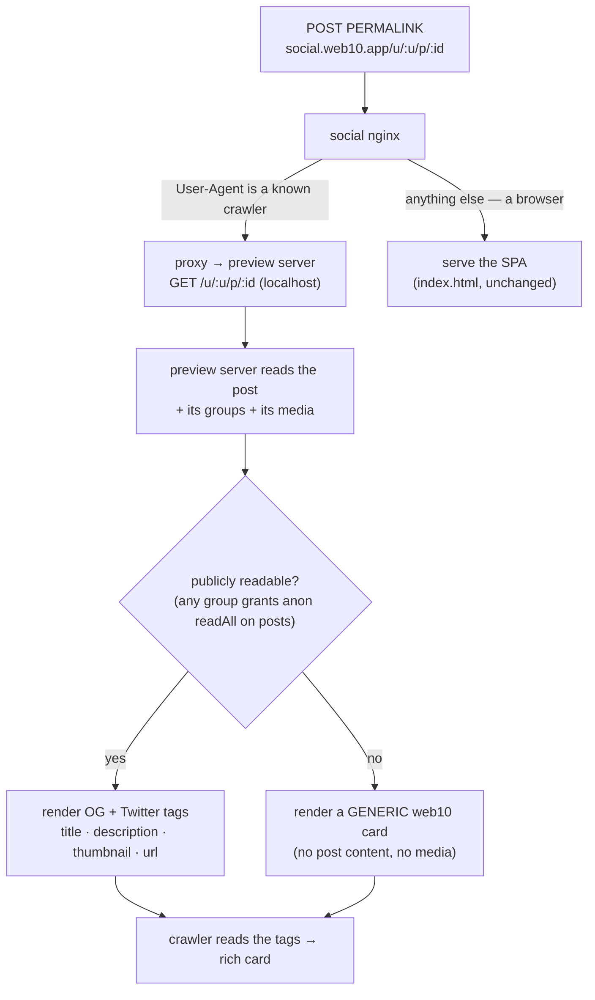

# Share Preview — the post permalink, rich when shared

The pipeline docs decide what a post *is* on the wire. This doc decides the one thing they do not: **what happens when a post's link leaves the app.** When a creator or a fan taps *Share* on a post, the link that goes out is the post permalink — `social.web10.app/u/:username/p/:postId`. When that link lands in Facebook, iMessage, Slack, WhatsApp, Discord, Telegram, or X, the receiving app crawls the URL and renders a **preview card**: a title, a description, and — the part that makes it feel real — a **thumbnail** (the post's first image, or the video's poster frame). This is the standard Open Graph / Twitter Card mechanism, the same one Facebook and Instagram use for their own links.

## The use case

A creator posts a clip. A fan taps Share and sends it to a friend in iMessage. The friend sees a card — the clip's poster frame, the creator's name, the first line of the caption — before they have even opened the app. That card is the whole pitch in miniature: *this is a real social product, and the thing you're being shown is the thing you'll get.* Without it, the link is a bare URL and the pitch is dead on arrival.

## The problem: the permalink is a SPA route

web10-social is a client-side-rendered PWA. The permalink `/u/:username/p/:postId` is a **route**, not a page — nginx serves the static `index.html` for every path, and the app hydrates over it in the browser. A crawler does not run JavaScript. It fetches the URL, reads the `<head>`, and finds no post-specific meta tags — so it renders nothing. The fix is to make the **social app's preview server** (a small Node server in the social container, reading the post via the node's generic read) render the preview for the crawler, while the browser keeps getting the SPA.

## The rule

> **The social app's preview server renders the preview; the browser gets the app.** The post permalink, when fetched by a social crawler, is answered by the social app's preview server (a small Node server in the social container) with an HTML document carrying the post's Open Graph + Twitter Card tags. When fetched by a browser, it is answered by the SPA exactly as today. The split is decided at the edge (nginx), by User-Agent.

## The endpoint

The social card is **the social app's own preview server** — not a platform
endpoint. The platform's `share.py` is deleted (D60: the node has zero social
concepts). The split (KB: `../media/thumbnailing.md`):

- **The platform (100% generic)** provides two universal primitives:
  - `POST /v3/media/thumbnail {doc_id}` — "what's the picture for this doc?"
    (anon-capable, access-checked I3).
  - `POST /v3/preview/render {title, description, image, url, og_type, …}` —
    "render a card from this spec" (the OG/Twitter HTML; schema-free, no social
    knowledge).
- **The social app** (`marketing/web10-social/preview/`) is a small Node preview
  server that runs in the social container alongside nginx. It maps the social
  permalink → a doc, reads the doc via the generic read (anon-capable), picks
  the thumbnail via the generic `media/thumbnail`, applies the social fallback
  (author avatar → brand mark), and asks the generic `preview/render` for the
  card HTML. The social nginx User-Agent split proxies crawler requests to it
  (same container, localhost); browsers get the SPA.

**The read is the same as the app's, minus the token.** The preview server:

1. Reads the post by `doc_id` (the generic read, anon-capable — a public post
   reads token-less; the `username` in the path is the *display* author, used
   for the canonical URL, not the read — the read is by `doc_id` so a reshared
   link still resolves).
2. **Decides public-readability:** a post that isn't anon-readable (private /
   followers-only) → a generic card, no content (the I3/D41 privacy floor).
3. If public: gets the **thumbnail** via the generic `media/thumbnail`, and
   reads the author's profile for the display name + the avatar fallback.
4. Renders the card via the generic `preview/render`.

**The thumbnail is the first media item that has an image.** Selection, in order:
| Post media | `og:image` |
|---|---|
| First item is an **image** | that image's presigned `read_url` |
| First item is a **video** with a `thumbnail_object_key` (the D44 transcode poster) | the presigned `thumbnail_url` |
| First item is a **video** with no poster yet (transcode pending) | fall through to the next item, else the author's avatar, else the web10 brand mark |
| No media at all | the author's avatar, else the web10 brand mark |

The presigned URL is minted fresh on every request (the document-typing rule — the document never stores a live URL; `resolve_media_urls` already does this). Crawlers fetch the image over HTTPS from the public MinIO vhost, so the URL must be the public one (`S3_PUBLIC_ENDPOINT`), which the signing client already uses.

> **The selection is the generic primitive.** The "first image, else the video's poster" table above is the universal `pickThumbnail` (KB: `../media/thumbnailing.md`) — a pure function over resolved media, delivered by the SDK and exposed as `POST /v3/media/thumbnail`. The social card (the social app's preview server) calls the generic primitive for the selection and the generic renderer for the card, and adds only the social parts (the `/u/:username` permalink, the title/description, and the author-avatar → brand-mark fallback). The platform owns the universal primitives; the card is the social app's tailoring — not platform debt.

**The tags rendered** (a public post):

| Tag | Value |
|---|---|
| `og:type` | `article` (a `video.other` hint when the first item is video) |
| `og:title` | the post text (truncated ~100 chars), else `@{username} on web10` |
| `og:description` | the post text (truncated ~200 chars), else a generic line |
| `og:image` | the thumbnail (above) |
| `og:image:alt` | the media's `alt_text`, else the title |
| `og:url` | the canonical permalink (`{SOCIAL_ORIGIN}/u/{username}/p/{post_id}`) |
| `og:site_name` | `web10` |
| `twitter:card` | `summary_large_image` |
| `twitter:title` / `twitter:description` / `twitter:image` | mirror the `og:` values |

**The privacy floor (I3 / D41).** A post that is *not* publicly readable never leaks. The endpoint renders a **generic** web10 card — the brand mark, `web10` as the site name, a neutral title/description ("A post on web10") — and **no** post text, **no** media URL, **no** author-specific data. The node is readable *by design* (discovery, search, auditability), but "readable by an authenticated member" is not "readable by anyone," and the preview must respect that line. A followers-only or private post shared to a stranger shows the generic card, not the content.

**A ghost post** (a `doc_id` that does not exist, or is tombstoned) → `404`. The crawler renders nothing; that is correct — a deleted post should not preview.

## The edge: nginx User-Agent split

The social app's nginx is the only thing that sees the permalink before the SPA. It splits on User-Agent:

- **Known social crawlers** → `proxy_pass` to the social app's preview server. The crawler list is the standard set: `facebookexternalhit`, `Twitterbot` / `Twitterbot/1.1`, `LinkedInBot`, `Slackbot`, `WhatsApp`, `TelegramBot`, `Discordbot`, `Slack-ImgProxy`, `TelegramBot`, `Pinterest`, `WhatsApp`, `Telegram`, `WhatsApp`, `QQ`, `Line`, `YandexBot` (the long tail of link-preview bots). The match is a case-insensitive substring check on `$http_user_agent`.
- **Everything else** → the SPA, exactly as today (`try_files … /index.html`).

The split is deliberately **browser-default**: an unknown agent gets the working app, never a broken preview. The only failure mode is a crawler with an unmatchable User-Agent, which degrades to "no preview card" — the same as today, never worse.

The preview-server target is injected at deploy time (a `PREVIEW_TARGET` env var, default `http://127.0.0.1:3001` — the preview server's port, same container, localhost), so the same image works in dev and prod. The nginx config is a **template** that the `nginx:alpine` image `envsubst`s at boot — the same env-var pattern the rest of the stack already uses.

## Trace: a fan shares a video post

1. The fan taps Share on a video post. `navigator.share` (or the copy-link fallback) sends `https://social.web10.app/u/nova/p/abc123` to iMessage.
2. Apple's link-preview crawler fetches that URL. Its User-Agent matches the list → the social nginx proxies to the preview server (`${PREVIEW_TARGET}/u/nova/p/abc123`, default `http://127.0.0.1:3001`).
3. The preview server reads the post by `abc123` (the generic read, anon-capable), sees it is in the discover group (anon `readAll` on `posts`) → public. It resolves the media: the first item is a video with a `thumbnail_object_key` → it mints a fresh presigned `thumbnail_url` over the public MinIO host. It reads the author's profile for the display name.
4. The preview server returns an HTML document: `og:image` = the poster frame, `og:title` = the caption, `og:description` = the caption, `og:url` = the permalink, `twitter:card` = `summary_large_image`.
5. iMessage renders the card — the poster frame, the caption, "web10." The friend taps it and lands on the permalink in the app, signed in or not.

## The profile permalink

The profile permalink (`/u/:username`) is the same edge split, one level up. The social app's preview server renders the profile's **face** for a crawler: the avatar as `og:image`, the display name as `og:title`, the bio as `og:description`, and `og:type` = `profile` (the Open Graph type for a person). The nginx edge proxies `/u/:username` (the path that ends right after the username — mutually exclusive with the post permalink's `/u/:username/p/:postId`) to the preview server for known link-preview bots; everyone else gets the SPA.

**No anon-read gate (unlike a post).** A post can be private or followers-only, so the post preview degrades to a generic card when it isn't anon-readable. A profile's face is the account's **public identity** — the avatar and display name are already on the discover board (the feed carries the author's avatar inline, resolved server-side for every reader), and there are no private accounts — so the profile preview renders the face directly, reading the author's profile via the generic read (anon-capable for a public profile). The avatar is resolved to a fresh presigned URL via the generic `media/thumbnail` (a media doc → its own image).

**A user with no profile doc** (never saved one, or an unknown username) previews as a **generic** `@{username} on web10` card with the brand mark — never a broken preview, the browser-default posture. (A profile has no "deleted" state that matters to a crawler, so there is no 404 here, unlike a ghost post.)

## What this is not

- **Not server-side rendering of the app.** The social app's preview server renders a *preview document* for crawlers, not the SPA. The browser still gets the client-rendered app. There is no SSR framework, no hydration, no build-time coupling between the node and the social bundle.
- **Not a platform endpoint.** The card is the social app's preview server (the social-specific tail). The platform provides only the generic primitives (the `media/thumbnail` + the `preview/render` card renderer) — it knows nothing about posts, profiles, or the `/u/:username` permalink (D60).
- **Not a privacy loosening.** The preview is *narrower* than the app: it only shows what an anonymous visitor could already read (the public board). Private and followers-only content never appears in a preview.

## Open questions

Decided and built: the social app's preview server (the card); the generic card renderer (`POST /v3/preview/render`); the public-readability floor (a non-anon-readable post → generic card); the thumbnail via the generic `media/thumbnail`; the nginx User-Agent split (crawlers → the preview server, browsers → the SPA); the **profile permalink** (the profile's face, no anon-read gate). The platform's `share.py` is deleted.

Still open:

- **Group permalink.** `/groups/:id` — the same preview-server pattern, the group's face (cover + avatar) as the image. The group's face is a `web10-social-group-identity` doc (D60); the preview server would read it the same way the profile preview reads the profile.
- **A preview for the app's own root** (`social.web10.app/`) — a static brand card. Cheap; the `index.html` static tags cover it.

## Reference

- The read gate the public check reuses (D58): `../groups/access.md`
- The readable-by-design posture the preview respects (D41): `../security/overview.md`
- The generic thumbnailing primitive + the card's home (this doc's tail): `../media/thumbnailing.md`
- The media model the thumbnail comes from (`thumbnail_object_key`, the presigned read): `../media/transcoding-foundation.md`
- The post + media document shapes: `../db/clickhouse.md`
- The social app's preview server (the card): `../../../../marketing/web10-social/preview/`
- The generic card renderer: `../../../../api/app/v3/endpoints/preview.py`
- The nginx split: `../../../../marketing/web10-social/nginx.conf`
