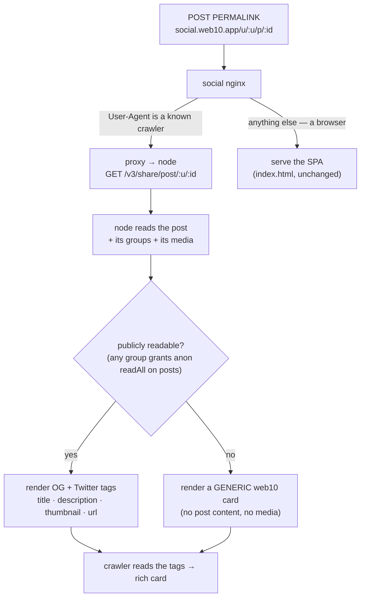

# Share Preview — the post permalink, rich when shared

The pipeline docs decide what a post *is* on the wire. This doc decides the one thing they do not: **what happens when a post's link leaves the app.** When a creator or a fan taps *Share* on a post, the link that goes out is the post permalink — `social.web10.app/u/:username/p/:postId`. When that link lands in Facebook, iMessage, Slack, WhatsApp, Discord, Telegram, or X, the receiving app crawls the URL and renders a **preview card**: a title, a description, and — the part that makes it feel real — a **thumbnail** (the post's first image, or the video's poster frame). This is the standard Open Graph / Twitter Card mechanism, the same one Facebook and Instagram use for their own links.

## The use case

A creator posts a clip. A fan taps Share and sends it to a friend in iMessage. The friend sees a card — the clip's poster frame, the creator's name, the first line of the caption — before they have even opened the app. That card is the whole pitch in miniature: *this is a real social product, and the thing you're being shown is the thing you'll get.* Without it, the link is a bare URL and the pitch is dead on arrival.

## The problem: the permalink is a SPA route

web10-social is a client-side-rendered PWA. The permalink `/u/:username/p/:postId` is a **route**, not a page — nginx serves the static `index.html` for every path, and the app hydrates over it in the browser. A crawler does not run JavaScript. It fetches the URL, reads the `<head>`, and finds no post-specific meta tags — so it renders nothing. The fix is to make the **node** (the FastAPI API, the source of truth for the post) render the preview for the crawler, while the browser keeps getting the SPA.

## The rule

> **The node renders the preview; the browser gets the app.** The post permalink, when fetched by a social crawler, is answered by the node with an HTML document carrying the post's Open Graph + Twitter Card tags. When fetched by a browser, it is answered by the SPA exactly as today. The split is decided at the edge (nginx), by User-Agent.

## The endpoint

`GET /v3/share/post/{username}/{post_id}` — public, no token, no app contract. It is the one surface where the node answers a crawler on behalf of the app.

**The read is the same as the app's, minus the token.** The node:

1. Reads the post by `doc_id` (`get_document_any_author` — the doc the URL names; the `username` in the path is the *display* author, used for the canonical URL, not the read — the read is by `doc_id` so a reshared link still resolves).
2. Reads the post's groups (`get_doc_groups`).
3. **Decides public-readability:** the post is shareable-with-content if **any** of its groups grants `readAll` on `posts` to the public class (`anyone`/`anon`) — `can_read_group(group, "anon", "posts", authenticated=False)`. A public post is in the discover group (public by design, D41); a followers-only or private post is in a group that does not grant anon read.
4. If public: resolves the post's media (`resolve_media_urls`, author-scoped — the same pass the feed and the app's read use) to get the **thumbnail**, and reads the author's profile (`get_author_profiles`) for the display name.
5. Renders the HTML.

**The thumbnail is the first media item that has an image.** Selection, in order:

| Post media | `og:image` |
|---|---|
| First item is an **image** | that image's presigned `read_url` |
| First item is a **video** with a `thumbnail_object_key` (the D44 transcode poster) | the presigned `thumbnail_url` |
| First item is a **video** with no poster yet (transcode pending) | fall through to the next item, else the author's avatar, else the web10 brand mark |
| No media at all | the author's avatar, else the web10 brand mark |

The presigned URL is minted fresh on every request (the document-typing rule — the document never stores a live URL; `resolve_media_urls` already does this). Crawlers fetch the image over HTTPS from the public MinIO vhost, so the URL must be the public one (`S3_PUBLIC_ENDPOINT`), which the signing client already uses.

**The tags rendered** (a public post):

| Tag | Value |
|---|---|
| `og:type` | `article` (a `video.other` hint when the first item is video) |
| `og:title` | the post text (truncated ~100 chars), else `@{username} on web10` |
| `og:description` | the post text (truncated ~200 chars), else a generic line |
| `og:image` | the thumbnail (above) |
| `og:image:alt` | the media's `alt_text`, else the title |
| `og:url` | the canonical permalink (`{SOCIAL_ORIGIN}/u/{username}/p/{post_id}`) |
| `og:site_name` | `web10` |
| `twitter:card` | `summary_large_image` |
| `twitter:title` / `twitter:description` / `twitter:image` | mirror the `og:` values |

**The privacy floor (I3 / D41).** A post that is *not* publicly readable never leaks. The endpoint renders a **generic** web10 card — the brand mark, `web10` as the site name, a neutral title/description ("A post on web10") — and **no** post text, **no** media URL, **no** author-specific data. The node is readable *by design* (discovery, search, auditability), but "readable by an authenticated member" is not "readable by anyone," and the preview must respect that line. A followers-only or private post shared to a stranger shows the generic card, not the content.

**A ghost post** (a `doc_id` that does not exist, or is tombstoned) → `404`. The crawler renders nothing; that is correct — a deleted post should not preview.

## The edge: nginx User-Agent split

The social app's nginx is the only thing that sees the permalink before the SPA. It splits on User-Agent:

- **Known social crawlers** → `proxy_pass` to the node's share endpoint. The crawler list is the standard set: `facebookexternalhit`, `Twitterbot` / `Twitterbot/1.1`, `LinkedInBot`, `Slackbot`, `WhatsApp`, `TelegramBot`, `Discordbot`, `Slack-ImgProxy`, `TelegramBot`, `Pinterest`, `WhatsApp`, `Telegram`, `WhatsApp`, `QQ`, `Line`, `YandexBot` (the long tail of link-preview bots). The match is a case-insensitive substring check on `$http_user_agent`.
- **Everything else** → the SPA, exactly as today (`try_files … /index.html`).

The split is deliberately **browser-default**: an unknown agent gets the working app, never a broken preview. The only failure mode is a crawler with an unmatchable User-Agent, which degrades to "no preview card" — the same as today, never worse.

The node target is injected at deploy time (an `API_PROXY_TARGET` env var, e.g. `http://web10-prod-api:80`), so the same image works in dev and prod. The nginx config is a **template** (`/etc/nginx/templates/default.conf.template`) that the `nginx:alpine` image `envsubst`s at boot — the same env-var pattern the rest of the stack already uses.

## Trace: a fan shares a video post

1. The fan taps Share on a video post. `navigator.share` (or the copy-link fallback) sends `https://social.web10.app/u/nova/p/abc123` to iMessage.
2. Apple's link-preview crawler fetches that URL. Its User-Agent matches the list → the social nginx proxies to `http://web10-prod-api:80/v3/share/post/nova/abc123`.
3. The node reads the post by `abc123`, sees it is in the discover group (anon `readAll` on `posts`) → public. It resolves the media: the first item is a video with a `thumbnail_object_key` → it mints a fresh presigned `thumbnail_url` over the public MinIO host. It reads the author's profile for the display name.
4. The node returns an HTML document: `og:image` = the poster frame, `og:title` = the caption, `og:description` = the caption, `og:url` = the permalink, `twitter:card` = `summary_large_image`.
5. iMessage renders the card — the poster frame, the caption, "web10." The friend taps it and lands on the permalink in the app, signed in or not.

## What this is not

- **Not server-side rendering of the app.** The node renders a *preview document* for crawlers, not the SPA. The browser still gets the client-rendered app. There is no SSR framework, no hydration, no build-time coupling between the API and the social bundle.
- **Not a change to the post read.** The app's read path (the SDK's `readById`, the feed, the lightbox) is untouched. The share endpoint is a *new*, thin, public read that reuses the existing primitives (`get_document_any_author`, `get_doc_groups`, `can_read_group`, `resolve_media_urls`, `get_author_profiles`).
- **Not a privacy loosening.** The preview is *narrower* than the app: it only shows what an anonymous visitor could already read (the public board). Private and followers-only content never appears in a preview.

## Open questions

Decided and built: the endpoint; the public-readability gate; the thumbnail selection; the generic-card privacy floor; the nginx User-Agent split; the deploy-time node target.

Still open:

- **Group + profile permalinks.** This covers the post permalink (the one the Share button emits). Group permalinks (`/groups/:id`) and profile permalinks (`/u/:username`) are natural follow-ups — the same endpoint pattern, the group's face / the profile's avatar as the image.
- **A preview for the app's own root** (`social.web10.app/`) — a static brand card. Cheap; the `index.html` static tags cover it.

## Reference

- The read gate the public check reuses (D58): `../groups/access.md`
- The readable-by-design posture the preview respects (D41): `../security/overview.md`
- The media model the thumbnail comes from (`thumbnail_object_key`, the presigned read): `../media/transcoding-foundation.md`
- The post + media document shapes: `../db/clickhouse.md`
- The endpoint: `../../../../api/app/v3/endpoints/share.py`
- The nginx split: `../../../../marketing/web10-social/nginx.conf`
