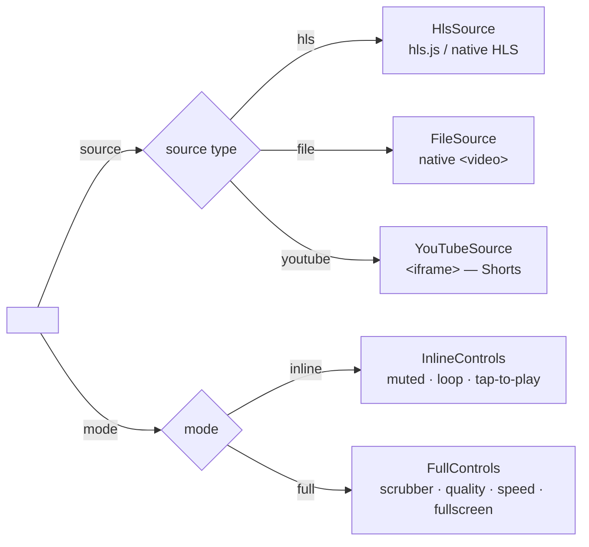
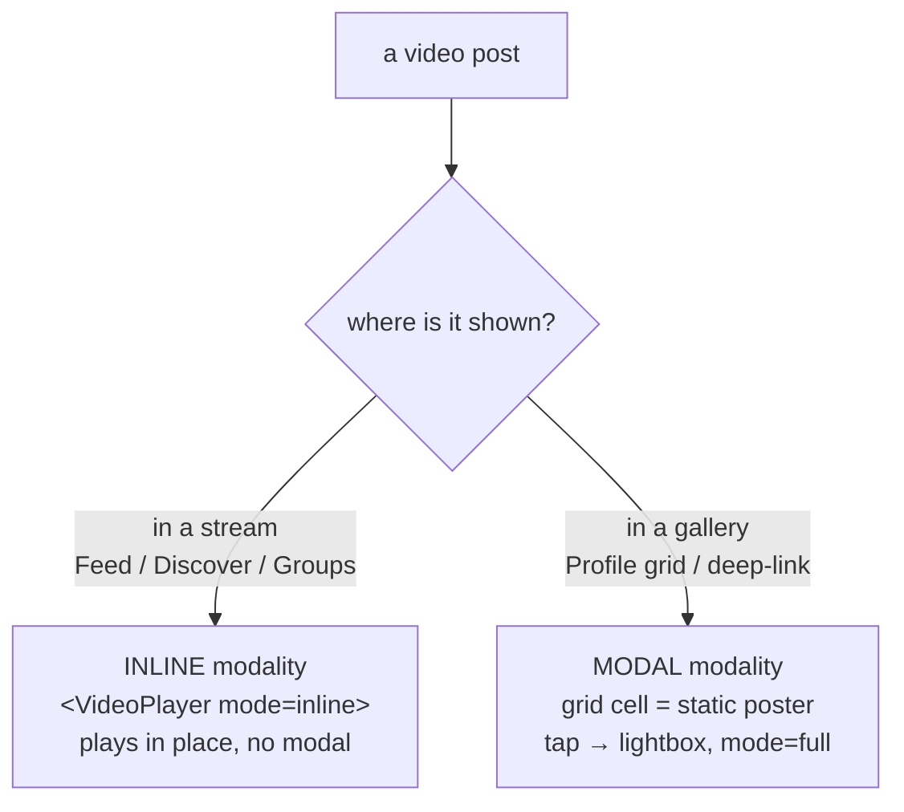

# Video Player — one shared surface for every video

The pipeline docs (`../media/transcoding.md`, `../media/streaming.md`) and the experience spec (`../media/video-experience.md`) decide what a video *is* on the wire: the ratio policy, the HLS renditions, the player's behavior (ABR, quality, speed, muted autoplay). This doc decides the one thing they do not: **how the web10-social client renders it.** Because that is where the slop was.

## The use case

A fan is scrolling. A video is in the stream. It should simply *be* — playing, in place, the way Reels and TikTok and Shorts do it — and it should not seize the screen and drag them out of the scroll. The creator posted a vertical clip; whether it appears in the feed, in Discover, or in a group, it should look like the same product. One video, one way of being rendered, everywhere it shows.

That is the whole goal. Everything below is in service of it.

## The problem: N copies, already drifting

The client did not have one way to render a video. It had several, copy-pasted, and they had already gone their separate ways:

| Copy | Where | Fit | Tap behavior |
|---|---|---|---|
| `MediaItem` video branch | Feed | `object-contain`, natural ratio | play/pause, **stops propagation** |
| `MediaVideo` | Discover grid | `object-cover`, uniform 16:9 | play/pause, **bubbles to the card → modal** |
| `PostMedia` | Groups | native `<controls>` | the browser's own player |

Three implementations of "an inline video you tap to play," and they disagreed on the one thing that matters: whether a tap on the video escapes to the card. Discover's did not stop propagation, so tapping the video both played it *and* opened the `PostLightbox` modal — the yank-out-of-the-scroll. The feed's copy had the fix; Discover's had drift; Groups had given up and used the browser's native controls.

The `HlsVideoPlayer` (the full control rack) was, to its credit, already shared between the feed and the lightbox. The slop was the *inline* path — the tap-to-play `<video>` — which is ninety percent of social video and which was triplicated.

## The rule

> **No surface owns a `<video>` element. Every surface composes `<VideoPlayer>`.**

That single rule is what kills the drift. A surface says *what* it wants — a source, a mode, a fit, a ratio — and does not say *how* the pixels get there. When the inline tap-to-play logic changes, it changes in one place, and every surface gets it at once.

## The component: two axes

`<VideoPlayer>` is factored along the two axes that actually vary. Not one mega-component with an `if` for everything, and not N copies — one thin component that picks a **source renderer** and a **control surface**, then delegates.



**Axis 1 — `source`** (where the bytes come from), a discriminated union:

| `source` | Renderer | Notes |
|---|---|---|
| `{ type: 'hls', manifestUrl }` | `HlsSource` | hls.js first, native HLS the Safari fallback (the `video-experience.md` rule). Transcoded posts (D44). |
| `{ type: 'file', url }` | `FileSource` | a direct `<video src>`. Non-transcoded posts, the import path's MP4s. |
| `{ type: 'youtube', id }` | `YouTubeSource` | an `<iframe>`. **This is the Shorts path** — adding YouTube is a new source case, not a new component. |

**Axis 2 — `mode`** (how it presents):

| `mode` | Control surface | Behavior |
|---|---|---|
| `inline` | `InlineControls` | muted, loop, tap-to-play/pause, minimal overlay, duration badge. The feed / Discover / Groups behavior. |
| `full` | `FullControls` | the current `HlsVideoPlayer` rack: scrubber, quality, speed, volume, fullscreen. The lightbox / "watch" behavior. |

**The rack's visibility (auto-hide + pointer hold).** The `full` rack overlays the video (not a bar below it) and auto-hides ~2.5s after the video is playing + idle, so the feed stays media-forward; it returns on hover and stays up while paused. The hide must never fire while the pointer is **over the player** — the rack is held visible for as long as the pointer is in the frame, independent of the idle timer. The same auto-hide + pointer-hold governs the file path's rack (`InlineVideo`, 3.102.0): a direct-file video shows the identical rack while playing, so the hls and file paths are visually consistent.

**The rack is one designed surface, not a native `<select>`.** The speed + quality controls are a small `RackMenu` (an icon button + a popover of options), not a native `<select>` — the native select is OS-styled (a lopsided, non-token widget) and breaks the flagship bar. The rack is a single row: scrubber on top, then play/pause · mute · volume · time on the left and speed · quality · fullscreen on the right — no text labels, even spacing, token colors only.

Plus three layout props: `fit` (`contain` — never crops, letterboxes; `cover` — fills the frame, crops), `ratio` (or `width`/`height`), and `immersive` (default `false`). **The frame is full-bleed** (3.102.0): the player reserves the source ratio and the video fills the card width (`object-contain`) — a portrait clip is a tall full-width box, landscape is full-width 16:9. There is no phone-width column and no letterbox gutter: the black bars (for a portrait clip in a wide card) are the video's own background, not a `bg-elevated` frame. This is what makes a 9:16 clip on Discover look like the same product as one in the feed and on the marketing `/trending` page — full size, no borders.

**`immersive` — the video fills the frame the surface gives it.** Off (the default), the player reserves its own box (the source's ratio, or the `ratio` prop) and the surface sizes it. On, the player takes the size of its parent frame and the `<video>` fills it (`absolute inset-0 w-full h-full object-cover`): no own aspect-ratio, no phone-width column, and — for the `hls` source — **video only, no control rack** (the scrubber/quality/speed/fullscreen rack is the `mode="full"`/lightbox surface; on an immersive slide it would collide with the overlay chrome the surface draws on top). The surface that owns the frame is `ShortsScreen` (the slide IS the 9:16 frame — see `shorts.md`); the prop is what lets the one shared player serve it without a second `<video>` implementation.

A surface is therefore a one-liner:

```
Feed:      <VideoPlayer source={hlsOrFile} mode="inline" fit="contain" />   (hls → mode="full")
Discover:  <VideoPlayer source={hlsOrFile} mode="inline" fit="contain" />   (hls → mode="full"; full-bleed, rack on both paths, 3.102.0)
Groups:    <VideoPlayer source={file}      mode="inline" fit="contain" />
Lightbox:  <VideoPlayer source={hlsOrFile} mode="full" />
Shorts:    <VideoPlayer source={hlsOrFile} mode="inline" fit="cover"  immersive />
```

## The two modalities (where, not how)

The modal question is orthogonal to the rendering question. *Where* a video is shown decides the modality; the `<VideoPlayer>` decides *how* it renders. The two compose:



- **Inline modality** — the surface is a *stream* (Feed, Discover, Groups). The video plays in place. No modal. Comments expand inline in the card (`CommentThread`, the feed's existing pattern), not in a lightbox.
- **Modal modality** — the surface is a *gallery* (the Profile grid, the deep-link). The grid cell is a static poster; tapping it opens the `PostLightbox`, which renders `<VideoPlayer mode="full">`.

The deep-link (`/u/:username/p/:postId`) is the modal modality — it opens over the profile, so it stays a modal. Consistent.

The invariant that makes the inline modality feel right: **in `inline` mode, a tap on the video must never reach the card.** The card's job is navigation and comments; the video's job is playback. `stopPropagation` on the inline control surface, always. This is the bug Discover had and the feed already fixed — it becomes a property of the component, not a per-surface discipline.

## Trace: a 9:16 clip in Discover

1. The read carries the media doc's `transcoding_settings` plus a per-reader `manifest_url` (the 3.34.0 data-layer work).
2. `DiscoverCard` renders the single video through `DiscoverVideo` → `<VideoPlayer source={{type:'hls', manifestUrl}} mode="full" fit="contain">` (a direct-file clip takes `mode="inline"` instead — same rack, 3.102.0).
3. The player reserves the source ratio (9:16) and fills the card width (`object-contain`, full-bleed — no phone column, no letterbox gutter); the poster shows; the tall 9:16 box holds its place (no layout shift).
4. The fan taps: it plays muted and looping, in place; the control rack (scrubber · play/pause · mute · time · speed · quality · fullscreen) reveals on hover and auto-hides while playing + idle. Tapping again pauses. The tap never reaches the card.
5. The fan taps the comment count: `CommentThread` drops open below the media, inline. No modal, no yank. The scroll is intact.

## Surface map

| Surface | Source | Mode | Fit | Ratio | Modality |
|---|---|---|---|---|---|
| Feed | hls \| file | inline (hls = full) | contain | natural (≤60vh) | inline |
| Discover grid | hls \| file | inline (hls = full) | contain | natural, full-bleed (3.102.0) | inline |
| Discover / trending "Video" view | hls \| file | inline (hls = full) | contain | natural, full-bleed (3.102.0) | inline |
| Groups | file | inline | contain | natural | inline |
| Profile grid cell | — (static poster) | — | — | — | modal (cell → lightbox) |
| Lightbox / deep-link | hls \| file | full | contain | natural | modal |
| Shorts slide | hls \| file | inline | cover | the slide's frame (9:16, `immersive`) | immersive (the swipe surface, `shorts.md`) |

**The control rack is on every inline video, both source paths** (3.102.0): the hls path (`HlsVideoPlayer`) and the file path (`InlineVideo`) render the same overlaid rack (scrubber · play/pause · mute · volume · time · speed · quality · fullscreen), auto-hiding while playing + idle. The file path's rack appears while playing (the tap-to-play surface reveals it); the hls path's is visible on mount + hover. This is the "both have video controls" consistency — a discover video looks and behaves the same whether it's transcoded (hls) or a direct file, and the same on web10-social and the marketing `/trending` page (one shared card).

## What this is not

- **Not a rewrite of the player.** `HlsVideoPlayer` is kept as-is and is the `hls` source renderer — `<VideoPlayer>` delegates to it for transcoded video (it is the full-rack implementation). The behavior is preserved; only *when* it's used moves (the surface says `source={{type:'hls'}}`, the component picks the player).
- **Not the immersive vertical feed.** The full-screen swipe-between-posts surface is specified in `shorts.md` — it composes the same `<VideoPlayer mode="inline">`, and the swipe container is its own thing.
- **Not a change to the node.** The ratio policy, the renditions, the manifest minting — all untouched. This is client-side only.

## Open questions

Decided and built: the two modalities; the one-component / two-axes shape; the inline `stopPropagation` invariant; the Discover fix (inline video plus inline `CommentThread`, no lightbox); the Discover YouTube view (web10 video posts render inline in the 16:9 tile — the TikTok/Shorts wall, no lightbox); Groups (unified to `<VideoPlayer mode="inline">`); **multi-media posts** (the shared `MediaCarousel` — a fixed frame + scroll-snap strip of all the post's media + a `1/N` position indicator where the old dead count badge was; video slides render through `<VideoPlayer fill>`, image slides through ``; composed by both the feed's `MediaGrid` and Discover's card).

Still open:

- **Real YouTube embeds (Shorts)** — the `youtube` source case (an `<iframe>`) is wired into `<VideoPlayer>` but no surface uses it yet. Landing it is a data-model question first (how a post references an external YouTube id) before a rendering one.

## Reference

- The player *spec* (ABR, quality, speed, muted autoplay, hls.js-first, the ratio policy): `../media/video-experience.md`
- The model + document shape (`transcoding_settings`, variants): `../media/transcoding-foundation.md`
- The visual bar (tokens, states, the screenshot test): `../../../strategy/design.md`
- The current full-rack implementation (becomes `FullControls`): `../../../../marketing/web10-social/src/components/Feed/HlsVideoPlayer.tsx`
- The inline comment pattern the inline modality reuses: `../../../../marketing/web10-social/src/components/Feed/CommentThread.tsx`
- The shared multi-media carousel: `../../../../marketing/web10-social/src/components/Feed/MediaCarousel.tsx`
