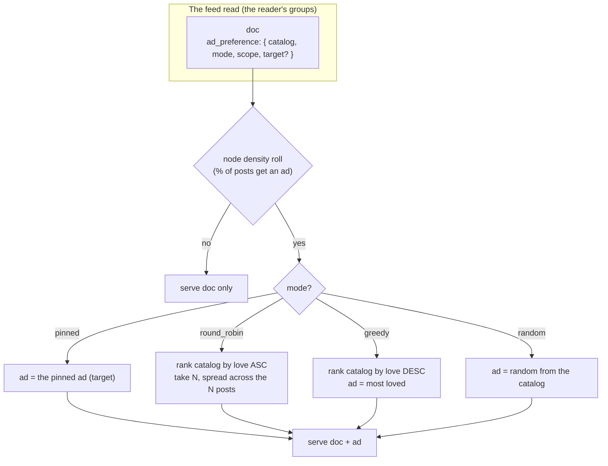

# Ad Dissemination (v4): The Curation Engine

> **v4 vision** (27.08.2026). The full ad-curation engine — the "bigger scope"
> behind the mad-simple v3 (`pinned` | `none`, see
> [`../../web10-v3/social/ads-dissemination.md`](../../web10-v3/social/ads-dissemination.md)).
> Documented so the v4 push has the map; **not** built in v3. Read the v3 doc,
> `ads.md` (the ad object, D55), and `ads-catalog.md` first.

## The Design

v3 pins a specific ad. v4 grows the `ad_preference` into a curation engine — the
read picks an ad from the creator's catalog by a configurable rule:

```
ad_preference: {
  catalog: <catalog>,                // which catalog to curate from
  mode: { signal, strategy },        // the curation (see below)
  scope: global | per_viewer,        // same ad for all, or hash the viewer in
  target?: <ad doc_id>               // for pinned: the specific ad
}
```

**The mode is two independent, expandable dimensions** — "reaction round
robin," "comment round robin," you name it:

- **`signal`** (what "love" is) — `reactions` | `comments` | `composite` (the
  feed's power-mean score) | … you name it. The engagement the pick is ordered
  by.
- **`strategy`** (how to pick from the catalog):
  - `round_robin` — the **least**-loved active ad
  - `greedy` — the **most**-loved active ad
  - `random` — a random ad from the catalog
  - `pinned` — the specific ad (`target`) (v3)
  - `frequency_capped` — TBD (the one that still needs a data-layer definition)

So "reaction round robin" = `{ signal: reactions, strategy: round_robin }`,
"comment greedy" = `{ signal: comments, strategy: greedy }`. Independent
dimensions, so it expands without a combinatorial explosion in the enum.

**`scope`** — `global` (the same ad for every viewer at a given time, a pure
function of the data) or `per_viewer` (hash the viewer into the pick, for
per-viewer variety).

**The node-level ad density** — the node's setting: the percent of posts that
get an ad at all (the operator's fatigue throttle, so users don't get fatigued).
v3 shows ads 100% of the time; the density roll is v4. A true random roll is
non-deterministic; the "ClickHouse-y" way is a deterministic pseudo-random (a
hash of `(doc, time_bucket)` modulo 100 vs. the density %).

## The "love" loop hole (why v3 skips round_robin / greedy)

The curation picks by the ad post's engagement (its reactions/comments). But
that engagement comes from the ad post's *own feed presence* — **not** from being
served as a block. The ad block has no reaction/comment mechanism in v0, and
link clicks aren't tracked (no `stats`, D55). So serving an ad generates **zero**
love on the ad post. Consequence: "least-loved" is always the *same* ad — it
doesn't rotate, because showing it doesn't raise its love. Per-post `round_robin`
is really "always show my least-popular ad post," not equal-exposure rotation.

**The v4 fix (operator's idea):** don't curate per-post — curate the **batch**.
Rank the catalog's ads by least-loved, take N (the feed size), and distribute
them across the N posts so each post gets a *different* ad. That makes the feed
show a spread of the catalog, not the same ad repeated. (It still doesn't fully
close the love loop — true lifetime-equalizing rotation needs the ad block's
exposure to feed a signal, which is a counter on a read path, the D55 wall. So v4
`round_robin` is "spread the catalog across the feed," not "equalize lifetime
exposure.")

`greedy` (most-loved) is the complement — "show my proven best." Its cold-start
(new ads never show) is the distinction, not a bug. Both are static-by-popularity
in v0; the batch spread is what makes them useful.

## Why "love" is still the right v4 signal (despite the loop hole)

Even static, "by popularity" is a meaningful curation: show the ad the audience
responds to most (`greedy`), or spread the catalog (`round_robin` batch). And it
is **the power-mean ranking pattern** (3.18.2 / 3.21.1) turned onto the ad
catalog — a window-function + join, the house pattern. The read already does
read-time projections (media URLs, HLS minting, ranking), so "the read curates
the ad" is the same category, not a scanner-doctrine break.

Concretely, the selection is a window-function + join (not a correlated scalar
subquery — ClickHouse can't decorrelate those, and the codebase already works
around it with `QUALIFY` + `row_number()`):

1. Rank the author's active ads in the chosen catalog by love
   (`row_number() OVER (PARTITION BY author, catalog ORDER BY love ASC/DESC)`).
2. Join the feed docs to that ranking on `(author, catalog)`, selecting the row
   where `rn = 1` (round_robin/greedy) or `ad_doc_id = target` (pinned).
3. Serve the doc + the ad's body.

## The Shape of It (v4)



## The Serious Questions (v4)

1. **`frequency_capped` / `random`** — the modes that still need definitions.
2. **Node-level density** — true random vs. deterministic pseudo-random;
   granularity (per-read / per-time-bucket / per-viewer).
3. **What happens to `curateAds` (3.26.0)?** Superseded by the data layer. Does
   it die, or stay as a v4 reference?