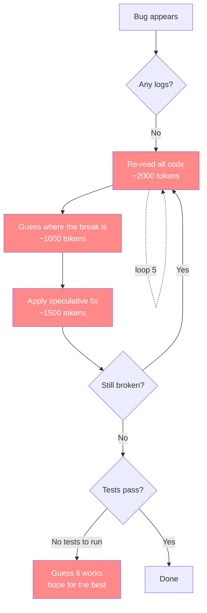

# AI Use Theory

How to use AI to build software without burning money on debugging loops.

## The Cost of Not Doing This

On a personal web10 project, a single debugging session — no logs, no KB, no tests, just AI guessing — cost $100 in tokens. The AI would claw and try and try, re-reading the same code, making speculative fixes, breaking other things, looping. Each loop is context window + reasoning tokens. Five or ten loops and you're bleeding money with nothing to show.

With this five-step process, the same debugging drops to $5-$10. That's 10x cheaper. The difference is **signal**: logs tell the AI where the break is, tests confirm the fix, and the KB tells it what the code is supposed to do. No guessing.

## The Problem

AI is optimized for benchmarks, not for debugging. It will claw and try and try to hit a target score. It may ask for more context, but it is shy — it won't always ask for enough. And when it writes code, it defaults to industry standard: minimal logs, sleek abstractions, productionized polish. Then when something breaks, it speculatively debugs its own minimally-logged code and enters expensive doom loops.

Every speculative debug loop burns tokens on two things: re-reading the same code (context) and reasoning about what might be wrong (generation). Without signal, both are wasted.



Each red box is a token burn. Five loops is 5 × (2000 + 1000 + 1500) = **22,500 tokens** wasted on re-reading and guessing before you even know if the fix is right. At typical API pricing, that's $100+ in a single session.

With the pyramid, something unexpected happens. You ask the AI to debug a bug, and it **disobeys you** — it says, *no, we're not fixing code yet*. It starts from the base of the pyramid and works upward, fixing every layer before it touches the code.

**Chart 1 — The refusal:**


**Chart 2 — The six signals (checked in order):**


**Chart 3 — Fix and verify:**


The red box is the key insight: **the AI disobeys your instruction**. You said "fix the bug," and it said "no, the KB is wrong, let's fix that first." This is what makes it truly intelligent — it understands that a code fix on a broken foundation is just temporary. The real bug is almost never in the code. The real bug is that the KB is stale, the code drifted from the KB, there are no tests, or the changelog doesn't reflect what changed.

So it works the pyramid from the bottom, checking **six signals** against each other in order:

| Order | Signal | The Question |
|-------|--------|-------------|
| 1 | **User input** | "What is broken?" |
| 2 | **KB** | "What is this supposed to do?" — does the bug report match the documented intent? **Also: did the user say something slightly wrong?** LLMs follow instructions to a fault — if you say "rectangle" but mean "square," it will make a rectangle even if every other signal points to square. The KB catches your own inaccuracies. |
| 3 | **Code** | "What was actually built?" — does the code match the KB? |
| 4 | **Logs** | "What happened at runtime?" — does the behavior match the code? |
| 5 | **Changelog** | "What was the intention of the code under scrutiny?" — does the changelog capture the intent, or is it obtuse? An obtuse changelog means the AI that wrote this code didn't understand it. |
| 6 | **Tests** | "What is expected?" — is there a test? Does it pass? |

Each signal is checked against the one before it. Misalignment at any layer is the real bug. The fix depends on which layer is wrong:

- User input vs KB mismatch → could mean the KB is stale, **or the user misspoke.** LLMs attach to inaccuracies in your words and follow them literally — "rectangle" when you meant "square." The KB is the guardrail against your own imprecision. The AI should flag this and ask before proceeding.

This is why the pyramid lets your chat be messy and spontaneous. Chat is inherently brittle — you'll misspeak, be vague, contradict yourself. That's fine. The KB is the stable reference that catches your inaccuracies as the AI works upward. You can fire off a sloppy bug report and the AI will ask, "the KB says X but you said Y — which is right?" instead of blindly following your inaccurate words. The KB makes sloppy chat safe.
- KB vs code mismatch → code drift, fix the code
- Code vs logs mismatch → runtime path diverged, find the branch
- **Logs vs changelog mismatch → the changelog is the retrospective signal of AI understanding.** The changelog captures the intention of the implemented code. If the changelog is obtuse, the AI that wrote this code wasn't thinking clearly about it — it probably wasn't considering the issue being debugged unless it says so. AI is incredible at writing changelogs when it understands what it built. An obtuse changelog is a red flag: the code was written without clear intent, and the fix needs to address the root misunderstanding, not just patch the symptom.
- No tests → add them before fixing, so the fix is verifiable

This is why the pyramid is also a **waterfall**. You build it bottom-up like a pyramid, and when debugging, the AI works through it like a waterfall — each layer must be clean before it flows to the next. It refuses to skip. It refuses to patch. It fixes the foundation first, then the code, and makes sure KB, code, logs, tests, and changelog are all in alignment.

That refusal — that disobedience — is what saves the $100. Because the code fix on a broken foundation is always a temporary fix that breaks again. Fixing the foundation makes the code fix permanent.

## What AI Is Good At

AI excels at translation — mapping one well-defined space to another:

- Language to language (Fortran → Python, COBOL → TypeScript)
- Framework to framework (pipenv → ux, 2021 React → 2026 TypeScript)
- Code → Knowledge base (extracting intent, structure, and rationale from existing code)
- Conversations → Knowledge base (distilling operator intent into structured docs)

These are translation tasks. The input and output shapes are known. The AI can do them reliably.

## What AI Is Bad At

Speculative debugging in a vacuum. When code breaks and there are no logs, no trace, no signal — AI guesses. And guessing costs money in agent minutes. The more context you give it, the better, but even then it won't always ask for enough on its own.

## The Pyramid

This is a five-step pyramid. You build from the bottom up. Each layer makes debugging cheaper for the layers above it.

```
           ┌───────┐
           │  STEP  │   Build features — fast, confident, debuggable
           │  FIVE  │
         ┌─┤       ├─┐
         │ └───────┘ │
         │  STEP 4   │   Tests — binary signal, no ambiguity
         │           │
       ┌─┤         ├─┐
       │ │  STEP 3 │ │
       │ │         │ │
       ├─┤ STEP 2  ├─┤   Logs — deterministic diagnosis, no guessing
       │ │         │ │
       ├─┤         ├─┤
       │ │ STEP 1  │ │   KB — the AI knows what to build before it builds it
       └─┤         ├─┘
         └─────────┘
```

### Step 1: Perfect the Knowledge Base

Before writing any code, the AI must understand what the code is supposed to do. Code → Knowledge base. Conversations → Knowledge base. The KB should read like it was written by a person, not generated lazily. If the KB is inaccurate, incomplete, or contradictory, the AI will build the wrong thing and you won't know until it's too late.

**This step is the foundation.** A shitty KB is the root cause of every "why did the AI do that" moment. Without it, the AI is guessing at intent — and guessing costs tokens.

### Step 2: Max the Logs

Every piece of code gets ridiculous levels of logging. Cover the entire API surface. Log every step of the way. Prefix logs so they're filterable. Log payloads, log decision paths, log errors with full context.

The reasoning is simple: if something breaks, the logs are the signal. Dense logging turns speculative debugging into deterministic diagnosis. Instead of the AI re-reading code and guessing where the break is, it reads the logs and knows. That's the difference between $100 and $10 in debug tokens.

### Step 3: Modernize the Stack

Low-hanging fruit. pipenv → ux. 2021 React → 2026 TypeScript. These are translation tasks — AI is good at them. Get the stack current so the codebase is maintainable and the AI can work in idiomatic patterns.

### Step 4: Make Tests for Everything

Unit tests. E2E tests. Gauntlets. Tests give the AI a deterministic way to verify its work instead of guessing. A test that fails is a clearer signal than a log that's missing — and tests are cheaper to fix than debugging sessions. One failing test tells the AI exactly what's wrong. No loops.

### Step 5: Build New Features

Only after the above is the codebase truly debuggable and the AI's understanding of intent is solid. The AGENTS.md makes the AI aware of the KB. The plans make it aware of what to build. The tests make it aware of what "done" looks like. Now features can be built with confidence.

## Why This Saves Tokens

Each layer of the pyramid eliminates a category of token waste:

| Layer | Without It | With It |
|-------|-----------|---------|
| KB | AI guesses intent, builds wrong, re-builds | AI knows what to build, first attempt is right |
| Logs | AI re-reads code, speculates, loops | AI reads logs, pinpoints the break, fixes once |
| Stack | AI fights outdated patterns, works around broken tooling | AI works in idiomatic code, fewer surprises |
| Changelog | AI can't see if the code was understood when written; obtuse code gets obtuse fixes | AI sees the intention behind every change; an obtuse changelog flags an oversight — even in a simple patch, the AI might have missed an edge case it didn't consider |
| Tests | AI guesses if a fix works, re-runs, re-breaks | AI runs tests, binary pass/fail, done |

On an ambiguous, rapidly developing product — where requirements change, the API surface shifts, and nothing is stable — this pyramid is not optional. Without it, every change introduces new debugging debt. With it, debugging is cheap and deterministic.

## Why This Works

This approach suits the strengths of an LLM:

- **Translation over invention.** AI is great at mapping between known spaces. Steps 1 and 3 are translation tasks.
- **Signal over speculation.** Dense logging (Step 2) gives AI the context it needs to debug deterministically instead of guessing.
- **Verification over faith.** Tests (Step 4) give AI a binary signal: pass or fail. No ambiguity, no doom loops.
- **Knowledge over assumptions.** A perfect KB (Step 1) means the AI understands intent before touching code.
- **Disobedience over compliance.** The AI refuses to patch symptoms. It works the six signals — user input, KB, code, logs, changelog, tests — and fixes the broken layer, not just the code. That refusal is what makes debugging cheap.

## The Alternative

Skip the KB, write minimal logs, modernize the stack, and start building features. The AI will build the wrong thing, break things, and enter debugging loops with no signal to work from. Every loop is context + reasoning tokens. Five loops is $100. Ten is $200.

The five-step process is the only way to use AI that doesn't waste money. It takes patience upfront — building the foundation — but it makes every dollar spent on AI features actually buy features instead of debugging.