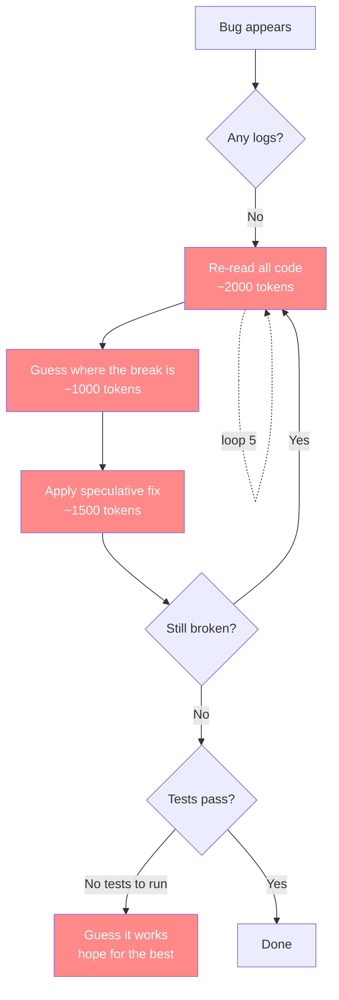
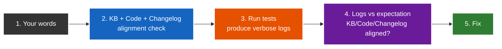

# AI Use Theory

How to use AI to build software without burning money on debugging loops.

## What an LLM Actually Is

An LLM is a language translator. That is its core capability — mapping one well-defined space to another with near-perfect accuracy. Fortran to Python. COBOL to TypeScript. 2021 React to 2026 TypeScript. Code to documentation. Conversations to structured knowledge. Literal to literal, it is almost too good at it. This is not a side effect — it is the model's primary strength, baked into how it was trained.

But an LLM is also benchmaxed. It was optimized for benchmarks like SWE-bench, where trying and failing scores higher than doing nothing. So when it hits a wall, it does not stop — it claws and tries and tries. It will riddle a codebase with speculative fixes, each one introducing new bugs, because getting a 75% on a benchmark is better than getting 0%. This is the terminator instinct: keep trying until the target is hit, even if the path is destruction.

These two traits — perfect translation and relentless overtrying — define how an LLM should be used. Give it translation tasks, and it excels. Give it open-ended debugging, and it destroys.

## The Cost of Not Doing This

On a personal web10 project, a single debugging session — no logs, no KB, no tests, just AI guessing — cost $100 in tokens. The AI would claw and try and try, re-reading the same code, making speculative fixes, breaking other things, looping. Each loop is context window + reasoning tokens. Five or ten loops and you're bleeding money with nothing to show.

With this five-step process, the same debugging drops to $5-$10. That's 10x cheaper. The difference is **signal**: logs tell the AI where the break is, tests confirm the fix, and the KB tells it what the code is supposed to do. No guessing.

## The Problem

AI is optimized for benchmarks, not for debugging. It will claw and try and try to hit a target score. It may ask for more context, but it is shy — it won't always ask for enough. And when it writes code, it defaults to industry standard: minimal logs, sleek abstractions, productionized polish. Then when something breaks, it speculatively debugs its own minimally-logged code and enters expensive doom loops.

Every speculative debug loop burns tokens on two things: re-reading the same code (context) and reasoning about what might be wrong (generation). Without signal, both are wasted.



Each red box is a token burn. Five loops is 5 × (2000 + 1000 + 1500) = **22,500 tokens** wasted on re-reading and guessing before you even know if the fix is right. At typical API pricing, that's $100+ in a single session.

---

## The Eureka Moment

With the pyramid, something unexpected happens. You ask the AI to debug a bug, and it **disobeys you**.


You said "fix the bug." It said "no." This is the moment where the AI stops being a dumb code monkey and starts being an actual engineer. It refuses to patch symptoms because it knows a code fix on a broken foundation is temporary. The real bug is almost never in the code — it's in the layers below.

So it works the signals in chronological debugging order — orient first, then generate signal, then compare:



**Step 1 — Your words.** The bug report. What you told the AI is broken. Chat is inherently messy — you'll misspeak, be vague, contradict yourself. That's fine. The next step catches it.

**Step 2 — KB ↔ Code ↔ Changelog alignment.** This is the orientation phase. The AI loads three reference resources into its context window and checks them against each other. The code will almost certainly match the changelog — LLMs are nearly perfect at literal translation, so the code it wrote matches the intent it recorded. The real check is: does the knowledge base match what was built and what was recorded? If your words say "rectangle" but the knowledge base says "square," the AI flags it and asks. This is why the knowledge base makes sloppy chat safe. And strategically, this step brings the most important reference material into context before spending any tokens on test runs.

**Step 3 — Run tests, produce logs.** Now that the AI is oriented, it runs the tests. The tests produce comically detailed logs — because every piece of code is logged to a ridiculous level. This is the signal generation step. You can't analyze logs you don't have, so tests come before log analysis.

**Step 4 — Logs vs expectation.** Do the logs match what you expect based on the now-aligned KB, code, and changelog? If the KB says "call endpoint A," the code says "call endpoint A," the changelog says "added endpoint A," but the logs show "endpoint B was called" — the runtime path diverged. The bug is in the branch, not the code. If the logs match expectations but the test still fails — the expectation itself is wrong, go back to the KB. This is the creative, freestyle part where the AI has everything it needs to reason.

**Step 5 — Fix.** The foundation is aligned, the logs are clear, the expectation is known. One targeted change.


Each step narrows the search space. The AI does not guess — it orients, generates signal, compares, and fixes. When one step fails, it tells you exactly what kind of bug it is: user misspoke, knowledge base stale, runtime diverged, or expectation wrong.

This is why the pyramid is also a **waterfall**. You build it bottom-up like a pyramid, and when debugging, the AI works through it like a waterfall — orient first, generate signal, compare, fix. It refuses to skip. It refuses to patch. It fixes the foundation first, then the code, and makes sure everything is in alignment.

That refusal — that disobedience — is what saves the $100. Because the code fix on a broken foundation is always a temporary fix that breaks again. Fixing the foundation makes the code fix permanent.

## The Pyramid

The pyramid is built from the LLM's two traits. Steps 1 and 3 are **translation tasks** — the LLM's strength. Steps 2, 4, and 5 create the **signal** that prevents the LLM's weakness (speculative overtrying) from burning money. Build from the bottom up:

```
           ┌───────┐
           │  STEP  │   Build features — fast, confident, debuggable
           │  FIVE  │
         ┌─┤       ├─┐
         │ └───────┘ │
         │  STEP 4   │   Tests — binary signal, no ambiguity
         │           │
       ┌─┤         ├─┐
       │ │  STEP 3 │ │
       │ │         │ │
       ├─┤ STEP 2  ├─┤   Logs — deterministic diagnosis, no guessing
       │ │         │ │
       ├─┤         ├─┤
       │ │ STEP 1  │ │   KB — the AI knows what to build before it builds it
       └─┤         ├─┘
         └─────────┘
```

### Step 1: Perfect the Knowledge Base

Before writing any code, the AI must understand what the code is supposed to do. Code → Knowledge base. Conversations → Knowledge base. The KB should read like it was written by a person, not generated lazily. If the KB is inaccurate, incomplete, or contradictory, the AI will build the wrong thing and you won't know until it's too late.

**This step is the foundation.** A shitty KB is the root cause of every "why did the AI do that" moment. Without it, the AI is guessing at intent — and guessing costs tokens.

### Step 2: Max the Logs

Every piece of code gets ridiculous levels of logging. Cover the entire API surface. Log every step of the way. Prefix logs so they're filterable. Log payloads, log decision paths, log errors with full context.

The reasoning is simple: if something breaks, the logs are the signal. Dense logging turns speculative debugging into deterministic diagnosis. Instead of the AI re-reading code and guessing where the break is, it reads the logs and knows. That's the difference between $100 and $10 in debug tokens.

### Step 3: Modernize the Stack

Low-hanging fruit. pipenv → ux. 2021 React → 2026 TypeScript. These are translation tasks — AI is good at them. Get the stack current so the codebase is maintainable and the AI can work in idiomatic patterns.

### Step 4: Make Tests for Everything

Unit tests. E2E tests. Gauntlets. Tests give the AI a deterministic way to verify its work instead of guessing. A test that fails is a clearer signal than a log that's missing — and tests are cheaper to fix than debugging sessions. One failing test tells the AI exactly what's wrong. No loops.

### Step 5: Build New Features

Only after the above is the codebase truly debuggable and the AI's understanding of intent is solid. The AGENTS.md makes the AI aware of the KB. The plans make it aware of what to build. The tests make it aware of what "done" looks like. Now features can be built with confidence.

## Why This Saves Tokens

Each layer of the pyramid eliminates a category of token waste:

| Layer | Without It | With It |
|-------|-----------|---------|
| KB | AI guesses intent, builds wrong, re-builds | AI knows what to build, first attempt is right |
| Logs | AI re-reads code, speculates, loops | AI reads logs, pinpoints the break, fixes once |
| Stack | AI fights outdated patterns, works around broken tooling | AI works in idiomatic code, fewer surprises |
| Changelog | AI can't see if the code was understood when written; obtuse code gets obtuse fixes | AI sees the intention behind every change; an obtuse changelog flags an oversight — even in a simple patch, the AI might have missed an edge case it didn't consider |
| Tests | AI guesses if a fix works, re-runs, re-breaks | AI runs tests, binary pass/fail, done |

On an ambiguous, rapidly developing product — where requirements change, the API surface shifts, and nothing is stable — this pyramid is not optional. Without it, every change introduces new debugging debt. With it, debugging is cheap and deterministic.

## Why This Works

This approach suits the strengths of an LLM:

- **Translation over invention.** AI is great at mapping between known spaces. Steps 1 and 3 are translation tasks.
- **Signal over speculation.** Dense logging (Step 2) gives AI the context it needs to debug deterministically instead of guessing.
- **Verification over faith.** Tests (Step 4) give AI a binary signal: pass or fail. No ambiguity, no doom loops.
- **Knowledge over assumptions.** A perfect KB (Step 1) means the AI understands intent before touching code.
- **Disobedience over compliance.** The AI refuses to patch symptoms. It works the six signals — user input, KB, code, logs, changelog, tests — and fixes the broken layer, not just the code. That refusal is what makes debugging cheap.

## The Alternative

Skip the KB, write minimal logs, modernize the stack, and start building features. The AI will build the wrong thing, break things, and enter debugging loops with no signal to work from. Every loop is context + reasoning tokens. Five loops is $100. Ten is $200.

The five-step process is the only way to use AI that doesn't waste money. It takes patience upfront — building the foundation — but it makes every dollar spent on AI features actually buy features instead of debugging.