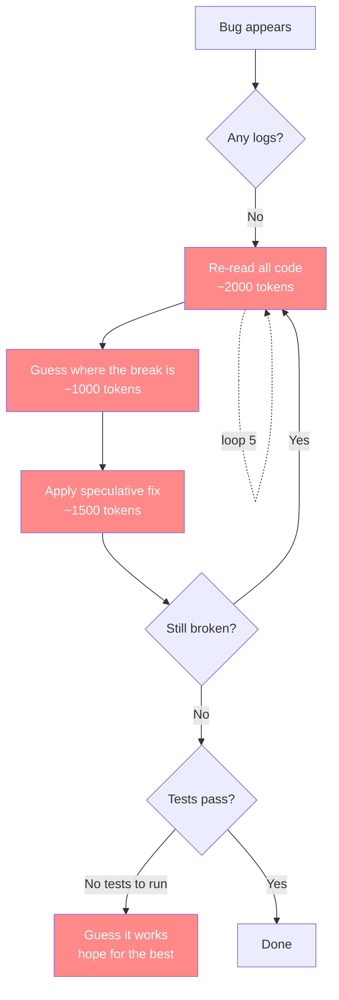
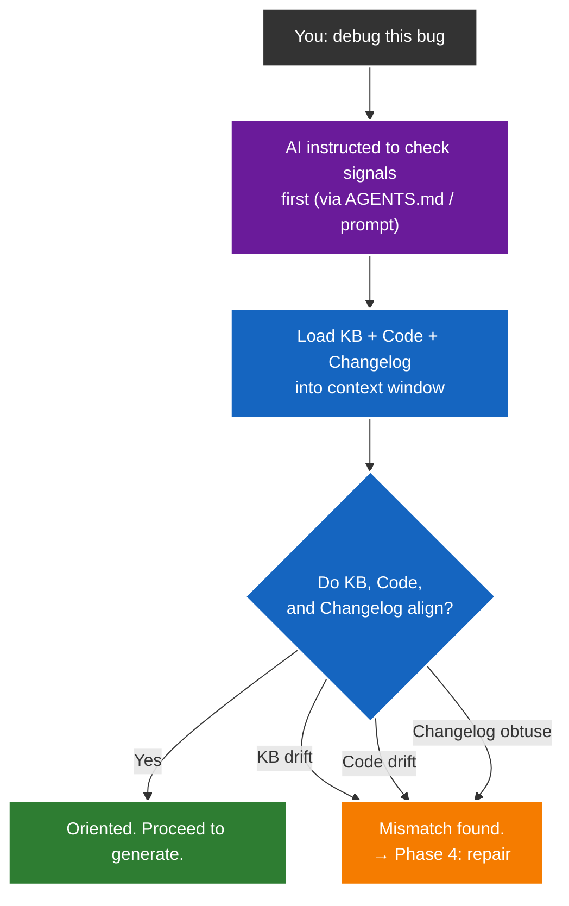
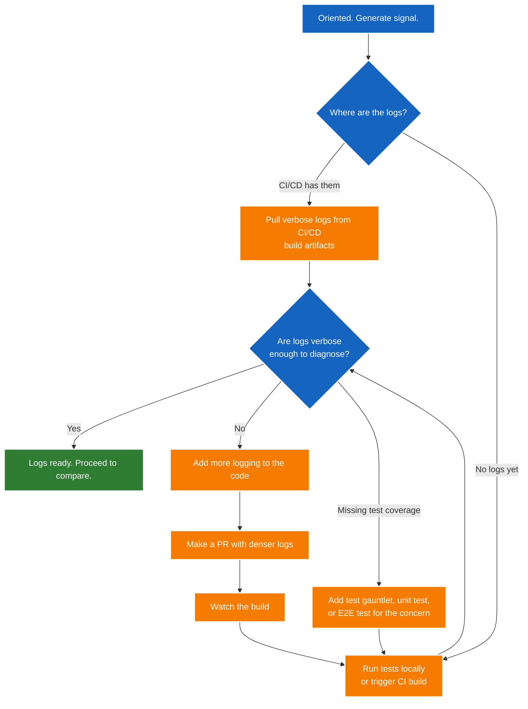
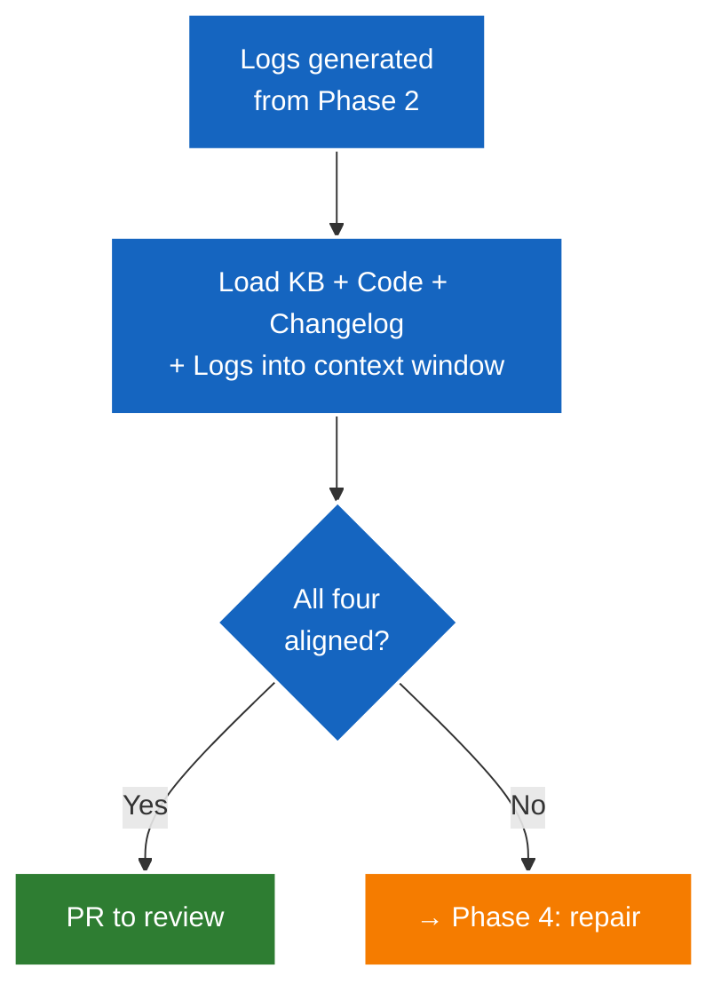
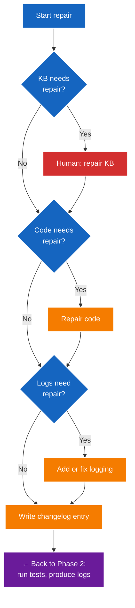

# AI Use Theory

How to use AI to build software without burning money on debugging loops.

## What an LLM Actually Is

An LLM is a language translator. That is its core capability — mapping one well-defined space to another with near-perfect accuracy. Fortran to Python. COBOL to TypeScript. 2021 React to 2026 TypeScript. Code to documentation. Conversations to structured knowledge. Literal to literal, it is almost too good at it. This is not a side effect — it is the model's primary strength, baked into how it was trained.

But an LLM is also a relentless overtryer. It was trained to be helpful and produce output — not to say "I don't know" or ask for clarification. When it hits a wall, it does not stop. It claws and tries and tries, riddling a codebase with speculative fixes because producing something plausible scores higher than admitting uncertainty. Mun Logadan put it plainly: "Benchmark training selects for models that make bold assumptions in the face of ambiguity rather than asking for clarification. Real life just isn't a benchmark." This is the terminator instinct: keep trying until the target is hit, even if the path is destruction.

These two traits — perfect translation and relentless overtrying — define how an LLM should be used. Give it translation tasks, and it excels. Give it open-ended debugging, and it destroys.

## The Cost of Not Doing This

On a personal web10 project, a single debugging session — no logs, no KB, no tests, just AI guessing — cost $100 in tokens. The AI would claw and try and try, re-reading the same code, making speculative fixes, breaking other things, looping.

With the pyramid, the same debugging drops to $5-$10. That's 10x cheaper. The difference is **signal**: logs tell the AI where the break is, tests confirm the fix, and the KB tells it what the code is supposed to do. No guessing.

**Note on token costs:** these numbers come from running AI agents in conductor.build, where every speculative debug loop is a fresh context window — no caching, no carryover. Each loop re-reads the entire codebase, reasons about what might be wrong, and generates a fix. In a cached API, re-reading context is cheap. In conductor.build it is not. These are the real costs for this harness.

## The Problem

An LLM trained to produce output will keep generating — even when generating makes things worse. It may ask for more context, but it is shy — it won't always ask for enough. And when it writes code, it defaults to industry standard: minimal logs, sleek abstractions, productionized polish. Then when something breaks, it speculatively debugs its own minimally-logged code and enters expensive doom loops.

In a conductor.build harness, every speculative debug loop is a fresh context window. No caching. No carryover. The AI re-reads the entire codebase, reasons about what might be wrong, generates a fix, and if it's wrong, the whole cycle repeats from scratch. Without signal, each loop burns tokens on two things: re-reading the same code (context) and reasoning about what might be wrong (generation).



Each red box is a token burn. Five loops is 5 × (2000 + 1000 + 1500) = **22,500 tokens** wasted on re-reading and guessing before you even know if the fix is right. But that's the optimistic case. In a conductor.build harness with no signal, an AI can idle for hours — reading way more code than it needs, loading the wrong files into context, polluting its own context window with noise. That's $60+ burning on idle context alone, before the speculative fixes even start. At typical API pricing, a session can easily exceed $100 with nothing to show.

---

## The Debugging Flow

Once the pyramid is built, debugging follows a different process. The pyramid is the setup. This flow is what you run when something breaks. The AI won't naturally follow this — it's enforced via AGENTS.md, system instructions, or explicit prompts. Without the instruction to check signals before patching, the AI will default to speculative fixes. The "disobedience" — refusing to patch symptoms and fixing the foundation first — is a process you impose, not natural LLM behavior.

The flow works in four phases: **orient, generate, compare, repair.** Each phase has branching paths — the AI can take different actions depending on what it finds.

### Phase 1: Orient — KB ↔ Code ↔ Changelog alignment



The AI loads three reference resources into its context window and checks them against each other. It doesn't fix anything here — it only detects. The code will almost certainly match the changelog — LLMs are nearly perfect at literal translation, so the code it wrote matches the intent it recorded. The real check is: does the knowledge base match what was built? If your words say "rectangle" but the knowledge base says "square," the AI flags the mismatch and routes to Phase 4 for repair. This is why the knowledge base makes sloppy chat safe — your spontaneous, inaccurate instructions are caught before the AI acts on them.

**Strategic context management:** this phase loads all the reference material before spending any tokens on test runs. If the KB is wrong, there's no point running tests yet — flag it and repair in Phase 4 first.

### Phase 2: Generate — run tests, produce logs



Now oriented, the AI needs signal. The logs come from test runs — you can't analyze logs you don't have. If CI/CD preserves test logs as build artifacts, it pulls those directly. No booting a local stack, no waiting. (Most CI setups don't do this yet — it's aspirational infrastructure worth building.) Otherwise, it runs tests locally or triggers a CI build. If the logs aren't verbose enough, it makes a PR to add denser logging, then watches the build.

If the concern isn't covered by existing tests, the AI writes a test gauntlet, unit test, or E2E test to exercise the specific code path — then runs it to produce the logs. This is the generate step: produce the signal before analyzing it.

### Phase 3: Compare — the gate

Same alignment check as Phase 1, but now with a fourth input: the actual log output.



Detection only. One gate: all four aligned? Yes → PR. No → Phase 4 repairs, then loops back to Phase 2, then Phase 3 runs the gate again. Iterate until green.

### Phase 4: Repair — fix in order, then changelog

Once the compare phase identifies what's broken, repair in hierarchy. Foundation before implementation.



Repair in order, only if needed:

1. **KB first** — if the knowledge base is wrong or incomplete, the human repairs it. The AI can't authoritatively write knowledge it doesn't understand.
2. **Code next** — with the KB right, the code fix is targeted. One change, not speculative.
3. **Logs next** — if the logs were too thin to diagnose, add the missing logging so the next debug is cheaper.
4. **Changelog last** — write the entry. It captures the intention of this fix, so the next AI that debugs this code has the signal.

Every step is conditional. If nothing needs repairing at a layer, skip it. The changelog is always written — it's the signal for the next debugging session. After repair, loop back to Phase 2 (run tests, produce logs), then Phase 3 (compare). Phase 3 has only two outcomes: aligned → PR, or misaligned → Phase 4 again. Iterate until green.

That process — forcing the AI to check signals before patching — is what saves the money. Because a code fix on a broken foundation is always temporary. Fixing the foundation makes the code fix permanent. And fixing the KB requires a human in the loop — the AI can flag the mismatch, but the human writes the knowledge.

## The Pyramid

The pyramid is a **setup order** for building a codebase that's debuggable by AI. It is separate from the debugging flow above — the pyramid is what you build first, the debugging flow is what you run after. The ordering (KB before logs before tests) is a theory based on the LLM's two traits and the evidence that each layer eliminates a category of token waste. Nothing proves this is the only valid order, but it is the order that matches the LLM's strengths (translation tasks first) and creates the signal that prevents its weakness (speculative overtrying) from burning money. Build from the bottom up:

```
           ┌───────┐
           │  STEP  │   Build features — fast, confident, debuggable
           │  FIVE  │
         ┌─┤       ├─┐
         │ └───────┘ │
         │  STEP 4   │   Tests — binary signal, no ambiguity
         │           │
       ┌─┤         ├─┐
       │ │  STEP 3 │ │
       │ │         │ │
       ├─┤ STEP 2  ├─┤   Logs — deterministic diagnosis, no guessing
       │ │         │ │
       ├─┤         ├─┤
       │ │ STEP 1  │ │   KB — the AI knows what to build before it builds it
       └─┤         ├─┘
         └─────────┘
```

### Step 1: Perfect the Knowledge Base

Before writing any code, the AI must understand what the code is supposed to do. Code → Knowledge base. Conversations → Knowledge base. The KB should read like it was written by a person, not generated lazily. If the KB is inaccurate, incomplete, or contradictory, the AI will build the wrong thing and you won't know until it's too late.

**This step is the foundation.** A shitty KB is the root cause of every "why did the AI do that" moment. Without it, the AI is guessing at intent — and guessing costs tokens.

### Step 2: Max the Logs

Every piece of code gets ridiculous levels of logging. Cover the entire API surface. Log every step of the way. Prefix logs so they're filterable. Log payloads, log decision paths, log errors with full context.

The reasoning is simple: if something breaks, the logs are the signal. Dense logging turns speculative debugging into deterministic diagnosis. Instead of the AI re-reading code and guessing where the break is, it reads the logs and knows. That's the difference between $100 and $10 in debug tokens.

### Step 3: Modernize the Stack

Low-hanging fruit. pipenv → ux. 2021 React → 2026 TypeScript. These are translation tasks — AI is good at them. Get the stack current so the codebase is maintainable and the AI can work in idiomatic patterns.

### Step 4: Make Tests for Everything

Unit tests. E2E tests. Gauntlets. Tests give the AI a deterministic way to verify its work instead of guessing. A test that fails is a clearer signal than a log that's missing — and tests are cheaper to fix than debugging sessions. One failing test tells the AI exactly what's wrong. No loops.

### Step 5: Build New Features

Only after the above is the codebase truly debuggable and the AI's understanding of intent is solid. The AGENTS.md makes the AI aware of the KB. The plans make it aware of what to build. The tests make it aware of what "done" looks like. Now features can be built with confidence.

## Why This Saves Tokens

Each layer of the pyramid eliminates a category of token waste:

| Layer | Without It | With It |
|-------|-----------|---------|
| KB | AI guesses intent, builds wrong, re-builds | AI knows what to build, first attempt is right |
| Logs | AI re-reads code, speculates, loops | AI reads logs, pinpoints the break, fixes once |
| Stack | AI fights outdated patterns, works around broken tooling | AI works in idiomatic code, fewer surprises |
| Changelog | AI can't see if the code was understood when written; obtuse code gets obtuse fixes | AI sees the intention behind every change; an obtuse changelog flags an oversight — even in a simple patch, the AI might have missed an edge case it didn't consider |
| Tests | AI guesses if a fix works, re-runs, re-breaks | AI runs tests, binary pass/fail, done |

On an ambiguous, rapidly developing product — where requirements change, the API surface shifts, and nothing is stable — this pyramid is not optional. Without it, every change introduces new debugging debt. With it, debugging is cheap and deterministic.

## Why This Works

This approach suits the strengths of an LLM:

- **Translation over invention.** AI is great at mapping between known spaces. KB building (Step 1) and stack modernization (Step 3) are translation tasks.
- **Signal over speculation.** Dense logging (Step 2) gives AI the context it needs to debug deterministically instead of guessing.
- **Verification over faith.** Tests (Step 4) give AI a binary signal: pass or fail. No ambiguity, no doom loops.
- **Knowledge over assumptions.** A perfect KB (Step 1) means the AI understands intent before touching code.
- **Process over compliance.** The debugging flow forces the AI to check signals before patching. It works the signals the pyramid creates — KB, code, changelog, logs, tests — and fixes the broken layer, not just the code. That process is what makes debugging cheap.

## The Alternative

Skip the KB, write minimal logs, modernize the stack, and start building features. The AI will build the wrong thing, break things, and enter debugging loops with no signal to work from. Every loop is context + reasoning tokens. Five loops is $100. Ten is $200.

The five-step process is the only way to use AI that doesn't waste money. It takes patience upfront — building the foundation — but it makes every dollar spent on AI features actually buy features instead of debugging.